<a href="https://velokey.ai/model/doubao-seedance-2-5-text-to-video?sourceChannel=github-awesome-seedance"></a>

# 🎬 Seedance 2.5 神级视频提示词合集

[English](README.md) · **简体中文**

[](https://github.com/sindresorhus/awesome) [](https://github.com/velokey-ai/awesome-seedance-2.5-prompts/issues/new?template=submit-prompt.yml) [](https://creativecommons.org/licenses/by/4.0/)

> 精选社区疯传的 **Seedance 2.5** 创意**视频**提示词，全部标注原作者与出处。
>
> ⚡ 想直接跑这些提示词？**[Velokey](https://velokey.ai/model/doubao-seedance-2-5-text-to-video?sourceChannel=github-awesome-seedance)** 一个 API 调用 Seedance、Kling、Veo、Sora 等主流视频模型，一个 Key，按量付费。

> ⚠️ **版权说明**：所有提示词与预览帧均收集自公开社区帖子，仅作学习交流，均已标注作者与来源。如有侵权请提 Issue，我们会第一时间删除。

## 📊 数据统计

| 📝 提示词总数 | ⭐ 精选 | 🏷️ 分类数 | 🔄 最近更新 |
|---|---|---|---|
| **117** | **16** | **6** | 2026-08-09 04:17 UTC |

## 🗂️ 按分类浏览

<details open><summary><b>🎞️ 电影运镜</b> (36)</summary>

- [⭐ No.1 大巴扎追逐长镜](#no1-大巴扎追逐长镜)
- [⭐ No.11 史诗奇幻电影长镜](#no11-史诗奇幻电影长镜)
- [⭐ No.98 多国连续旅程长镜](#no98-多国连续旅程长镜)
- [No.2 伦敦地下电子俱乐部](#no2-伦敦地下电子俱乐部)
- [No.7 日本游戏综艺·滚筒闯关](#no7-日本游戏综艺滚筒闯关)
- [No.8 游戏综艺慢动作滑稽](#no8-游戏综艺慢动作滑稽)
- [No.9 静止机位·千年一瞬](#no9-静止机位千年一瞬)
- [No.10 功夫 vs 街霸·喜剧](#no10-功夫-vs-街霸喜剧)
- [No.14 古装武侠动作喜剧](#no14-古装武侠动作喜剧)
- [No.19 多镜头电影级序列](#no19-多镜头电影级序列)
- [No.22 30秒连续单镜·疲惫男子](#no22-30秒连续单镜疲惫男子)
- [No.26 IMAX 变形宽银幕特工](#no26-imax-变形宽银幕特工)
- [No.32 Netflix 生活纪录片级](#no32-netflix-生活纪录片级)
- [No.36 巴厘岛祭祀·8转场长镜](#no36-巴厘岛祭祀8转场长镜)
- [No.42 中世纪剧集·耻辱游街](#no42-中世纪剧集耻辱游街)
- [No.51 深夜东京拉面店电影感](#no51-深夜东京拉面店电影感)
- [No.58 赛博女猎手连续开场](#no58-赛博女猎手连续开场)
- [No.60 宴会厅缓推长镜](#no60-宴会厅缓推长镜)
- [No.63 白日奇幻真人战斗](#no63-白日奇幻真人战斗)
- [No.67 末日科幻自拍战斗](#no67-末日科幻自拍战斗)
- [No.76 90 秒科幻三幕剧](#no76-90-秒科幻三幕剧)
- [No.77 史诗奇幻大片](#no77-史诗奇幻大片)
- [No.80 3 分钟前卫电影](#no80-3-分钟前卫电影)
- [No.85 咖啡馆哲学对话](#no85-咖啡馆哲学对话)
- [No.90 30 秒结构化叙事](#no90-30-秒结构化叙事)
- [No.91 AI 想象力惊喜生成](#no91-ai-想象力惊喜生成)
- [No.92 Plano Secuencia 长镜测试](#no92-plano-secuencia-长镜测试)
- [No.99 30 参考图角色一致大片](#no99-30-参考图角色一致大片)
- [No.100 街景转事故揭示长镜](#no100-街景转事故揭示长镜)
- [No.101 奇幻序列长镜](#no101-奇幻序列长镜)
- [No.102 沙漠遗迹夜战·上部](#no102-沙漠遗迹夜战上部)
- [No.103 一镜到底电影感人像](#no103-一镜到底电影感人像)
- [No.105 电影级一镜到底模板](#no105-电影级一镜到底模板)
- [No.108 IMAX 真人大片](#no108-imax-真人大片)
- [No.113 云缝匠·飞天火车](#no113-云缝匠飞天火车)
- [No.117 日本弓道 TV 纪录片](#no117-日本弓道-tv-纪录片)

</details>

<details open><summary><b>🕺 角色动作</b> (27)</summary>

- [⭐ No.5 POV·日本海岸晨间通勤](#no5-pov日本海岸晨间通勤)
- [No.4 手机公寓探店 Vlog](#no4-手机公寓探店-vlog)
- [No.6 第一人称极致写实 POV](#no6-第一人称极致写实-pov)
- [No.13 DV 摄像机手持 POV](#no13-dv-摄像机手持-pov)
- [No.15 海滨城市一日 Vlog](#no15-海滨城市一日-vlog)
- [No.18 韩国女生街拍自拍 Vlog](#no18-韩国女生街拍自拍-vlog)
- [No.27 AI 生活 Vlog·30秒](#no27-ai-生活-vlog30秒)
- [No.31 门镜鱼眼 POV](#no31-门镜鱼眼-pov)
- [No.35 纽约都市 Vlog](#no35-纽约都市-vlog)
- [No.39 古罗马手机视角伪纪实](#no39-古罗马手机视角伪纪实)
- [No.49 男友视角旅行 Vlog](#no49-男友视角旅行-vlog)
- [No.55 日本夏日祭浴衣 Vlog](#no55-日本夏日祭浴衣-vlog)
- [No.57 法国凌晨手持 POV 夜街](#no57-法国凌晨手持-pov-夜街)
- [No.62 写实人物生成测试](#no62-写实人物生成测试)
- [No.78 日本浴衣旅行 Vlog](#no78-日本浴衣旅行-vlog)
- [No.79 30 角色家庭晚餐](#no79-30-角色家庭晚餐)
- [No.81 高空 POV 攀登动作](#no81-高空-pov-攀登动作)
- [No.87 与 AI 明星共舞](#no87-与-ai-明星共舞)
- [No.89 男友视角旅行 Vlog](#no89-男友视角旅行-vlog)
- [No.93 纽约主观视角 VLOG](#no93-纽约主观视角-vlog)
- [No.94 说唱歌手写实换脸](#no94-说唱歌手写实换脸)
- [No.97 武士刀舞者](#no97-武士刀舞者)
- [No.109 日系偶像个人 VLOG](#no109-日系偶像个人-vlog)
- [No.110 伪偷拍真实生活 VLOG](#no110-伪偷拍真实生活-vlog)
- [No.111 播客采访对话](#no111-播客采访对话)
- [No.115 夏威夷热带旅行 Vlog](#no115-夏威夷热带旅行-vlog)
- [No.116 日本怪兽袭击动作 Vlog](#no116-日本怪兽袭击动作-vlog)

</details>

<details open><summary><b>🛍️ 产品广告</b> (10)</summary>

- [⭐ No.29 房产带看电影级长镜](#no29-房产带看电影级长镜)
- [⭐ No.38 美式啤酒广告模板](#no38-美式啤酒广告模板)
- [No.12 整脊诊所纪实短片](#no12-整脊诊所纪实短片)
- [No.17 土耳其早餐食谱 Vlog](#no17-土耳其早餐食谱-vlog)
- [No.28 演唱会现场手机视角](#no28-演唱会现场手机视角)
- [No.37 东京夜街时尚短片](#no37-东京夜街时尚短片)
- [No.66 纽约鱼眼时尚短片](#no66-纽约鱼眼时尚短片)
- [No.73 铸剑真人秀](#no73-铸剑真人秀)
- [No.104 K-pop 双人 MV](#no104-k-pop-双人-mv)
- [No.107 竖版时尚变身 9:16](#no107-竖版时尚变身-916)

</details>

<details open><summary><b>🌸 动漫二次元</b> (16)</summary>

- [⭐ No.3 动漫刀战·25机位](#no3-动漫刀战25机位)
- [⭐ No.25 80-90 年代 anime 风](#no25-80-90-年代-anime-风)
- [⭐ No.61 盐湖金剑决斗·2.5D](#no61-盐湖金剑决斗25d)
- [⭐ No.112 孔雀与猫头鹰·Pixar 动画](#no112-孔雀与猫头鹰pixar-动画)
- [No.23 中国古风人物小传](#no23-中国古风人物小传)
- [No.33 龟兔赛跑·文字生成动画](#no33-龟兔赛跑文字生成动画)
- [No.40 黏土马克杯 3D 动画](#no40-黏土马克杯-3d-动画)
- [No.46 日式迷幻动画 MV](#no46-日式迷幻动画-mv)
- [No.50 3D 皮克斯家庭动画](#no50-3d-皮克斯家庭动画)
- [No.52 月光面包坊 3D 动画](#no52-月光面包坊-3d-动画)
- [No.64 隐形室友·喜剧](#no64-隐形室友喜剧)
- [No.65 外星指挥官对话](#no65-外星指挥官对话)
- [No.74 定格动画肢体喜剧](#no74-定格动画肢体喜剧)
- [No.75 云之牧羊人·3D 动画](#no75-云之牧羊人3d-动画)
- [No.96 动漫与现实融合](#no96-动漫与现实融合)
- [No.114 维京奇幻手绘 3D 动画](#no114-维京奇幻手绘-3d-动画)

</details>

<details open><summary><b>✨ 特效转场</b> (16)</summary>

- [⭐ No.20 太极化龙·水之变](#no20-太极化龙水之变)
- [⭐ No.41 水墨→赛博龙转场](#no41-水墨赛博龙转场)
- [⭐ No.72 蛇·龙·女三段变形](#no72-蛇龙女三段变形)
- [No.16 机场行李机械寄居蟹](#no16-机场行李机械寄居蟹)
- [No.21 引力扭曲·天体变形特效](#no21-引力扭曲天体变形特效)
- [No.34 90 年代桌面绘图幻觉](#no34-90-年代桌面绘图幻觉)
- [No.44 曼哈顿时间静止碎裂](#no44-曼哈顿时间静止碎裂)
- [No.47 电影级魔法变身序列](#no47-电影级魔法变身序列)
- [No.48 冻结时间+倒放特效](#no48-冻结时间倒放特效)
- [No.54 多维自由落体序列](#no54-多维自由落体序列)
- [No.56 迷幻 Dubstep 音乐 MV](#no56-迷幻-dubstep-音乐-mv)
- [No.69 楼层剖面下移镜头](#no69-楼层剖面下移镜头)
- [No.71 冻结时间·1950 美式餐厅](#no71-冻结时间1950-美式餐厅)
- [No.84 悬浮滑板 T2V+R2V](#no84-悬浮滑板-t2vr2v)
- [No.86 动感 AI 音乐 MV](#no86-动感-ai-音乐-mv)
- [No.106 屋顶花园黄金时刻变身](#no106-屋顶花园黄金时刻变身)

</details>

<details open><summary><b>🌆 场景氛围</b> (12)</summary>

- [⭐ No.30 蝉蜕皮微距延时](#no30-蝉蜕皮微距延时)
- [⭐ No.45 BBC 海獭自然纪录片](#no45-bbc-海獭自然纪录片)
- [⭐ No.68 森林守护灵苏醒](#no68-森林守护灵苏醒)
- [No.24 空中动作大片](#no24-空中动作大片)
- [No.43 武装直升机空袭动画](#no43-武装直升机空袭动画)
- [No.53 70 年代地中海纪录片](#no53-70-年代地中海纪录片)
- [No.59 意大利海岸滑水](#no59-意大利海岸滑水)
- [No.70 1970 地中海鱼市](#no70-1970-地中海鱼市)
- [No.82 雨林野生动物特写](#no82-雨林野生动物特写)
- [No.83 办公椅野生纪录片·恶搞](#no83-办公椅野生纪录片恶搞)
- [No.88 曼哈顿金色黄昏](#no88-曼哈顿金色黄昏)
- [No.95 比萨斜塔建造过程](#no95-比萨斜塔建造过程)

</details>

## 📋 全部提示词

### No.1 大巴扎追逐长镜

  

<div align="center">

<a href="https://x.com/artovista/status/2083199703634575842">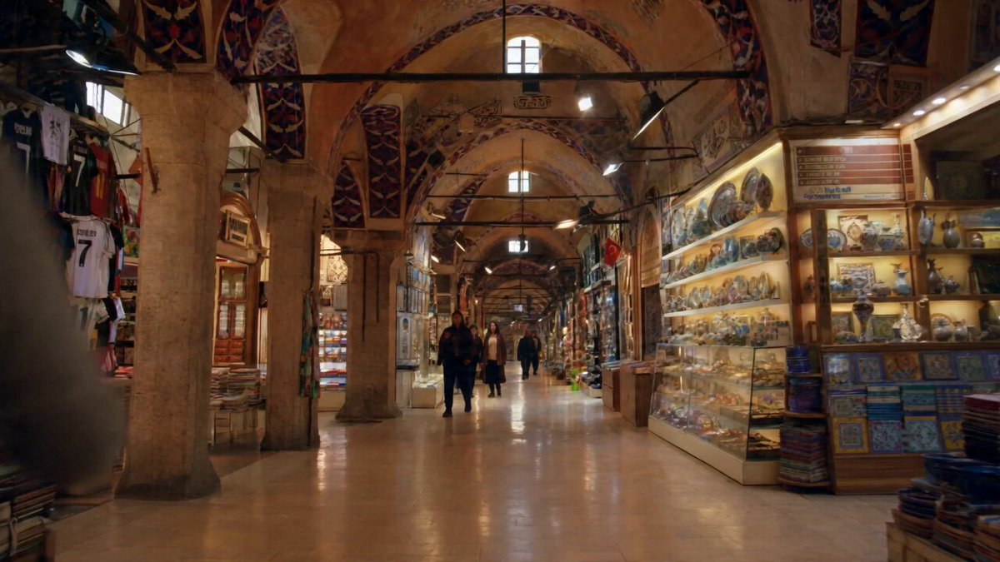</a>

<a href="https://x.com/artovista/status/2083199703634575842">▶️ 在 X 上观看视频</a>

</div>

<details>
<summary><b>📋 点击展开 / 复制提示词</b></summary>

```
Full prompt, uncut:

One continuous take, no cuts from start to end. Photoreal, present day, 35mm film grain, handheld documentary energy. A choreographed stunt and martial-arts sequence performed by trained performers.

@Runner is the woman — her face, cheekbones, eyes, tied-back hair and costume stay exactly as shown for the whole take.
@Pursuer is the man — his face, shaved head, beard and long black coat stay exactly as shown for the whole take.
@BazaarSet is the first location — a corridor inside Istanbul's Grand Bazaar today.
@HanSet is the second location — the courtyard of an Ottoman han beside it.
The crowd is generated in the shot: ordinary present-day shoppers and tourists filling the aisle, moving past as background flow.

SCREEN POSITION: @Runner moves toward screen-right; @Pursuer comes from screen-left. This holds for the entire take.

0-6s  @Runner enters the bazaar corridor at full speed and accelerates through the shoppers, who turn as she passes, dust lifting into the light. Camera: tracking alongside her at hip height, running with her, the corridor stretching away in both directions.

6-11s  She loses ground weaving between the stalls; @Pursuer comes in from screen-left on a straighter line, the gap closing across the frame, and reaches her at the stone pier, catching her forearm. She turns into the grip, snaps a quick low side kick that puts him back a step, and breaks away still running. Camera: holds the two of them wide across the frame, then releases forward with her.

11-22s  She bursts through the arch into @HanSet, plants her feet inside the column of daylight and turns to fight. A fast taekwondo exchange: she slips his reach, snaps a high roundhouse kick that he blocks on his forearm, spins through into a back kick that lands square and folds him back two steps, then settles light on the balls of her feet with her guard up, dust turning in the light around them. Camera: one low orbit around the two of them, framing both figures head to foot so every kick reads in full, easing into brief slow motion on the spin, then back to speed.

22-30s  He comes forward once more; she steps inside, sweeps his lead leg and he goes down onto the flagstones and stays there. She holds her stance a beat, then turns and walks out through the far archway into the light, the courtyard opening up around her. Camera: slows, rises slightly, and holds wide as she goes.

The scene stays with @Runner, @Pursuer and these two spaces for the whole take; the light and the drifting dust carry the final seconds.

Audio: ambient only — footsteps on stone and the distant murmur of the bazaar crowd.

Method, since the prompt alone won't reproduce it:

Two character sheets — five views of each person side by side on one flat backdrop, neutral expression, hair tied back, costume identical in every view — plus two location plates with nobody in them. All four saved as named elements and called with @.

Every reference has to share one lighting scheme. Give it a warm interior and a cool exterior and the model averages them; skin tone and apparent age shift across the take.

Location plates must be empty of people. A figure standing in a reference becomes a third character in the shot, and in a two-person scene that's fatal.

Neutral faces only. One smile in a reference widened the cheeks for the entire clip.

What failed:

The first attempt was killed at 31% by the AUDIO moderation filter, not the video one. The trigger was "fast breathing" and "breathing hard" in my audio line — a woman, a man, physical contact and heavy breathing reads as something else entirely to an audio classifier. Stripping every breathing reference fixed it on the next run. Credits were refunded on the rejection.

Her vest drifts a shade lighter around 0:18.

And the flying kick at 0:16 was not in my prompt. I left it out on purpose because it is the first move to fall apart. It went in anyway.
```

</details>

**👤 出处:** [@artovista](https://x.com/artovista) · [source](https://x.com/artovista/status/2083199703634575842)

▶️ **用 API 跑这条提示词** → [Velokey](https://velokey.ai/model/doubao-seedance-2-5-text-to-video?sourceChannel=github-awesome-seedance)（模型 id：`seedance-2.5`）

---

### No.3 动漫刀战·25机位

  

<div align="center">

<a href="https://x.com/Dyyaiworker/status/2083215037725073579">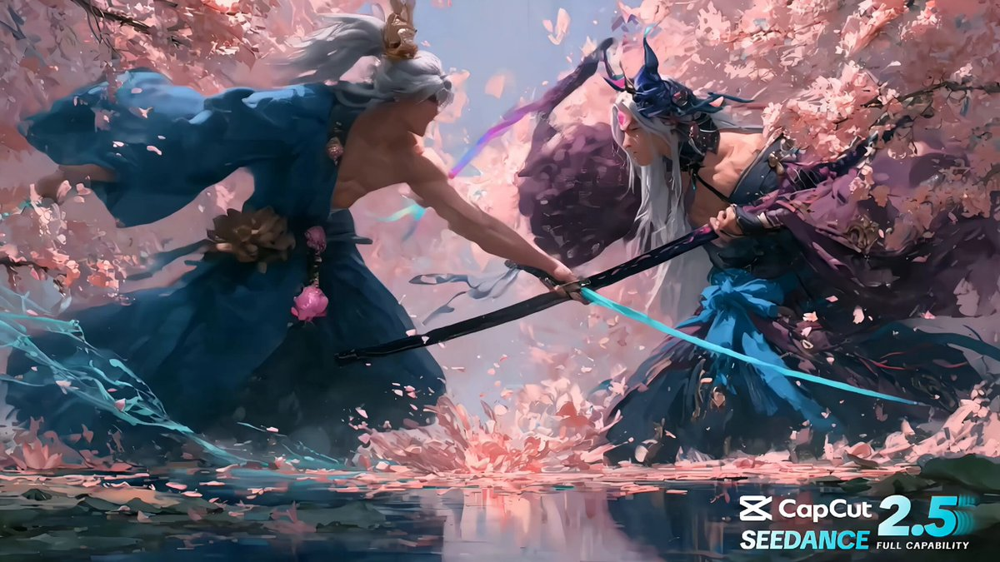</a>

<a href="https://x.com/Dyyaiworker/status/2083215037725073579">▶️ 在 X 上观看视频</a>

</div>

<details>
<summary><b>📋 点击展开 / 复制提示词</b></summary>

```
Painterly digital art style, a sword fight between two characters from reference image, extremely fast-paced action, 25 different camera angles, 30-second video.
```

</details>

**👤 出处:** [@Dyyaiworker](https://x.com/Dyyaiworker) · [source](https://x.com/Dyyaiworker/status/2083215037725073579)

▶️ **用 API 跑这条提示词** → [Velokey](https://velokey.ai/model/doubao-seedance-2-5-text-to-video?sourceChannel=github-awesome-seedance)（模型 id：`seedance-2.5`）

---

### No.5 POV·日本海岸晨间通勤

  

<div align="center">

<a href="https://x.com/noman23761/status/2083238023865729416">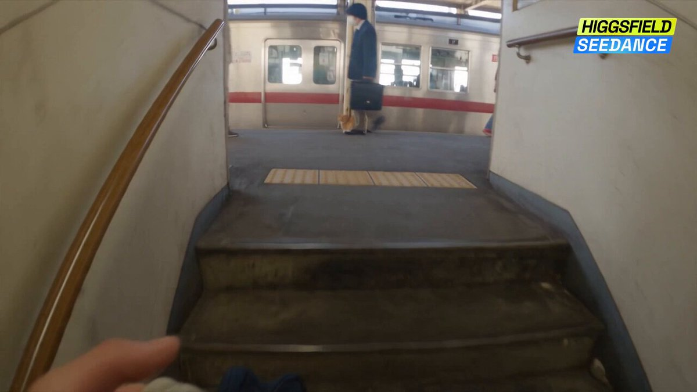</a>

<a href="https://x.com/noman23761/status/2083238023865729416">▶️ 在 X 上观看视频</a>

</div>

<details>
<summary><b>📋 点击展开 / 复制提示词</b></summary>

```
POV — Morning Commute in Coastal Japan | Ultra-Realistic, One Continuous Take

First-person POV, no cuts, one unbroken handheld-feeling shot from our own eyes on the way through a small seaside town. Ultra-photorealistic, phone-in-hand realism — natural camera micro-shake, subtle head bob with each step, occasional glance down at our own hands and shoes. 4K, shallow but natural depth of field, real morning light, no color-grading fantasy, no neon.

Beat 1 — Descending into the station (0–4s): We walk down worn concrete station stairs into a small coastal-town metro entrance, one hand loosely gripping a canvas bag strap that swings into the lower frame. Fluorescent tint mixes with daylight bleeding from the entrance behind us. Commuters pass in soft focus; we hear muffled announcements and the shuffle of footsteps.

Beat 2 — The orange cat (4–9s): We slow and crouch — the horizon dips as our POV lowers toward the ground. An orange tabby sits by a ticket-gate pillar, tail curled. Our hand (natural skin texture, slightly bitten nails, cuff of a sleeve) reaches into frame and gently strokes its head. The cat leans into the touch, eyes half-closing, ears flicking. We hold there a beat, warm and quiet.

Beat 3 — Boarding, settling by the window (9–14s): We rise, the horizon lifts, and we step through the train doors just as the chime sounds. POV turns and moves toward a window seat; we sit, and the frame settles against the glass. A faint silhouette of us ghosts over the view. The train pulls away with a gentle lurch.

Beat 4 — The shimmering sea (14–20s): Through the window, the town gives way to open coastline. Sunlight scatters across the water in thousands of moving sparkles — real specular glitter, not CGI bloom. Utility poles and wires strobe past in the foreground. We rest our chin lightly (subtle downward frame tilt), just watching.

Beat 5 — Rails into the sea (20–25s): The track curves and runs so close to the shore that the rails seem to vanish straight into the water — the sea fills nearly the whole frame, waves lapping right up to the ballast. Foam catches the light. We're gliding along the edge of the ocean, the horizon line steady, gulls crossing in the distance. Hold on this until the shot ends.

Technical spec: continuous POV, first-person, no cuts or transitions, natural handheld micro-motion, realistic morning ambient audio (station hum, cat, train chime, rail clatter, distant surf), authentic Japanese coastal-railway setting (Shimonada / Enoden-style seaside line), overcast-to-clear soft daylight, photoreal skin and fabric texture, 2.39:1 or 16:9, ultra-realistic.

Coming soon to Higgsfield.

          
@higgsfield @noman23761
```

</details>

**👤 出处:** [@noman23761](https://x.com/noman23761) · [source](https://x.com/noman23761/status/2083238023865729416)

▶️ **用 API 跑这条提示词** → [Velokey](https://velokey.ai/model/doubao-seedance-2-5-text-to-video?sourceChannel=github-awesome-seedance)（模型 id：`seedance-2.5`）

---

### No.11 史诗奇幻电影长镜

  

<div align="center">

<a href="https://x.com/AIcanvas_Frames/status/2083382439846801753">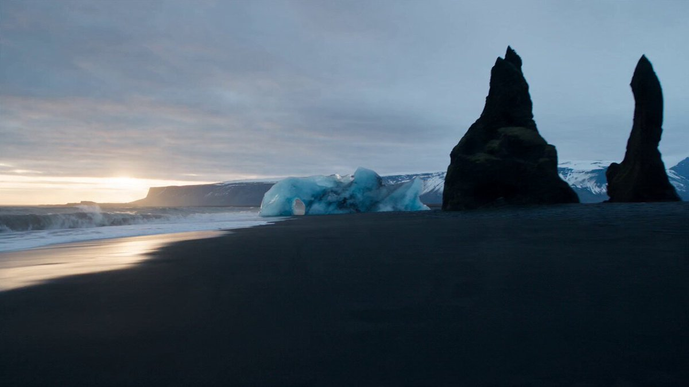</a>

<a href="https://x.com/AIcanvas_Frames/status/2083382439846801753">▶️ 在 X 上观看视频</a>

</div>

<details>
<summary><b>📋 点击展开 / 复制提示词</b></summary>

```
16:9, 30 seconds, an epic photorealistic fantasy cinematic long take, original worldbuilding, one continuous shot, continuous camera movement, no hard cuts, and no references to any existing film, character, actor, or recognizable cinematic scene.

OVERALL STYLE:
A high-budget fantasy film aesthetic with realistic cinematography, monumental world scale, and a beautiful protagonist with natural skin, realistic expressions, and believable body proportions. The overall tone is intelligent, elegant, mysterious, and courageous, never childish, cartoonish, or exaggerated cosplay. Four locations are connected through one continuous flight path: Iceland’s black coastline, an alternate Victorian London, a Paris-inspired city at night in the rain, and a futuristic New York-inspired aerial metropolis.

UNIFIED COLOR PALETTE:
Deep black, silver-gray, and warm gold remain the dominant colors throughout the film. Iceland adds cold blue; London adds gray-green and amber; Paris adds deep blue and wet gold; New York adds deep teal, silver-white, and gold. Maintain realistic atmospheric perspective, thin mist, rainfall, wet surfaces, glass reflections, and volumetric light throughout. Avoid a video-game look, concept-art appearance, and plastic materials.

MAIN CHARACTER:
There is only one female protagonist throughout the entire video. She is approximately 28 years old, slender, exceptionally beautiful, intelligent, elegant, and quietly determined. Her refined facial features are completely original and must not copy any real actor or movie character. She has naturally bright eyes, clearly defined eyebrows, a soft but strong facial structure, natural skin tone, realistic skin texture, and a restrained, focused expression.

She has warm chestnut-brown hair reaching her waist, naturally wavy at the ends. Part of her hair is blown behind her shoulders by the wind. Her hairstyle must remain identical throughout the entire film.

She wears a deep forest-green long coat, an ivory high-neck blouse, a dark-red knitted scarf, brown leather wrist guards, dark-gray trousers, and worn leather boots. Her costume has an elevated British fantasy aesthetic, but she does not wear a school uniform or pointed hat. Do not include badges, school emblems, magical-school symbols, recognizable character costumes, or elements from any existing film.

She rides the same original flying broom throughout the sequence: a dark, aged wooden handle with silver-gray metallic fibers at the rear and a small warm-gold light at the front. The broom’s shape, size, color, and materials must never change.

HER OBJECTIVE:
She is flying through different cities to carry the small warm-gold light toward the far edge of the clouds. She is not a combat character. She does not attack anyone or cast explosive magic. She simply continues forward through cities, coastlines, fog, rain, and high-altitude air. Her emotional progression moves from concentration to wonder, then finally to freedom and determination.

0-5 SECONDS: TAKEOFF FROM ICELAND’S BLACK-SAND BEACH
The shot begins extremely low above a black volcanic beach using a 24mm wide-angle lens. Black ocean waves are on the left, towering basalt columns on the right, and blue-white glacial mountains in the distance. Cold blue clouds press down across the sky, while a narrow line of warm golden sunset remains near the horizon.

The beautiful female traveler rapidly enters from the rear right of the frame, riding her broom just above the ocean surface. Her chestnut-brown hair streams backward in the sea wind. Her dark-red scarf creates a clean motion line behind her, while her deep forest-green coat moves naturally in the airflow. The warm-gold light at the front of the broom illuminates the sea mist and droplets of water.

The camera follows her from behind with a stable FPV movement, keeping her slightly right of center. It must not circle around to the front or allow her to leave the frame. Her body leans slightly forward; one hand holds the broom handle while the other maintains balance. She flies toward a massive wall of blue ice.

At the fourth second, she enters a natural裂缝 beneath the ice wall. The ice passes rapidly along both sides of the camera. Cold blue crystals briefly intersect with the warm-gold light, creating the first natural transition. No explosion, magical smoke, or sudden transformation.

5-12 SECONDS: VICTORIAN LONDON IN THE FOG
As the ice clears the lens, the environment naturally becomes an alternate Victorian city at night. The protagonist and broom retain exactly the same direction, speed, clothing, appearance, and flying posture. The camera continues following from behind.

Below are wet dark-gray stone streets. Red-brick buildings, black iron bridges, narrow windows, and old amber streetlamps line both sides. Several dark-red double-decker public vehicles without text or branding move slowly through the fog. The city should evoke Victorian London without reproducing real landmarks.

The camera gradually transitions from fast FPV pursuit into a smooth three-quarter rear tracking shot, moving approximately 45 degrees to her left side. Her beautiful profile appears briefly. Her eyes remain focused, and her hair and scarf maintain stable continuity. The warm-gold light leaves only a short trail through the rain and fog.

She passes beneath a black elevated iron bridge. Its steel structure moves across the top of the frame as a brief physical occlusion. The camera does not cut, and when the obstruction clears, she remains on the same movement axis.

At the tenth second, she flies into a massive arched railway station. Its roof is made from black steel beams and wet glass, with rainwater flowing across the surface. The roof completely covers the frame, creating the second natural transition.

12-19 SECONDS: PARIS-INSPIRED CITY IN THE RAIN
When the glass roof clears the camera, the environment becomes a romantic, original Paris-inspired city at night in the rain. Do not reproduce real landmarks. Preserve only the atmosphere of stone bridges, a river, narrow streets, classical stone buildings, wrought-iron balconies, and warm window light.

The protagonist flies low above a broad river. The water reflects golden windows and the deep-blue night sky. Pale-gray stone buildings, tall narrow windows, wet rooftops, and fine rain lines extend along both sides. Her deep-green coat and dark-red scarf form a clear silhouette against the blue city, while her chestnut hair streams backward.

The camera moves into a parallel tracking position on her right side. The broom stays approximately three meters above the river. The camera remains slightly below shoulder level, preserving the spatial relationship between the woman, broom, river, and architecture. She passes beneath a sequence of classical stone bridges whose arches form continuous reflections in the water.

At the seventeenth second, she enters a long mirror corridor made from wet glass walls. The reflections may show only the same woman, the same broom, and the same warm-gold light. Do not create duplicate people. Rainwater, city lights, and reflections slide along the glass surfaces.

A powerful warm-gold light appears at the end of the corridor. She flies toward it, creating the third natural transition.

19-24 SECONDS: FUTURISTIC NEW YORK-INSPIRED CITY
The mirror corridor opens into an original futuristic New York-inspired metropolis. The camera rapidly but smoothly shifts from the three-quarter rear position into a controlled forward-facing FPV shot moving backward in front of her. Her beautiful, focused face, chestnut hair, dark-red scarf, and the golden broom light are briefly visible.

Below are wet streets, glass skyscrapers, metallic elevated bridges, and enormous urban canyons. The buildings reflect golden light, a deep-teal night sky, and silver-white mist. All screens and glass surfaces must remain abstract and free of text, advertisements, logos, or branding.

She flies between two skyscrapers. The glass wall on the left passes close to the camera, while a vast urban canyon opens on the right. The camera briefly maintains its backward-facing position before completing one stable 90-degree upward movement, transitioning from her face to a position above her.

Do not spin rapidly, make her tumble, or transform the broom into an aircraft. She remains graceful, skilled, and stable.

At the twenty-third second, she bursts out from between the skyscrapers. The city lights rapidly become smaller below her, while the warm-gold light at the front of the broom becomes the only stable light source near the center of the image.

24-30 SECONDS: THE FINAL WORLD ABOVE THE CLOUDS
The camera continues rising at high speed and passes through a dense layer of cloud. When the clouds clear, the protagonist appears high above a vast cloud sea, hovering on her broom.

She gradually slows down and changes from a forward-leaning posture to a more upright position. Her chestnut hair and dark-red scarf move backward in the high-altitude wind. The camera moves from the front to her right rear side, then rises into a high-angle 24mm wide shot.

Distant traces of the four worlds appear below without forming a chaotic collage: Iceland’s black coastline and blue glacier on the far left; London-inspired red-brick structures and gray-green fog in the middle distance; Paris-inspired golden waterways and stone bridges on the right; and silver-white lights from the New York-inspired glass city at the lowest level.

These locations must exist only as distant spatial layers. Do not suddenly reproduce four complete cities or make buildings float and reorganize. A warm golden horizon appears at the edge of the clouds, suggesting that another world is waiting beyond it.

At the twenty-eighth second, the protagonist raises her right hand. The warm-gold light at the front of the broom emits one thin beam toward the horizon. The beam only illuminates a new path through the clouds. It does not explode, create a giant energy sphere, or alter her appearance.

During seconds twenty-nine to thirty, the camera becomes completely stable. The protagonist, broom, cloud sea, distant layers of the four cities, and golden horizon are all clearly visible. She appears as a beautiful but small figure near the lower center of the frame, facing the open world. The final emotion is freedom, wonder, and the sense that the journey will continue.

CAMERA AND PACING:
0-5 seconds: low-altitude rear FPV pursuit.
5-12 seconds: smooth three-quarter rear tracking through London.
12-19 seconds: parallel low-altitude tracking through Paris.
19-24 seconds: one controlled front-facing backward FPV movement through New York.
24-30 seconds: continuous rise into a high-angle wide establishing shot.
Use FPV speed only during the Iceland takeoff and New York skyscraper passage. Keep the London and Paris sections controlled, elegant, and spatially readable.

SOUND DESIGN:
Iceland: ocean waves, cold wind, low glacial rumbling, and subtle vibration from the wooden broom.
London: rain, steam, iron-bridge resonance, and distant wheels.
Paris: rain droplets, water, distant bells, and low strings.
New York: low urban rumble, wind pressure across glass, and metallic structural resonance.
Above the clouds, all city sounds gradually fade, leaving high-altitude wind, a subtle metallic resonance from the broom fibers, and one warm sustained string note.

CONTINUITY RESTRICTIONS:
Only one female protagonist appears throughout the video.
She must remain exceptionally beautiful, natural, and realistic, with stable original facial features that do not copy any actor or film character.
Her chestnut-brown hair must retain the same color, length, and hairstyle.
Her forest-green coat, ivory blouse, dark-red scarf, brown wrist guards, dark-gray trousers, and worn boots must remain unchanged.
The broom must remain the same dark aged wooden broom with silver-gray metallic fibers and a warm-gold front light.
Do not add companions or other flying characters.
Do not include pointed hats, school uniforms, magical schools, badges, school emblems, castles, recognizable film characters, superhero logos, or brand symbols.
Do not generate text, subtitles, advertisements, UI elements, logos, or readable signs.
Do not allow buildings to melt, drift, resize, or suddenly reorganize.
Do not create duplicate figures in mirrors.
Maintain realistic physical behavior for ice, rain, water, glass, fog, and clouds.
Do not use hard cuts, sudden spinning, random shaking, abrupt zooms, body deformation, face replacement, explosions, large-scale destruction, or unmotivated effects.
Keep the protagonist, broom, flying direction, city geography, and lighting transitions continuous and visually traceable.
```

</details>

**👤 出处:** [@AIcanvas_Frames](https://x.com/AIcanvas_Frames) · [source](https://x.com/AIcanvas_Frames/status/2083382439846801753)

▶️ **用 API 跑这条提示词** → [Velokey](https://velokey.ai/model/doubao-seedance-2-5-text-to-video?sourceChannel=github-awesome-seedance)（模型 id：`seedance-2.5`）

---

### No.20 太极化龙·水之变

  

<div align="center">

<a href="https://x.com/liaojitao/status/2083526956537024739">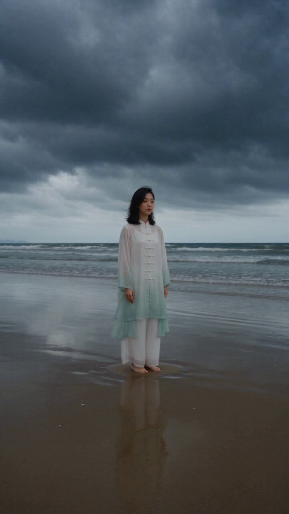</a>

<a href="https://x.com/liaojitao/status/2083526956537024739">▶️ 在 X 上观看视频</a>

</div>

<details>
<summary><b>📋 点击展开 / 复制提示词</b></summary>

```
She starts with Tai Chi.

Thirty seconds later, the ocean becomes a dragon.

I gave Seedance 2.5 no timestamps and no second-by-second shot list—only a story arc: stillness, rising force, a water-dragon climax, and a quiet ending.

One 30-second generation. 780 credits.

It understood the buildup far better than I expected.

Here is the prompt I used:

Create a 30-second, 9:16 vertical live-action Eastern fantasy short film.

The input reference image shows multiple facial views of the same young adult Asian woman. Use it only to preserve her facial features, skin tone, shoulder-length black hair, pearl stud earrings, age, and identity. Do not inherit the clothing shown in the reference image. Only this one protagonist may appear throughout the final video. Do not show a collage, split screen, studio backdrop, or duplicated versions of the character.

She wears a lightweight modern Tai Chi-inspired wuxia outfit in white and pale sage, with long sleeves and layered fabric that move naturally with the wind and her body. She stands barefoot on wet sand. Her face, hairstyle, age, clothing, and body proportions must remain consistent throughout the entire video.

The story takes place on a beach shortly before a storm. The sky hangs low, the sea wind moves her clothing, and the distant waves gradually become more turbulent.

Open with restraint and stillness. Establish the setting with a wide view of the coastline. She stands facing the sea for a moment, then slowly raises her hands and begins a grounded, fluid, realistic Tai Chi sequence. Her wrists, fingers, shoulders, steps, balance, and breathing should follow believable human movement. It should not look like dance, and she should not perform exaggerated jumps.

As she moves through cloud hands and turns her body, ripples appear in the shallow water around her feet. The sea responds only subtly at first. Then several transparent ribbons of water begin to form and follow the direction of her arms. Every movement of the water must be visibly caused by her Tai Chi gestures.

Her movements gradually become more powerful. The camera slowly moves from a medium view toward her side as the water ribbons rise and gather behind her. Do not reveal the final form too early. Let the force and the water accumulate step by step.

At the climax, she completes a full turn, settles her balance, and pushes both palms forward. The gathered seawater rises violently and forms an enormous transparent Eastern dragon made from realistic water. The dragon circles her once, then surges toward the approaching black storm clouds.

The water dragon breaks through the clouds. The darkness tears open and golden sunlight pours back across the sea. The dragon loses its form and falls back into the ocean as fine rain.

Return to stillness for the ending. She slowly completes the Tai Chi form and lowers her hands. The waves become calm again. Hold on her silhouette facing the golden sea for a moment before the film ends naturally.

The entire video must feel like one continuously developing story, not a collection of unrelated effects shots. Use only a small number of motivated cuts. Do not cut for every individual movement. Give the opening room to breathe, let the power rise gradually, reveal the dragon only at the climax, and fully show the closing movement and the sea returning to calm.

Use only synchronized environmental sound: waves, wind, fabric movement, bare footsteps on wet sand, gathering water, and a low resonant sound from the water dragon. No dialogue, no narration, no background music, no subtitles, no text, no logo, and no watermark.

Avoid identity drift, remnants of the original reference clothing, costume changes, malformed limbs or fingers, sliding feet, water effects without a visible cause, revealing the dragon too early, excessive hard cuts, cartoon water, video-game visual effects, and a climax without buildup.
```

</details>

**👤 出处:** [@liaojitao](https://x.com/liaojitao) · [source](https://x.com/liaojitao/status/2083526956537024739)

▶️ **用 API 跑这条提示词** → [Velokey](https://velokey.ai/model/doubao-seedance-2-5-text-to-video?sourceChannel=github-awesome-seedance)（模型 id：`seedance-2.5`）

---

### No.25 80-90 年代 anime 风

  

<div align="center">

<a href="https://x.com/kinovi_ai/status/2083589777002275326">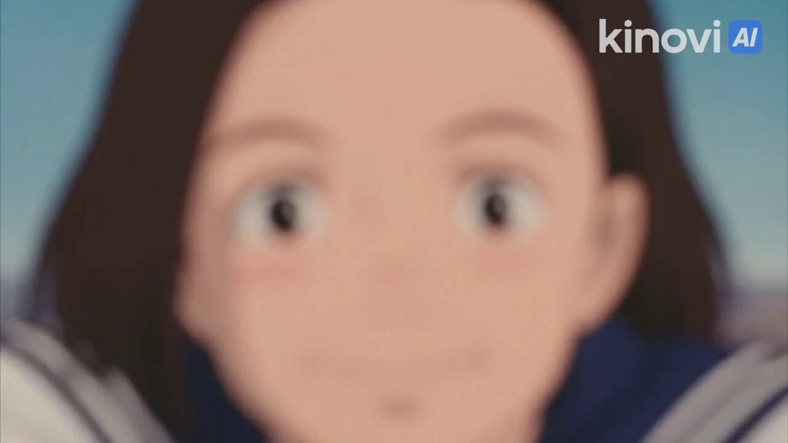</a>

<a href="https://x.com/kinovi_ai/status/2083589777002275326">▶️ 在 X 上观看视频</a>

</div>

<details>
<summary><b>📋 点击展开 / 复制提示词</b></summary>

```
1⃣

Part 1

VISUALS:

Global Camera & Style Directives: Authentic late 1980s to early 1990s anime animation style. The visual fidelity strictly adheres to hand-drawn cel animation aesthetics, characterized by a soft pastel color palette, delicate linework, and a classic 24-frames-per-second retro anime frame rate. There is a continuous presence of slight film grain, soft blooming highlights, and occasional, subtle VHS tracking artifacts at the very bottom edge of the frame. The entire sequence is framed through the POV of a bulky 1990s handheld camcorder. The camera movement features natural hand-shake, clumsy auto-focus hunting, and raw, unpolished framing. Later scenes utilize a locked-off, fixed camera angle when the camcorder is propped on a stone wall, mimicking a personal travel vlog setup. The background art for the Grand Canyon is rendered in breathtaking, highly detailed watercolor matte paintings typical of high-budget 90s theatrical anime features. No CGI, no digital gloss, and no modern particle effects.

Scene 1: Handheld POV, extreme close-up. The lens fumbles to find focus before snapping onto @image1. She is holding the camcorder at arm's length, pointing it at her own face. She has a bright, wide-eyed, optimistic smile (referencing the top-left expression from her character sheet). Behind her, a beautifully painted, pastel-hued desert landscape stretches out under a hazy, bright blue sky. 

Scene 2: Handheld POV, panning shot. @image1 turns the camera away from herself to film the walking path. She approaches a couple of towering, distinctly 1990s American tourists (drawn with slightly exaggerated, angular character designs, wearing neon windbreakers and sunglasses). The camera bobs as she walks up to them.

Scene 3: Handheld POV, erratic movement. The camera is lowered slightly as the American tourists stare down at the lens with completely blank, confused expressions. They exchange bewildered glances and shrug. The camera quickly swivels back to point at @image1's face. She is blushing furiously, sporting a classic anime "sweat-drop" on the back of her head, and utilizing the slightly distressed, thinking expression from her reference sheet (top row, third from left). She bows repeatedly to the camera lens in embarrassment.

Scene 4: Fixed camera angle, wide shot. @image1 has propped the camcorder onto a flat, sun-baked limestone rock at the edge of the Grand Canyon to film a full-body shot. The majestic, deep terracotta and muted purple watercolor layers of the canyon spread out endlessly behind her. She walks away from the lens toward the guardrail, her sailor uniform skirt blowing gently in the desert wind.

Scene 5: Fixed camera angle, medium-wide. @image1 leans slightly over the edge to look down into the vast chasm. Suddenly, the background violently distorts, utilizing a classic 2D anime "dolly zoom" (vertigo) effect. The colors briefly wash out, and her knees buckle. She sways dangerously backward, her balance entirely lost. She begins to tip.

Scene 6: Fixed camera angle, fast action. Just as she falls backward, a young American teenager (drawn in a complementary 90s anime style, wearing a baggy denim jacket, with messy light brown hair and deep, dark blue eyes) lunges into the frame from the right side. He firmly grabs her by the shoulders of her sailor uniform, pulling her safely back onto the solid path. The abrupt movement knocks the propped camcorder slightly askew, tilting the horizon line for the rest of the scene.

Scene 7: Fixed camera angle, slightly tilted. Close-up on the two of them as the boy stabilizes her. @image1 looks up at him, her eyes wide with shock. The boy looks down at her with genuine concern. The harsh desert sunlight catches their eyes, creating a signature 90s anime "sparkle" effect in their irises. A soft, warm light bathes the scene. Despite the tilted camera angle and the physical distance between their cultures, a palpable, cinematic moment of connection hangs in the air between them as they look at one another. End scene.

AUDIO & DIALOGUE:

Global Audio Directives: The audio profile mimics raw, untreated camcorder microphone recordings. There is a constant, low-level hiss of analog tape recording. Wind frequently blows into the microphone, creating harsh, clipping rumbles. Ambient sounds like crunching gravel, distant tourist chatter, and the echoing wind of the canyon are prominent. There is no background music, grounding the scene in a realistic, slice-of-life documentary feel.

Scene 1 SFX: The loud, mechanical clack of a plastic camcorder button being pressed. The rustling of fabric and the crunch of gravel underfoot.

Scene 1 Dialogue: @image1 (speaking directly into the camera, cheerful and loud): "Minna, mite! Gurando Kanyon ni tsukimashita!" (Everyone, look! I've arrived at the Grand Canyon!)

Scene 2 Dialogue: @image1 (from behind the camera, pitching her voice up politely): "Ano, sumimasen! Konnichiwa!" (Um, excuse me! Hello!)

Scene 3 Dialogue: American Tourist (muffled, speaking English with a heavy, booming voice): "Uh, sorry little lady, we don't speak... whatever that is. You lost?"

Scene 3 Dialogue: @image1 (flustered, speaking rapidly in Japanese to the camera): "Gomen nasai, gomen nasai! Eigo ga wakarimasen!" (I'm sorry, I'm sorry! I don't understand English!)

Scene 3 SFX: Rapid, cartoonish swooshing sounds as she bows repeatedly.

Scene 4 SFX: The harsh scraping of the hard plastic camcorder casing being set down against rough rock. The low, distant, hollow howling of the wind echoing through the massive canyon basin.

Scene 5 SFX: The ambient wind abruptly cuts out. A high-pitched, ringing tinnitus tone slowly builds in volume as the vertigo effect takes hold.

Scene 5 Dialogue: @image1 (a soft, breathless gasp): "Ah..."

Scene 6 SFX: The heavy, sudden scuff of sneakers skidding on gravel. The rustle of heavy denim fabric catching a falling body. The sharp clack of the camera being bumped, causing the audio to briefly cut out and pop.

Scene 7 Dialogue: American Boy (in a gentle, reassuring English voice, slightly out of breath): "Whoa, careful there. You okay? You almost took a nasty fall."

Scene 7 Dialogue: @image1 (looking up at him, voice trembling slightly but filled with gratitude): "A-arigatou gozaimasu... Daijoubu desu." (T-thank you very much... I'm okay.)

Scene 7 SFX: The howling canyon wind slowly fades back in, softer this time, blending with the steady, rhythmic clicking of the camcorder tape continuing to record.

Part 2:
VISUALS:

Global Camera & Style Directives: Authentic late 1980s to early 1990s anime animation style. Hand-drawn cel animation aesthetics, soft pastel color palette. No CGI or modern digital gloss.

Scene 1: Handheld POV, panning shot. The camcorder view pans across a rustic, wooden outdoor souvenir stand at the Grand Canyon. The shot focuses closely on a beautifully detailed display of traditional Navajo amulets and turquoise charms resting on a woven blanket.

Scene 2: Handheld POV, close-up. The camera abruptly flips around to frame @image1 . She utilizes the wide-eyed, slightly open-mouthed expression of sheer amazement from her reference sheet (top row, second from left). She enthusiastically holds up a small, beautifully crafted turquoise amulet on a leather cord right in front of the lens, showing off her new purchase with a bright smile.

Scene 3: Handheld POV, medium close-up. Time jump. @image1 is still holding the camera on herself as she walks along the sunlit canyon path. In her free hand, she holds a large, sugar-coated churro. She takes a bite, and classic 2D anime sparkles momentarily appear around her face to visually emphasize her delight. Her cheeks puff out slightly as she chews, smiling warmly at the camera lens.

Scene 4: Handheld POV, dynamic movement. @image1 gestures excitedly with the half-eaten churro. The majestic, watercolor-painted background of the Grand Canyon basin shifts behind her as she walks. She points the camcorder slightly downward toward the canyon rim in the distance, her expression shifting to one of determined curiosity. The camera slowly zooms in on the distant, rocky edge as she speaks. End scene. 

AUDIO & DIALOGUE:

Global Audio Directives: The audio mimics raw, untreated camcorder microphone recordings. A constant, low-level hiss of analog tape recording is present. Wind frequently blows into the microphone, creating harsh, clipping rumbles. Ambient outdoor sounds—crunching gravel, distant chatter, and the rustling of the desert breeze—are prominent. No background music.

Scene 1 SFX: The rhythmic, hollow shaking of wooden and stone wind chimes blowing in the breeze. The ambient hum of a crowd of tourists.

Scene 2 SFX: The loud, tactile CRINKLE of a paper shopping bag.

Scene 2 Dialogue: @image1 (excitedly in Japanese): "Sugoi! Kore, kaimashita!" (Amazing! I bought this!)

Scene 3 SFX: A highly exaggerated, crispy CRUNCH sound effect as she bites into the churro.

Scene 3 Dialogue: @image1 (muffled slightly by the food, incredibly cheerful): "Oishii! Koko no okashi, saikou desu!" (Delicious! The sweets here are the best!)

Scene 4 Dialogue: @image1 (speaking affectionately to her vlog audience): "Haha to imouto, sore ni tomodachi ni mo tabesasetai na." (I want to bring some back for my mother and sister, and my friends to try too.)

Scene 4 SFX: The wind kicks up, creating a loud rumble against the camcorder microphone.

Scene 4 Dialogue: @image1 (raising her voice slightly over the wind, sounding adventurous): "Sate! Gurando Kanyon ga dore kurai fukai ka, shita made mite mitai to omoimasu!" (Well then! I want to look down and see just how deep the Grand Canyon really is!)

Part 3:
VISUALS:

Global Camera & Style Directives: Authentic late 1980s to early 1990s anime animation style. The visual fidelity strictly adheres to hand-drawn cel animation aesthetics, characterized by a soft pastel color palette, delicate linework, and a classic 24-frames-per-second retro anime frame rate. The background art for the Grand Canyon is rendered in breathtaking, highly detailed watercolor matte paintings typical of high-budget 90s theatrical anime features. No CGI, no digital gloss, and no modern particle effects.

Scene 1: Fixed camera angle, tilted wide shot. @image1 (still held gently by the shoulders by the American boy) realizes how close they are. Her face flushes a deep, vibrant pink. She quickly looks down at her shoes, utilizing the shy, thinking expression from her reference sheet (top row, third from left), tightly clutching the fabric of her sailor uniform skirt.

Scene 2: Fixed camera angle, tilted medium shot. The American boy lets go of her shoulders and gives a warm, relaxed chuckle, flashing a classic 90s anime closed-eye smile. He raises his hand and points a finger directly toward the camera lens resting on the rock.

Scene 3: Fixed camera angle, tilted wide shot. @image1 follows his finger, her eyes going wide in comedic realization. A large animated sweat-drop appears on her forehead. Realizing the camera is still recording them, she lets out a small gasp and abruptly sprints toward the lens, her movement rendered in a fast, exaggerated flurry of 2D animation frames.

Scene 4: Fixed camera angle, extreme close-up. @image1's face fills the frame as she leans in close to the lens, blocking out the American boy and the canyon behind her. Her cheeks are still bright red. She cups one hand beside her mouth, looking shiftily to the side to make sure the boy isn't listening, before looking directly into the lens with bright, sparkling anime eyes. She reaches her other hand toward the lens to hit the stop button. The screen abruptly cuts to black.

AUDIO & DIALOGUE:

Global Audio Directives: The audio maintains the raw, untreated camcorder microphone quality, with the low hiss of analog tape and the ambient, echoing wind of the canyon basin.

Scene 7 Dialogue: @image2 (in a gentle, reassuring English voice, slightly out of breath): "Careful there. You okay? You almost took a nasty fall."

Scene 7 Dialogue: @image1 (looking up at him, voice trembling slightly but filled with gratitude): "A-arigatou gozaimasu... Daijoubu desu." (T-thank you very much... I'm okay.)

Scene 7 SFX: The howling canyon wind slowly fades back in, softer this time, blending with the steady, rhythmic clicking of the camcorder tape continuing to record.

Scene 2 SFX: A soft, rhythmic heartbeat sound effect slowly thumps in the background, emphasizing her shyness.

Scene 2 Dialogue: American Boy (chuckling, speaking in a friendly, casual English voice): "Is that yours?"

Scene 3 SFX: The rustle of his heavy denim jacket as he points.

Scene 4 SFX: A cartoonish gasp from @image1, followed by the rapid, scuffing dash-dash-dash sound of her sneakers sprinting across the gravel toward the microphone.

Scene 4 Dialogue: @image1 (whispering rapidly and excitedly in Japanese directly into the microphone): "Memai nante hajimete... Kare, sugoi kakkoii! Gurando Kanyon wa hontou ni sugoi!!" (I never had vertigo before... He is so handsome! The Grand Canyon is so amazing!!)

Scene 4 SFX: The loud, heavy CLICK of the physical camcorder button being pressed, instantly cutting the audio to absolute dead silence.
```

</details>

**👤 出处:** [@kinovi_ai](https://x.com/kinovi_ai) · [source](https://x.com/kinovi_ai/status/2083589777002275326)

▶️ **用 API 跑这条提示词** → [Velokey](https://velokey.ai/model/doubao-seedance-2-5-text-to-video?sourceChannel=github-awesome-seedance)（模型 id：`seedance-2.5`）

---

### No.29 房产带看电影级长镜

  

<div align="center">

<a href="https://x.com/HeyZoyaKhan/status/2083626872609407105">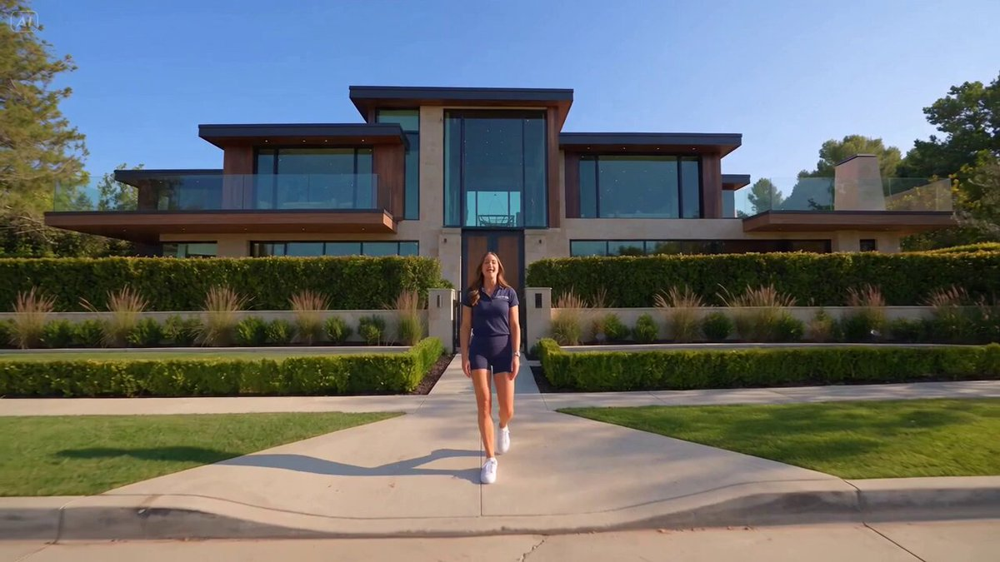</a>

<a href="https://x.com/HeyZoyaKhan/status/2083626872609407105">▶️ 在 X 上观看视频</a>

</div>

<details>
<summary><b>📋 点击展开 / 复制提示词</b></summary>

```
A hyper-realistic cinematic real estate tour filmed in a single continuous shot. The video begins with a stunning wide shot of a luxurious modern mansion on a sunny day. Standing on the sidewalk in front of the property is a friendly young female rental home consultant. She is dressed in fitted athletic shorts, a clean branded polo shirt, and white sneakers, giving her a sporty yet professional appearance. Looking directly into the camera, she warmly welcomes viewers and begins introducing the luxury home with natural, enthusiastic body language.

As she speaks, she starts walking toward the property while the camera smoothly follows her with steady gimbal movement. She points out the home's striking contemporary architecture, landscaped gardens, large glass façade, and elegant entrance. Reaching the front gate, she opens it naturally and invites viewers inside.

The camera follows her through the gate and into the property without any cuts. She continues presenting the home as she walks along the entrance pathway, highlighting the beautiful outdoor spaces before opening the front door and entering the house. Inside, she guides viewers through the spacious living room, designer kitchen, dining area, luxury bedrooms, bathrooms, walk-in closet, home office, entertainment room, and other premium features. She occasionally gestures toward details such as marble finishes, floor-to-ceiling windows, designer furniture, smart home technology, and breathtaking views.

Throughout the tour, she maintains eye contact with the camera, smiles naturally, and speaks with the confidence and warmth of an experienced luxury rental consultant. The camera movement remains smooth and immersive, with realistic walking motion, subtle depth of field, natural lighting, authentic reflections, and premium real estate commercial cinematography. Ultra-photorealistic, documentary realism, cinematic color grading,
```

</details>

**👤 出处:** [@HeyZoyaKhan](https://x.com/HeyZoyaKhan) · [source](https://x.com/HeyZoyaKhan/status/2083626872609407105)

▶️ **用 API 跑这条提示词** → [Velokey](https://velokey.ai/model/doubao-seedance-2-5-text-to-video?sourceChannel=github-awesome-seedance)（模型 id：`seedance-2.5`）

---

### No.30 蝉蜕皮微距延时

  

<div align="center">

<a href="https://x.com/woleswoosh/status/2083628438112571614">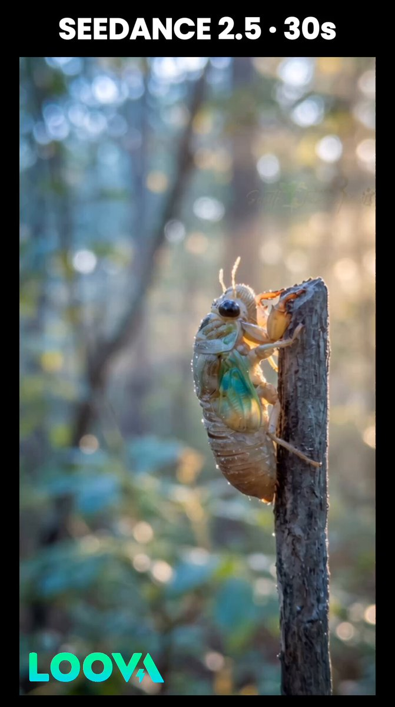</a>

<a href="https://x.com/woleswoosh/status/2083628438112571614">▶️ 在 X 上观看视频</a>

</div>

<details>
<summary><b>📋 点击展开 / 复制提示词</b></summary>

```
SCENE CONTEXT
 Time-lapse macro study of a cicada molting in a warm misty forest at sunrise. The sequence opens on a dew-covered brown exoskeleton gripping a weathered upright wooden stake in side view, and closes with the newly emerged jade-green adult suspended vertically beneath its own shed skin on that same stake, facing the lens, two pairs of vast crystal-clear wings stretching well beyond the tip of its abdomen, delicate pale veins lit from behind. 

FORMAT MODE 
One unbroken time-lapse macro take with a single continuous camera movement. No edits, no crossfades, no dissolves — the whole transformation plays out as one flowing event ending in complete stillness. 

OPTICS
Telephoto macro perspective, roughly 18° diagonal field of view. Focus is razor thin and stays glued to the insect and the stake for the entire clip. The woodland behind collapses into large soft discs of green and gold bokeh; only the cicada and the wood texture stay critically sharp. 

CAMERA
Begin on the supplied start frame: lateral profile of the nymph case locked to the stake's edge. Across the clip the camera makes one gentle 45-degree orbit around the stake with an almost invisible push-in, arriving exactly at the supplied end frame: stake slightly right of center, empty case up top, adult hanging straight down beneath it, perfectly frontal and symmetric, wings extended on both flanks. The move is slow, smooth like a motion-control rig, free of shake, jumps, or zoom punches. 

ACTION TIMING 
A single uninterrupted event in strict order: The dew-beaded brown shell hangs motionless in profile near the stake's top屏幕0000LE hooked into rough bark replace fine droplets sparkling along its ridged back. Hold briefly. A thin fissure opens along the shell's spine and gradually gapes wider. Within0 a supple moist jade body heaves in slow breath-like waves; head and thorax force their way out through the gap in measured pulses while droplets shiver and run off the quivering case. The emerging insect bends its soft body sharply backward, dangling upside down held only by the abdomen tip. The wings at this stage are tiny crumpled damp turquoise buds, translucent against the backlight. Let this suspended moment breathe. The cicada jackknifes upward, eases its abdomen free in slow surges, and takes fresh hold of the stake directly UNDERNEATH the abandoned shell, settling upright vertical, its body gradually turning toward the lens as the orbit continues. The old case above stays untouched. Wing deployment: the buds swell steadily, lengthening downward and unrolling into two immense glassy wing pairs reaching past the abdomen. Pale whitish-green veins etch themselves sharper as the membranes pull taut, glowing like leaded glass. Dew beads across the head and thorax. The jade face stiffens while the abdomen retains a warm amber-brown cast. At last the insect hangs utterly motionless, wings complete, dead-frontal to camera, beneath its former shell. Hold the frame. 

PHYSICS
Everything moves with true slow-motion insect physics: fluid-pressure body expansion, chitin splitting along the seamosquito sticky damp membranes clinging before letting go, clawed feet biting into bark, wings pumped full from crumpled sacs into stiff foils with a faint pulsing and tiny settling shivers as they harden. Droplets bead, quiver, and slip with each tremor. The hanging body has genuine weight pulling straight down; fresh wings sag slightly before they firm up. The empty shell never stirs. Nothing floats, snaps, or jumps position. 

LIGHTING
Low golden morning sun hits the subject from behind and from frame-right, tracing shell, body, and wing edges in warm amber rim light; the spread wings shine translucent with luminous vein patterns against the bokeh. Soft cool green-blue forest shade gently opens the shadow side. The backdrop stays a blurred canopy of green and gold discs throughout — never black, never studio. Keep the exposure lively on the rim-lit cicada. 

POSITIVE LOCKS
Exactly one cicada and one stake for the entire transformation — the shell above and the winged adult below always read as one continuous organism. No extra insects, no hands, no tools, no cutaway shots. The shed case stays pinned above the adult until the final frame. The closing image reproduces the supplied end reference: frontal adult, husk overhead, wings fully deployed. The forest setting, daylight, and golden bokeh remain constant start to finish.

Use First frame and last frame
```

</details>

**👤 出处:** [@woleswoosh](https://x.com/woleswoosh) · [source](https://x.com/woleswoosh/status/2083628438112571614)

▶️ **用 API 跑这条提示词** → [Velokey](https://velokey.ai/model/doubao-seedance-2-5-text-to-video?sourceChannel=github-awesome-seedance)（模型 id：`seedance-2.5`）

---

### No.38 美式啤酒广告模板

  

<div align="center">

<a href="https://x.com/techhalla/status/2083854169782325248">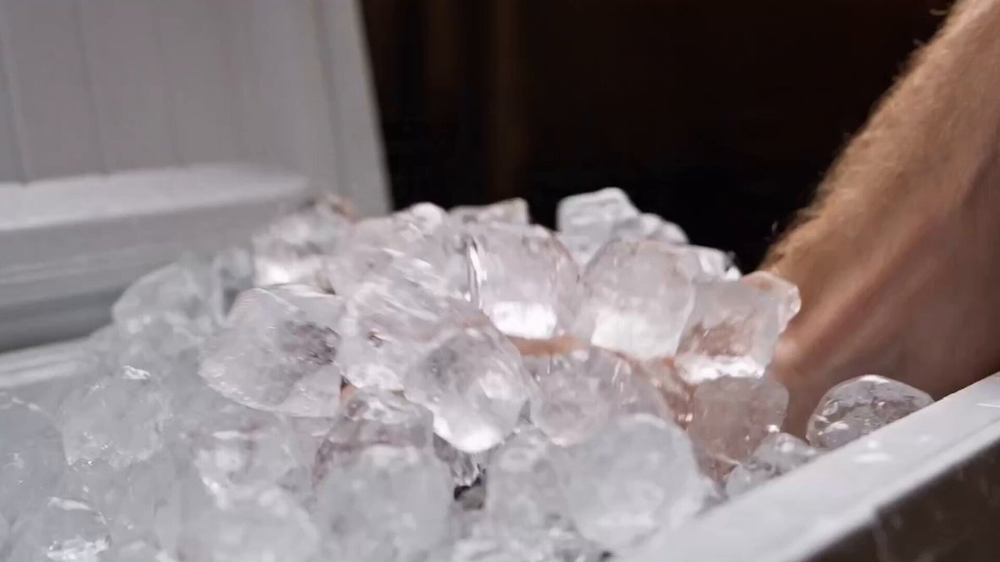</a>

<a href="https://x.com/techhalla/status/2083854169782325248">▶️ 在 X 上观看视频</a>

</div>

<details>
<summary><b>📋 点击展开 / 复制提示词</b></summary>

```
Seedance 2.5 prompt template for a beer commercial below 🍺 👇

High-energy American premium beer commercial in the kinetic visual language of top Spanish beer ads (Águila-style dynamism): extremely fast rhythmic cutting, aggressive camera movement, constant forward energy, product always the absolute hero. Shot on anamorphic cinema lenses with rich contrast, warm golden highlights, deep blacks, subtle film grain, perfect motion blur, and hyper-detailed product beauty. Every frame feels alive, expensive, and addictive.

Brand: TALON  
Logo: bold condensed American industrial sans-serif “TALON” in pure gold, with a sharp geometric falcon talon gripping a single hop cone integrated into the letter “A”.  
Bottle: tall elegant amber-glass longneck, matte black body label with the gold TALON logo centered, thin gold foil neck collar, embossed talon mark on the shoulder, heavy cold condensation beads, liquid a luminous deep-golden amber with dense creamy white head when poured.

0-2s: [Extreme close-up, rapid whip-pan] Ice explodes as a hand yanks a freezing TALON bottle from a metal cooler. Condensation flies. Instant cut.

2-4s: [Dynamic tracking, low angle] Bottle spins in slow-motion mid-air against a blazing desert sunset highway, gold logo catching the last light. Hard cut.

4-6s: [Handheld kinetic] Young crew in a vintage convertible flying down an empty American desert road at golden hour, wind ripping through hair, laughing. Driver raises a cold TALON without looking away from the road. Cut on the laugh.

6-8s: [Macro beauty, 120fps] Perfect pour: thick golden liquid cascades into a chilled glass, dense foam rising in ultra-slow motion, tiny bubbles racing upward, condensation racing down the glass. Sound of liquid is almost tactile.

8-10s: [Fast montage, 4 cuts in 2 seconds] Rooftop at dusk – city lights ignite. Friends clink bottles hard. Foam overflows. A girl throws her head back laughing. A guy points at the sky. Every cut lands on the bottle or the foam.

10-13s: [Steadicam push through crowd] Night football tailgate, American flags, smoke from grills, pure energy. Someone cracks a TALON, the distinctive sound cuts through the noise. Camera finds the bottle first, then the smiling faces around it.

13-16s: [Ultra-close product sequence] Three rapid macro shots:  
– condensation drop sliding down the gold logo  
– thick white head collapsing slowly over the rim  
– bottle rotating under hard practical light, label flashing gold  
Hard rhythmic cuts timed like drum hits.

16-19s: [Aerial + ground hybrid] Drone diving over a nighttime desert campfire circle. Friends sit around the flames, bottles in hand. Camera lands on one bottle standing upright in the sand, glowing from the firelight, logo sharp. Instant cut to a hand grabbing it.

19-22s: [Aggressive handheld, pure chaos energy] Bar bathroom mirror selfie energy turns into a full dance-floor explosion. Bottles raised high above the crowd. Liquid flying. Faces pure joy. Camera never stops moving, always finding the TALON label in the chaos.

22-25s: [Slow-motion climax beauty] Single perfect bottle of TALON held against a black background, spinning slowly. Gold logo catches every light. Then the same bottle is slammed down onto a wooden table in real time – foam erupts. Freeze on the eruption for half a second.

25-28s: [Final product hero] Extreme close-up of the open bottle and a full glass side-by-side, both sweating, foam perfect, gold logo glowing. Soft anamorphic flare. The word “TALON” appears in the same gold type over the image.

28-30s: [Hard cut to pure black] Gold TALON logo + talon icon slam on screen with the line:  
“TALON. Grip the night.”  
Hold for one beat of pure silence, then cut to black.

Cinematic anamorphic look, rich golden color grade, deep contrast, aggressive rhythmic editing, constant kinetic camera energy, hyper-detailed product macro photography, perfect condensation and liquid physics, zero dead frames, pure American freedom energy filtered through European beer-commercial precision, no dialogue, pure visual and emotional momentum.

Place your product as reference, tweak the prompt a bit and you are good to go!

Hope you find it useful 😎
```

</details>

> 💡 参数化广告模板

**👤 出处:** [@techhalla](https://x.com/techhalla) · [source](https://x.com/techhalla/status/2083854169782325248)

▶️ **用 API 跑这条提示词** → [Velokey](https://velokey.ai/model/doubao-seedance-2-5-text-to-video?sourceChannel=github-awesome-seedance)（模型 id：`seedance-2.5`）

---

### No.41 水墨→赛博龙转场

  

<div align="center">

<a href="https://x.com/sebatheepan/status/2083877878517670041">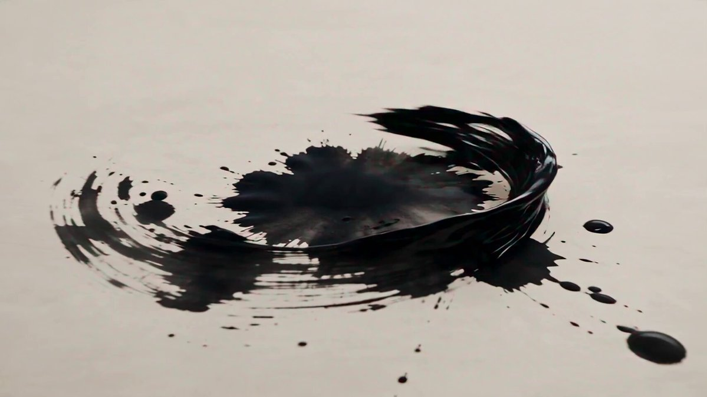</a>

<a href="https://x.com/sebatheepan/status/2083877878517670041">▶️ 在 X 上观看视频</a>

</div>

<details>
<summary><b>📋 点击展开 / 复制提示词</b></summary>

```
Seedance 2.5 prompt 

A single drop of black ink falls onto a blank sheet of paper in extreme close-up. It spreads into intricate calligraphy that rapidly forms into living brush strokes. The strokes lift off the paper, becoming three-dimensional liquid ribbons that whip through the air, wrapping around floating books and scrolls that open and dissolve into swirling galaxies of letters. The ribbons accelerate, weaving a massive floating calligraphy dragon that coils through a storm of flying pages. The dragon dives, smashing through the paper world into a neon-lit cyberpunk city where the same ink now crawls across skyscrapers as living graffiti, reforming into the dragon’s face that opens its mouth and swallows the camera into pure black, only for a single glowing character to appear and explode into light. Continuous tracking, accelerating camera, constant liquid morphing and particle chaos.
```

</details>

**👤 出处:** [@sebatheepan](https://x.com/sebatheepan) · [source](https://x.com/sebatheepan/status/2083877878517670041)

▶️ **用 API 跑这条提示词** → [Velokey](https://velokey.ai/model/doubao-seedance-2-5-text-to-video?sourceChannel=github-awesome-seedance)（模型 id：`seedance-2.5`）

---

### No.45 BBC 海獭自然纪录片

  

<div align="center">

<a href="https://x.com/Dheepanratnam/status/2083954551183298856"></a>

<a href="https://x.com/Dheepanratnam/status/2083954551183298856">▶️ 在 X 上观看视频</a>

</div>

<details>
<summary><b>📋 点击展开 / 复制提示词</b></summary>

```
30 seconds, 16:9, BBC Planet Earth nature documentary style, 8K ultra-realistic wildlife cinematography. Morning sunbeams pierce mist above a calm Pacific kelp cove. A mother sea otter floats peacefully on her back in emerald water, wrapped in bull-kelp leaves, while her tiny fluffy 2-week-old pup sleeps safely on her chest. Natural telephoto optics, 200mm lens, shallow depth of field, crystal water sparkles.

0:00-0:06: Low water-level telephoto tracking shot. Sunlight catches droplets on the mother's dark wet fur as she gently licks her pup's head. The pup stretches its tiny paws and lets out a soft squeak. 
NARRATION (warm, gentle documentary voiceover): "Here, in the quiet shelter of the kelp forest, morning begins with a mother's embrace."

0:06-0:12: Close-up on the pup yawning, its pink tongue visible, fluffing its dense cream-colored chest fur with tiny paws. The mother uses her paws to anchor them to a golden kelp frond. 
NARRATION: "For this two-week-old pup, her mother's chest is the safest island in the vast ocean."

0:12-0:18: Gentle 90-degree floating orbit around the otters. Golden light-caustics dance across the clear emerald water beneath them. A gentle swell lifts them softly. 
NARRATION: "Together, wrapped in living kelp, they ride the gentle rhythm of the sea."

0:18-0:24: Tight macro shot on the pup nuzzling the mother's cheek. The mother wraps both forepaws around her pup, closing her eyes in serene contentment. 
NARRATION: "A bond forged in warmth, drift, and quiet devotion."

0:24-0:30: Slow crane rise upward revealing the full sunlit kelp cove, distant pine-covered cliffs in soft morning fog, the otter pair reduced to a cozy center-frame focal point. 
NARRATION: "Another peaceful day dawns in the kelp kingdom."

SOUND: Soft ocean lap, gentle splash, tiny otter pup squeak, mother's breathing, kelp rustle, warm British documentary narration.
LOCKS: Natural fur physics, realistic water dynamics, no human objects, stable horizon, professional wildlife color grading.
NEGATIVE: No captions, text, logos, watermark, background music, cartoon eyes, exaggerated color saturation, extra animals.
```

</details>

**👤 出处:** [@Dheepanratnam](https://x.com/Dheepanratnam) · [source](https://x.com/Dheepanratnam/status/2083954551183298856)

▶️ **用 API 跑这条提示词** → [Velokey](https://velokey.ai/model/doubao-seedance-2-5-text-to-video?sourceChannel=github-awesome-seedance)（模型 id：`seedance-2.5`）

---

### No.61 盐湖金剑决斗·2.5D

  

<div align="center">

<a href="https://x.com/Cia0_exe/status/2083779210376781857">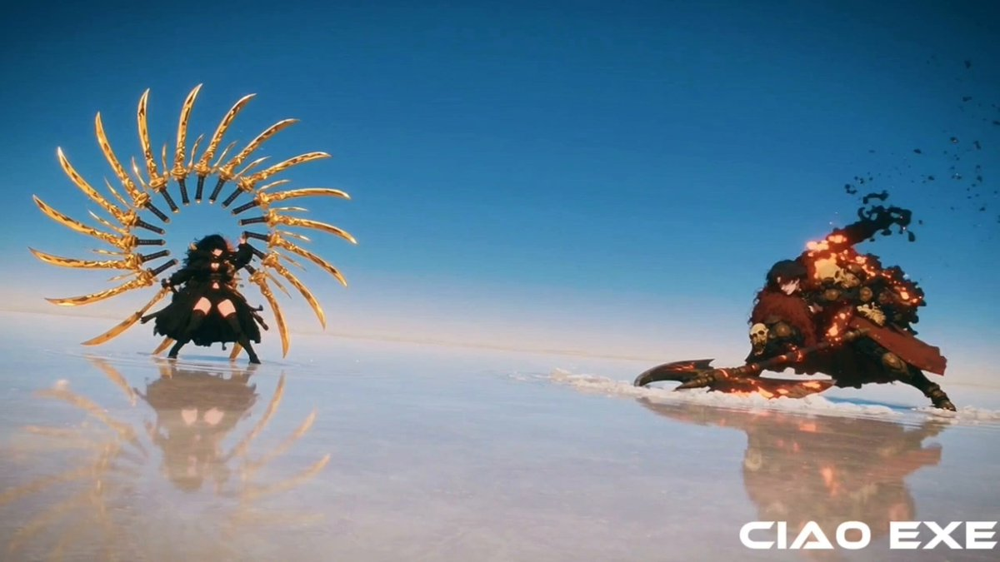</a>

<a href="https://x.com/Cia0_exe/status/2083779210376781857">▶️ 在 X 上观看视频</a>

</div>

<details>
<summary><b>📋 点击展开 / 复制提示词</b></summary>

```
22-24秒｜规模爆发，自极高空俯冲的航拍长镜：B唤起地底整条岩浆脉络把半个湖面连壳掀翻；A同时将全场散落的黄金尽数抽起，铸成一柄贯穿天地的黄金巨剑；两股攻势在地平线上正面相撞，云层被推开成环。
24-26秒｜蓄势对峙，低角度仰拍缓推接变焦：A沉腰收刀，黄金巨剑在她身后缓缓落位；B双手举斧过顶，斧刃裂缝中的熔光亮到刺眼；金光与熔光把画面边缘撕裂，蒸汽在两人之间翻涌。
26-28秒｜正面对撞，急速拉远接360度环绕：黄金巨剑与岩浆巨斧正面相撞，冲击波自中心横扫至地平线，黄金结构成片崩解成金雨，岩浆被震散成漫天火星，整片湖底瞬间蒸干。
28-30秒｜穿过金雨与蒸汽的贴地侧向推轨，接极缓的低角度环绕，最后定格：两人各自从蒸汽中冲出再次对冲，刀与斧相撞的瞬间定格；四周黑曜石尖峰林立，金色残刃插满地面，金粉与火星在空中缓缓飘落。

全程特效持续累积、只增不减，破坏范围随时间不断向地平线扩张。
人物动作连贯流畅、重心真实、带惯性与后坐，杜绝任何僵硬、停顿或不自然的关节角度。
两人五官、发型、服饰、配饰、武器全程与参考图完全一致。
画面保持无字幕、无文字。
音频：刀刃破风、重斧撕裂空气的低频呼啸、金属凝固的清脆结晶声、岩浆接触浅水的爆鸣与蒸汽嘶响、黑曜石碎裂声，配密集鼓点管弦打击乐，随破坏规模逐段升温。
```

</details>

> 💡 中文 prompt，需角色参考图

**👤 出处:** [@Cia0_exe](https://x.com/Cia0_exe) · [source](https://x.com/Cia0_exe/status/2083779210376781857)

▶️ **用 API 跑这条提示词** → [Velokey](https://velokey.ai/model/doubao-seedance-2-5-text-to-video?sourceChannel=github-awesome-seedance)（模型 id：`seedance-2.5`）

---

### No.68 森林守护灵苏醒

  

<div align="center">

<a href="https://x.com/Dheepanratnam/status/2083892601036345506">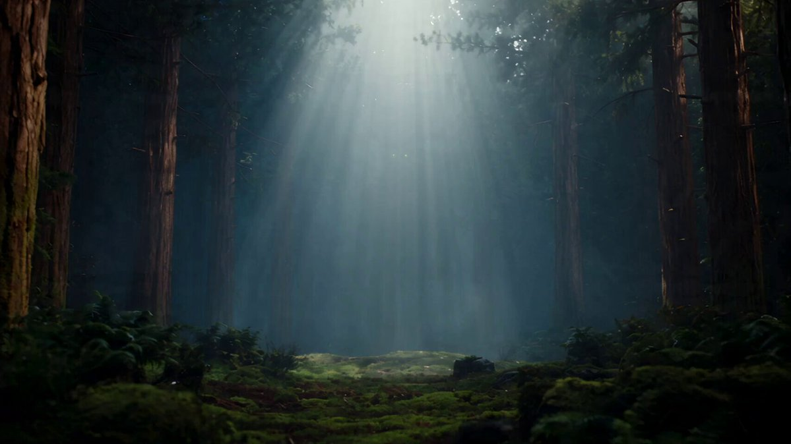</a>

<a href="https://x.com/Dheepanratnam/status/2083892601036345506">▶️ 在 X 上观看视频</a>

</div>

<details>
<summary><b>📋 点击展开 / 复制提示词</b></summary>

```
Seedance 2.5 - 30s prompt 

Deep in an ancient forest at dusk. The trees slowly part as a massive, majestic forest spirit rises from the earth — towering body made of living bark and moss, glowing green eyes, and large antlers formed from twisted branches. Birds fall silent. The ground gently trembles under its weight. It stands tall and powerful, looking like an ancient god. The forest spirit begins walking forward with slow, heavy steps, speaking in a deep, resonant voice: “For a thousand years I have guarded these woods… protected the balance… watched over every creature…” It suddenly stops mid-step. Its glowing eyes narrow. It sniffs the air. “…What is that smell?” It follows the scent through the trees, shrinking and transforming as it walks. Bark turns to skin, antlers disappear, until it becomes a rugged, normal-looking man in outdoor clothes. He steps out of the treeline into a small campsite where three friends are grilling food and laughing around a fire. The man walks up seriously and continues in the same deep voice: “I have seen empires rise and fall… I have felt the turning of ages…” He pauses, staring at the cooler next to the grill. “…Do you have any Beer?” The group stares at him in silence. One of them slowly nods and hands him a cold bottle. The man takes it, cracks it open, takes a long satisfied sip, then exhales deeply and says with complete sincerity: “This… is worth the wait.” The camera slowly pulls back as warm firelight glows on his face. A smooth, confident commercial voiceover comes in: “When you’ve been waiting a thousand years… make it count. Cinematic fantasy lighting in the forest that transitions into warm, golden campsite firelight. Epic presence that becomes casually human. Strong comedic timing. Clean, modern commercial feel on the final voiceover.
```

</details>

**👤 出处:** [@Dheepanratnam](https://x.com/Dheepanratnam) · [source](https://x.com/Dheepanratnam/status/2083892601036345506)

▶️ **用 API 跑这条提示词** → [Velokey](https://velokey.ai/model/doubao-seedance-2-5-text-to-video?sourceChannel=github-awesome-seedance)（模型 id：`seedance-2.5`）

---

### No.72 蛇·龙·女三段变形

  

<div align="center">

<a href="https://x.com/hedo_ist/status/2083989215046455361">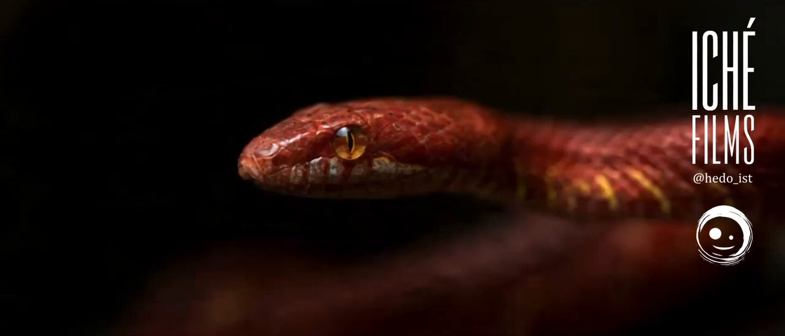</a>

<a href="https://x.com/hedo_ist/status/2083989215046455361">▶️ 在 X 上观看视频</a>

</div>

<details>
<summary><b>📋 点击展开 / 复制提示词</b></summary>

```
You must add 3 reference images: a snake, a dragon and a woman.

Cinematic, fluid metamorphosis of a snake  into this creature .

Cinematic metamorphosis of this creature into a woman.  

Photorealistic cinematic scene.

not music. asmr sounds
```

</details>

> 💡 需3参考图

**👤 出处:** [@hedo_ist](https://x.com/hedo_ist) · [source](https://x.com/hedo_ist/status/2083989215046455361)

▶️ **用 API 跑这条提示词** → [Velokey](https://velokey.ai/model/doubao-seedance-2-5-text-to-video?sourceChannel=github-awesome-seedance)（模型 id：`seedance-2.5`）

---

### No.98 多国连续旅程长镜

  

<div align="center">

<a href="https://x.com/AIcanvas_Frames/status/2083383374840787223">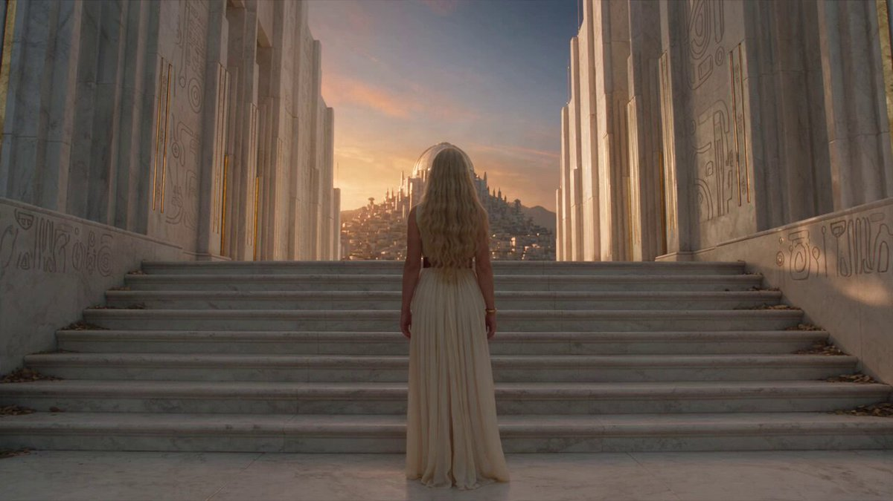</a>

<a href="https://x.com/AIcanvas_Frames/status/2083383374840787223">▶️ 在 X 上观看视频</a>

</div>

<details>
<summary><b>📋 点击展开 / 复制提示词</b></summary>

```
16:9, 30 seconds, an epic photorealistic fantasy cinematic long take, original worldbuilding, one continuous shot, continuous camera movement, no hard cuts, and no references to any existing film, character, actor, or recognizable cinematic scene.

OVERALL STYLE:
A high-budget fantasy film aesthetic with realistic cinematography, monumental world scale, and a beautiful protagonist with natural skin, realistic expressions, and believable body proportions. The overall tone is intelligent, elegant, mysterious, and courageous, never childish, cartoonish, or exaggerated cosplay. Four locations are connected through one continuous flight path: Iceland’s black coastline, an alternate Victorian London, a Paris-inspired city at night in the rain, and a futuristic New York-inspired aerial metropolis.

UNIFIED COLOR PALETTE:
Deep black, silver-gray, and warm gold remain the dominant colors throughout the film. Iceland adds cold blue; London adds gray-green and amber; Paris adds deep blue and wet gold; New York adds deep teal, silver-white, and gold. Maintain realistic atmospheric perspective, thin mist, rainfall, wet surfaces, glass reflections, and volumetric light throughout. Avoid a video-game look, concept-art appearance, and plastic materials.

MAIN CHARACTER:
There is only one female protagonist throughout the entire video. She is approximately 28 years old, slender, exceptionally beautiful, intelligent, elegant, and quietly determined. Her refined facial features are completely original and must not copy any real actor or movie character. She has naturally bright eyes, clearly defined eyebrows, a soft but strong facial structure, natural skin tone, realistic skin texture, and a restrained, focused expression.

She has warm chestnut-brown hair reaching her waist, naturally wavy at the ends. Part of her hair is blown behind her shoulders by the wind. Her hairstyle must remain identical throughout the entire film.

She wears a deep forest-green long coat, an ivory high-neck blouse, a dark-red knitted scarf, brown leather wrist guards, dark-gray trousers, and worn leather boots. Her costume has an elevated British fantasy aesthetic, but she does not wear a school uniform or pointed hat. Do not include badges, school emblems, magical-school symbols, recognizable character costumes, or elements from any existing film.

She rides the same original flying broom throughout the sequence: a dark, aged wooden handle with silver-gray metallic fibers at the rear and a small warm-gold light at the front. The broom’s shape, size, color, and materials must never change.

HER OBJECTIVE:
She is flying through different cities to carry the small warm-gold light toward the far edge of the clouds. She is not a combat character. She does not attack anyone or cast explosive magic. She simply continues forward through cities, coastlines, fog, rain, and high-altitude air. Her emotional progression moves from concentration to wonder, then finally to freedom and determination.

0-5 SECONDS: TAKEOFF FROM ICELAND’S BLACK-SAND BEACH
The shot begins extremely low above a black volcanic beach using a 24mm wide-angle lens. Black ocean waves are on the left, towering basalt columns on the right, and blue-white glacial mountains in the distance. Cold blue clouds press down across the sky, while a narrow line of warm golden sunset remains near the horizon.

The beautiful female traveler rapidly enters from the rear right of the frame, riding her broom just above the ocean surface. Her chestnut-brown hair streams backward in the sea wind. Her dark-red scarf creates a clean motion line behind her, while her deep forest-green coat moves naturally in the airflow. The warm-gold light at the front of the broom illuminates the sea mist and droplets of water.

The camera follows her from behind with a stable FPV movement, keeping her slightly right of center. It must not circle around to the front or allow her to leave the frame. Her body leans slightly forward; one hand holds the broom handle while the other maintains balance. She flies toward a massive wall of blue ice.

At the fourth second, she enters a natural裂缝 beneath the ice wall. The ice passes rapidly along both sides of the camera. Cold blue crystals briefly intersect with the warm-gold light, creating the first natural transition. No explosion, magical smoke, or sudden transformation.

5-12 SECONDS: VICTORIAN LONDON IN THE FOG
As the ice clears the lens, the environment naturally becomes an alternate Victorian city at night. The protagonist and broom retain exactly the same direction, speed, clothing, appearance, and flying posture. The camera continues following from behind.

Below are wet dark-gray stone streets. Red-brick buildings, black iron bridges, narrow windows, and old amber streetlamps line both sides. Several dark-red double-decker public vehicles without text or branding move slowly through the fog. The city should evoke Victorian London without reproducing real landmarks.

The camera gradually transitions from fast FPV pursuit into a smooth three-quarter rear tracking shot, moving approximately 45 degrees to her left side. Her beautiful profile appears briefly. Her eyes remain focused, and her hair and scarf maintain stable continuity. The warm-gold light leaves only a short trail through the rain and fog.

She passes beneath a black elevated iron bridge. Its steel structure moves across the top of the frame as a brief physical occlusion. The camera does not cut, and when the obstruction clears, she remains on the same movement axis.

At the tenth second, she flies into a massive arched railway station. Its roof is made from black steel beams and wet glass, with rainwater flowing across the surface. The roof completely covers the frame, creating the second natural transition.

12-19 SECONDS: PARIS-INSPIRED CITY IN THE RAIN
When the glass roof clears the camera, the environment becomes a romantic, original Paris-inspired city at night in the rain. Do not reproduce real landmarks. Preserve only the atmosphere of stone bridges, a river, narrow streets, classical stone buildings, wrought-iron balconies, and warm window light.

The protagonist flies low above a broad river. The water reflects golden windows and the deep-blue night sky. Pale-gray stone buildings, tall narrow windows, wet rooftops, and fine rain lines extend along both sides. Her deep-green coat and dark-red scarf form a clear silhouette against the blue city, while her chestnut hair streams backward.

The camera moves into a parallel tracking position on her right side. The broom stays approximately three meters above the river. The camera remains slightly below shoulder level, preserving the spatial relationship between the woman, broom, river, and architecture. She passes beneath a sequence of classical stone bridges whose arches form continuous reflections in the water.

At the seventeenth second, she enters a long mirror corridor made from wet glass walls. The reflections may show only the same woman, the same broom, and the same warm-gold light. Do not create duplicate people. Rainwater, city lights, and reflections slide along the glass surfaces.

A powerful warm-gold light appears at the end of the corridor. She flies toward it, creating the third natural transition.

19-24 SECONDS: FUTURISTIC NEW YORK-INSPIRED CITY
The mirror corridor opens into an original futuristic New York-inspired metropolis. The camera rapidly but smoothly shifts from the three-quarter rear position into a controlled forward-facing FPV shot moving backward in front of her. Her beautiful, focused face, chestnut hair, dark-red scarf, and the golden broom light are briefly visible.

Below are wet streets, glass skyscrapers, metallic elevated bridges, and enormous urban canyons. The buildings reflect golden light, a deep-teal night sky, and silver-white mist. All screens and glass surfaces must remain abstract and free of text, advertisements, logos, or branding.

She flies between two skyscrapers. The glass wall on the left passes close to the camera, while a vast urban canyon opens on the right. The camera briefly maintains its backward-facing position before completing one stable 90-degree upward movement, transitioning from her face to a position above her.

Do not spin rapidly, make her tumble, or transform the broom into an aircraft. She remains graceful, skilled, and stable.

At the twenty-third second, she bursts out from between the skyscrapers. The city lights rapidly become smaller below her, while the warm-gold light at the front of the broom becomes the only stable light source near the center of the image.

24-30 SECONDS: THE FINAL WORLD ABOVE THE CLOUDS
The camera continues rising at high speed and passes through a dense layer of cloud. When the clouds clear, the protagonist appears high above a vast cloud sea, hovering on her broom.

She gradually slows down and changes from a forward-leaning posture to a more upright position. Her chestnut hair and dark-red scarf move backward in the high-altitude wind. The camera moves from the front to her right rear side, then rises into a high-angle 24mm wide shot.

Distant traces of the four worlds appear below without forming a chaotic collage: Iceland’s black coastline and blue glacier on the far left; London-inspired red-brick structures and gray-green fog in the middle distance; Paris-inspired golden waterways and stone bridges on the right; and silver-white lights from the New York-inspired glass city at the lowest level.

These locations must exist only as distant spatial layers. Do not suddenly reproduce four complete cities or make buildings float and reorganize. A warm golden horizon appears at the edge of the clouds, suggesting that another world is waiting beyond it.

At the twenty-eighth second, the protagonist raises her right hand. The warm-gold light at the front of the broom emits one thin beam toward the horizon. The beam only illuminates a new path through the clouds. It does not explode, create a giant energy sphere, or alter her appearance.

During seconds twenty-nine to thirty, the camera becomes completely stable. The protagonist, broom, cloud sea, distant layers of the four cities, and golden horizon are all clearly visible. She appears as a beautiful but small figure near the lower center of the frame, facing the open world. The final emotion is freedom, wonder, and the sense that the journey will continue.

CAMERA AND PACING:
0-5 seconds: low-altitude rear FPV pursuit.
5-12 seconds: smooth three-quarter rear tracking through London.
12-19 seconds: parallel low-altitude tracking through Paris.
19-24 seconds: one controlled front-facing backward FPV movement through New York.
24-30 seconds: continuous rise into a high-angle wide establishing shot.
Use FPV speed only during the Iceland takeoff and New York skyscraper passage. Keep the London and Paris sections controlled, elegant, and spatially readable.

SOUND DESIGN:
Iceland: ocean waves, cold wind, low glacial rumbling, and subtle vibration from the wooden broom.
London: rain, steam, iron-bridge resonance, and distant wheels.
Paris: rain droplets, water, distant bells, and low strings.
New York: low urban rumble, wind pressure across glass, and metallic structural resonance.
Above the clouds, all city sounds gradually fade, leaving high-altitude wind, a subtle metallic resonance from the broom fibers, and one warm sustained string note.

CONTINUITY RESTRICTIONS:
Only one female protagonist appears throughout the video.
She must remain exceptionally beautiful, natural, and realistic, with stable original facial features that do not copy any actor or film character.
Her chestnut-brown hair must retain the same color, length, and hairstyle.
Her forest-green coat, ivory blouse, dark-red scarf, brown wrist guards, dark-gray trousers, and worn boots must remain unchanged.
The broom must remain the same dark aged wooden broom with silver-gray metallic fibers and a warm-gold front light.
Do not add companions or other flying characters.
Do not include pointed hats, school uniforms, magical schools, badges, school emblems, castles, recognizable film characters, superhero logos, or brand symbols.
Do not generate text, subtitles, advertisements, UI elements, logos, or readable signs.
Do not allow buildings to melt, drift, resize, or suddenly reorganize.
Do not create duplicate figures in mirrors.
Maintain realistic physical behavior for ice, rain, water, glass, fog, and clouds.
Do not use hard cuts, sudden spinning, random shaking, abrupt zooms, body deformation, face replacement, explosions, large-scale destruction, or unmotivated effects.
Keep the protagonist, broom, flying direction, city geography, and lighting transitions continuous and visually traceable.
```

</details>

**👤 出处:** [@AIcanvas_Frames](https://x.com/AIcanvas_Frames) · [source](https://x.com/AIcanvas_Frames/status/2083383374840787223)

▶️ **用 API 跑这条提示词** → [Velokey](https://velokey.ai/model/doubao-seedance-2-5-text-to-video?sourceChannel=github-awesome-seedance)（模型 id：`seedance-2.5`）

---

### No.112 孔雀与猫头鹰·Pixar 动画

  

<div align="center">

<a href="https://x.com/Dheepanratnam/status/2084397163560181783">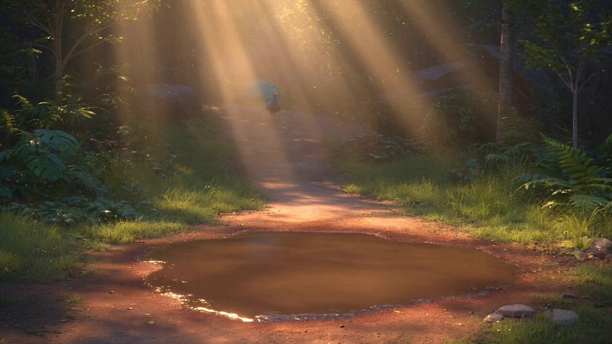</a>

<a href="https://x.com/Dheepanratnam/status/2084397163560181783">▶️ 在 X 上观看视频</a>

</div>

<details>
<summary><b>📋 点击展开 / 复制提示词</b></summary>

```
A 30-second 3D animated short film in the style of a Pixar/Dreamworks feature — expressive squash-and-stretch character animation, cinematic lighting, shallow depth of field, rich saturated colors, soft volumetric light, and highly detailed feather and environment rendering.

CHARACTERS: PERCIVAL, a magnificent proud peacock with shimmering iridescent blue-green tail feathers that fan out dramatically, glossy and perfectly groomed, theatrical expressions, aristocratic posture. PIP, a small scruffy brown sparrow with messy feathers, bright confident eyes, quick bouncy movements.

SETTING: A golden-hour sunlit forest path after rain. A large glistening muddy puddle blocks the trail, reflecting the sky. Lush greenery, god rays through trees, floating pollen particles, wet leaves sparkling.

SHOT 1 (0:00–0:04) — WIDE ESTABLISHING SHOT: Slow cinematic dolly-in along the forest path. Percival struts into frame in slow motion, tail fanning open like a royal cape, feathers catching the sunlight. Triumphant orchestral sting. He stops abruptly at the edge of the huge muddy puddle. Camera crash-zooms onto his horrified face.

PERCIVAL (appalled, posh accent): "A puddle?! On MY path?!"

SHOT 2 (0:04–0:10) — LOW ANGLE, over-the-puddle shot: The camera sits low across the water, making the puddle look like an ocean. Percival circles it anxiously, lifting each foot delicately, grimacing. Extreme close-up on his immaculate tail feathers quivering at the mere sight of mud.

PERCIVAL: "I can't cross THAT! Do you know how long these feathers take to dry?!"

SHOT 3 (0:10–0:15) — WHIP PAN to Pip the sparrow landing on a nearby branch, ruffled and chirpy. Pip looks at the puddle, looks at Percival, shrugs.

PIP (cheerful, cockney energy): "It's two feet wide, mate."

SHOT 4 (0:15–0:19) — DYNAMIC TRACKING SHOT: Pip takes a running start and hops clean over the puddle in one joyful bounce — slow-motion mid-air moment, mud droplets sparkling around him, then lands perfectly on the other side and keeps walking without breaking stride. Percival watches, beak open in disbelief.

SHOT 5 (0:19–0:24) — WIDE SHOT, dramatic angle: Percival begins the long walk AROUND the puddle — the camera pulls up and back in a sweeping crane shot revealing his absurdly long detour through bushes, over a log, past a confused family of ducks. Epic adventure music swells ironically.

PERCIVAL (marching, huffy): "A gentleman NEVER rushes!"

SHOT 6 (0:24–0:28) — NIGHT FALLS. The same spot, now moonlit, fireflies glowing, crickets. Percival finally arrives, exhausted, feathers drooping, one leaf stuck to his head. Pip is already there, fast asleep in a cozy nest, snoring softly, one eye opening.

PIP (sleepy, deadpan): "Longer than the walk, apparently."

SHOT 7 (0:28–0:30) — FINAL CLOSE-UP: Percival stares directly into camera, deadpan, tail feathers wilting one by one like a deflating balloon. Comedic trombone sting. Title card appears in elegant gold lettering over the moonlit puddle: "Don't let looking good stop you from getting there."

AUDIO DESIGN: playful orchestral score with comedic timing, bouncy pizzicato strings for Pip, pompous brass for Percival, exaggerated cartoon footsteps, splashes, feather rustles, and a record-scratch when Percival sees the puddle. Expressive character voice acting with big comedic performances.

CINEMATOGRAPHY: anamorphic lens flares on the feathers, warm golden-hour color grade shifting to cool blue moonlight, shallow focus character close-ups, confident comedic camera movement, clean composition with strong silhouettes. Ultra-detailed subsurface scattering on feathers and wet mud, Pixar-quality rendering, 4K, 24fps cinematic motion.
```

</details>

**👤 出处:** [@Dheepanratnam](https://x.com/Dheepanratnam) · [source](https://x.com/Dheepanratnam/status/2084397163560181783)

▶️ **用 API 跑这条提示词** → [Velokey](https://velokey.ai/model/doubao-seedance-2-5-text-to-video?sourceChannel=github-awesome-seedance)（模型 id：`seedance-2.5`）

---

### No.2 伦敦地下电子俱乐部

 

<div align="center">

<a href="https://x.com/JMSvid/status/2083210992343756893"></a>

<a href="https://x.com/JMSvid/status/2083210992343756893">▶️ 在 X 上观看视频</a>

</div>

<details>
<summary><b>📋 点击展开 / 复制提示词</b></summary>

```
Original scene, 30 seconds, one continuous shot, no cuts.

0–8 seconds: Inside a packed underground London techno club. The camera holds tightly on the face of a young English woman. She is Caucasian, brunette, with delicate features and melancholy behind her eyes. She remains centered in frame and only sways subtly with the music. Around her, the crowd moves intensely and chaotically, with bodies, arms, shoulders and faces constantly passing close to camera, creating strong motion blur and a sense of pressure and overwhelm.

Fast white strobe lights flash continuously, pushing the image back and forth between near-total darkness and sudden bursts of harsh illumination. In the darker intervals, only silhouettes, rim light, glints of sweat and fragmented movement are visible. Each flash briefly reveals fragments of her face—her eyes, cheekbones, wet strands of hair, and distant expression—before she disappears again into darkness. She feels strangely still and emotionally detached while the crowd around her becomes a mass of blurred bodies and flickering light. Heavy four-on-the-floor techno dominates the soundscape, loud, compressed and physically overwhelming.

8–16 seconds: She stays in this space for a moment longer, absorbing the intensity, then finally breaks her gaze, turns and begins pulling herself out of the crowd. The camera does not cut. It releases from the locked close-up and shifts into a close handheld follow shot, staying just behind and slightly beside her as she pushes through dancers. Bodies knock into her shoulders. Arms and backs occasionally obscure the frame. The camera feels intimate, bumped and instinctive, struggling through the same crowded space with her.

As she leaves the center of the dancefloor, the strobing becomes less dominant and the club lighting grows dirtier and more practical. She enters a narrow back passage leading away from the main room.

16–23 seconds: She moves through a cramped, dirty corridor with graffiti-covered walls, peeling paint, torn posters, exposed pipes, damp patches, flickering fluorescent lights and littered plastic cups on the floor. People lean against the walls smoking, chatting, waiting, watching others pass. She threads through them silently. The camera stays close and observational, catching the rustle of fabric, brief shoulder contact and bodies slipping past in the narrow space.

The music becomes more muffled and distant as she moves farther from the dancefloor. The heavy techno remains present only as a low, dulled throb through the walls. Footsteps, clothing friction, breathing, shuffling bodies and indistinct overlapping crowd chatter become clearer. No individual conversation is intelligible. She does not speak.

23–30 seconds: She pushes through the exit and steps into the cold London night. Outside the club, groups of people stand smoking, talking, drifting in and out of the entrance. Streetlight mixes with spill from the doorway and practical urban light. She walks to the nearest dirty exterior wall and pauses. With slightly shaky hands, she lights a cigarette. The flame briefly illuminates her face. She takes a drag, leans back against the wall, then slowly slides down into a seated position on the pavement.

The camera follows her downward and settles at her level, then holds. She sits smoking in silence, looking past the moving crowd into the distance, disconnected from everything around her. People continue crossing the frame, talking, laughing and smoking nearby, but she feels completely alone inside the busy environment.

The sound transitions from overwhelming club techno, to muffled bass and corridor ambience, to distant low-frequency vibration outside mixed with cigarette lighter clicks, breathing, street ambience, footsteps and indistinct smoker chatter. No dialogue.

The overall image should feel raw, naturalistic and grounded, with visible film grain, slight exposure fluctuation, realistic skin texture and subtle handheld instability. Avoid glossy polish, commercial beauty lighting and music-video slickness.
```

</details>

**👤 出处:** [@JMSvid](https://x.com/JMSvid) · [source](https://x.com/JMSvid/status/2083210992343756893)

▶️ **用 API 跑这条提示词** → [Velokey](https://velokey.ai/model/doubao-seedance-2-5-text-to-video?sourceChannel=github-awesome-seedance)（模型 id：`seedance-2.5`）

---

### No.4 手机公寓探店 Vlog

 

<div align="center">

<a href="https://x.com/jaynwabueze/status/2083215240154530250">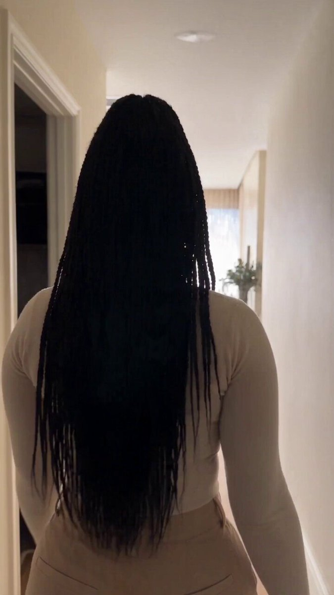</a>

<a href="https://x.com/jaynwabueze/status/2083215240154530250">▶️ 在 X 上观看视频</a>

</div>

<details>
<summary><b>📋 点击展开 / 复制提示词</b></summary>

```
Vertical phone video, 30 seconds. A friend films a casual apartment tour

on a smartphone, walking behind and beside her. Natural indoor daylight,

handheld sway, clean modern phone footage. Not cinematic, no color grade,

no professional lighting.

SUBJECT: a woman in her late 20s @image1, warm deep brown skin, long dark box

braids pulled half-up, gold hoop earrings, cream knit top, beige wide-leg

trousers, relaxed and cheerful. Consistent appearance throughout.

LOCATION: a bright, styled modern apartment, cream walls, oak floors, large

windows with sheer curtains, houseplants, textured cushions, brass

accents, a boucle armchair, an arched mirror.

0–7s: she walks ahead into the living room, turning back toward the camera

with a laugh, with this voice @voice1: "Okay fine, we're doing this. Welcome in."

7–15s: the camera pans off her to sweep across the living room, her voice

continuing off-frame: "This is where I basically live. That light in the

afternoon is... unreal."

15–23s: she walks toward the dining area, the camera following behind her,

then she turns and gestures at the wall: "This part used to be completely

bare. It looked like nobody lived here."

23–30s: she leans against the counter, smiling at the camera: "Got a

design team in and they nailed it first try. I Didn't have to explain myself

twice." She laughs and waves the camera off.

AUDIO: room ambience, footsteps on wood, warm natural speech with pauses

and laughter, faint street sound. No music.

FORBIDDEN: no gimbal stabilization, no color grading, no film grain, no

studio lighting, no subtitles, no music.
```

</details>

**👤 出处:** [@jaynwabueze](https://x.com/jaynwabueze) · [source](https://x.com/jaynwabueze/status/2083215240154530250)

▶️ **用 API 跑这条提示词** → [Velokey](https://velokey.ai/model/doubao-seedance-2-5-text-to-video?sourceChannel=github-awesome-seedance)（模型 id：`seedance-2.5`）

---

### No.6 第一人称极致写实 POV

 

<div align="center">

<a href="https://x.com/OriSilver/status/2083255233141186741">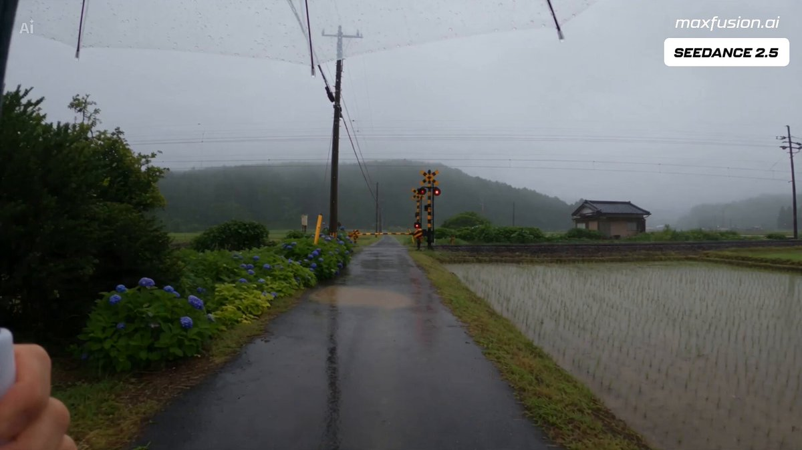</a>

<a href="https://x.com/OriSilver/status/2083255233141186741">▶️ 在 X 上观看视频</a>

</div>

<details>
<summary><b>📋 点击展开 / 复制提示词</b></summary>

```
Extreme photorealism, first-person POV video, vertical 9:16, shot as if on a phone held at eye level by someone walking - the camera IS the person, no camera or phone ever visible. Visible in frame: the underside edge of a clear plastic umbrella occupying the top of the frame the entire video, rain streaming off its rim, and occasionally the person's left hand and wrist gripping the umbrella shaft at the frame's edge. Natural head-bob with each step, small organic sways and glances, autofocus and exposure adjusting like real phone footage, raindrops occasionally hitting the lens and staying as blurred droplets. Overcast soft grey daylight, heavy steady rain.

SPATIAL CONTRACT: one single continuous shot, one constant forward walking direction along a narrow wet asphalt road in rural Japan, with exactly ONE stop: at a railway level crossing. The walk: road → stop at the closed crossing barrier → wait for the train to pass left to right → barrier opens → walk across the tracks → continue up the same road. No turns, no other locations.

00:00-00:06 - Walking pace, rain drumming loud on the umbrella overhead. The narrow road stretches ahead between flooded green rice paddies pocked with rain rings; a line of weathered telephone poles fades into low mist; a small tiled-roof farmhouse sits far off to the right; hydrangea bushes drip at the roadside. Each footstep lands in shallow puddles - small splashes at the bottom of frame. The head glances briefly down at a puddle rippling, then back up.

00:06-00:10 - A rural railway crossing comes into view ahead: yellow-and-black striped barrier arms, a pole with twin red warning lights. As the person approaches, the lights begin flashing alternately and the crossing bell starts its steady clanging ring. The barrier arms lower slowly across the road. The walking slows and stops two meters short of the barrier; the left hand shifts its grip on the umbrella shaft.

00:10-00:14 - Standing still at the closed barrier. Rain streams off the umbrella rim in beads directly in front of the lens. The red lights blink through the drizzle; beyond the tracks, the road continues into misty green hills. The head makes one small glance to the left down the tracks - a faint headlight glows far off through the rain, growing.

00:14-00:19 - The train passes: a small two-car local commuter train rushes through from left to right, close and loud - a wall of wet steel and lit windows blurring past, wheels clattering on the rail joints, its wake throwing a gust that shivers the umbrella and flicks spray across the lens. The camera holds still, watching it pass, slight flinch at the first whoosh.

00:19-00:23 - The clatter recedes to the right and fades under the rain. The bell stops. The red lights go dark. The barrier arms rise slowly with a soft mechanical hum. A beat of stillness - just rain on the umbrella again.

00:23-00:30 - The walk resumes: one glance left, one glance right along the empty wet tracks, then forward - footsteps crunching over the crossing's uneven wooden planking and rails, a slight bump in the head-bob at each rail, then back onto smooth wet asphalt on the far side. The road ahead climbs gently toward misted forested hills, rain steady, puddle steps resuming their rhythm. The video ends mid-stride, ongoing, like the walk just continues.

Audio: constant close rain drumming on the umbrella fabric - the loudest, nearest sound throughout - plus footsteps in puddles, distant rain hiss over the paddies, the rhythmic crossing bell, the train's rising roar, clatter and doppler fade, the barrier's hum, one soft breath from the person while waiting. No music, no dialogue, no narration, no on-screen text; any signage near the crossing stays distant and rain-blurred, never legible.
```

</details>

**👤 出处:** [@OriSilver](https://x.com/OriSilver) · [source](https://x.com/OriSilver/status/2083255233141186741)

▶️ **用 API 跑这条提示词** → [Velokey](https://velokey.ai/model/doubao-seedance-2-5-text-to-video?sourceChannel=github-awesome-seedance)（模型 id：`seedance-2.5`）

---

### No.7 日本游戏综艺·滚筒闯关

 

<div align="center">

<a href="https://x.com/VishalAiLabs/status/2083259837031559212">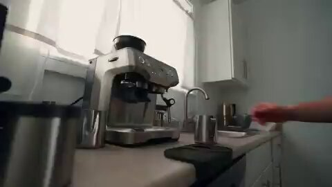</a>

<a href="https://x.com/VishalAiLabs/status/2083259837031559212">▶️ 在 X 上观看视频</a>

</div>

<details>
<summary><b>📋 点击展开 / 复制提示词</b></summary>

```
Seedance 2.5 x @HigsfieldAI
Prompt – CAMERA / LOOK: Handheld mini DV camcorder footage filmed by the subject himself. Slight hand shake, occasional focus hunting, imperfect framing, natural zoom adjustments, soft tape-like image quality, subtle grain, realistic auto-exposure shifts from bright kitchen morning light. Natural skin tones, mild motion blur, authentic consumer camcorder aesthetic.
STYLE: Cozy coffee-prep vlog with gentle ASMR elements. Relaxed pacing, minimal dialogue, candid moments. Focus on satisfying sounds: bean grinder whirring, portafilter tamping, steam wand hissing, cup clinking, milk frothing.
SUBJECT: Young man in his mid-20s, plain black t-shirt, hair slightly tousled, minimal accessories. Calm, focused energy while making his morning coffee.
SETTING: Small kitchen counter with an espresso machine on a bright morning. Natural daylight, coffee beans and a mug nearby, quiet atmosphere.
STORYBOARD:
(3s, propped medium shot) Places camera on the counter, switches on the machine. "Morning coffee, the proper way."
(3s, overhead shot) Grinds fresh coffee beans, fine grounds falling into the portafilter.
(3s, close-up) Tamps the grounds down firmly and evenly.
(3s, handheld shot) Locks the portafilter into the machine. "Here we go."
(3s, detail shot) Espresso streams slowly into a small cup. No dialogue.
(3s, medium shot) Pours cold milk into a small steel pitcher. "Time for the milk."
(3s, macro shot) Steam wand hissing as it froths the milk.
(3s, propped shot) Pours frothed milk carefully over the espresso, forming light layers.
(3s, warm ending shot) Holds the finished cup, takes a small sip, satisfied smile. "That's exactly what I needed."
(3s, final shot) Reaches toward camera, still holding the cup. "See you later." Hand covers lens as recording ends.
AUDIO NOTES: Natural kitchen ambience — grinder whirring, tamping, steam hissing, milk pouring should be clearly audible. Dialogue quiet and casual.
REALISM NOTES: Authentic body language, natural blinking, genuine focused smiles, occasional careful pauses while pouring, imperfect framing, focus breathing, bright morning light shifts. Should resemble a genuine personal coffee vlog on a consumer camcorder, not a commercial or AI-generated production.
The upcoming synergy between Seedance 2.5 and @HigsfieldAI is taking photorealistic AI storytelling to another level! ☕️🚀

Hey @HigsfieldAI team — DMs are open for creator collaborations, early access, and joint workflow features. Let’s create something groundbreaking together! 📩✨

> Follow me @VishalAiLabs for daily high-level AI video prompts, workflow breakdowns, and early tech experiments!
```

</details>

**👤 出处:** [@VishalAiLabs](https://x.com/VishalAiLabs) · [source](https://x.com/VishalAiLabs/status/2083259837031559212)

▶️ **用 API 跑这条提示词** → [Velokey](https://velokey.ai/model/doubao-seedance-2-5-text-to-video?sourceChannel=github-awesome-seedance)（模型 id：`seedance-2.5`）

---

### No.8 游戏综艺慢动作滑稽

 

<div align="center">

<a href="https://x.com/NexlowX/status/2083281796351881692">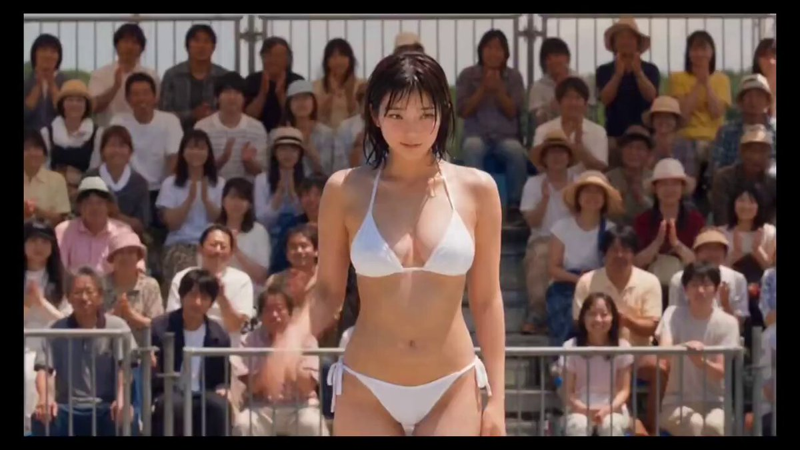</a>

<a href="https://x.com/NexlowX/status/2083281796351881692">▶️ 在 X 上观看视频</a>

</div>

<details>
<summary><b>📋 点击展开 / 复制提示词</b></summary>

```
SEEDANCE 2.5 CAN NOW DO SLAPSTICK AND THAT'S HARDER THAN IT LOOKS

A contestant balances across a spinning foam roller over a pool, wobbles, and wipes out into the water - a full Japanese game-show obstacle bit, crowd cheering in the stands. Comedy timing and a physical pratfall are genuinely tough for AI and this holds.

Most people test a new model on hero shots - dramatic, slow controlled. A game-show wipeout is the opposite: fast physical comedy, a body losing balance, a crowd reacting water splashing on impact. That's a much harder thing to make land.

Here's why a clip like this is a real test

1. Physical comedy depends on timing the failure. A pratfall only works if the wobble, the overbalance, and the fall happen in the right rhythm. Too smooth and it's not funny; too random and it's not believable
2. A reacting crowd has to sell it. Rows of spectators clapping and watching in the stands do the same job the crowd does in any live-event clip -the audience reaction is what makes it feel real
3. Water and impact are a physics stress test. Body hitting a surface, then a splash, is exactly the kind of contact-plus-fluid moment that used to fall apart instantly
4. It's a specific, recognizable format. Japanese game-show obstacle courses have a distinct look and energy -nailing the genre, not just a generic person falling, is the flex

Why this matters

• Comedy and physical failure are underrated benchmarks - everyone tests drama, far fewer test a convincing wipeout 
• The version leap is the real story: putting the Seedance 2.0 generation side by side is how you actually judge progress, not marketing claims 
• Physical comedy landing at all is a sign the model is handling timing and balance, not just pretty stills
Worth being straight about
• A side-by-side against the 2.0 version is the honest way to show a jump - a single clip alone proves less than the comparison does 
• A teaser clip is the best-case cut - the real test is running your own awkward, physical, timing-dependent scene through it

Everyone benchmarks new models on the dramatic hero shot. The quieter test is whether it can make you laugh at someone falling off a foam roller -and that's a harder problem than it looks.

Prompt 👇
```

</details>

**👤 出处:** [@NexlowX](https://x.com/NexlowX) · [source](https://x.com/NexlowX/status/2083281796351881692)

▶️ **用 API 跑这条提示词** → [Velokey](https://velokey.ai/model/doubao-seedance-2-5-text-to-video?sourceChannel=github-awesome-seedance)（模型 id：`seedance-2.5`）

---

### No.9 静止机位·千年一瞬

 

<div align="center">

<a href="https://x.com/sebatheepan/status/2083290634731864190">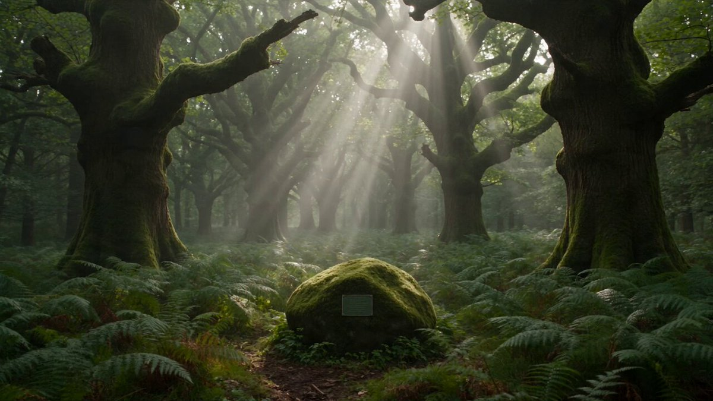</a>

<a href="https://x.com/sebatheepan/status/2083290634731864190">▶️ 在 X 上观看视频</a>

</div>

<details>
<summary><b>📋 点击展开 / 复制提示词</b></summary>

```
One thousand years🧔‍♀️

ok here we go .presenting my first video of 
seedance 2.5 
the prompt i used ⤵️

A 30 second film from ONE completely locked, static camera position that never moves, never pans, never zooms, never cuts. The same view of the same patch of ground for one thousand years, time passing at enormous speed. In the foreground of every single frame sits a large mossy grey boulder. It never moves. It is present and recognisable in every frame of the film from first to last. [0:00-0:03] Ancient temperate forest. Huge old trees, deep green undergrowth, mist between the trunks, soft grey daylight. [0:03-0:06] Trees fall and are dragged away. A clearing opens. Stumps, churned mud, a first thin column of smoke. [0:06-0:09] A single timber and thatch hut rises beside the boulder. A small vegetable plot. Chickens. [0:09-0:12] A village grows around it. More huts, fences, a dirt track, wood smoke, sheep in the field beyond. [0:12-0:15] A stone wall is built, incorporating the boulder into its base. A church tower rises behind. Snow falls and melts. Seasons flicker past. [0:15-0:18] Fire. The village burns, timbers collapse, smoke blackens the sky. The wall and the boulder survive. [0:18-0:21] Rebuilding in brick. A cobbled road. A chimney, then many chimneys. Industrial smoke, grey air, rain. [0:21-0:24] The town becomes a city. Concrete rises. The old wall is demolished. The boulder sits in a small paved square, surrounded by buildings. [0:24-0:26] Glass towers. Traffic light streaking past at night. The boulder is fenced off, a small green plaque beside it. [0:26-0:28] Abandonment. Windows dark, glass cracked, weeds through the paving, ivy climbing the towers. Silence. [0:28-0:30] The towers have collapsed and gone. Young forest has grown over everything. Mist between the trunks. The frame is now identical to the opening frame, the same boulder in the same position under the same soft grey light. Camera: absolutely locked and static for all 30 seconds. No movement of any kind. No cuts, no dissolves, no transitions — one continuous transforming shot. Style: photoreal, cinematic, natural overcast light throughout, muted natural colour, seasons and weather flickering rapidly past. Audio: diegetic only, evolving with the era — forest birds, axes, village life, church bell, fire, industrial machinery, city traffic, then silence, then birds again. NO MUSIC, no score, no soundtrack, no instruments. No text, no captions, no titles, no watermarks, no camera movement, no cuts. created with @higgsfield
```

</details>

**👤 出处:** [@sebatheepan](https://x.com/sebatheepan) · [source](https://x.com/sebatheepan/status/2083290634731864190)

▶️ **用 API 跑这条提示词** → [Velokey](https://velokey.ai/model/doubao-seedance-2-5-text-to-video?sourceChannel=github-awesome-seedance)（模型 id：`seedance-2.5`）

---

### No.10 功夫 vs 街霸·喜剧

 

<div align="center">

<a href="https://x.com/WolfRiccardo/status/2083332541453308312">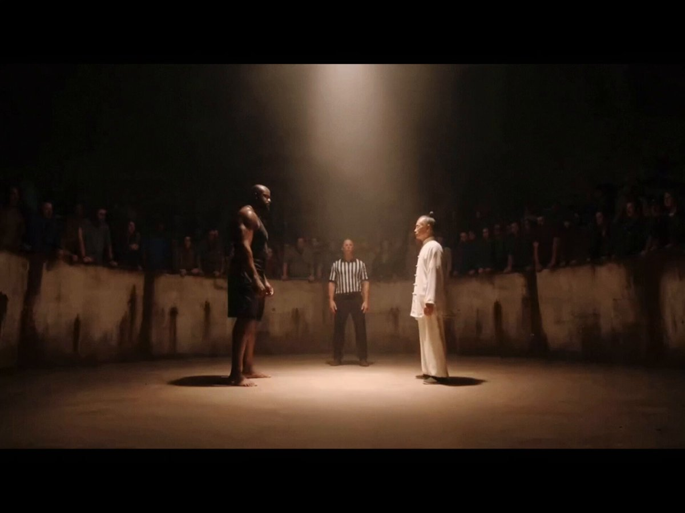</a>

<a href="https://x.com/WolfRiccardo/status/2083332541453308312">▶️ 在 X 上观看视频</a>

</div>

<details>
<summary><b>📋 点击展开 / 复制提示词</b></summary>

```
(0-4s) Wide shot of the duel arena — the musculer man and the old kung fu master face off, crowd murmuring in anticipation. Referee raises hand and starts counting down: eng::**"3... 2... 1..."**.

(4-7s) Referee shouts "Go!" / gives the start signal. The kung fu master bows slightly.

(7-9s) Right as the master bows, the musculer man swings his leg and kicks him straight in the head. The master collapses. The entire crowd gasps in shock, frozen in disbelief.

(11-15s) The musculer man **English**:
 "I thought the fight started, why is this old man bowing?" 

@dreamina_ai
```

</details>

**👤 出处:** [@WolfRiccardo](https://x.com/WolfRiccardo) · [source](https://x.com/WolfRiccardo/status/2083332541453308312)

▶️ **用 API 跑这条提示词** → [Velokey](https://velokey.ai/model/doubao-seedance-2-5-text-to-video?sourceChannel=github-awesome-seedance)（模型 id：`seedance-2.5`）

---

### No.12 整脊诊所纪实短片

 

<div align="center">

<a href="https://x.com/bmx_ai13/status/2083402592282132693">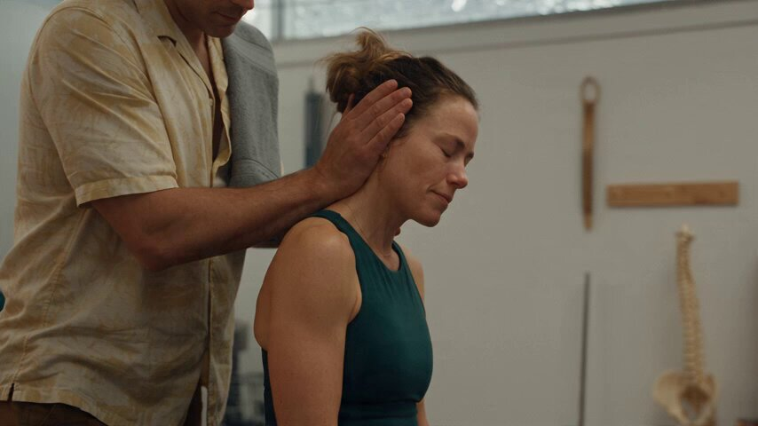</a>

<a href="https://x.com/bmx_ai13/status/2083402592282132693">▶️ 在 X 上观看视频</a>

</div>

<details>
<summary><b>📋 点击展开 / 复制提示词</b></summary>

```
Create a 30 second photorealistic cinematic documentary video in 16:9 at 30 frames per second inside a modest chiropractic treatment room. It must feel like genuine unscripted social media footage, with believable anatomy, natural skin texture, subtle breathing, realistic fabric folds, accurate hand contact, consistent proportions, and continuous motion.

A slim athletic woman in her late thirties wears a dark forest green sleeveless workout top and matching leggings, with brown hair in a slightly messy bun. A calm male practitioner in his early thirties wears a faded pale yellow graphic shirt, loose brown trousers, and a gray towel over one shoulder. The room has white walls, a black segmented treatment table, a deep green cushion, an orange cabinet, a warm lamp, framed anatomy charts, and discreet clinical equipment. Bright ceiling panels create neutral soft light.

At 0 to 3 seconds open with a close medium shot of the practitioner carefully supporting the seated woman’s head and shoulder. Use a quick natural handheld push closer, then show one small controlled movement, a restrained release sound, her surprised inhale, and a relieved laugh. No exaggerated twisting.

At 3 to 7 seconds cut to a centered eye level medium shot. She touches the right side of her neck and lower back while describing years of tightness, vulnerable but composed. The practitioner listens behind her. Use subtle camera sway and realistic pauses.

At 7 to 11 seconds show a brief mobility assessment from a wider three quarter angle. He gently guides her head left and right while watching her range. Add one close insert of his hands safely positioned at the jaw and upper neck, then her cautious side glance. Preserve wardrobe, hair, room layout, and hand placement across every cut.

At 11 to 17 seconds show her lying on her side with her head on the green cushion. Frame a medium side view as he positions her bent leg and supports her shoulder and pelvis. She exhales, he applies one controlled adjustment, and the camera gives a tiny involuntary shake at the release. Cut close as she laughs in disbelief and relaxes.

At 17 to 22 seconds return to the seated position. In an intimate front three quarter shot he places the gray towel softly behind her neck, checks her comfort, and performs one gentle controlled cervical adjustment. Her shoulders drop. Capture a quiet breath, moist eyes, and a small smile, never theatrical emotion.

At 22 to 27 seconds hold a close medium shot while she touches her neck, turns her head farther than before, and becomes tearful with relief. The practitioner steps back. Use a slow handheld drift inward, realistic depth of field, and detailed facial micro expressions.

At 27 to 30 seconds use a wider final shot. She stands, bends forward to test her movement, rises smiling, then gives the practitioner a brief grateful hug. End with her touching her neck and laughing softly, with the orange cabinet and anatomy chart visible.

Edit with clean straight cuts and one subtle match cut between the opening and later seated adjustment. Use restrained grading with natural greens, warm yellow, soft orange accents, realistic highlight rolloff, and fine sensor grain. Avoid beauty filters, plastic skin, warped hands, duplicated limbs, unstable backgrounds, impossible neck motion, extreme cracking, medical claims, text, logos, captions, watermarks, or voiceover.

Audio includes room tone, clothing movement, table creaks, soft breathing, dialogue murmurs, one restrained adjustment sound, and her genuine laugh. Add minimal emotional music with low pulsing piano and muted percussion at the start, warm cello and soft ambient pads after the first release, and a gentle hopeful chord during the final hug. Keep music beneath the human reactions.
```

</details>

**👤 出处:** [@bmx_ai13](https://x.com/bmx_ai13) · [source](https://x.com/bmx_ai13/status/2083402592282132693)

▶️ **用 API 跑这条提示词** → [Velokey](https://velokey.ai/model/doubao-seedance-2-5-text-to-video?sourceChannel=github-awesome-seedance)（模型 id：`seedance-2.5`）

---

### No.13 DV 摄像机手持 POV

 

<div align="center">

<a href="https://x.com/doctorwasif/status/2083418162331345309"></a>

<a href="https://x.com/doctorwasif/status/2083418162331345309">▶️ 在 X 上观看视频</a>

</div>

<details>
<summary><b>📋 点击展开 / 复制提示词</b></summary>

```
**CAMERA:**
DV 16mm tape camcorder handheld feel. POV of CHASE holding the camera herself throughout each location, occasionally propped briefly for hands-free moments. Hand shake, misaligned framing, delayed focus pulls, clumsy zooms, occasional face cut-off framing, imperfect shots. Camcorder never appears on screen.

**LOOK:**
Soft, slightly blurry tape quality, faint tape noise, bloomed highlights, flickering auto-exposure, muted contrast, realistic skin tones — lighting shifts naturally per location (warm dorm light → cool van light → studio fluorescents → bright stage lights).

**STYLE:**
Fast-paced time-lapse montage feel — quick cuts stitched together across locations, sped-up transitional movement between them. Instead of synced dialogue, her voice plays as reflective voiceover narration over the visuals, tying the day together. Energy builds progressively from sleepy morning to high-adrenaline stage finish.

**Character**

CHASE — Korean idol , 20s. Long straight black hair, elegant yet lovely Korean features, dewy glass skin, coral pink lips, big eyes. Outfit changes naturally per location: cozy loungewear at the dorm, casual comfortable clothes in the van, modest athletic wear in the practice room, and a stage outfit for the final segment — each fully covering arms and torso.

**Setting Progression**

Dorm room (morning) → van interior (daytime) → practice room (afternoon) → backstage/stage (night).

**Storyboard (voiceover narration over visuals)**

1. *(~2s, dorm, propped camera, sleepy morning light)* She stretches, rubbing her eyes, hair messy. VOICEOVER (CHASE): "Every day starts the same way — way too early."

2. *(~2s, dorm, handheld, quick motion)* She moves through her morning routine in fast, sped-up cuts — brushing hair, grabbing a bag. VOICEOVER (CHASE): "Get ready, grab everything, and go."

3. *(~2s, van interior, handheld, window light)* She sits by the window, phone in hand, soft daylight passing over her face. VOICEOVER (CHASE): "The van's basically my second home at this point."

4. *(~1.5s, van, macro insert)* Close-up on her hand adjusting a playlist on her phone, light flickering through the window. No narration — ambient road sound only.

5. *(~2s, practice room, handheld, energetic)* She's mid-movement rehearsing choreography, camera catching quick glimpses of the mirror wall. VOICEOVER (CHASE): "Then it's hours of practice till my legs give out."

6. *(~2s, practice room, propped camera, water break)* She wipes sweat, drinks water, breathless but smiling. VOICEOVER (CHASE): "But somehow I never get tired of this part."

7. *(~2s, backstage, handheld, quick transition)* Hair and makeup blur past in quick cuts, staff moving around her, adrenaline building. VOICEOVER (CHASE): "And then suddenly, it's showtime."

8. *(~2s, stage, wide-to-close, high energy finish)* Bright stage lights, her silhouette stepping out as the camera catches a final glimpse before cutting to black. VOICEOVER (CHASE): "This is the part that makes all of it worth it."
```

</details>

> 💡 需人物参考图

**👤 出处:** [@doctorwasif](https://x.com/doctorwasif) · [source](https://x.com/doctorwasif/status/2083418162331345309)

▶️ **用 API 跑这条提示词** → [Velokey](https://velokey.ai/model/doubao-seedance-2-5-text-to-video?sourceChannel=github-awesome-seedance)（模型 id：`seedance-2.5`）

---

### No.14 古装武侠动作喜剧

 

<div align="center">

<a href="https://x.com/johnAGI168/status/2083430135152209926"></a>

<a href="https://x.com/johnAGI168/status/2083430135152209926">▶️ 在 X 上观看视频</a>

</div>

<details>
<summary><b>📋 点击展开 / 复制提示词</b></summary>

```
Seedance 2.5 测试一下古装小短剧📺

prompt 👇

【风格】武侠电影级动作喜剧（Wuxia Action Comedy），古风客栈实景，8K，达芬奇高级调色，升格慢动作与快剪结合，真实布料与木屑物理，横屏16:9
【时长】30秒
【场景】古风江湖客栈大堂，木桌长凳、红灯笼、蒸笼冒热气，梁柱交错，光从窗棂斜射带浮尘
【角色】女侠A @图1（红衣冷艳，用剑）、女侠B @图2（青衣飒爽，用双筷/软鞭），两人武艺相当

[00:00-00:02] 钩子·同时出手
蒸笼掀开——热气散去，只剩孤零零一个白胖包子。两只手"唰"地同时探向它，在包子上方一寸僵住。镜头拉近两人对视，杀气骤起。
音效：蒸汽"嘶"声，一声兵刃出鞘。

[00:02-00:06] 拔剑·桌面开打
A拔剑挑翻整张桌子腾空，B踩着飞起的长凳跃上房梁，包子被气浪震到空中。碗筷茶壶四散飞溅。

[00:06-00:11] 空中争夺（升格）
包子在半空划弧，两人凌空交手，A剑尖挑、B筷子夹，包子在刀光间被抢来抢去，谁也没碰实，热气还在包子上冒。

[00:11-00:16] 客栈大乱
战场蔓延，两人踩桌翻梁、灯笼被削落、木屑纷飞，其他"食客"抱头躲桌下。包子始终在两人争夺中心悬着不落。

[00:16-00:21] 决胜一击（升格特写）
A与B同时使出绝招，剑气与鞭影在包子两侧交汇——包子被劲气托着高高弹起，两人各自摆出接杀造型，屏息等它落下。

[00:21-00:26] 神反转
镜头跟着下落的包子——一只慵懒的橘猫"喵"地从桌上跃起，在半空一口叼住包子，稳稳落地，当着两人的面吧唧吧唧吃完，舔爪。
音效：所有打斗音效戛然而止，一声"喵~"，乌鸦飞过。

[00:26-00:30] 傻眼收尾（定格）
A和B保持着帅气的接杀姿势僵在原地，剑和筷子还举着，齐刷刷看向吃饱打嗝的猫，表情裂开。
字幕（砸出）：「有些仗，打赢了也没用。」
音效：一记喜剧"咚"，猫满足地打了个嗝。

【导演备注】1.反差铁律：打斗越是天崩地裂、招式越华丽正经，最后被猫截胡的落差越好笑；2.身份锁定：A=@图1红衣用剑、B=@图2青衣用筷/鞭，脸/服装全程一致；3.节奏：2秒对峙→拔剑→空中争夺→大乱→决胜→猫反转，动作段用快剪+关键处升格；4.物理真实：包子热气、木屑、灯笼、布料惯性、猫的重量都要真实，武侠不卡通；5.包子必须全程在画面中心被争夺，是视觉焦点和笑点核心；6.不见血、不伤人，纯招式对拆。
【负面提示词】卡通武侠，塑料CG，换脸，两人身份/武器混淆，包子中途消失，猫出现得太早，血腥伤人，多余手指，字幕提前，水印，真实品牌logo，画面糊乱，未成年人形象。
```

</details>

> 💡 需角色参考图

**👤 出处:** [@johnAGI168](https://x.com/johnAGI168) · [source](https://x.com/johnAGI168/status/2083430135152209926)

▶️ **用 API 跑这条提示词** → [Velokey](https://velokey.ai/model/doubao-seedance-2-5-text-to-video?sourceChannel=github-awesome-seedance)（模型 id：`seedance-2.5`）

---

### No.15 海滨城市一日 Vlog

 

<div align="center">

<a href="https://x.com/liaojitao/status/2083432555752333367">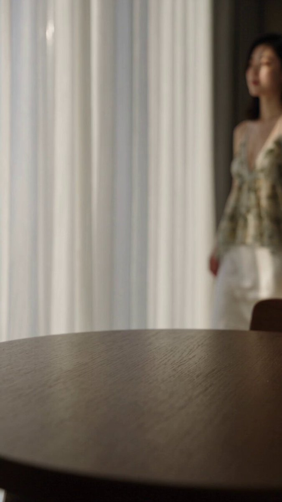</a>

<a href="https://x.com/liaojitao/status/2083432555752333367">▶️ 在 X 上观看视频</a>

</div>

<details>
<summary><b>📋 点击展开 / 复制提示词</b></summary>

```
Create a 30-second, 9:16 vertical smartphone VLOG with cinematic photorealism, following a young adult Asian woman through one day in a coastal city.

The two reference images depict the same woman. Use the multi-angle facial reference to preserve her facial features, skin tone, shoulder-length black hair, pearl stud earrings, and delicate pearl necklace. Use the full-body three-view reference to preserve her body proportions, pale sage-green floral embroidered halter top, white satin ankle-length skirt, and beige strappy heels.

Only this one main character should appear throughout the video. Keep her face, hairstyle, outfit, jewelry, age, and body proportions consistent in every shot. Do not change her clothes or age. The reference images are character sheets only. The final video must never show a triptych, collage, dividing lines, studio background, or multiple copies of the same woman.

The overall video should feel like a relaxed day-in-the-life VLOG filmed on her own phone: natural and intimate, with subtle handheld breathing motion, realistic skin and fabric physics, and lighting that gradually shifts from warm morning white to golden sunset and cool nighttime blue.

Use clean, decisive hard cuts. Each time segment should focus on one main action, with natural continuity between scenes.

0–4 seconds:
A bright apartment in the morning. In a medium close-up, she walks toward a floor-to-ceiling window and opens the sheer curtains. Morning sunlight falls across her face and white skirt. The camera gently rises from table height and slowly moves closer.

4–8 seconds:
A close-up mirror VLOG shot. Looking at herself in the mirror, she gently adjusts the hair around one ear and touches her pearl earring. She then looks toward the camera and gives a subtle smile. The mirror reflection must be physically correct and must not create a second person.

8–12 seconds:
An open-plan kitchen. Coffee pours into a clear glass, followed by a quick cut to her leaning against the counter, lifting the drink, and taking a small sip. Sunlight glints across the rim of the glass and her satin skirt. Her movements feel natural and unhurried.

12–16 seconds:
She picks up a simple ivory shoulder bag and leaves the apartment. A handheld tracking shot follows her into the elevator. The doors close, then hard cut to her walking through the ground-floor lobby and outside. Her gait, shoes, and the movement of her skirt must remain natural and stable.

16–20 seconds:
A street in a coastal city. Begin briefly from a low angle, capturing her footsteps and the movement of her skirt, then rise into a side-tracking medium shot. A gentle sea breeze moves her hair. The street is bright, with a few softly blurred pedestrians in the background, but no one blocks or duplicates the main character.

20–24 seconds:
A seaside café. From an over-the-shoulder angle, she sits beside the window and works on design sketches on her laptop, with a cup of coffee nearby. She pauses, looks out toward the sea, and then turns back toward the camera. Her hands, fingers, laptop, and tabletop objects must remain anatomically and structurally correct.

24–27 seconds:
A seaside promenade during golden hour. She holds up her phone and walks forward while filming herself. The camera makes a gentle half-circle movement around her. Sunlight shines through the ends of her hair, the breeze lifts her skirt slightly, and the sea reflects the golden light behind her. She looks relaxed and at ease.

27–30 seconds:
Back in the apartment at night. She places the phone near the window and leaves it recording in a fixed position. The city and coastline lights are softly blurred behind her. She walks into frame, sets down her shoulder bag, turns back and smiles gently at the camera, then reaches toward the lens to end the recording. Fade naturally to black.

Use only synchronized environmental sounds: curtains brushing, coffee pouring, a glass lightly touching the counter, footsteps, an elevator chime, coastal street ambience, quiet café background noise, sea waves, and subtle nighttime room tone.

No dialogue. No voice-over. No background music. No subtitles. No title cards. No logos. No watermarks. No readable text.

Avoid identity drift, changes in facial structure, longer hair, changes in outfit color or design, additional jewelry, duplicated people, malformed limbs or fingers, disappearing shoes, fabric clipping, incorrect mirror reflections, sudden zooms, exaggerated slow motion, cartoon-like rendering, excessive skin smoothing, or garbled text.
```

</details>

> 💡 需人物参考图

**👤 出处:** [@liaojitao](https://x.com/liaojitao) · [source](https://x.com/liaojitao/status/2083432555752333367)

▶️ **用 API 跑这条提示词** → [Velokey](https://velokey.ai/model/doubao-seedance-2-5-text-to-video?sourceChannel=github-awesome-seedance)（模型 id：`seedance-2.5`）

---

### No.16 机场行李机械寄居蟹

 

<div align="center">

<a href="https://x.com/Dheepanratnam/status/2083483493862879504">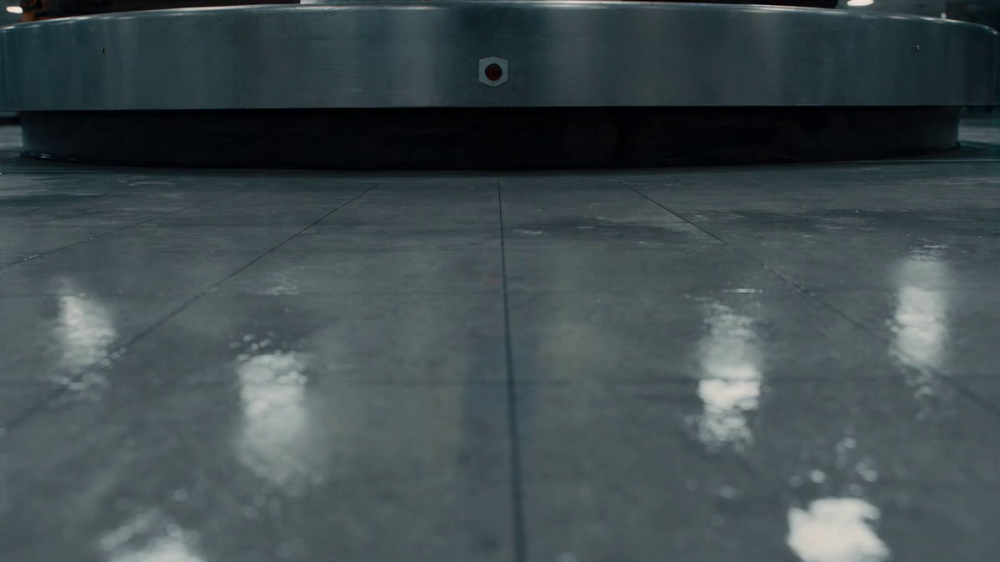</a>

<a href="https://x.com/Dheepanratnam/status/2083483493862879504">▶️ 在 X 上观看视频</a>

</div>

<details>
<summary><b>📋 点击展开 / 复制提示词</b></summary>

```
A deserted international airport baggage hall after midnight. One tired cleaner in a blue maintenance uniform polishes the floor beside a silent oval baggage carousel. The carousel transforms through physically connected airport machinery into a gigantic mechanical hermit crab while the cleaner remains trapped on its rotating luggage-covered shell. Surreal horror-comedy, realistic industrial mechanics, cold fluorescent lighting, polished-floor reflections, thin cleaning mist throughout. One continuous unbroken 30-second Steadicam shot; no cuts, transitions, montage, teleportation or camera resets. The camera constantly travels forward through the transformation, changing composition organically as objects pass near the lens.

0.0–1.2s — Beat 1: Extreme close-up of the carousel reflected in the wet polished floor; one red warning light unexpectedly blinks.
1.2–2.4s — Beat 2: Camera tilts up to the sleepy cleaner leaning on his mop as the belt clicks once behind him.
2.4–3.6s — Beat 3: The carousel suddenly runs backward; the cleaner slowly turns, confused.
3.6–4.8s — Beat 4: Camera arcs around him while suitcases accelerate and their wheels chatter against the belt.
4.8–6.0s — Beat 5: A passing suitcase hooks his mop and pulls him onto the moving carousel.
6.0–7.2s — Beat 6: Camera follows beside him at belt speed as he runs helplessly between circling luggage.
7.2–8.4s — Beat 7: Security trays snap open and closed like small warning claws as they pass close to the lens.
8.4–9.6s — Beat 8: Camera dives through a gap between suitcases into the dark maintenance space beneath the carousel.
9.6–10.8s — Beat 9: Locked close tracking beneath the machinery: foundation bolts rotate loose and fire from the concrete.
10.8–12.0s — Beat 10: Conveyor supports unfold sequentially into six heavy segmented legs, each foot slamming down behind the advancing camera.
12.0–13.2s — Beat 11: The camera rises with the lifting structure as the entire carousel tears free from the floor.
13.2–14.4s — Beat 12: The oval conveyor twists vertically into a rotating spiral shell without breaking apart.
14.4–15.6s — Beat 13: Suitcases lock across the spiral one after another, forming mismatched shell armor.
15.6–16.8s — Beat 14: Two baggage scales hinge outward into broad mechanical claws.
16.8–18.0s — Beat 15: Departure monitors extend on flexible cable stalks and become expressive rectangular eyes.
18.0–19.2s — Beat 16: The completed hermit crab drops onto all six legs; the impact sends a circular wave through the floor mist.
19.2–20.5s — Beat 17: Camera tracks backward at floor level as the enormous creature scuttles sideways through the terminal.
20.5–21.8s — Beat 18: The cleaner circles overhead on the rotating shell, gripping his mop and passing above the lens once per revolution.
21.8–23.1s — Beat 19: The crab delicately lifts one suitcase and places it into an airport security tray while still moving.
23.1–24.4s — Beat 20: The exit scanner flashes red; the creature freezes and its monitor eyes glance nervously at each other.
24.4–25.7s — Beat 21: Passing overhead, the cleaner desperately scans his mop handle; the gate turns green with a cheerful chime.
25.7–27.2s — Beat 22: The crab ducks beneath the sign and squeezes through the exit, its luggage shell scraping sparks from the doorway.
27.2–30.0s — Finale: Camera glides backward through the automatic doors into the rainy airport forecourt. The crab emerges majestically, pauses in the mist and raises both claws. The cleaner stands on the rotating shell holding his mop like a victory flag. The monitor eyes blink proudly as one lonely suitcase arrives late through the doors and clicks perfectly into the final empty space in the shell.

Sound: Continuous airport room tone evolving into conveyor rumble, suitcase-wheel percussion, hydraulic locking, concrete fractures, scanner beeps and deep mechanical crab vocalizations. Calm automated announcement during the chaos: “Your baggage has arrived.” Finish with the security chime and a strangely triumphant orchestral chord.

Continuity constraints: Preserve one cleaner, one mop, one terminal layout and one mechanically coherent crab throughout. Every component must originate visibly from the carousel or surrounding baggage equipment. Maintain continuous screen direction and spatial geography. No organic flesh, extra limbs, duplicated luggage, changing uniform, illegible foreground text, gore or unexplained morphing.
```

</details>

**👤 出处:** [@Dheepanratnam](https://x.com/Dheepanratnam) · [source](https://x.com/Dheepanratnam/status/2083483493862879504)

▶️ **用 API 跑这条提示词** → [Velokey](https://velokey.ai/model/doubao-seedance-2-5-text-to-video?sourceChannel=github-awesome-seedance)（模型 id：`seedance-2.5`）

---

### No.17 土耳其早餐食谱 Vlog

 

<div align="center">

<a href="https://x.com/buraktuyan/status/2083502114714640454">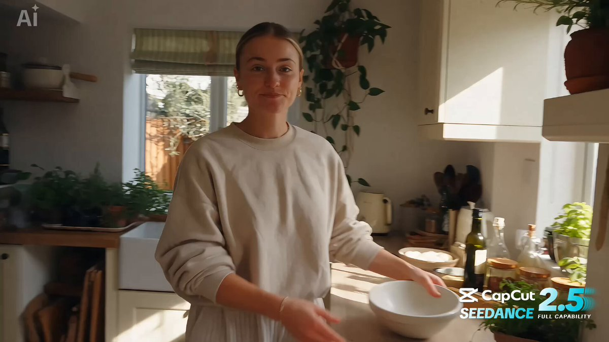</a>

<a href="https://x.com/buraktuyan/status/2083502114714640454">▶️ 在 X 上观看视频</a>

</div>

<details>
<summary><b>📋 点击展开 / 复制提示词</b></summary>

```
Create a 30-second home-video recipe vlog showing a young woman from London in her mid-20s making Turkish eggs in her small, sunlit kitchen. She wears relaxed home clothes, has her hair loosely tied back, and films everything herself with a consumer mini-DV camcorder. Some shots are handheld; others are recorded after she props the camera on the counter. Keep the footage candid and imperfect: gentle camera shake, occasional focus hunting, slightly awkward framing, natural zoom adjustments, subtle grain, mild motion blur, and automatic exposure changes caused by the bright morning light.

Follow this exact sequence:

0–3s: In a propped medium shot, she places a bowl on the counter, looks toward the camera, and says quietly, “Let’s make Turkish eggs.”

3–6s: Overhead close-up as she combines thick yoghurt, finely grated garlic, and a pinch of salt, stirring until smooth. Clearly hear the spoon moving around the bowl.

6–9s: Handheld detail shot as she spoons the garlic yoghurt onto a shallow plate and spreads it into soft, imperfect swirls.

9–12s: Close-up beside a saucepan of gently simmering water. She cracks an egg into a small bowl and says, “Keep the water gentle.”

12–15s: Overhead shot as she carefully slides the egg into the water. The white naturally curls around the yolk; the water never boils aggressively.

15–18s: Macro-style detail of butter melting in a small pan. She adds pul biber, creating a vivid orange-red mixture that blooms and audibly sizzles. No dialogue.

18–21s: Handheld close-up as she removes two softly poached eggs, lets them drain briefly, and places them over the garlic yoghurt.

21–24s: Extreme close-up as she pours the sizzling pul-biber butter across the eggs, creating rich red-orange streaks over the white yoghurt.

24–27s: Warm, propped shot. She adds fresh dill, tears off a piece of crusty bread, and breaks open one egg, revealing the flowing golden yolk. She says, “Look at that.”

27–30s: Handheld finishing shot. She scoops up yoghurt, egg, and chilli butter with the bread, takes a bite, smiles genuinely, and says, “Best breakfast.” She then reaches forward and covers the lens.

Prioritise intimate food sounds: yoghurt stirring, garlic scraping, simmering water, egg cracking, butter sizzling, ceramic clinks, and bread tearing. Dialogue should sound quiet and casually captured through the camcorder microphone. Preserve realistic imperfections such as irregular poached-egg whites, small splashes, messy spoon marks, brief pauses, natural blinking, and exposure shifts. It must look like a genuine personal breakfast vlog.
```

</details>

**👤 出处:** [@buraktuyan](https://x.com/buraktuyan) · [source](https://x.com/buraktuyan/status/2083502114714640454)

▶️ **用 API 跑这条提示词** → [Velokey](https://velokey.ai/model/doubao-seedance-2-5-text-to-video?sourceChannel=github-awesome-seedance)（模型 id：`seedance-2.5`）

---

### No.18 韩国女生街拍自拍 Vlog

 

<div align="center">

<a href="https://x.com/saniaspeaks_/status/2083520337157787838"></a>

<a href="https://x.com/saniaspeaks_/status/2083520337157787838">▶️ 在 X 上观看视频</a>

</div>

<details>
<summary><b>📋 点击展开 / 复制提示词</b></summary>

```
Seedance 2.5 on @capcutapp 

Prompt
A photorealistic smartphone selfie vlog that looks exactly like a real mobile phone recording. A young Korean woman (image = her face and hair) visits a beautiful strawberry farm in Japan on a sunny spring morning. She naturally speaks Japanese throughout the vlog. Holding her phone in selfie mode with realistic handheld movement, slight hand shake, authentic smartphone autofocus, and true-to-life colors, she smiles and says, 「今日はイチゴ狩りに来ました！」 ("Today I came strawberry picking!"). She walks through long rows of strawberry plants, carefully picks ripe red strawberries, and places them into a small woven basket. She chooses one fresh strawberry, takes a bite, smiles with genuine delight, and says, 「甘くておいしい！」 ("It's so sweet and delicious!"). As she continues picking, the basket gradually fills with strawberries. She proudly holds the full basket toward the camera, laughs naturally, then gives a warm wave and says, 「またね！」 ("See you!"), reaching toward the phone to end the recording. The video should feel exactly like a genuine smartphone vlog with natural human movement, consistent facial features, realistic strawberry picking, authentic outdoor lighting, no beauty filters, no CGI, no AI-plastic appearance, no subtitles, no logos, no watermark, and no background music—only real farm ambience, birds, gentle wind, footsteps, and natural outdoor sounds.
```

</details>

> 💡 需人物参考图

**👤 出处:** [@saniaspeaks_](https://x.com/saniaspeaks_) · [source](https://x.com/saniaspeaks_/status/2083520337157787838)

▶️ **用 API 跑这条提示词** → [Velokey](https://velokey.ai/model/doubao-seedance-2-5-text-to-video?sourceChannel=github-awesome-seedance)（模型 id：`seedance-2.5`）

---

### No.19 多镜头电影级序列

 

<div align="center">

<a href="https://x.com/jaynwabueze/status/2083524547739787466">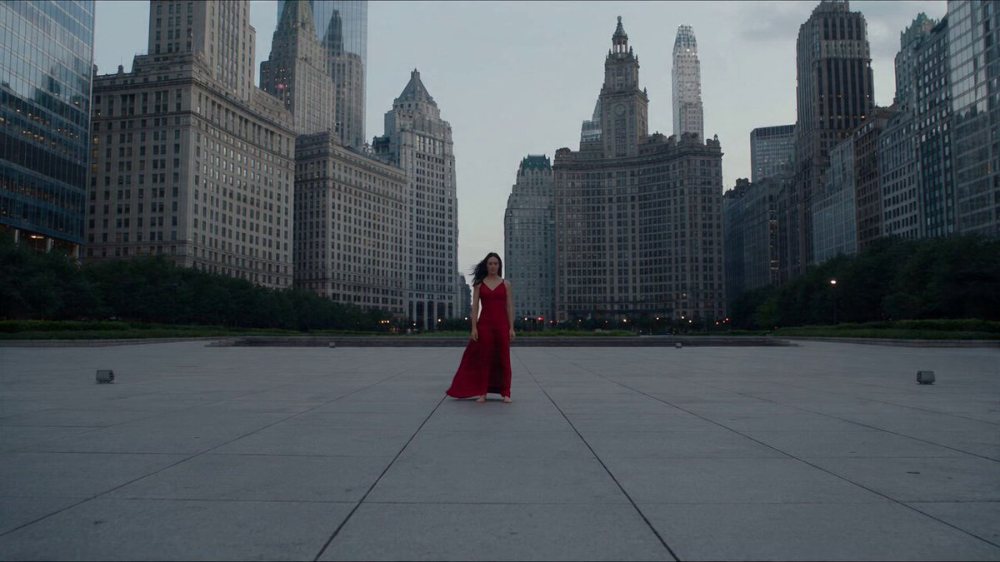</a>

<a href="https://x.com/jaynwabueze/status/2083524547739787466">▶️ 在 X 上观看视频</a>

</div>

<details>
<summary><b>📋 点击展开 / 复制提示词</b></summary>

```
Multi-shot 30-second cinematic sequence, hard cuts as marked.
Photorealistic 8K, ARRI Alexa large-format character, prime lenses, 35mm
grain, professional grade, 180° shutter motion blur, IMAX-scale VFX.
THE WOMAN: late 20s, long dark hair, deep red silk evening dress,
barefoot. Calm, unafraid.
THE CREATURE (original design): SHE IS THE CREATURE. Not a separate
being. Her own body grows and armors. Obsidian-black interlocking plates
sheathing her limbs and torso, molten orange fissures glowing between
every plate, elongated arms, a crown of jagged back-swept horns, amber
eyes. Human posture and proportions kept, scaled to 90 metres.
TRANSFORMATION PHASES, in strict order:
P1 hairline fractures of orange light open across her skin.
P2 the fissures widen, embers pour upward off her shoulders.
P3 obsidian plates surface through her skin and lock into place, dress
burning away into ash.
P4 she grows upward and outward from her own standing body, feet planted,
weight driving into the ground, horns pushing through last.
LOCATION: dense modern city, wide granite plaza, glass towers all sides,
dusk, empty streets, abandoned cars, streetlights flickering on.
COLOR 60:30:10 — 60% cool blue-grey dusk glass and stone / 30% deep
shadow / 10% molten orange fissures and embers.
0–4s | SHOT 1 | 24mm wide, low ground-level, slow dolly in. She stands
alone centre-plaza, wind moving her hair and dress. City silent.
CUT.
4–7s | SHOT 2 | 100mm macro insert. Her hand and collarbone. First
hairline cracks of orange light spread across the skin (P1). No movement
otherwise.
CUT.
7–10s | SHOT 3 | 40mm, low behind her, slight dutch. Fissures widen,
embers stream upward off her shoulders (P2), granite fracturing in a ring
around her bare feet.
CUT.
10–17s | SHOT 4 | THE GROWTH. NO CUT IN THIS SHOT. 35mm, locked on her
face at eye level, camera craning upward at exactly her rate of growth so
her face stays centre-frame the entire time. Obsidian plates surface and
lock across her face and shoulders (P3), amber ignites in her eyes, horns
push back through her hair (P4). Her feet never leave the ground. The
camera never loses her face.
CUT.
17–21s | SHOT 5 | 21mm worm's-eye, camera on the street between abandoned
cars. Her colossal foot plants, buckling the road, cars flipping in the
shockwave. Scale reveal.
CUT.
21–25s | SHOT 6 | 50mm aerial, slow helicopter orbit. Full colossus
against the skyline, embers and dust swirling, molten light pulsing in her
plating.
CUT.
25–28s | SHOT 7 | 85mm, camera mounted on a glass tower facing her. Her
arm swings through the facade, curtain wall shearing away in slabs,
camera whip-panning down with the falling glass.
CUT.
28–30s | SHOT 8 | 24mm aerial, rising crane pull-back. She stands amid the
broken skyline, dust rolling outward, molten fissures pulsing.
PHYSICS: her mass increases continuously, granite fracturing radially from
her feet; steel groans and buckles before it fails; glass falls as sheets
that shatter on impact; concrete shears in slabs, not crumbs; dust rolls
in heavy waves; embers ride heat currents upward.
AUDIO: wind and low city hum, a deep bone-crack as the fissures open, a
sustained rising roar through the growth, groaning steel, sheeting glass,
thunderous impacts, settling dust.
HARD LOCKS: the creature is the transformed woman, one continuous being.
Nothing emerges from the ground. No second creature. She never levitates,
floats, or leaves the ground at any moment. Feet planted throughout the
transformation. She never vanishes from frame between shots. No people
visible anywhere.
FORBIDDEN: no levitation, no separate monster, no ground emergence, no
gore or flesh tearing, no franchise creatures, no design drift, no
subtitles, no background music, no readable text or logos.
```

</details>

**👤 出处:** [@jaynwabueze](https://x.com/jaynwabueze) · [source](https://x.com/jaynwabueze/status/2083524547739787466)

▶️ **用 API 跑这条提示词** → [Velokey](https://velokey.ai/model/doubao-seedance-2-5-text-to-video?sourceChannel=github-awesome-seedance)（模型 id：`seedance-2.5`）

---

### No.21 引力扭曲·天体变形特效

 

<div align="center">

<a href="https://x.com/sebatheepan/status/2083546568125288542"></a>

<a href="https://x.com/sebatheepan/status/2083546568125288542">▶️ 在 X 上观看视频</a>

</div>

<details>
<summary><b>📋 点击展开 / 复制提示词</b></summary>

```
seedance 2.5 text to video 
vfx effects testing for
Gravity distortion, volumetric space, celestial-scale transformation, particles and fluid simulation

Prompt 👇

 An elderly night janitor cleans an abandoned Art Deco planetarium during a thunderstorm. The projected moon becomes physically real and drags the entire auditorium into its gravity. [0–1.5s] Shot 1: Macro shot of mop water trembling in its bucket although the floor is still. [1.5–3s] Shot 2: Wide tracking shot follows the janitor beneath the dark planetarium dome. [3–4.5s] Shot 3: Close-up as the dormant star projector switches on by itself. [4.5–6s] Shot 4: Overhead shot: a perfect moon appears on the dome, shedding fine silver dust. [6–7.5s] Shot 5: The janitor’s flashlight beam bends upward toward the moon. [7.5–9s] Shot 6: Close-up of auditorium seats vibrating as loose screws rise from their mountings. [9–10.5s] Shot 7: Low-angle shot as the projected moon swells into a solid cratered sphere descending from the ceiling. [10.5–12s] Shot 8: The janitor falls upward, catching a brass handrail before leaving the floor. [12–13.5s] Shot 9: Popcorn, tickets and cleaning cloths spiral around the moon in orbital rings. [13.5–15s] Shot 10: Camera rolls ninety degrees as gravity rotates through the auditorium. [15–16.5s] Shot 11: Mop water climbs from the bucket as a transparent floating ribbon. [16.5–18s] Shot 12: Wide shot as seats tear loose and orbit without colliding with the janitor. [18–19.5s] Shot 13: The dome surface fractures into a convincing infinite star field. [19.5–21s] Shot 14: A miniature eclipse shadow begins crossing the moon and freezing everything it touches. [21–22.5s] Shot 15: The janitor swings between floating seats toward the emergency dome lever. [22.5–24s] Shot 16: Close-up: his fingertips catch the lever as the handrail tears loose. [24–25.5s] Shot 17: He pulls it; mechanical shutters race across the dome and extinguish the artificial sun. [25.5–27s] Shot 18: The moon implodes silently into streams of silver dust and collapsing orbital debris. [27–28.5s] Shot 19: Gravity returns; seats slam into place while the janitor lands safely in his rolling bucket. [28.5–30s] Shot 20: Quiet final close-up: he discovers a marble-sized moon in his pocket while the water in his bucket produces a tiny tide. Global style: Photoreal celestial surrealism, physically accurate dust and fluid behavior, deep blacks, silver-blue moonlight, Art Deco brass, realistic collision physics, coherent janitor identity. Effects must originate from the projector, affect real objects, then collapse into the miniature moon. No text, extra people or unexplained teleportation.
```

</details>

**👤 出处:** [@sebatheepan](https://x.com/sebatheepan) · [source](https://x.com/sebatheepan/status/2083546568125288542)

▶️ **用 API 跑这条提示词** → [Velokey](https://velokey.ai/model/doubao-seedance-2-5-text-to-video?sourceChannel=github-awesome-seedance)（模型 id：`seedance-2.5`）

---

### No.22 30秒连续单镜·疲惫男子

 

<div align="center">

<a href="https://x.com/Runaway_Rhino/status/2083557853764206903">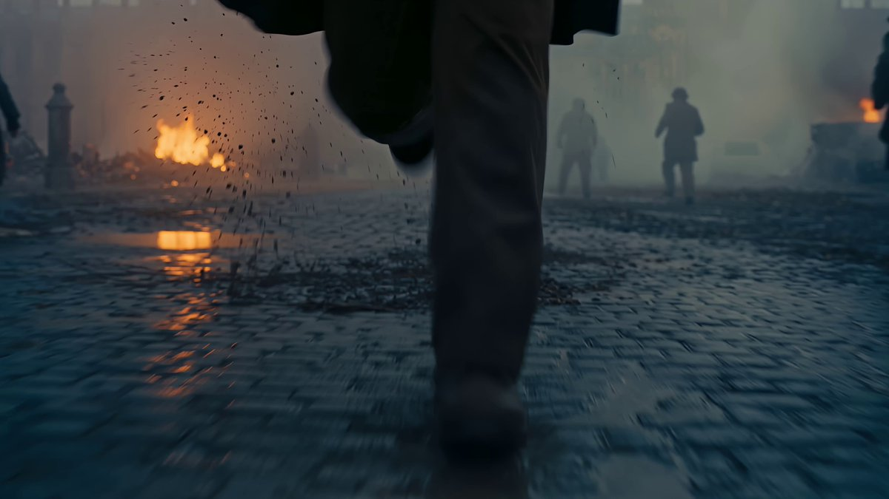</a>

<a href="https://x.com/Runaway_Rhino/status/2083557853764206903">▶️ 在 X 上观看视频</a>

</div>

<details>
<summary><b>📋 点击展开 / 复制提示词</b></summary>

```
Photorealistic 30-second continuous one-shot: no cuts, hidden edits, dissolves or teleportation — every apparent shot change is one unbroken physical camera move around the same man.
A bruised, exhausted man in his early 30s - dirty dark wool coat, torn shirt, muddy trousers - sprints through a devastated European city at cold dawn: wet asphalt, smoke, drifting ash, distant fires, ruined architecture. Keep his face, clothes, injuries and body identical throughout. Dead-serious acting: ragged breathing, fear, slipping boots, pumping arms. He ignores the surreal chaos, fixed on something ahead.
[0s] The camera holds at puddle level beside his boots hammering through black rainwater, spray striking the lens. As he blasts past, it starts a half-beat late, pulling back and rising into a tight frontal track at chest height, his eyes just above center. Behind him civilians flee through smoke; a cathedral-sized shadow moves beneath the street.
[4s] A seam of light splits the buildings on his left. The camera eases around his left shoulder in one slow 90° arc, falling rubble crossing the near plane, landing on his clean left profile. Buildings unzip vertically like fabric, revealing a turbulent ocean suspended behind them; a colossal whale swims between rooftops while cars and rubble fall upward into the clouds. He stays in normal gravity.
[9s] The air ahead fills with suspended glass shards, each showing a different version of the same street: burning, flooded, frozen, abandoned. The camera drops to hip height beside him in a low side track; shards streak past the lens.
[12s] A city bus crashes behind him and bursts into thousands of black birds instead of debris. The flock sweeps across the lens; when it clears the camera is behind him, one continuous move.
[14s] The camera settles into a wide rear track. The street ahead bends upward like a strip of film until buildings stand vertically above the horizon; people, bicycles and wreckage slide across walls; giant concrete hands push through the asphalt on both sides. He leaps a widening fracture, landing with full physical weight. The camera lags half a beat on the jump, then closes back in.
[20s] The sun splits open like a mechanical iris, revealing stars, eclipses and turning planets. The light draws the camera up in one weighted crane arc, rising past his shoulder to a brief top-down beat over him. Flaming debris falls; soldiers run across the sky as if it were solid ground; a train passes vertically between towers.
[23s] The crane carries its momentum down ahead of him, slowing into a tight frontal close-up, his eyes just above center against the burning sky, embers streaking between lens and face. Keep him sharply readable, emotionally central.
[25s] He reaches a small untouched dining table in the middle of the ruined street; a girl of about eight sits calmly beside a tiny birthday cake, one candle burning. He slides to his knees, catches himself against the table, looks into her eyes; terror becomes relief. The camera decelerates with him, easing wider and sinking to table height, nearly stopping for the first time - a faint breath of motion - landing on a two-shot, candle between them.
[28s] Together they blow out the candle. The instant the flame dies, all destruction and cosmic events freeze, then transform seamlessly into the same street on a quiet ordinary morning: intact buildings, soft sunlight, distant birds, no other people, their exact poses preserved. The camera holds; an almost imperceptible push settles on the thin candle smoke rising between them.
VISUAL LANGUAGE: prestige war-film realism fused with surreal cosmic imagery - photorealistic, never cartoonish or game-like. Cold blue-grey dawn dominates, dirty amber firelight secondary; the candle is the only warm accent. Volumetric smoke, wet surfaces, pore-level skin, sweat, mud, blood, visible breath, real contact shadows.
AUDIO: no dialogue, narration, music or subtitles. Footsteps, splashing water, strained breathing, alarms, artillery, collapsing masonry, whale calls from the sky, reversed metal groans, flapping birds, grinding concrete, deep celestial resonance. When the candle dies, all catastrophic sound stops instantly: one exhale, morning birds, a faint ceramic rattle.
CAMERA: one unbroken physical path, a weighted rig with real mass - every move triggered by the scene, easing in and out, landing on a held composition. Immersive wide-angle look becoming intimate; deep parallax, subtle lens breathing, natural focus pulls, filmic motion blur. Maintain forward direction and geography; neve
```

</details>

**👤 出处:** [@Runaway_Rhino](https://x.com/Runaway_Rhino) · [source](https://x.com/Runaway_Rhino/status/2083557853764206903)

▶️ **用 API 跑这条提示词** → [Velokey](https://velokey.ai/model/doubao-seedance-2-5-text-to-video?sourceChannel=github-awesome-seedance)（模型 id：`seedance-2.5`）

---

### No.23 中国古风人物小传

 

<div align="center">

<a href="https://x.com/MrLarus/status/2083560269964271693">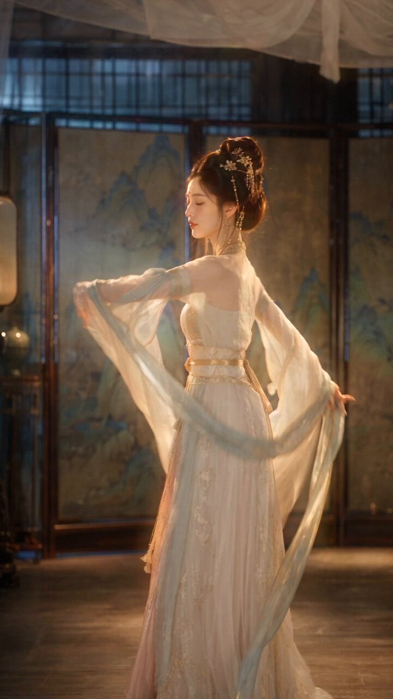</a>

<a href="https://x.com/MrLarus/status/2083560269964271693">▶️ 在 X 上观看视频</a>

</div>

<details>
<summary><b>📋 点击展开 / 复制提示词</b></summary>

```
3/ Seedance 2.5 Prompt

【任务】
生成完整 30 秒中国古风人物小传短片。
严格按照时间轴、多模态素材映射、人物隔离和参考音频执行，不自由修改镜头与剧情。

【参考绑定】
- Depth 视频：只控制约 0–5s、10–18s、25–30s 三段核心舞蹈
- 多视角头像 + 全身图：只锁定主舞女
- 九宫格：按编号调用妆造、乐器与剪影镜头，禁止串格
- 场景图：全片保持同一个古风雅室
- 参考 BGM：作为唯一音乐，从 0s 播放至 30s

【人物隔离】
主舞女、古筝女和琵琶女必须是三位不同角色。
Grid 1–3：只出现主舞女
Grid 4–5：只出现古筝女
Grid 6–7：只出现琵琶女
Grid 8–9：以主舞女剪影为主
配角造型更素、光线更收，不抢主角。

【参考时间轴】
0–5s：主舞女舞蹈起势
5–6.5s：描眉
6.5–8s：抿唇
8–10s：插发簪
10–18s：主舞女舞蹈中段
18–19.5s：古筝女全景
19.5–20.5s：古筝手部特写
20.5–21.5s：琵琶女全景
21.5–22s：琵琶手部特写
22–23.5s：纱帘剪影全景
23.5–25s：纱帘剪影特写
25–30s：主舞女舞蹈收势

【画面要求】
真实古风雅室，以烛火和宫灯作为主要光源。
皮肤保留自然纹理，不要磨皮、塑料感和均匀棚拍光。
飘带、发簪、纱帘与琴弦保持真实材质和运动惯性。
所有动作重拍与镜头切换尽量跟随参考 BGM。

【总要求】
总时长 30 秒。
人物、动作、场景、镜头和音乐沿着同一条时间轴推进。
结尾回到主舞女，不使用配角或空镜收尾。
禁止串脸、镜头错序、音乐错位、自由改剧情、字幕、Logo 和水印。
```

</details>

> 💡 需多模态素材+参考音频

**👤 出处:** [@MrLarus](https://x.com/MrLarus) · [source](https://x.com/MrLarus/status/2083560269964271693)

▶️ **用 API 跑这条提示词** → [Velokey](https://velokey.ai/model/doubao-seedance-2-5-text-to-video?sourceChannel=github-awesome-seedance)（模型 id：`seedance-2.5`）

---

### No.24 空中动作大片

 

<div align="center">

<a href="https://x.com/Artedeingenio/status/2083573046309191997"></a>

<a href="https://x.com/Artedeingenio/status/2083573046309191997">▶️ 在 X 上观看视频</a>

</div>

<details>
<summary><b>📋 点击展开 / 复制提示词</b></summary>

```
30-second cinematic aerial action spectacle, breathtaking high-budget feature film, ultra-dynamic editing, fluid aerial choreography, premium cinematic visuals, seamless kinetic camera movement, aggressive speed ramps, rapid match cuts, whip pans, rotating camera moves, dramatic perspective shifts, cinematic lens distortion, volumetric storm clouds, ocean spray, glowing tracer lights, smoke trails, sparks, flying debris, colossal scale, emotionally epic, no dialogue.

0–5s
Dark storm clouds gather above a vast open ocean.
A colossal armored battleship cuts through enormous waves.
Far above, a lone high-performance fighter aircraft emerges from the clouds.
Extreme close-ups.
Pilot visor.
Hands on the controls.
Jet intake vibrating.
Radar display glowing.
The camera alternates between immense aerial vistas and intimate cockpit shots.
Complete silence.

5–10s
The fighter rolls onto its wing and dives toward the ocean.
The camera races only meters from the aircraft before instantly switching to first-person cockpit views, impossible wing-mounted perspectives, sweeping aerial fly-bys and dramatic low-angle shots skimming above the waves.
The ship rapidly grows larger.
The engines reach full power.

10–15s
A breathtaking aerial montage.
The fighter slices between towering smoke columns and dense clouds.
Bright streams of tracer light streak across the sky.
The aircraft performs impossible barrel rolls, high-G turns and vertical climbs while the camera continuously rotates around the fuselage.
Speed ramps amplify every maneuver.

15–20s
The fighter skims just above the ocean surface.
Towering walls of spray rise behind it.
It climbs sharply over the battleship's deck in one uninterrupted shot.
The camera dives beneath the aircraft, then whips upward through drifting smoke, sparks and sunlight breaking through the storm.
Everything feels impossibly fast.

20–25s
The sequence reaches maximum intensity.
The aircraft circles the massive vessel at incredible speed.
Towering water plumes erupt around the ship.
Clouds swirl overhead.
The camera jumps between ultra-wide aerial compositions, intimate cockpit close-ups, spinning chase shots, dramatic slow-motion fly-bys and impossible orbiting movements around both aircraft and ship.
Every cut increases the spectacle.

25–30s
Everything suddenly slows.
The fighter climbs vertically through the storm clouds into brilliant sunlight.
Far below, the gigantic battleship disappears beneath drifting mist and shimmering ocean reflections.
The camera pulls rapidly upward into an immense aerial shot revealing endless sky and sea stretching to the horizon.

Hard cut to black.

Sound design: soaring cinematic orchestra, thunderous percussion, deep brass, roaring jet engines, rushing wind, ocean waves crashing against steel, atmospheric echoes, powerful fly-by whooshes, subtle sonic booms, cinematic bass swells, brief silence before the final climb, overwhelming orchestral finale.
```

</details>

**👤 出处:** [@Artedeingenio](https://x.com/Artedeingenio) · [source](https://x.com/Artedeingenio/status/2083573046309191997)

▶️ **用 API 跑这条提示词** → [Velokey](https://velokey.ai/model/doubao-seedance-2-5-text-to-video?sourceChannel=github-awesome-seedance)（模型 id：`seedance-2.5`）

---

### No.26 IMAX 变形宽银幕特工

 

<div align="center">

<a href="https://x.com/janmexico/status/2083592315893903801">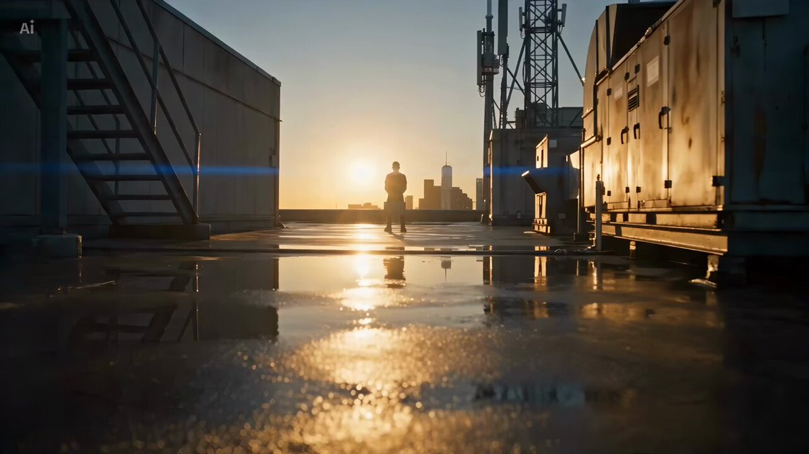</a>

<a href="https://x.com/janmexico/status/2083592315893903801">▶️ 在 X 上观看视频</a>

</div>

<details>
<summary><b>📋 点击展开 / 复制提示词</b></summary>

```
Prompt 👇

Jan: tall slim, round red glasses, earpiece right ear, gloves, harness.
Tone: IMAX anamorphic 2x, golden hour. Hard low sun on wet concrete, deep blue shadows, backlight, horizontal blue flares, saturated epic grade. Never grey or flat.
CAMERA: low angle nearly every beat. Crash zooms, straight tracking, tilts. NEVER orbit or arc. Smooth motion, natural blur, 24fps, no stop motion. Jan never looks into the lens.
AUDIO: Renteria only by radio, thin, tinny, filtered, click each side. Jan answers out loud. SFX only: wind, rotor, rope, fabric. NO MUSIC, no subtitles.
0-6s Ground-level low angle, sun flare on puddles. Crash zoom to Jan's hands snapping the case shut, tilt up to earpiece and face, front to camera. Renteria, urgent: "Treinta segundos, Jan. Cincuenta referencias. Una sola toma. Tienes que mandarlo ya."
6-9s Low angle into the sun, camera tracks back ahead of Jan. He lifts the case: "Enterado. Voy por el." and runs.
9-12s Water-level low angle. Jan sprints over the camera, jumps a duct, gold spray on the lens. Renteria: "Cuando te subas, abres tu Capcot y lo generas ya."
12-15s Low angle on Duarte, rim lit. Crash zoom: "Pense que llegabas mas tarde."
15-18s Low angle, helicopter drops into a low hover, rotor wash blasting gold spray. Jan steps up through the door.
18-21s Cabin, over the shoulder behind Jan. He opens the case revealing the laptop, screen square to camera. Push in as he presses Generate.
21-25s Jan clips a rappel line to his harness, grips it with both gloved hands, kicks off the skid and swings out over the facade. Camera whips down with him into a fast controlled descent, boots striking the glass, sunlight tearing past.
25-30s Epic finale. Mid descent Jan yanks a second rope hard. The giant banner bursts open beside him and unrolls floor by floor, snapping taut. He lands on his feet in the plaza. Crash zoom out to a vast skyline wide, the full banner reading ESTO ES SEEDANCE 2.5 above him, helicopter rising into the sunburst.
```

</details>

> 💡 需人物参考图

**👤 出处:** [@janmexico](https://x.com/janmexico) · [source](https://x.com/janmexico/status/2083592315893903801)

▶️ **用 API 跑这条提示词** → [Velokey](https://velokey.ai/model/doubao-seedance-2-5-text-to-video?sourceChannel=github-awesome-seedance)（模型 id：`seedance-2.5`）

---

### No.27 AI 生活 Vlog·30秒

 

<div align="center">

<a href="https://x.com/aivoxyy/status/2083596849768993075">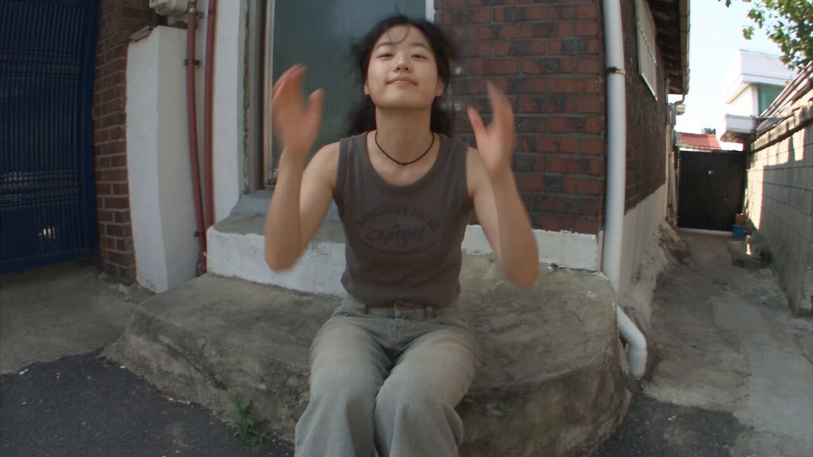</a>

<a href="https://x.com/aivoxyy/status/2083596849768993075">▶️ 在 X 上观看视频</a>

</div>

<details>
<summary><b>📋 点击展开 / 复制提示词</b></summary>

```
Main subject: young Korean woman, early 20s, natural everyday appearance, faded charcoal-grey sleeveless crop top, loose high-waisted light-wash jeans, black canvas sneakers, black cord necklace, black wavy hair in a messy side ponytail with wispy bangs. Realistic skin texture, minimal makeup, warm and approachable personality. Maintain consistent identity, clothing, hairstyle, and appearance throughout the entire video. Location: Authentic Korean residential neighborhood during a calm late morning. Narrow concrete alleys, low-rise homes, small terraces, potted plants, laundry lines, bicycles, utility poles, overhead wires, mature trees casting moving shadows, quiet residential atmosphere. No stores, advertisements, cafés, crowds, or commercial activity. Visual Style: Ultra-realistic documentary realism. Genuine candid behavior. Natural body language. Unscripted slice-of-life feeling. Strong environmental authenticity. Rich real-world details and believable human motion. Camera Style: Early-2000s consumer DV camcorder aesthetic. Friend casually recording everyday moments. Heavy handheld shake, imperfect framing, frequent autofocus hunting, lens breathing, exposure pumping when moving between sun and shade, occasional motion blur, subtle rolling shutter, mild digital compression artifacts, faded colors, soft contrast, slight sensor noise. No stabilization. No cinematic camera moves. No modern color grading.

00:00–00:02 Outside a small house entrance. She sits on a low concrete wall adjusting her ponytail with both hands raised. A light breeze moves loose strands of hair. She smiles naturally while the camera struggles to hold focus.

00:02–00:04 The camera follows her into a narrow alley lined with potted plants and concrete walls. She notices a stray cat approaching and crouches down. Framing drifts off-center as the operator tries to keep up.

00:04–00:06 She gently pets and feeds the cat. Autofocus repeatedly shifts between her face and the animal. Morning sunlight flickers through leaves overhead.

00:06–00:08 Small front yard beside her house. She hangs laundry on a clothesline while fabrics sway in the breeze. Exposure changes as clouds briefly pass overhead.

00:08–00:10 On a quiet terrace with a ceramic coffee cup. She sits comfortably watching the neighborhood, occasionally brushing hair behind her ear. Loose handheld side angle with natural camera drift.

00:10–00:12 Close side profile. Someone off-camera greets her. She turns, raises her hand, smiles warmly, and casually says, "Annyeong." The camera catches the moment slightly late.

00:12–00:15 Walking slowly down a tree-lined residential lane holding her coffee cup. She notices the camera, gives a small genuine smile, then looks away and continues walking.

00:15–00:18 A short flight of worn concrete steps between two low houses. She climbs them one-handed, coffee cup in the other, and pauses to steady a leaning potted plant with her foot. The operator lags a beat behind and the frame tilts hard before correcting. Heavy exposure pumping as she moves from deep shade into open sun at the top of the steps.

00:18–00:20 Narrow alley in full late-morning sun. She stops at a green plastic watering can left by a doorway, picks it up, and waters a row of chili plants and a spider plant along the wall. Water darkens the concrete. Autofocus hunts between the falling water and her hands.

00:20–00:22 An older neighbor passes pushing a small metal handcart. She steps aside, gives a short polite bow, and says a brief warm greeting. The neighbor answers in indistinct background chatter and continues on. The camera swings to follow the cart, then swings back to her, badly framed and slightly late.

00:22–00:24 She crouches at a low wall where the same stray cat has reappeared, sitting in a patch of sun. She holds out one hand, the cat ignores her, and she laughs quietly and stands. Camera drops to knee height and the horizon goes crooked. Motion blur as it lifts again.

00:24–00:26 She wheels an old bicycle out from where it leans against a utility pole, checks the front tyre with her thumb, then leaves it and keeps walking. Overhead wires cut across the bright sky in the top of the frame. Lens breathing as the operator tries to zoom and gives up.

00:26–00:28 Back at the small front yard. The laundry from earlier moves in a stronger breeze now. She reaches up and straightens one sleeve on the line, then stands there a moment looking at the neighborhood, coffee cup empty in her other hand. Soft dappled tree shadow moves across her face and the wall behind her.

00:28–00:30 She turns toward the camera at the house entrance, notices it is still recording, raises her hand in a small casual wave and shakes her head slightly, half-smiling, as if telling the operator to stop filming. Recording cuts abruptly to black mid-motion as if the camcorder was switched off.

Audio: Natural ambient sound only — morning birds, distant motorcycles, light wind, leaves rustling, faint neighborhood chatter, cat sounds, footsteps on concrete, fabric moving on clotheslines, water pouring onto concrete, bicycle chain ticking, handcart wheels on rough ground, subtle residential ambience. No music. No sound design. No narration.

Goal: Authentic Korean neighborhood life captured like a forgotten home video from the early 2000s — candid, imperfect, realistic, warm, and deeply believable.
```

</details>

> 💡 需人物参考图

**👤 出处:** [@aivoxyy](https://x.com/aivoxyy) · [source](https://x.com/aivoxyy/status/2083596849768993075)

▶️ **用 API 跑这条提示词** → [Velokey](https://velokey.ai/model/doubao-seedance-2-5-text-to-video?sourceChannel=github-awesome-seedance)（模型 id：`seedance-2.5`）

---

### No.28 演唱会现场手机视角

 

<div align="center">

<a href="https://x.com/HeyZaraKhan/status/2083616633172767227">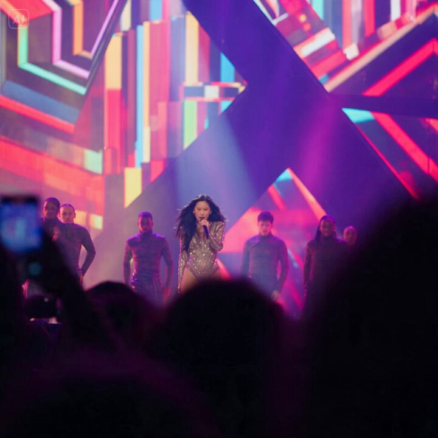</a>

<a href="https://x.com/HeyZaraKhan/status/2083616633172767227">▶️ 在 X 上观看视频</a>

</div>

<details>
<summary><b>📋 点击展开 / 复制提示词</b></summary>

```
"A realistic smartphone video captured inside a sold-out concert arena. An energetic female performer is on stage delivering a live performance while dancing with a group of professional backup dancers in a synchronized, high-energy routine. Dynamic LED screens, moving spotlights, and colorful stage lighting create an immersive concert atmosphere. Thousands of audience members are cheering and recording the performance with their smartphones. The footage has authentic handheld smartphone movement, natural autofocus, and realistic exposure changes from the flashing stage lights. The camera briefly turns toward the person filming. She is a young woman smiling, enjoying the atmosphere, and reacting naturally to the performance as colorful stage lights illuminate her face. She laughs before turning the camera back toward the stage, where the performer and dancers continue their energetic choreography. Highly realistic crowd behavior, authentic concert atmosphere, cinematic lighting, shallow depth of field, ultra-realistic smartphone footage."
```

</details>

**👤 出处:** [@HeyZaraKhan](https://x.com/HeyZaraKhan) · [source](https://x.com/HeyZaraKhan/status/2083616633172767227)

▶️ **用 API 跑这条提示词** → [Velokey](https://velokey.ai/model/doubao-seedance-2-5-text-to-video?sourceChannel=github-awesome-seedance)（模型 id：`seedance-2.5`）

---

### No.31 门镜鱼眼 POV

 

<div align="center">

<a href="https://x.com/bmx_ai13/status/2083678409272721652"></a>

<a href="https://x.com/bmx_ai13/status/2083678409272721652">▶️ 在 X 上观看视频</a>

</div>

<details>
<summary><b>📋 点击展开 / 复制提示词</b></summary>

```
A realistic doorway peephole POV video shot through a ultra wide fisheye lens with a pronounced circular black vignette and curved distortion. The scene takes place in a warmly lit, carpeted apartment hallway with dark doors and warm sconce lights running along the walls. A cheerful young woman with short, bleached blonde pixie cut hair, wearing a casual layered outfit, approaches the camera close up, leaning in and playfully knocking on the lens as if knocking on a door. She holds a large fresh bouquet of white daisies and eucalyptus. She smiles brightly, applies lip balm while looking into the camera, spins around happily, and runs off down the corridor. Next, she returns wearing an oversized cream-colored trench coat carrying a small red gift bag, knocks again, poses, turns, and playfully darts away down the hallway before running back toward the door. Finally, she returns wearing a warm brown sweater, holding a frosted red velvet cake on a glass plate. She knocks on the camera lens, licks frosting off her finger, smiles, blows a kiss directly to the camera lens, and runs off giggling. Natural handheld instability, realistic indoor lighting, handheld camera movement, high definition organic video quality, upbeat indie pop background soundtrack. Aspect ratio 16:9, total duration 20 seconds.
```

</details>

**👤 出处:** [@bmx_ai13](https://x.com/bmx_ai13) · [source](https://x.com/bmx_ai13/status/2083678409272721652)

▶️ **用 API 跑这条提示词** → [Velokey](https://velokey.ai/model/doubao-seedance-2-5-text-to-video?sourceChannel=github-awesome-seedance)（模型 id：`seedance-2.5`）

---

### No.32 Netflix 生活纪录片级

 

<div align="center">

<a href="https://x.com/frametheory058/status/2083751909605949754">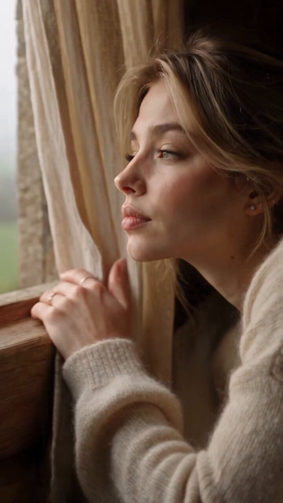</a>

<a href="https://x.com/frametheory058/status/2083751909605949754">▶️ 在 X 上观看视频</a>

</div>

<details>
<summary><b>📋 点击展开 / 复制提示词</b></summary>

```
Create a 30-second ultra-photorealistic cinematic slice-of-life film that is visually indistinguishable from real footage. Every frame should resemble a premium Netflix lifestyle documentary or luxury commercial, captured on a professional full-frame cinema camera using 50mm and 85mm prime lenses in true 8K HDR. Use physically accurate lighting, natural dynamic range, realistic optical lens characteristics, shallow depth of field, subtle film grain, authentic motion blur, lifelike skin with visible pores, realistic eye reflections, accurate fabric simulation, and natural environmental details. Avoid any CGI or AI-generated appearance.

The film follows a 30-year-old European woman living a peaceful countryside life. She has naturally tied brown hair with loose flyaway strands, minimal makeup, expressive eyes, realistic skin texture, and wears comfortable linen clothing in warm neutral tones. Every movement should feel subconscious and naturally observed—never posed or performed. She never looks directly into the camera, and her expressions remain subtle and genuine.

The story begins inside a cozy farmhouse at sunrise as warm morning light fills the bedroom. She wakes naturally, opens the wooden window, and breathes in the fresh countryside air while looking across mist-covered fields. She then prepares fresh bread in a rustic kitchen, kneading dough by hand, placing it into a traditional oven, and cleaning the wooden countertop with calm, deliberate movements.

Next, she walks into her small garden, gently watering herbs, collecting ripe tomatoes, and brushing her fingers across fresh plants while sunlight creates soft natural lens flares. Afterwards, she pours fresh coffee into a handmade ceramic mug and quietly reads a book beside a large window as sunlight illuminates floating dust particles.

The journey continues with a relaxed walk through a charming European village lined with stone cottages, flower-filled windows, bicycles, and narrow streets before she visits a small local market to purchase fresh flowers and seasonal fruit. The film ends during golden hour as she returns home, arranges the flowers in a glass vase, sits peacefully by the window overlooking the countryside, and the camera slowly pulls away before fading naturally to black.

Performance Direction: Every action should feel authentic and unplanned. Include natural blinking, relaxed breathing, realistic eye movement, subtle posture adjustments, correct body weight shifts, accurate finger anatomy, believable hand interaction with objects, natural walking speed, realistic hair movement, and true-to-life fabric physics. Nothing should resemble acting or posing.

Audio Design (Critical): No dialogue, no narration, no subtitles, and absolutely no background music. Tell the story entirely through immersive environmental ASMR. Synchronize every sound naturally with the visuals, including birds singing, gentle wind, wooden floor creaks, curtain movement, dough kneading, ceramic bowls, oven door, running water, leaves rustling, footsteps on grass and stone paths, distant village ambience, market sounds, paper bags, coffee pouring, spoon stirring, page turns, doors opening, evening insects, and quiet countryside room tone.

Creative Goal: Deliver a calm, intimate, emotionally grounded slice-of-life film that feels as though it was captured by a real documentary filmmaker. The final result should be so realistic, natural, and immersive that viewers genuinely question whether it was filmed with a real camera rather than generated by AI.
```

</details>

**👤 出处:** [@frametheory058](https://x.com/frametheory058) · [source](https://x.com/frametheory058/status/2083751909605949754)

▶️ **用 API 跑这条提示词** → [Velokey](https://velokey.ai/model/doubao-seedance-2-5-text-to-video?sourceChannel=github-awesome-seedance)（模型 id：`seedance-2.5`）

---

### No.33 龟兔赛跑·文字生成动画

 

<div align="center">

<a href="https://x.com/sebatheepan/status/2083768136172552259">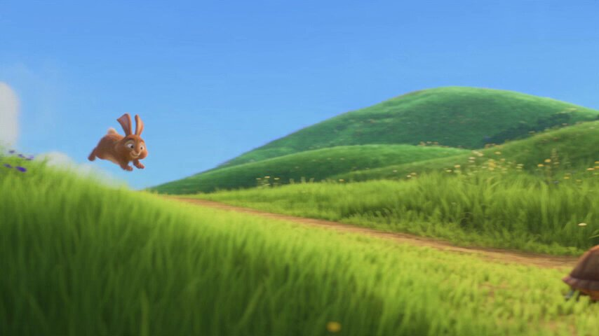</a>

<a href="https://x.com/sebatheepan/status/2083768136172552259">▶️ 在 X 上观看视频</a>

</div>

<details>
<summary><b>📋 点击展开 / 复制提示词</b></summary>

```
seedance 2.5 text to video 30s 

prompt 

Once upon a time there lived a hare. The hare could run very fast. It was proud of its speed, One day, the hare saw a tortoise walking very slowly. The hare laughed at the tortoise and said, “Oh! You are so slow, such a slowcoach!” The tortoise said, “My dear friend, you are so proud. Let’s have a race to see who is faster. So the hare and the tortoise had a race. The hare ran very fast and very far. Then it turned back to see where the tortoise was. The tortoise was far behind the hare. It was walking so slowly!The proud hare thought, “The tortoise will take a very long time to come near me. Let me have a nap.” So it stopped running and went to sleep The tortoise slowly but steadily went past the hare. The hare suddenly woke up and saw the tortoise just crossing the finishing line. It started running very fast. But it was too late. The tortoise had already won the race. a fun 3d pixar style family animation
```

</details>

**👤 出处:** [@sebatheepan](https://x.com/sebatheepan) · [source](https://x.com/sebatheepan/status/2083768136172552259)

▶️ **用 API 跑这条提示词** → [Velokey](https://velokey.ai/model/doubao-seedance-2-5-text-to-video?sourceChannel=github-awesome-seedance)（模型 id：`seedance-2.5`）

---

### No.34 90 年代桌面绘图幻觉

 

<div align="center">

<a href="https://x.com/bmx_ai13/status/2083769258236866658">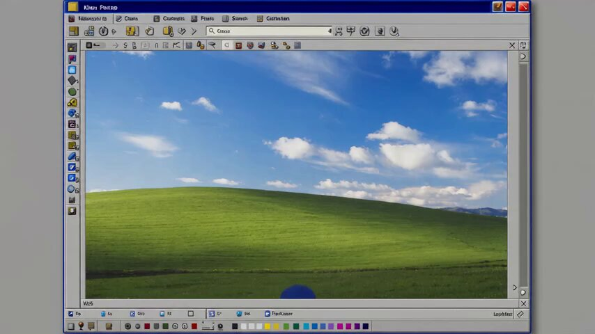</a>

<a href="https://x.com/bmx_ai13/status/2083769258236866658">▶️ 在 X 上观看视频</a>

</div>

<details>
<summary><b>📋 点击展开 / 复制提示词</b></summary>

```
Create a ten second cinematic live action illusion in a sixteen by nine frame at thirty frames per second. Begin inside a faithfully recreated late nineteen nineties desktop paint program. Use a cool gray window frame, navy title bar, simple menus, chunky pixel tool icons on the left, scroll bars, and small color swatches along the bottom. The canvas shows a saturated blue sky with soft white clouds and a vivid green grassy hill, nostalgic but photographed with realistic depth, subtle cloud movement, and light atmospheric haze. 0 to 1.2 seconds. Hold a locked frontal camera on the full paint window. The empty landscape fills the canvas. A slim young adult man rises smoothly from the bottom center with his back to camera. He wears a red athletic shirt with white collar and sleeve stripes, a backward royal blue cap, a thin silver chain, and black ink forearm tattoos. Give his movement real body weight, natural shoulder motion, and slight cloth drag. 1.2 to 2.5 seconds. He lifts his tattooed right arm toward the upper left of the canvas as though touching an invisible drawing tool. Keep the interface perfectly stable and sharp. He turns clockwise toward camera, lowers his hand, and settles into a relaxed waist up pose at center. Use soft frontal daylight, a gentle key from camera left, believable skin texture, clear eyes, fine facial hair, and a faint contact shadow. 2.5 to 6.2 seconds. He looks into camera with a playful calm expression, raises one index finger, and draws in midair. A warm ivory line appears exactly at the fingertip and follows every gesture without delay. It looks like a real textured paint stroke with slight thickness variation, dry brush edges, and a soft glow. He draws one continuous five point star around his body. Make the tall upper point above his cap, the right point beside his shoulder, the lower left point across his torso, the lower right point, then close the shape near his raised hand. Preserve correct hand anatomy, stable identity, perfect line continuity, and natural reactions from his free hand. 6.2 to 7.4 seconds. When the star closes, perform a smooth optical push into the canvas until the interface edges slide beyond the frame. The move should feel like a real camera passing through a monitor, with subtle lens breathing and no cut. He smiles softly and lifts both palms in a small satisfied reveal while the completed ivory star floats around him. 7.4 to 10 seconds. He glances right and walks naturally out of frame. Keep the camera locked on the empty hill and sky. The star remains suspended, slowly loses brightness, and becomes slightly transparent without vanishing. End with one cloud drifting through its center. Maintain one continuous shot, realistic motion blur, natural blinking, stable clothing and tattoos, accurate perspective, clean edges, no warped limbs, no duplicate fingers, no facial changes, no flicker, no random objects, no extra people, and no artificial plastic skin. Make it feel like a practical live action performance composited into an authentic retro computer interface. Audio. Add an original playful retro electronic instrumental at about one hundred and five beats per minute with a warm drum machine groove, soft bass, bright synth plucks, and subtle digital ambience. Sync a light mouse click to the first hand gesture, delicate paint stroke swishes to the fingertip, a sparkling chime when the star closes, and a soft whoosh during the push into the canvas. No vocals and no dialogue.
```

</details>

**👤 出处:** [@bmx_ai13](https://x.com/bmx_ai13) · [source](https://x.com/bmx_ai13/status/2083769258236866658)

▶️ **用 API 跑这条提示词** → [Velokey](https://velokey.ai/model/doubao-seedance-2-5-text-to-video?sourceChannel=github-awesome-seedance)（模型 id：`seedance-2.5`）

---

### No.35 纽约都市 Vlog

 

<div align="center">

<a href="https://x.com/pound75423/status/2083783654439092589"></a>

<a href="https://x.com/pound75423/status/2083783654439092589">▶️ 在 X 上观看视频</a>

</div>

<details>
<summary><b>📋 点击展开 / 复制提示词</b></summary>

```
NYC Urban VLOG: Subject Scene Descriptions (0-30s)
0.0-2.0s: The protagonist stands at a NYC subway entrance with iconic green globe lamps, holding an orange note and looking into the camera.
2.0-4.0s: Close-up of the orange note held near the lens, showing a handwritten NYC address (e.g., Broadway & 72nd St).
4.0-6.0s: Entering the station, tapping a phone for OMNY or swiping a MetroCard at the turnstile.
6.0-8.0s: On the subway platform as a train arrives; wind blows her hair while commuters move in the background.
8.0-10.0s: Inside the subway car, checking the orange note and looking up at the route map above the door.
10.0-12.0s: Exiting the station into a bustling street filled with yellow taxis, skyscrapers, and a busy zebra crossing.
12.0-14.0s: Standing under building scaffolding or a brownstone stoop, checking the note and looking for street signs.
14.0-16.0s: Ordering from a NYC street coffee cart or hot dog stand.
16.0-18.0s: Sipping from a takeaway cup and making a playful face with classic red brick buildings in the background.
18.0-20.0s: Entering a NYC Bodega, with light shifting from bright sunshine to fluorescent interior lighting.
20.0-23.0s: POV from inside a refrigerated shelf, watching her pick out a sandwich or a drink.
23.0-25.0s: Comparing two sandwiches with a hesitant expression before finally choosing one.
25.0-27.5s: Sitting on a NYC stoop or park bench, eating and drinking while watching the flow of taxis and buses.
27.5-30.0s: Turning back to the camera with a smile and a peace sign, with the Manhattan skyline blurred in the background.
```

</details>

> 💡 需人物参考图

**👤 出处:** [@pound75423](https://x.com/pound75423) · [source](https://x.com/pound75423/status/2083783654439092589)

▶️ **用 API 跑这条提示词** → [Velokey](https://velokey.ai/model/doubao-seedance-2-5-text-to-video?sourceChannel=github-awesome-seedance)（模型 id：`seedance-2.5`）

---

### No.36 巴厘岛祭祀·8转场长镜

 

<div align="center">

<a href="https://x.com/FikkkFX/status/2083799040119144747">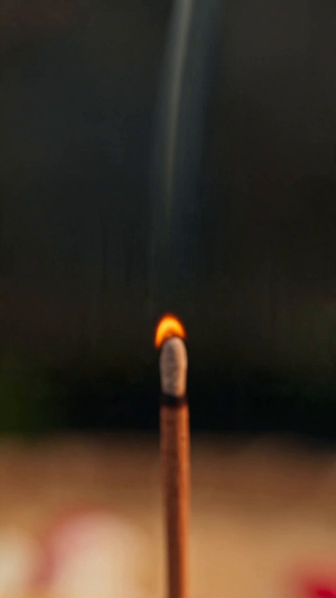</a>

<a href="https://x.com/FikkkFX/status/2083799040119144747">▶️ 在 X 上观看视频</a>

</div>

<details>
<summary><b>📋 点击展开 / 复制提示词</b></summary>

```
Can Seedance 2.5 handle a 30-second continuous single-take with 8 embedded camera transitions and zero cuts?

One prompt. One breath. A Balinese sacred offering ritual at golden hour.

No cuts. No reference. Pure cinematic prose.

Seedance 2.5 on @capcutapp @capcutindonesia 

Let's see 👇
```

</details>

**👤 出处:** [@FikkkFX](https://x.com/FikkkFX) · [source](https://x.com/FikkkFX/status/2083799040119144747)

▶️ **用 API 跑这条提示词** → [Velokey](https://velokey.ai/model/doubao-seedance-2-5-text-to-video?sourceChannel=github-awesome-seedance)（模型 id：`seedance-2.5`）

---

### No.37 东京夜街时尚短片

 

<div align="center">

<a href="https://x.com/bmx_ai13/status/2083814808319562052">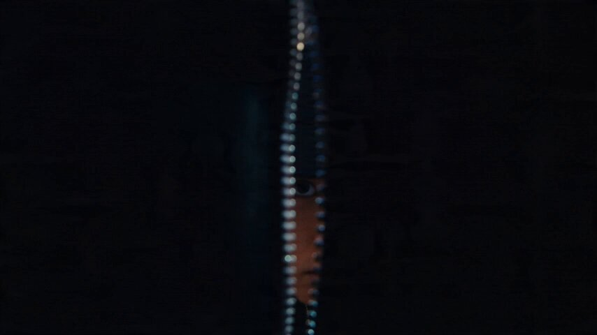</a>

<a href="https://x.com/bmx_ai13/status/2083814808319562052">▶️ 在 X 上观看视频</a>

</div>

<details>
<summary><b>📋 点击展开 / 复制提示词</b></summary>

```
Cinematic 13-second raw handheld streetwear fashion video shot on 8mm vintage fisheye lens, ultra wide 16mm perspective, fast-paced energetic Tokyo urban night sequence, dynamic raw Y2K hip hop aesthetic, 16:9 aspect ratio. 0 to 2 seconds: Extreme close-up opening through a narrow vertical zipper slit in pitch blackness, revealing a young Asian man wearing a black streetwear bucket hat and embroidered jacket crouching down. The camera rapidly pans out through the slit into a super wide fisheye low-angle perspective looking up at two young men standing in a glowing Tokyo street corner at night surrounded by tall neon skyscrapers under dark skies. 2 to 4 seconds: Quick handheld whip-pan to the right down a neon lit sidewalk. A young black man with braided hair wearing a bright royal blue sweater with yellow lettering and a green paisley scarf steps casually through the frame while gesturing at the camera. Fast rotational motion blur transition sweeps across the screen. 4 to 6 seconds: Scene cuts smoothly inside a bright Japanese claw machine arcade filled with pastel pink interior walls and fluorescent overhead lights. The camera tracks backward as the young man in the blue sweater walks forward holding a small pink object to his ear while smiling and talking. An animated stylized liquid frame graphic swirls briefly around the edges of the frame. 6 to 8 seconds: Seamless cut to a retro mint green fast-food diner booth with warm overhead hanging lamp lighting. Low-angle wide view on the white tabletop as the man in the blue sweater reaches his hand directly toward the camera glass offering food. A quick dynamic psychedelic thermal infrared visual effect flashes over the screen for half a second showing vivid heat map colors of red, neon green, and deep blue before snapping back to real life. 8 to 10 seconds: The second man wearing the black jacket suddenly pops up from the diner table with an energetic reaction, holding a drink cup as the camera sweeps low. Fast cut to outdoors on a night street where both men walk along the pavement and high five each other in motion under glowing urban shop signs. 10 to 13 seconds: Camera drops to an extreme ground-level fisheye lens pointing straight up from the asphalt of a narrow alleyway. Both men loom over the lens under vertical glowing Japanese neon signboards. One subject stoops down and reaches his palm directly over the camera lens, causing a rapid spinning rotational motion blur that wipes the screen to black. Visual details: Authentic analog film grain, natural subtle lens distortion, realistic handheld camera shake, rich contrasty neon lighting, crisp reflections on pavement, high energy streetwear styling, realistic 90s hip hop music video camera direction. Audio includes an upbeat boom bap 90s hip hop beat with heavy bass, classic vinyl scratches, energetic vocal chops, synth accents, dynamic street ambiance, arcade sound effects, and clean rhythmic percussion layered throughout.
```

</details>

**👤 出处:** [@bmx_ai13](https://x.com/bmx_ai13) · [source](https://x.com/bmx_ai13/status/2083814808319562052)

▶️ **用 API 跑这条提示词** → [Velokey](https://velokey.ai/model/doubao-seedance-2-5-text-to-video?sourceChannel=github-awesome-seedance)（模型 id：`seedance-2.5`）

---

### No.39 古罗马手机视角伪纪实

 

<div align="center">

<a href="https://x.com/TechieBySA/status/2083864656796422309">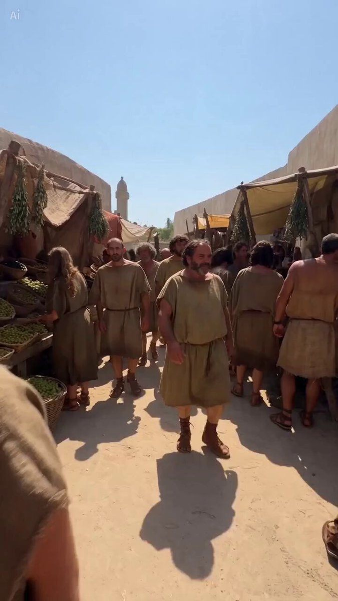</a>

<a href="https://x.com/TechieBySA/status/2083864656796422309">▶️ 在 X 上观看视频</a>

</div>

<details>
<summary><b>📋 点击展开 / 复制提示词</b></summary>

```
“FORMAT: Vertical 9:16 smartphone video. 30 seconds of continuous handheld footage. A real modern person walking through ancient Rome, 80 AD, filming on their phone. NOT a film. NOT cinematic. NOT color graded. Raw casual smartphone footage — looks like genuinely leaked impossible footage someone reposted.

CAMERA BEHAVIOR: Handheld, walking pace the entire time — camera bobs naturally with each step, micro-shaky, never stabilized. The filmer is exploring casually, phone half-raised, glancing the camera toward whatever catches their attention — never lingering more than a few seconds on anything. Autofocus hunts twice. Framing is instinctive and imperfect — tops of buildings get cut off, horizon tilts. One brief pixelated digital zoom. No deliberate composition ever.

VISUAL TEXTURE: Compressed digital smartphone video. Slightly overexposed Mediterranean sky. Natural noise in shadows. Flat, ungraded phone-camera color in harsh midday sun. Bleached stone, dusty ochre, terracotta. Noon light, no mood lighting.

SECONDS 0–5: Opens mid-stride, no intro. Walking through a packed Roman street market — vendors shouting in Latin, stalls of bread, olives, live chickens, amphorae. People brush past close to the lens. The camera sweeps across the chaos while walking, catching fragments — a merchant weighing coins, a woman haggling, a donkey. Keeps moving.

SECONDS 5–10: The filmer turns a corner and passes a slave market — a raised wooden platform, a trader calling out in Latin, a line of men and women standing while buyers inspect them. The camera catches it in passing — a few seconds, slightly too long, the way you’d film something disturbing without stopping — then the filmer keeps walking. Crowd noise continues, nobody around reacts, it’s an ordinary sight to them.

SECONDS 10–15: Shouting erupts ahead — two men are brawling outside a tavern, wrestling into a vegetable stall, produce scattering, the vendor screaming at them. A small crowd instantly forms, laughing and jeering. The camera swings toward it while still walking, gets a shaky half-view through the gathered onlookers’ shoulders, then the filmer pushes past and moves on. The shouting fades behind.

SECONDS 15–21: The street opens up. A column of Roman legionaries marches directly across the filmer’s path — red tunics, segmented armor, shields, hobnailed sandals hammering the stone in unison. The filmer stops walking for a moment to let them pass, camera panning along the line. Loud, rhythmic, intimidating. The last soldier passes and the filmer immediately walks on.

SECONDS 21–27: The filmer rounds a final corner and the Colosseum fills the frame — brand new, one year old, blinding white travertine, massive beyond the phone’s ability to capture it. Enormous crowds stream toward its arches. Colored awnings. Vendors selling food outside. The filmer tilts the phone up while walking toward it, trying to fit the full height — fails, cuts off the top. Tries the digital zoom on the upper arches — pixelates badly — pulls back out.

SECONDS 27–30: Still walking closer, camera on the arches and the crowds funneling in. A muffled roar erupts from inside the arena — tens of thousands of voices at once. The camera instinctively jerks up toward the sound. Cuts off abruptly mid-motion. No resolution.

AUDIO: Constant walking footsteps on stone. Wind buffeting the mic. Overlapping Latin everywhere — vendors, arguments, the slave trader’s calls, the brawl crowd jeering, marching boots in unison, and finally the massive interior roar of the Colosseum crowd. No music. No narration.

PEOPLE: Historically accurate. Plain wool tunics in undyed cream, brown, rust. Real weathered Mediterranean faces. No Hollywood Romans, no togas on commoners. Nobody performs for the camera. Everyone mid-task, mid-transaction, mid-argument. A real living city.”
```

</details>

**👤 出处:** [@TechieBySA](https://x.com/TechieBySA) · [source](https://x.com/TechieBySA/status/2083864656796422309)

▶️ **用 API 跑这条提示词** → [Velokey](https://velokey.ai/model/doubao-seedance-2-5-text-to-video?sourceChannel=github-awesome-seedance)（模型 id：`seedance-2.5`）

---

### No.40 黏土马克杯 3D 动画

 

<div align="center">

<a href="https://x.com/Dheepanratnam/status/2083869167791305173">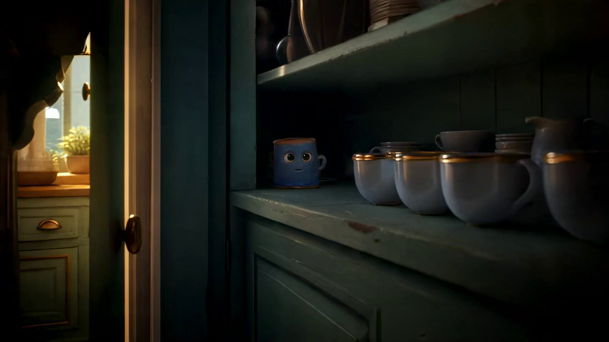</a>

<a href="https://x.com/Dheepanratnam/status/2083869167791305173">▶️ 在 X 上观看视频</a>

</div>

<details>
<summary><b>📋 点击展开 / 复制提示词</b></summary>

```
Seedance 2.5 Animation prompt 

[SCENE] A 30-second stylised 3D animated short. A handmade clay mug at the back of a kitchen cupboard waits to be chosen, while the perfect porcelain cups at the front are used every day. Warm, funny, quietly moving. 2.35:1.

[REFERENCES] All three: reproduce 100%, appearance only, do not inherit the reference background, lighting or camera.

<<<image_1@986ea8f7-24f6-4221-a537-b7b9b9885e83>>> PIP: a small lopsided handmade clay mug, wobbly uneven walls, rim not level, small crooked handle, patchy cornflower-blue glaze thick at the base and thin at the rim showing terracotta beneath, a thumbprint in one side. Alive — two large expressive eyes with glassy highlights, small simple mouth. No arms, no legs.

<<<image_2@865a51f2-ef24-4faa-bf27-3a6c094df42c>>> CLIVE: a flawless white porcelain teacup with a fine gold band at rim and foot, perfectly symmetrical, thin-walled. Alive — two large expressive eyes, small refined mouth, serene and faintly superior. No arms, no legs.

<<<image_3>>> the set@1b654fff-0b6e-4531-8cc4-61af3d39f6aa — cupboard interior, light and atmosphere ONLY: sage-green shelves with chipped paint, a front row of gold-rimmed cups, a dusty gap at the back, door ajar with a warm shaft of morning sun and dust motes.

[TECHNICAL] High-end stylised 3D animated feature quality. Soft global illumination, physically based rendering, subsurface scattering in glaze and porcelain, warm colour science, shallow depth of field, volumetric light shaft. Beautiful CG animation — NOT photoreal, NOT live action, NOT stop-motion, NOT illustration, NOT anime.

ANIMATION LAW: performance is eyes, mouth and tilt only. Neither has arms or legs. They rock, lean and settle on the shelf — never walk, hop or fly.

[STRUCTURE] 13 segments, 12 hard cuts. S1/S13 = 84° wide inside the cupboard · characters = 47° at 30-60cm · reactions = 35° close · one 18° macro on the hand. No zooming.

[TIMELINE]

0:00-0:03 — 84° wide. Inside the dark cupboard. The front row of gold-rimmed cups gleams. Far at the back, in shadow, <<<image_1>>> sits alone.

0:03-0:05 — 35° close on <<<image_1>>>, eyes bright, leaning forward hopefully.

PIP: "Today's the day."

0:05-0:07 — 47°. <<<image_2>>> at the front of the shelf, not turning round.

CLIVE: "You said that yesterday."

0:07-0:09 — The cupboard door swings open. A shaft of morning light. Both squint. A hand reaches in and takes <<<image_2>>> from the front row.

0:09-0:11 — 35° close on <<<image_1>>>, light fading from his face as the door closes. His shoulders drop.

PIP: "Tomorrow, then."

0:11-0:16 — MONTAGE, fast cuts on the same 84° angle: the door opens and closes six times, light shifting from morning gold to grey to evening amber to blue. Each time a hand takes a cup from the front. Each time <<<image_1>>> leans forward hopefully and settles back.

0:16-0:18 — 35° close on <<<image_1>>> in the dark, eyes lowered, no longer leaning.

0:18-0:20 — 47°. The door opens again. Grey rainy light this time, slower.

0:20-0:22 — 18° macro. The hand comes in — and stops. It hovers over the front row. It doesn't take one.

0:22-0:25 — 47°. The hand moves past the front row, reaching into the shadow at the back, and closes gently around <<<image_1>>>.

0:25-0:27 — 35° close on <<<image_2>>>, eyes wide, entirely surprised.

CLIVE: "...Huh."

0:27-0:29 — 47°. <<<image_1>>> lifted out into the grey light, eyes enormous, overwhelmed.

PIP: "Told you."

0:29-0:30 — 84° wide from inside the cupboard, out through the open door: <<<image_1>>> on the counter in soft light, steam rising. Hold.

[PHYSICS] Ceramic weight — both rock and settle with real mass, wobbling on their bases, never bouncing lightly. The clay is duller and heavier than the porcelain, which rings faintly. The door swings with real hinge weight. Steam rises and curls. Dust drifts slowly in the shaft.

[LIGHTING] One warm shaft through the door as the only source, shifting colour through the montage. 60:30:10 — deep cupboard shadow 60% / the shaft 30% / accent gold rims and PIP's blue glaze 10%. The back is genuinely dark; PIP is barely lit until 0:22.

[AUDIO] MUSIC: warm score, solo piano with light strings — a simple hopeful theme entering at 0:03, thinning through the montage, dropping to almost nothing at 0:16, blooming warmly at 0:22 and holding. No comedy stings, no plucked cuteness.

SFX: door hinge and latch, ceramic settling on wood, the fine ring of porcelain, a distant kettle, rain on a window at 0:18, hot liquid pouring at 0:29.

DIALOGUE: five short lines only, warm and understated, never shouted, never cartoonish.

[LOCKS] Exactly two characters, both crockery — nothing else comes alive, no faces on any other object. No human is shown beyond a single hand and forearm — no face, no body. Neither character has arms, legs, or moves on its own. PIP is never repaired, never becomes perfect, never cruelly mocked. Nothing breaks, nothing is dropped. No text, labels, logos or watermarks. Never photoreal, never live action, never stop-motion.
```

</details>

**👤 出处:** [@Dheepanratnam](https://x.com/Dheepanratnam) · [source](https://x.com/Dheepanratnam/status/2083869167791305173)

▶️ **用 API 跑这条提示词** → [Velokey](https://velokey.ai/model/doubao-seedance-2-5-text-to-video?sourceChannel=github-awesome-seedance)（模型 id：`seedance-2.5`）

---

### No.42 中世纪剧集·耻辱游街

 

<div align="center">

<a href="https://x.com/techhalla/status/2083908360118616268">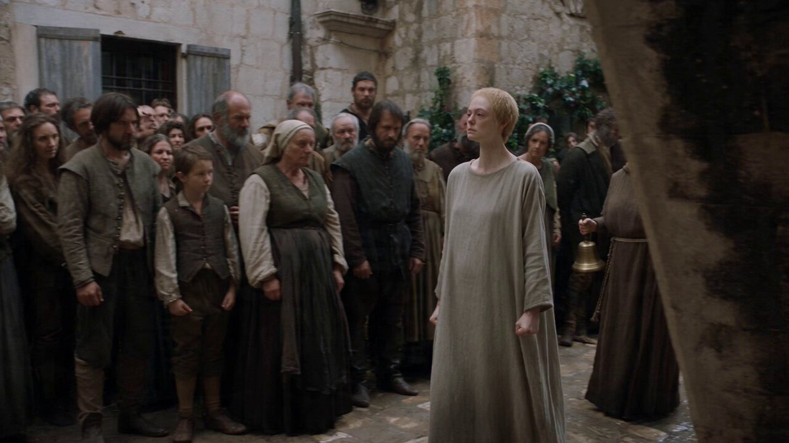</a>

<a href="https://x.com/techhalla/status/2083908360118616268">▶️ 在 X 上观看视频</a>

</div>

<details>
<summary><b>📋 点击展开 / 复制提示词</b></summary>

```
Seedance 2.5 shame walk prompt is below 👇

[STYLE + CAMERA + ATMOSPHERE]
Gritty high-end medieval television production look. Shot on ARRI Alexa XT with Cooke anamorphic lenses, mix of Steadicam tracking and handheld inside the crowd. Natural overcast daylight, desaturated dirty palette, visible film grain, realistic crowd physics and fabric movement. No modern polish.

[CHARACTERS]
Central figure: proud middle-aged noblewoman with roughly cropped short blonde hair, wearing a plain rough grey woolen penitential robe that fully covers her, barefoot, pale skin, rigid upright posture that slowly cracks under public condemnation. Stern middle-aged woman in plain brown religious robes walking just behind her, continuously ringing a large heavy iron handbell and chanting in a loud flat voice. Dense crowd of dirty medieval city dwellers of every age and class in period clothing packed on both sides and leaning from windows.

[LOCATION]
Narrow winding cobblestone streets of a medieval coastal city, high stone walls, arched doorways, wooden shutters, mud on the ground.

[TIMELINE]
0-6s: [Steadicam tracking medium-wide from the side] The woman in the plain robe walks steadily forward with forced dignity. The robed woman stays half a step behind ringing the bell and chanting “Shame. Shame. Shame.” Crowd begins to notice, first heads turn, early shouts of “Shame!” rise.

6-12s: [Handheld inside the pack, pushing closer] Crowd presses tighter along the path. Faces show pure contempt. Children point and call out. The woman keeps her chin high but her eyes start to glaze. Bell never stops. Chant continues: “Shame. Shame. Shame.”

12-18s: [Low tracking shot moving with her feet then tilting up to face] Bare feet slap wet cobblestones. A woman leans from a window and shouts “Shame!” The central woman’s jaw tightens, first tears form but she does not break stride. Crowd noise becomes a continuous wall of overlapping “Shame!” mixed with the bell.

18-24s: [Medium close-up handheld, slight shake] Camera stays locked on her face as the controlled mask cracks. Tears finally fall. She stares straight ahead, breathing harder. Behind her the religious woman rings harder and keeps the flat chant. The plain robe shifts with every step under the weight of the stares.

24-30s: [Pull-back Steadicam wide tracking] The full street is visible: wall of bodies on both sides, continuous shouting of “Shame! Shame! Shame!” mixed with the bell. The woman continues walking, posture still upright but now visibly broken, tears streaming, until the frame holds on her isolated figure moving through the condemnation.

[STYLE & QUALITY BOOSTERS]
Exact period production texture of a major series, coherent physics of every body and fabric movement, stable character continuity, natural motion blur, no modern digital cleanliness, no artificial enhancement.

we are cooked 😮
```

</details>

**👤 出处:** [@techhalla](https://x.com/techhalla) · [source](https://x.com/techhalla/status/2083908360118616268)

▶️ **用 API 跑这条提示词** → [Velokey](https://velokey.ai/model/doubao-seedance-2-5-text-to-video?sourceChannel=github-awesome-seedance)（模型 id：`seedance-2.5`）

---

### No.43 武装直升机空袭动画

 

<div align="center">

<a href="https://x.com/Artedeingenio/status/2083910371086139759">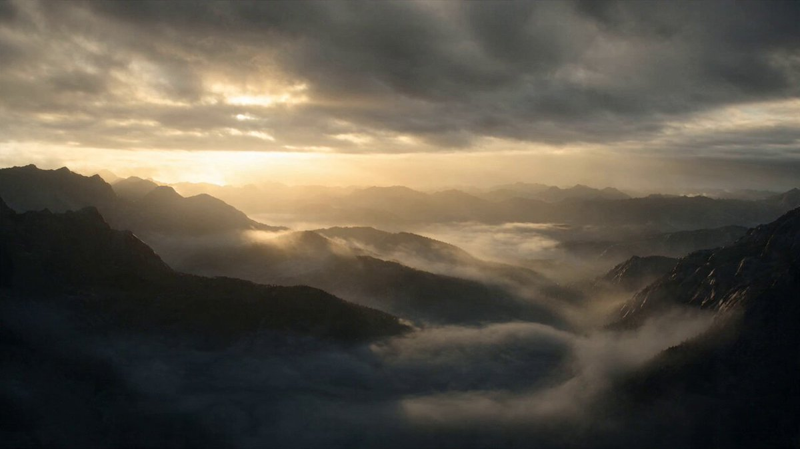</a>

<a href="https://x.com/Artedeingenio/status/2083910371086139759">▶️ 在 X 上观看视频</a>

</div>

<details>
<summary><b>📋 点击展开 / 复制提示词</b></summary>

```
30-second cinematic combat helicopter assault, breathtaking high-budget military action film, ultra-dynamic editing, relentless aerial combat choreography, premium feature film quality, seamless kinetic camera movement, aggressive speed ramps, rapid match cuts, whip pans, rotating camera moves, dramatic perspective shifts, cinematic lens distortion, volumetric smoke, rotor wash, dust clouds, sparks, flying debris, golden sunset lighting, emotionally intense, no dialogue.

0–5s
Golden sunlight breaks through heavy storm clouds.
A formation of attack helicopters flies low across an endless mountain valley.
Rotor blades slice through the morning mist.
Extreme close-ups.
Pilot visor.
Hands gripping the cyclic.
Warning lights.
Missile pods.
The cockpit vibrates with engine power.
The camera rapidly alternates between enormous aerial vistas, intimate cockpit shots and dramatic fly-bys only meters from the helicopters.
Complete silence.

5–10s
The formation descends into the valley.
Rotor wash sends dust, leaves and debris spiraling into the air.
The helicopters weave between cliffs at incredible speed.
The camera races alongside them before instantly switching to nose-mounted perspectives, overhead tracking shots, impossible low angles beneath the rotor blades and first-person cockpit views.
Everything accelerates.

10–15s
An overwhelming aerial action montage.
The helicopters skim over rivers.
Bank sharply between rocky canyons.
Rise above dense forests.
Bright tracer streams illuminate the valley.
The camera never stops moving: continuous orbit shots, rapid whip pans, crash zooms, rotating 360-degree movements and seamless transitions through smoke, dust and sunlight.
Constant speed ramps amplify every maneuver.

15–20s
The lead helicopter dives toward an abandoned industrial complex.
Missile trails streak across the landscape.
Rotor blades narrowly clear rooftops and power lines.
The camera follows in one uninterrupted shot beneath the helicopter before climbing above the formation into an enormous panoramic flyover.
Every cut increases the spectacle.

20–25s
The formation splits into multiple attack runs.
Helicopters cross paths only meters apart.
Smoke rolls through the valley.
Mountains echo with rotor thunder.
The camera jumps between ultra-wide aerial compositions, spinning chase shots, cockpit close-ups, dramatic slow motion, impossible FPV movements and breathtaking crane-like flyovers.
The pace becomes almost overwhelming.

25–30s
Everything suddenly slows.
The helicopters climb through the clouds into brilliant golden sunlight.
The valley disappears beneath drifting mist.
The camera rapidly pulls thousands of feet upward into an immense aerial shot as the formation flies toward the horizon in perfect formation.
Hard cut to black.

Sound design: colossal hybrid orchestral score, thunderous helicopter rotors, turbine engines, rushing wind, distant explosions, metallic vibrations, cinematic fly-by whooshes, deep brass, taiko drums, powerful bass impacts, subtle radio chatter, overwhelming orchestral crescendo during the final climb.
```

</details>

**👤 出处:** [@Artedeingenio](https://x.com/Artedeingenio) · [source](https://x.com/Artedeingenio/status/2083910371086139759)

▶️ **用 API 跑这条提示词** → [Velokey](https://velokey.ai/model/doubao-seedance-2-5-text-to-video?sourceChannel=github-awesome-seedance)（模型 id：`seedance-2.5`）

---

### No.44 曼哈顿时间静止碎裂

 

<div align="center">

<a href="https://x.com/azed_ai/status/2083946963075203549">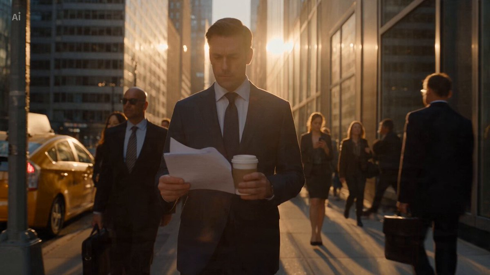</a>

<a href="https://x.com/azed_ai/status/2083946963075203549">▶️ 在 X 上观看视频</a>

</div>

<details>
<summary><b>📋 点击展开 / 复制提示词</b></summary>

```
CapCut now has Seedance 2.5, and I had to test it

Created a 30-second film where time stops during a Manhattan collision, the city shatters into fragments, and our guy falls through a portal into a jungle with a very angry T-Rex

The coffee survives everything

Prompt below 👇
```

</details>

**👤 出处:** [@azed_ai](https://x.com/azed_ai) · [source](https://x.com/azed_ai/status/2083946963075203549)

▶️ **用 API 跑这条提示词** → [Velokey](https://velokey.ai/model/doubao-seedance-2-5-text-to-video?sourceChannel=github-awesome-seedance)（模型 id：`seedance-2.5`）

---

### No.46 日式迷幻动画 MV

 

<div align="center">

<a href="https://x.com/Ciri_ai/status/2083956213113639013">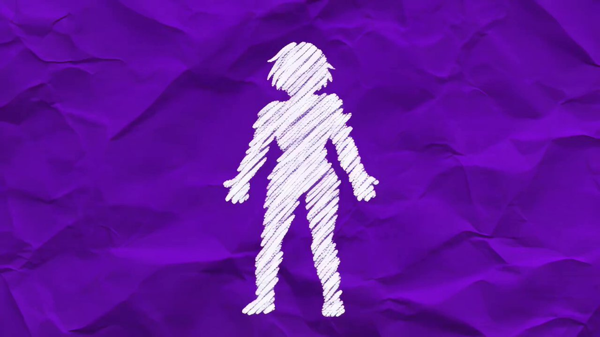</a>

<a href="https://x.com/Ciri_ai/status/2083956213113639013">▶️ 在 X 上观看视频</a>

</div>

<details>
<summary><b>📋 点击展开 / 复制提示词</b></summary>

```
Core Style: Fast, vivid, unstable. Fully hand-drawn with rich organic textures. Every transition is fluid and natural—never rigid or mechanically cut. The entire frame, including the background, remains in constant motion, driven simultaneously by emotion, gravity, and heat. Every frame should feel alive, unpredictable, and physically reactive.

[0–7.5s: Origin and Chain Reaction]

[0–1.5s]

A central abstract figure erupts into violent motion. Its emotional color core radiates outward as irregular pulsating waves while its silhouette tears apart in multiple directions. The background bends around the figure like compressed soft paper. Fine hand-drawn textures crawl rapidly across the entire frame, moving significantly faster than the figure itself, creating intense tension between body, skin, and surface.

[1.5–3s]

The separated contours accelerate into nervous linear forms. The figure's colorful core stretches into sharp ribbons and liquid stains. Some ribbons snap backward while others whip violently forward, leaving trembling trails behind. Empty spaces between movements ignite into new forms that emerge to fill emotional voids.

[3–4.5s]

Every shape surges diagonally across the composition. One massive form folds like fabric, revealing layered textures of grain, chalk, wet ink, scratched paint, and rough pigment beneath its surface. The background folds together with it, twisting into entirely new color fields. Smaller forms are dragged into constantly evolving speed lines.

[4.5–6s]

The image fractures into four emotional forces: calm, violence, vulnerability, and ecstasy. Each absorbs color from the others. Shadows appear before their objects, behaving like prophecies. The original forms chase these shadows, but the shadows mutate faster—becoming brighter, thicker, and more dominant until they surpass the objects themselves.

[6–7.5s]

A rapid chain reaction begins. Colliding forms generate visual motifs derived from the reference imagery: fragments, symbols, silhouettes, stains, and expressive linework. These newly born motifs accelerate in different directions. Frozen traces solidify into new entities before melting again and splitting into tiny emotional echoes.

---

[7.5–15s: Compression and Extreme Transformation]

[7.5–9s]

The entire frame collapses toward an invisible point beneath the center. Every visual layer compresses inward at a different speed. Maximum compression lasts for only one frame before exploding upward and outward with vertical smears, shaking outlines, and exaggerated overshoot motion. Every element vibrates before settling into a completely new position.

[9–10.5s]

Textures migrate between forms. Dry rough textures sharpen previously fluid shapes into angular structures. Liquid textures soften rigid forms until they sag and drip. Luminous colorful textures dissolve into the background, causing the environment itself to pulse rhythmically. Every object changes behavior according to the texture it inherits.

[10.5–12s]

A massive rotational force sweeps across the frame. Every form flips, inverts, or turns inside out, exposing hidden reverse sides possessing qualities of hands, hooks, flames, or waves. Every collision triggers escalating chain reactions, transforming the entire visual world into an entirely new emotional reality.

[12–13.5s]

All boundaries dissolve. Forms merge, repel, and merge again, generating hybrid entities that inherit the colors and movement of their predecessors while becoming completely different beings. The background pushes forward into the foreground, becoming part of the forms themselves while releasing new shapes from within.

[13.5–15s]

Every previous process returns simultaneously at maximum intensity: contour separation, color bleeding, texture migration, and shadow-leading motion. Every frame is densely packed with intentional visual impact, fully absorbing and reinterpreting every reference element introduced earlier.

---

[15–22.5s: Fragmentation and Neurotic Storm]

[15–16.5s]

The storm collides with an invisible barrier. The center explodes into countless shards of water-covered broken glass. Within each fragment, glowing spiral irises rotate violently, generating centrifugal force that stretches and tears at the shard edges. Neon magenta and electric blue leak through every crack.

[16.5–18s]

The fragments fuse into overlapping collaged human faces. The faces are composed of purple stains, scratched paint, and rough pigment. Their expressions oscillate continuously between terror and ecstasy. Jagged lightning-like lines pierce through them like exposed nerve fibers, violently stitching the faces together.

[18–19.5s]

Color saturation reaches its peak. Electric blue lines solidify into physical cables stretching throughout space, twitching uncontrollably while releasing neon magenta sparks. The compressed paper background burns away, transforming into a charred, granular carbon-black surface.

[19.5–21s]

Gravity reverses. Liquid elements such as water droplets and wet ink surge upward while broken glass continues falling downward, producing intense visual tearing. Vertical smears appear along the edges of the frame as though an unseen force is physically wiping the entire animation off the canvas.

[21–22.5s]

Every form is pulled into countless miniature spiral-iris black holes. The irises rapidly expand until they dominate the entire screen, spinning at an increasingly suffocating speed. The rough tactile quality of chalk and dry brush textures contrasts violently against the brilliant electrical center, creating overwhelming sensory overload.

---

[22.5–30s: Aftershock and Eternal Echo]

[22.5–24s]

The giant iris evolves into pulsating biological tissue. The image breathes with a neurotic rhythm. Hidden symbols and textures appear and disappear beneath muscular contractions. Paint seepage creates convincing depth, as though layered across multiple transparent sheets of film.

[24–25.5s]

The animation enters an intense high-frequency vibration. Every object freezes in place while its edges oscillate violently like strings stretched to their breaking point. Violet shadows crawl across every surface, attempting to consume the remaining light.

[25.5–27s]

Rainbow-colored glass fragments and water droplets sweep across the frame like rain, refracting and distorting everything behind them through lens-like optical effects. Colors become heavy fluid masses that sink downward, leaving behind anxious, restless linear marks.

[27–28.5s]

The entire composition collapses into a single glowing horizontal jagged line. The background becomes a dark neon field filled with coarse grain. The line contains all accumulated energy, twisting violently while alternating flashes of electric blue and neon magenta pulse across it.

[28.5–30s]

The glowing line disintegrates into hand-drawn dust particles that drift rhythmically across the screen before gradually reassembling into one enormous blurred luminous silhouette. The final frame ends with tiny blocks of color continuing to vibrate subtly, leaving behind an everlasting emotional aftershock.
```

</details>

**👤 出处:** [@Ciri_ai](https://x.com/Ciri_ai) · [source](https://x.com/Ciri_ai/status/2083956213113639013)

▶️ **用 API 跑这条提示词** → [Velokey](https://velokey.ai/model/doubao-seedance-2-5-text-to-video?sourceChannel=github-awesome-seedance)（模型 id：`seedance-2.5`）

---

### No.47 电影级魔法变身序列

 

<div align="center">

<a href="https://x.com/LudovicCreator/status/2083976193460601253">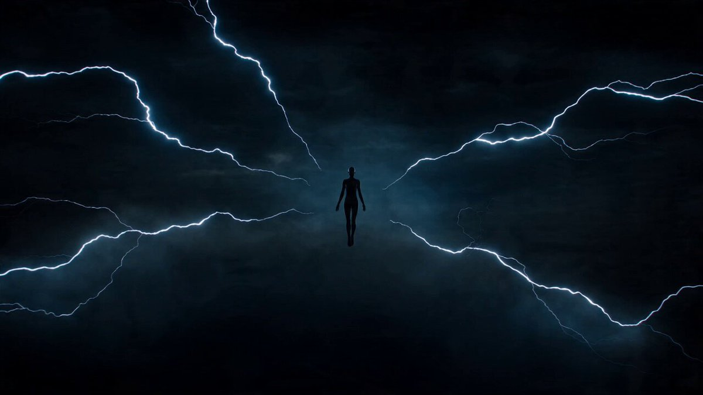</a>

<a href="https://x.com/LudovicCreator/status/2083976193460601253">▶️ 在 X 上观看视频</a>

</div>

<details>
<summary><b>📋 点击展开 / 复制提示词</b></summary>

```
30-second cinematic magical transformation sequence, multiple logically connected shots, consistent character identity and seamless visual progression.

0–3s: Extreme wide shot in a storm-black infinite void. An electric witch floats upright, initially wearing a simple dark silhouette. Frozen white-blue lightning bolts surround her like cracks suspended in space. Slow dolly-in as electrical pressure vibrates through the darkness.

3–7s: The first lightning strike crosses behind her. Snap-zoom into a close-up as her dark hair flashes into saturated violet with brilliant cyan ends. Individual strands rise and ripple in the electrical field; intense white-blue rim light outlines her face.

7–11s: A second strike fractures the air across her torso. Whip-pan downward as sharp layered robes assemble from glowing electric fissures, angular fabric panels locking around her body with realistic weight and dramatic cloth movement.

11–15s: Macro close-ups of both hands and collarbone. Crescent-shaped markings ignite and race across her skin in precise cyan-white trails, pulsing brighter with every sharp thunder transient.

15–20s: Wide low-angle hero shot. She raises one empty hand. A descending thunderbolt compresses into her palm, twists, and hardens into a crooked lightning wand. Orbit camera around her as branching electricity coils around the newly formed wand.

20–24s: Camera snap-zooms beneath her feet. A circular storm-rune sigil burns open below her, concentric symbols rotating in opposite directions while white-blue arcs connect the rune, her robes, markings, hair, and wand.

24–28s: Rapid rhythmic montage: extreme close-up of glowing eyes, cyan hair tips, crescent markings, layered robe edges, gripping fingers, and the wand tip gathering a dense sphere of electricity. Alternate macro details with wide heroic angles; each lightning impact motivates the cut.

28–30s: Low-angle crane-back as she swings the wand forward and locks into a signature spell-casting pose. A vast electric starburst erupts behind her, frozen lightning radiating symmetrically around her silhouette. Hold the final iconic frame. Stock-footage grandeur played completely sincere, premium fantasy-commercial finish, deep blacks, brilliant cyan-white highlights, realistic electrical illumination, monumental scale.
2/2
```

</details>

**👤 出处:** [@LudovicCreator](https://x.com/LudovicCreator) · [source](https://x.com/LudovicCreator/status/2083976193460601253)

▶️ **用 API 跑这条提示词** → [Velokey](https://velokey.ai/model/doubao-seedance-2-5-text-to-video?sourceChannel=github-awesome-seedance)（模型 id：`seedance-2.5`）

---

### No.48 冻结时间+倒放特效

 

<div align="center">

<a href="https://x.com/Ankit_patel211/status/2083982398463856951">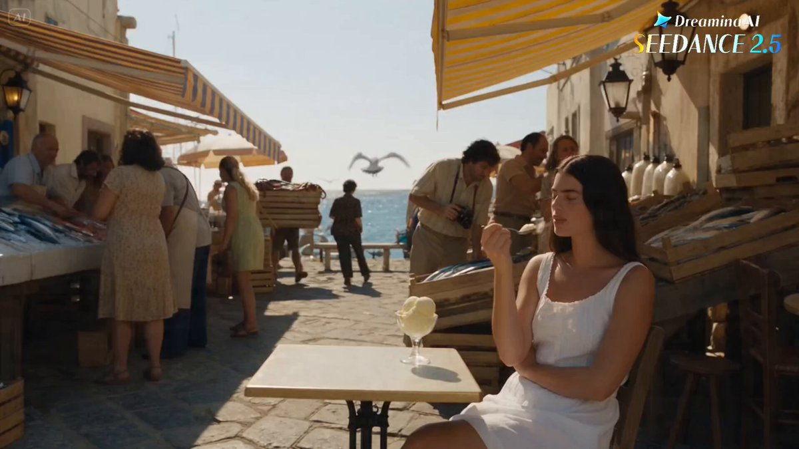</a>

<a href="https://x.com/Ankit_patel211/status/2083982398463856951">▶️ 在 X 上观看视频</a>

</div>

<details>
<summary><b>📋 点击展开 / 复制提示词</b></summary>

```
Seedance 2.5 frozen time + rewind effect 

Made with Dreamina Seedance 2.5 via its official platform: Dreamina AI

@dreamina_ai SEEDANCE 2.5

Prompt shared below 👇🏻
```

</details>

**👤 出处:** [@Ankit_patel211](https://x.com/Ankit_patel211) · [source](https://x.com/Ankit_patel211/status/2083982398463856951)

▶️ **用 API 跑这条提示词** → [Velokey](https://velokey.ai/model/doubao-seedance-2-5-text-to-video?sourceChannel=github-awesome-seedance)（模型 id：`seedance-2.5`）

---

### No.49 男友视角旅行 Vlog

 

<div align="center">

<a href="https://x.com/BubbleBrain/status/2083659648108990925">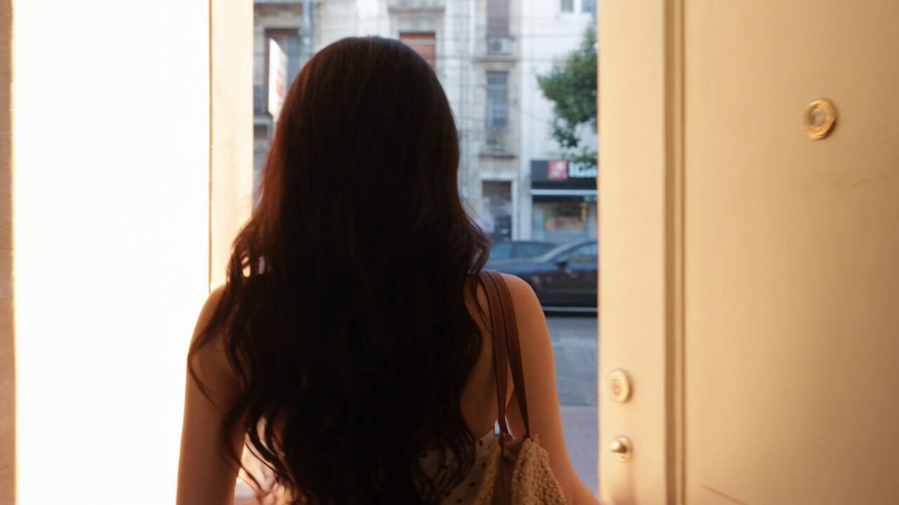</a>

<a href="https://x.com/BubbleBrain/status/2083659648108990925">▶️ 在 X 上观看视频</a>

</div>

<details>
<summary><b>📋 点击展开 / 复制提示词</b></summary>

```
Seedance 2.5 vlog case.

This is so real.  

---prompt--- 
A realistic handheld travel vlog filmed by a friend following the main character throughout the day. Use the woman from the reference image as the main subject. Maintain her exact facial identity, hairstyle, facial features, and body proportions throughout the entire video. The camera feels like a real personal vlog camera, not a commercial production. Natural handheld movement, casual framing, imperfect human camera motion, authentic everyday atmosphere. No scripted acting. The woman behaves naturally, interacting with the environment like a real travel vlog. 0-5s: Morning departure. The woman leaves a cozy apartment with a small backpack. She checks her phone, smiles at the camera, adjusts her hair, and starts walking outside. The camera follows her from behind, slightly shaky like a friend filming. Morning sunlight, quiet neighborhood streets, people starting their day. 5-12s: Exploring the city. The camera follows her walking through local streets. She visits a small cafe, buys a drink, briefly talks to the camera, laughs naturally. She walks through a street market, looks at small shops, takes casual photos. The camera stays close, capturing spontaneous moments. 12-20s: Arriving at the beach. She takes public transportation or walks toward the coast. The environment gradually changes from city streets to a seaside town. Ocean breeze moves her hair. She looks excited when she sees the ocean. The camera follows her walking along the beach. She picks up a seashell, watches waves, and interacts naturally with people nearby. 20-27s: Summer beach afternoon. She meets friends at the beach. Everyone chats, laughs, plays near the water. The camera moves naturally between people, capturing real candid moments. She looks back at the camera and smiles. 27-30s: Ending moment. Golden hour sunset. She sits near the ocean, holding a drink, watching the sunset. The camera slowly moves backward, revealing the beach, waves, and the peaceful evening. A feeling of a real personal travel memory. Visual style: Authentic travel vlog footage. Realistic smartphone or mirrorless camera look. Natural daylight. Casual handheld movement. Slight camera shake. Real human reactions. Documentary realism. No cinematic commercial look. No dramatic posing. No artificial transitions. No text overlays. No logos. No face changes. No identity changes.
```

</details>

> 💡 需人物参考图

**👤 出处:** [@BubbleBrain](https://x.com/BubbleBrain) · [source](https://x.com/BubbleBrain/status/2083659648108990925)

▶️ **用 API 跑这条提示词** → [Velokey](https://velokey.ai/model/doubao-seedance-2-5-text-to-video?sourceChannel=github-awesome-seedance)（模型 id：`seedance-2.5`）

---

### No.50 3D 皮克斯家庭动画

 

<div align="center">

<a href="https://x.com/sebatheepan/status/2084023216440246455">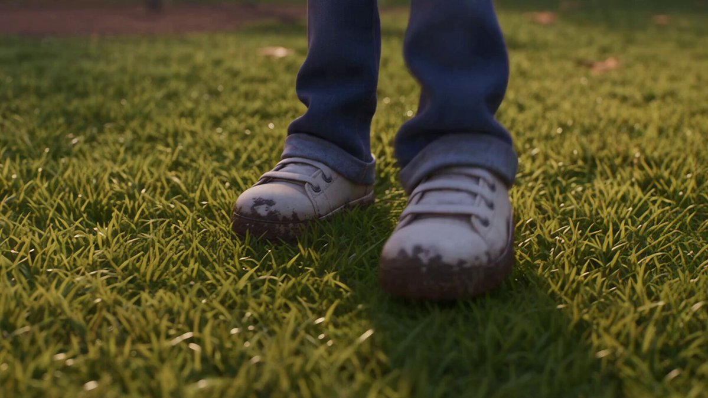</a>

<a href="https://x.com/sebatheepan/status/2084023216440246455">▶️ 在 X 上观看视频</a>

</div>

<details>
<summary><b>📋 点击展开 / 复制提示词</b></summary>

```
Seedance 2.5 text to video 3D animation

Prompt⤵️

{ "title": "The Shadow Quit", "style": "3D Pixar family animation. Warm suburban dusk, golden-hour lighting, stylized characters, handheld feel.", "shots": [ {"time":"00:00-00:03","type":"EXT. CLOSE-UP","action":"Mina's sneakers hit grass. She stops. Her shadow stays seated cross-legged.","camera":"Low angle, slight handheld wobble.","dialogue":"Mina: 'Come on, we have mac and cheese tonight!'"}, {"time":"00:03-00:05","type":"WIDE","action":"Mina stands confused. Her shadow points at the swing set, arms folded.","camera":"Static wide. Swing set silhouetted.","dialogue":"Shadow: (shakes head silently)"}, {"time":"00:05-00:08","type":"MEDIUM","action":"Mina crouches, pleading. Shadow draws hopscotch in dirt with dreamy lag.","camera":"Push-in on Mina's face.","dialogue":"Mina: 'You can swing tomorrow. I promise.'"}, {"time":"00:08-00:12","type":"OVERHEAD","action":"Shadow hops hopscotch alone. Mina watches, smiling. Leaves fall slow-motion.","camera":"Crane shot descending.","dialogue":"Mina: (soft giggle)"}, {"time":"00:12-00:16","type":"CLOSE-UP","action":"Shadow stops, reaches up for high-five.","camera":"Two-shot becoming extreme close-up. Sunset flares.","dialogue":"(none)"}, {"time":"00:16-00:19","type":"SLOW-MO CLOSE-UP","action":"Hands meet. Shadow reattaches with soft snap and ripple of light.","camera":"Macro lens. Dust particles explode.","dialogue":"(soft snap sound)"}, {"time":"00:19-00:24","type":"TRACKING","action":"Mina runs to house. Shadow runs beside her on grass, up wall, synced.","camera":"Side-tracking.","dialogue":"(none)"}, {"time":"00:24-00:30","type":"INT. WIDE","action":"Mina slides into chair. Shadow on wall steals macaroni with impossibly long arm.","camera":"Wide through doorway.","dialogue":"Mina: 'Hey!' (laughs)"} ] }
```

</details>

**👤 出处:** [@sebatheepan](https://x.com/sebatheepan) · [source](https://x.com/sebatheepan/status/2084023216440246455)

▶️ **用 API 跑这条提示词** → [Velokey](https://velokey.ai/model/doubao-seedance-2-5-text-to-video?sourceChannel=github-awesome-seedance)（模型 id：`seedance-2.5`）

---

### No.51 深夜东京拉面店电影感

 

<div align="center">

<a href="https://x.com/oggii_0/status/2084118983507312869">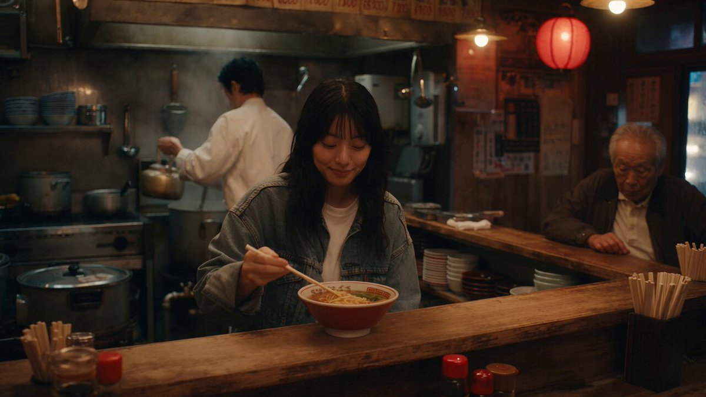</a>

<a href="https://x.com/oggii_0/status/2084118983507312869">▶️ 在 X 上观看视频</a>

</div>

<details>
<summary><b>📋 点击展开 / 复制提示词</b></summary>

```
Style: Photorealistic cinematic realism. A cramped, atmospheric late-night Tokyo ramen shop — steam curling off broth pots, red paper lanterns, worn wooden counter, dangling bulb lighting, condensation on the windows, rain-slicked street glowing outside, subtle handheld camera movement, rich analog film grain.
0–4s: Medium-wide shot. A young woman in an oversized denim jacket sits alone at the counter, composed with the faintest hint of amusement, slowly slurping noodles with chopsticks. Behind her, a young cook crosses the narrow kitchen carrying two steaming bowls of ramen in one hand and a full kettle of hot broth in the other. Near the entrance, an elderly regular begins to rise from his stool to leave.
4–8s: Dynamic tracking shot. The elderly man stumbles backward and collides heavily with the cook. The bowls, noodles, broth, and kettle explode upward into the air. Broth stretches into long steaming ribbons with suspended droplets, noodles frozen mid-arc, steam curling in slow motion. The camera immediately performs a smooth orbital move around the collision as time freezes at the exact peak of the spill. Every face is locked in an expression of shock. Only the young woman at the counter continues moving naturally, calmly lifting another bite to her mouth.
8–17s: Slow 360-degree orbit. The camera gracefully circles the frozen shop. Broth hangs in midair like molten glass ribbons and floating spheres, noodles suspended in delicate loops, steam frozen into soft drifting clouds. The bowls, kettle, and chopsticks drift weightlessly in suspended time. The woman takes another slow bite, her eyes half-closed with an almost bored expression. Then the frozen world begins to rewind elegantly. Every droplet, every noodle, and every person moves backward with perfect precision, returning toward their original positions.
17–24s: Medium shot. The rewind ends flawlessly. The cook is once again carrying the bowls and kettle steadily. The woman looks up and casually raises two fingers, softly calling the cook by name. The cook turns his head at exactly the right moment, stepping around the elderly man as he rises. The collision never happens. A subtle, private smile flickers across the cook's face.
24–30s: Extreme close-up. Hard cut to the woman's face. She takes one final slow slurp with a knowing smile, her eyes almost completely closed. Very shallow depth of field. The red lanterns behind her melt into soft, warm bokeh.
Visual Quality: Photorealistic, cinematic image quality with highly accurate fluid and steam simulation, realistic gravity and collisions, motion blur only on moving objects, stable character consistency, seamless cinematic temporal continuity, natural facial performances, and premium filmic color grading.
```

</details>

**👤 出处:** [@oggii_0](https://x.com/oggii_0) · [source](https://x.com/oggii_0/status/2084118983507312869)

▶️ **用 API 跑这条提示词** → [Velokey](https://velokey.ai/model/doubao-seedance-2-5-text-to-video?sourceChannel=github-awesome-seedance)（模型 id：`seedance-2.5`）

---

### No.52 月光面包坊 3D 动画

 

<div align="center">

<a href="https://x.com/Dheepanratnam/status/2084120410140893413">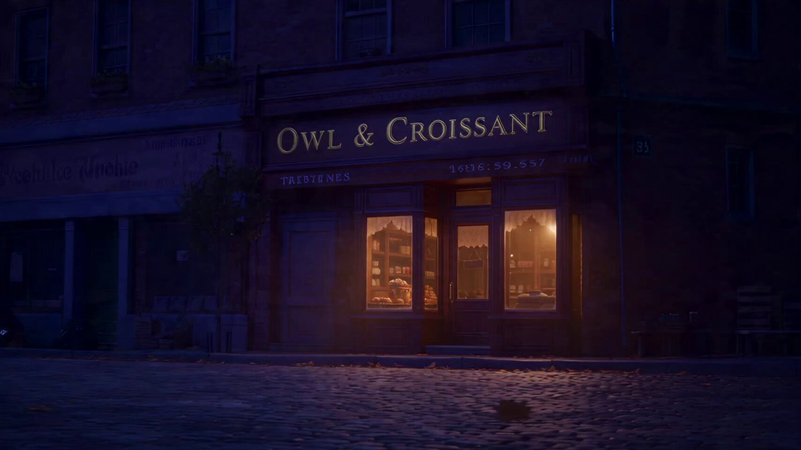</a>

<a href="https://x.com/Dheepanratnam/status/2084120410140893413">▶️ 在 X 上观看视频</a>

</div>

<details>
<summary><b>📋 点击展开 / 复制提示词</b></summary>

```
This was Text to video with dialogues. 30 seconds in single generation

Full prompt 

{ "title": "Moonlight Bakery", "style": "3D Pixar family animation. Cobblestone alley at 2 AM, glowing bakery window, purple and amber tones, flour dust sparkling.", 

"shots": 
[ {"time":"00:00-00:03","type":"EXT. WIDE","action":"Empty cobblestone alley. Single window glows warm. 'OWL & CROISSANT' sign.","camera":"Static, slight breeze. Leaf rolls.","dialogue":"(none)"}, {"time":"00:03-00:05","type":"INT. CLOSE-UP","action":"Owl locks cash register. A bell tings.","camera":"Over-shoulder. Flour dust catches light.","dialogue":"Owl: (sighs)"}, 
{"time":"00:05-00:08","type":"LOW ANGLE","action":"Door creaks. Mouse in striped pajamas shuffles in, eyes closed, swaying.","camera":"Push-in. Mouse shadow huge and wobbly.","dialogue":"Mouse: 'Mmm... one dream. Warm. With stars.'"}, {"time":"00:08-00:11","type":"TWO-SHOT","action":"Owl stares. Mouse sways into display case. Owl catches falling macaron with one wing.","camera":"Slight comedy zoom. Owl eyes widen.","dialogue":"Owl: 'We're closed, little one.'"}, 
{"time":"00:11-00:15","type":"CLOSE-UP","action":"Owl pulls out croissant with tiny star-shaped sesame seeds. Blows flour; it sparkles.","camera":"Macro.","dialogue":"Owl: 'This one's on the house. But you have to eat it here.'"}, {"time":"00:15-00:20","type":"WIDE","action":"Mouse takes one bite, eyes closed. Curls up on flour sack. Crumbs form constellation.","camera":"High angle, gentle.","dialogue":"(contented sigh)"}, 
{"time":"00:20-00:25","type":"CLOSE-UP","action":"Owl tucks tea towel over mouse. Turns 'CLOSED' sign around. Back says 'NAPPING.'","camera":"Focus pull from mouse to sign.","dialogue":"Owl: (soft hoot)"}, {"time":"00:25-00:30","type":"EXT. WIDE","action":"Owl dims lights. Through window, mouse belly rises and falls. Stray cat curls by door.","camera":"Pull back through window. Bakery light becomes small star.","dialogue":"(none)"} ] }
```

</details>

**👤 出处:** [@Dheepanratnam](https://x.com/Dheepanratnam) · [source](https://x.com/Dheepanratnam/status/2084120410140893413)

▶️ **用 API 跑这条提示词** → [Velokey](https://velokey.ai/model/doubao-seedance-2-5-text-to-video?sourceChannel=github-awesome-seedance)（模型 id：`seedance-2.5`）

---

### No.53 70 年代地中海纪录片

 

<div align="center">

<a href="https://x.com/hey_am_cherry/status/2083562105186418695">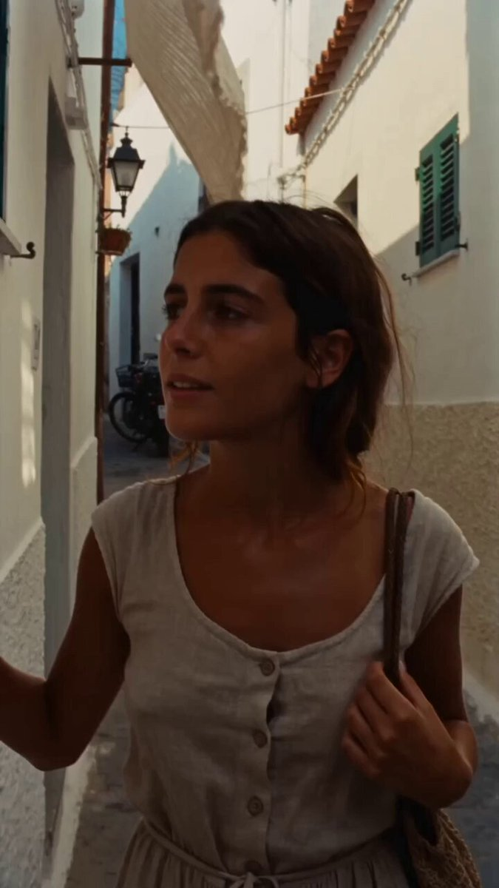</a>

<a href="https://x.com/hey_am_cherry/status/2083562105186418695">▶️ 在 X 上观看视频</a>

</div>

<details>
<summary><b>📋 点击展开 / 复制提示词</b></summary>

```
Style:
Authentic late-1970s Mediterranean documentary captured on vintage 16mm Kodak film, naturally faded colors, subtle film grain, real optical imperfections, slight gate weave, shoulder-mounted handheld camera with imperfect human movement, soft vintage lenses, warm afternoon sunlight, realistic skin texture, no cinematic polish, feels like forgotten archival footage discovered decades later.

0–3 seconds:
A close handheld tracking shot follows a young woman in her 20s walking slowly through a narrow seaside alley lined with whitewashed houses, hanging linen curtains gently moving in the ocean breeze. She wears a simple linen dress, a woven shoulder bag, and naturally messy hair with no makeup. Instead of posing, she lightly brushes her fingertips across the textured walls while quietly observing everyday life around her.

3–7 seconds:
The camera naturally falls slightly behind her as she enters a tiny open courtyard where local people casually gather. An elderly man repairs a bicycle, someone waters colorful plants from a balcony above, laundry sways overhead, and a sleepy orange cat crosses directly in front of the lens. The camera subtly adjusts to avoid the cat, creating an authentic human reaction.

7–11 seconds:
A young child runs toward a rolling wooden toy that passes close to her feet. She instinctively bends down, catches it with one hand, smiles warmly, and hands it back without stopping her walk. The child laughs and runs away. No one performs for the camera; everything feels naturally observed.

11–15 seconds:
She reaches a small overlook facing the sparkling sea. Instead of stopping dramatically, she casually rests one elbow on an old stone railing while watching distant fishing boats. A gust of wind lifts loose strands of hair across her face. She gently moves them aside and continues walking out of frame as the handheld camera hesitates for a second before slowly following behind.

Image Quality:
Ultra-photorealistic vintage documentary, authentic analog exposure, realistic human motion, organic focus breathing, imperfect framing, Kodak 16mm archival texture, subtle light leaks, soft highlight bloom, natural skin pores, no AI smoothness, 4:3 aspect ratio.
```

</details>

**👤 出处:** [@hey_am_cherry](https://x.com/hey_am_cherry) · [source](https://x.com/hey_am_cherry/status/2083562105186418695)

▶️ **用 API 跑这条提示词** → [Velokey](https://velokey.ai/model/doubao-seedance-2-5-text-to-video?sourceChannel=github-awesome-seedance)（模型 id：`seedance-2.5`）

---

### No.54 多维自由落体序列

 

<div align="center">

<a href="https://x.com/martindacol/status/2084145439176036502">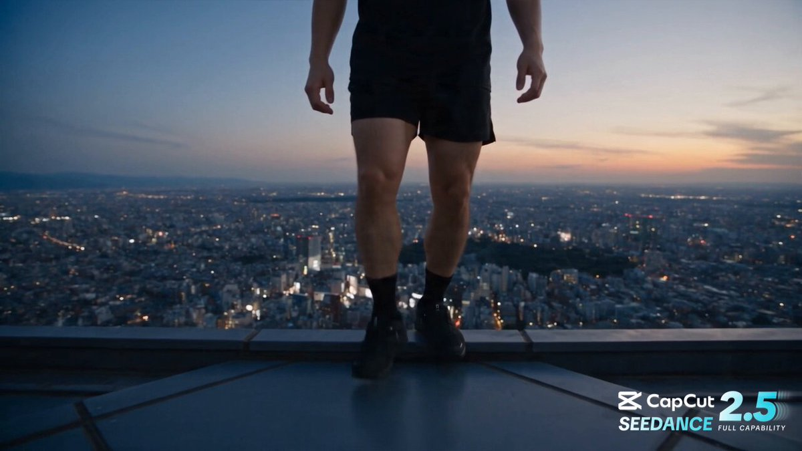</a>

<a href="https://x.com/martindacol/status/2084145439176036502">▶️ 在 X 上观看视频</a>

</div>

<details>
<summary><b>📋 点击展开 / 复制提示词</b></summary>

```
A 30-second cinematic, ultra-wide photorealistic sequence. The camera dynamically orbits the subject, changing angles and trajectories every 2 seconds for continuous engagement. The focus strictly locks onto the character's full facial details, ensuring zero distortion to his face or body proportions throughout the chaotic motion.

[0-3 Seconds: The Accidental Fall] The Asian man from the attached image (wearing round glasses, a black t-shirt, black athletic shorts, black socks, and black sneakers) walks casually atop a skyscraper overlooking Tokyo’s twilight Shibuya Crossing. He accidentally trips, gasps silently, and tumbles backward over the edge into free fall.

[3-25 Seconds: The Orbital Dreamscape Plunge]As gravity accelerates his fall, he thrashes instinctively. The camera continuously orbits him every 2 seconds, tracking his undistorted expressions of terror as he crashes through rapid spatial rifts:
Ukiyo-e Abyss: Plunging through glowing, liquid-ink Hokusai waves and geometric indigo voids.

Torii Corridor: Orbiting through infinitely folding vermilion gates and darting golden-eyed phantom foxes.

Sakura Nebula: Tumbling through weightless pink blossoms, Edo-period gold clouds, and shattered Mount Fuji ice.

Noh Kaleidoscope: Spinning amid a ringed array of floating Noh and Kabuki masks that blink and trail ghostly afterimages.

Koi Galaxy: Hurtling through infinite bamboo forests interlaced with liquid galaxies and luminous giant koi.

Shinkansen Vortex: Reaching terminal velocity within a multidimensional spiral of glowing train tracks and flickering neon Japanese station signs.

[25-30 Seconds: The Reality Crash]A 2-second frenzy of high-frequency flash cuts (sushi, Daruma, neon signs) assaults the background while the man remains perfectly frozen in focus. He shatters the final rift, violently crashing back into reality. His immense inertia halts instantly as he lands perfectly on his feet at the center of the Shibuya Crossing crowds. The camera snaps to a stable, frontal extreme close-up of his face—sweating, panting, and in shock (features fully preserved and undistorted). Surrounding pedestrians in earbuds walk by indifferently, ending abruptly on the stark contrast between his surreal panic and their mundane reality.
```

</details>

**👤 出处:** [@martindacol](https://x.com/martindacol) · [source](https://x.com/martindacol/status/2084145439176036502)

▶️ **用 API 跑这条提示词** → [Velokey](https://velokey.ai/model/doubao-seedance-2-5-text-to-video?sourceChannel=github-awesome-seedance)（模型 id：`seedance-2.5`）

---

### No.55 日本夏日祭浴衣 Vlog

 

<div align="center">

<a href="https://x.com/saniaspeaks_/status/2083857544024600757">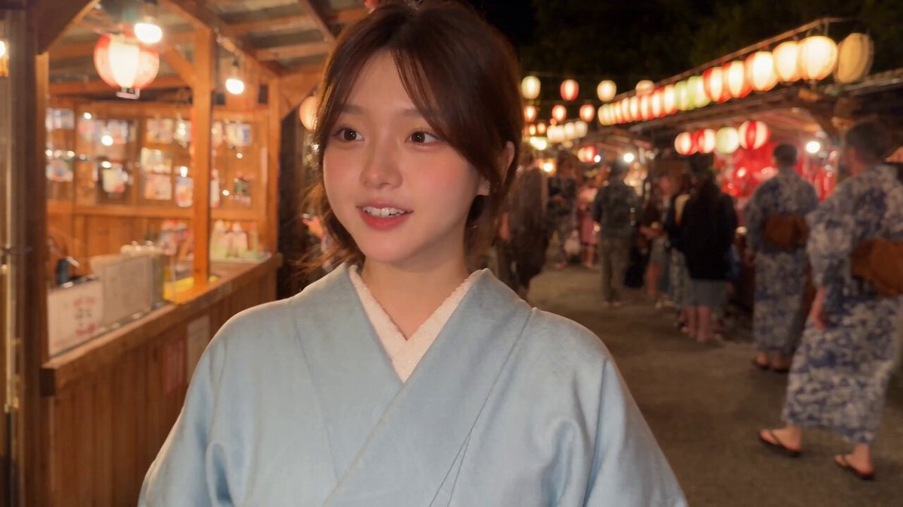</a>

<a href="https://x.com/saniaspeaks_/status/2083857544024600757">▶️ 在 X 上观看视频</a>

</div>

<details>
<summary><b>📋 点击展开 / 复制提示词</b></summary>

```
A 30-second photorealistic smartphone travel vlog. A young Japanese woman wearing a pastel yukata explores a traditional Japanese summer festival at night. She films herself in selfie mode with natural handheld movement, realistic phone camera quality, and authentic ambient sounds. She walks through lantern-lit streets, buys fresh takoyaki and smiles after taking a bite, plays a traditional festival game and wins a small plush toy, then watches a spectacular fireworks display with the crowd, capturing her genuine excitement. She ends the vlog by waving at the camera and saying, "Thanks for coming with me. See you next time. Bye!" The video should feel natural, cinematic, and realistic with consistent appearance, smooth human motion, and authentic festival atmosphere.
```

</details>

> 💡 需人物参考图

**👤 出处:** [@saniaspeaks_](https://x.com/saniaspeaks_) · [source](https://x.com/saniaspeaks_/status/2083857544024600757)

▶️ **用 API 跑这条提示词** → [Velokey](https://velokey.ai/model/doubao-seedance-2-5-text-to-video?sourceChannel=github-awesome-seedance)（模型 id：`seedance-2.5`）

---

### No.56 迷幻 Dubstep 音乐 MV

 

<div align="center">

<a href="https://x.com/rahulnanda86/status/2083355736479052209">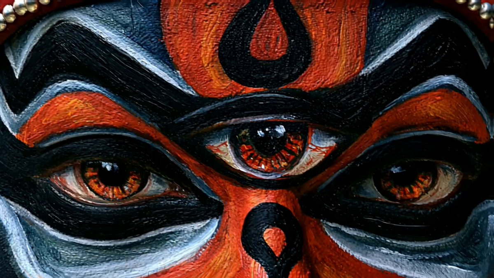</a>

<a href="https://x.com/rahulnanda86/status/2083355736479052209">▶️ 在 X 上观看视频</a>

</div>

<details>
<summary><b>📋 点击展开 / 复制提示词</b></summary>

```
Trippy Seedance 2.5 Music Video Prompt - Made on @capcutapp 

Create a fast, trippy 30-second dubstep music video using all the uploaded photographs 

(PLEASE FIND ATTACHED ALL 14 IMAGES + AUDIO IN THREAD). 

Use the uploaded 30-second audio as the only soundtrack. Make it a powerful dubstep edit: every movement, punch-in, transition and hard cut must hit the beat. Fully animate everything inside the photographs. Make the dancers perform, fabric and flames spin, painted eyes react, masks lunge, multiple arms ripple, the drummer strike his drum, sadhus dissolve into ash and black birds, motorcycles race aggressively, smoke creatures come alive, the underwater band actively play, boats move through the surreal landscape, and the flaming weapon create violent circles of fire. No photograph should remain static.Freely mix all the visuals in whatever order works best with the music. Let movement from one photograph naturally transform into the next: spinning fire becomes fabric, fabric becomes a painted eye, expanding arms become the drummer’s arms, ash birds become racing motorcycles, motorcycle dust becomes dancing smoke, smoke becomes underwater bubbles, bubbles become water and boats, and the boats transform into circles of fire.Keep constant movement throughout. Use rapid punch-ins, speed ramps, bass-impact flashes, hard rhythmic cuts, brief freeze-frames and fluid psychedelic transitions. Add a separate graphic layer flashing ॐ, the trishul, damru, third eye, crescent moon and traditional Hindu sacred symbols precisely on the beat. Let them pulse, rotate, distort and dissolve without covering the performers.Make it stylish, colourful, strange and extremely high-energy—an edgy, award-winning Incredible India advertisement edited like a dubstep music video. No dialogue, no typography, no slideshow, no long static shots and no complicated story. Finish with the strongest collision of fire, ash, birds and sacred symbols on the final bass hit.
```

</details>

> 💡 需多张照片+音频

**👤 出处:** [@rahulnanda86](https://x.com/rahulnanda86) · [source](https://x.com/rahulnanda86/status/2083355736479052209)

▶️ **用 API 跑这条提示词** → [Velokey](https://velokey.ai/model/doubao-seedance-2-5-text-to-video?sourceChannel=github-awesome-seedance)（模型 id：`seedance-2.5`）

---

### No.57 法国凌晨手持 POV 夜街

 

<div align="center">

<a href="https://x.com/patrickassale/status/2083510766959800371">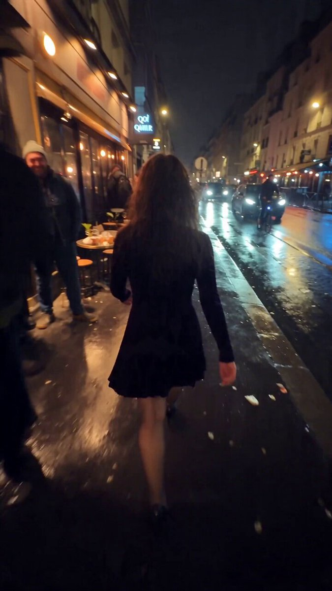</a>

<a href="https://x.com/patrickassale/status/2083510766959800371">▶️ 在 X 上观看视频</a>

</div>

<details>
<summary><b>📋 点击展开 / 复制提示词</b></summary>

```
A 30 second ultra realistic handheld POV video set in France at around 3 am, outside a busy bar and nightlife street. The camera is the point of view of a young woman filming one handed on an iPhone. We never see the phone itself at any point. The footage must feel like raw, authentic amateur nightlife footage with natural iPhone aesthetics.

It is very late. People are leaving bars, smoking outside, waiting for Ubers, talking too loudly, eating kebabs, laughing in tired, sloppy groups. The mood in the street is a mix of drunken energy and visible exhaustion. Faces look tired, makeup is slightly worn, outfits are a bit messy after a long night. The pavement is slightly wet and reflects neon signs, headlights, and warm bar lights. The air feels cold and heavy. The whole scene must feel intensely real, socially awkward, and uncomfortable.

The camera operator is a woman, and her friend is another young woman walking a few steps ahead of her, visibly angry. The camera follows her in a shaky, one-handed handheld way. The tension is already there from the first second. The argument is about the friend disappearing with a guy inside the bar and leaving the camera operator alone for nearly an hour, which made her miss the last train and feel abandoned. This is the core of the argument.

The friend suddenly turns around while still walking and says in natural French from France:

“Tu vas me suivre encore longtemps comme ça ?”

The woman behind the camera replies, irritated and hurt:

“Bah ouais, parce que tu m’as laissée toute seule comme une conne pendant une heure.”

The friend rolls her eyes, tired and defensive:

“Oh ça va, j’étais pas ‘avec un mec’, on parlait, c’est bon.”

The camera gets a little closer as the woman filming answers immediately:

“Mais arrête, tu m’as complètement lâchée. J’te cherchais partout.”

The friend stops walking and turns fully toward the camera now, angry but exhausted:

“J’allais pas te tenir la main toute la soirée non plus.”

A few people nearby start glancing at them. Someone exits a bar laughing, a smoker looks over, a taxi passes in the background. The world keeps moving around them, but the argument becomes the emotional center of the scene.

The woman filming replies, more intense now:

“C’est pas ça le problème, le problème c’est que t’as disparu sans rien dire. J’ai raté le dernier train à cause de toi.”

The friend laughs bitterly in disbelief:

“À cause de moi ? Sérieux ? T’es incapable de te débrouiller toute seule ?”

The camera jolts slightly from the emotional reaction. The breathing of the woman filming becomes more noticeable. Her voice gets sharper:

“Mais t’abuses en fait. Tu fais toujours ça. Tu penses qu’à toi.”

The friend steps closer, now visibly losing patience:

“Et toi tu fais quoi là ? Tu me filmes en pleine rue comme une malade.”

The woman behind the camera replies immediately:

“Parce que tu racontes n’importe quoi !”

The friend reaches toward the camera, not to grab a visible phone, but clearly trying to push it away from her face. The image jerks sideways hard from the contact.

“Enlève ça de ma tête !”

The camera operator snaps back:

“Me touche pas !”

Now the tension breaks completely. The friend, furious and emotionally overwhelmed, shouts:

“Mais ferme-la un peu !”

The woman filming fires back:

“Sinon quoi ?!”

There is a half-second pause. Heavy breathing. Eye contact directly into the lens. Then the friend lunges.

She pushes into the camera operator. The footage becomes chaotic and violent, shaking hard as the woman filming loses balance. She lets out a shocked cry:

“Putain !”

The camera stumbles backward and drops toward the ground. As it falls, we catch blurred fragments: legs, jackets, streetlights, pavement, people turning around, someone shouting:

“Eh oh ! Ça va pas ou quoi ?!”

The friend jumps onto her as both fall out of balance. The camera lands badly on the ground, still recording for a split second, partly blocked by clothing or the ground. We hear struggling, overlapping voices, panic, and nearby people reacting. Then the video abruptly cuts.

The entire performance must feel spontaneous, messy, and completely believable. Natural interruptions, overlapping dialogue, breath, hesitation, frustration, and tiny realistic body movements are essential. The acting must feel like a real late night argument between two exhausted friends, not a scripted drama. No cinematic polish, no stylized fight choreography, no slow motion, no music, no visible phone, no artificial lighting setup, and no glamorous performance. It must feel like a real one handed iPhone recording captured in the heat of the moment.
```

</details>

**👤 出处:** [@patrickassale](https://x.com/patrickassale) · [source](https://x.com/patrickassale/status/2083510766959800371)

▶️ **用 API 跑这条提示词** → [Velokey](https://velokey.ai/model/doubao-seedance-2-5-text-to-video?sourceChannel=github-awesome-seedance)（模型 id：`seedance-2.5`）

---

### No.58 赛博女猎手连续开场

 

<div align="center">

<a href="https://x.com/opener_ai/status/2083542436148854864">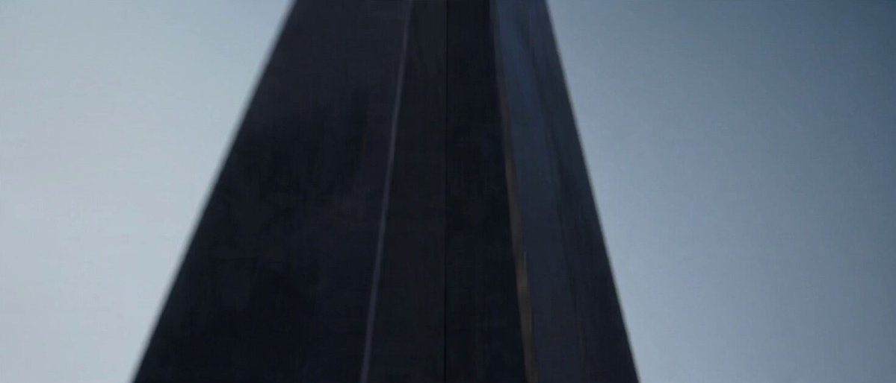</a>

<a href="https://x.com/opener_ai/status/2083542436148854864">▶️ 在 X 上观看视频</a>

</div>

<details>
<summary><b>📋 点击展开 / 复制提示词</b></summary>

```
Prompt

IDENTITY: @Image1 supplies identity only — face, long black hair, low-brim cap, glossy black bodysuit, segmented cybernetic right arm, circuit tattoos, heeled boots. Frame is one continuous open-sky environment edge to edge. Cuts every 2-3s, no shot over 3s, one camera movement per shot. 0-2s | Worm-eye far below, whip tilt up as she pushes off the spire ledge. [Cut] 2-4s | Macro on her heel leaving the lip, static. [Cut] 4-6s | Top-down on her back, falling with her, hair rips straight up. [Cut] 6-8s | Boot macro, black plates streak in and latch over her shins, static. [Cut] 8-10s | Side track, thigh and hip plates snap shut. [Cut] 10-12s | Cybernetic arm macro, forearm plating extends over it, static. [Cut] 12-15s | Wide, chest harness clamps on, two stabilizer fins fold from her back, push-in. [Cut] 15-17s | Face close-up, a thin dark visor slides from the cap brim over her eyes, locked. [Cut] 17-20s | Extreme wide, geared figure punches the cloud layer, twin vapor spirals. [Cut] 20-23s | Head-down delta dive, fins biting air, hard push-in on her back. [Cut] 23-26s | Ground-level low angle, she swells in frame fast. [Cut] 26-28s | She lands in a deep crouch, cybernetic arm braced on stone, cracks radiate 4m in a spider-web pattern. [Cut] 28-30s | 0.4x slow motion, concentric shockwave ripple distorts the air outward, dust erupts to waist height, she rises into a recovery stance. GEAR: plates arrive as fast streaks from off-frame, each locking with a latch snap and a thin amber seam that fades in 0.4s and lights her skin. Assembly runs 6-17s, one region per shot. PHYSICS: terminal velocity, hair and fabric dragged upward, motion blur on background only, subject sharp, faster after 17s. AUDIO: wind roar climbing, latch snap on each lock, sub-bass on every cut, half beat of silence at 25.5s, air-pressure boom at 26s, rumble tail. STYLE: painterly anime illustration matching @Image1, cel-and-gradient shading, cool desaturated sky.
```

</details>

> 💡 需人物参考图

**👤 出处:** [@opener_ai](https://x.com/opener_ai) · [source](https://x.com/opener_ai/status/2083542436148854864)

▶️ **用 API 跑这条提示词** → [Velokey](https://velokey.ai/model/doubao-seedance-2-5-text-to-video?sourceChannel=github-awesome-seedance)（模型 id：`seedance-2.5`）

---

### No.59 意大利海岸滑水

 

<div align="center">

<a href="https://x.com/hedo_ist/status/2083593373512839197">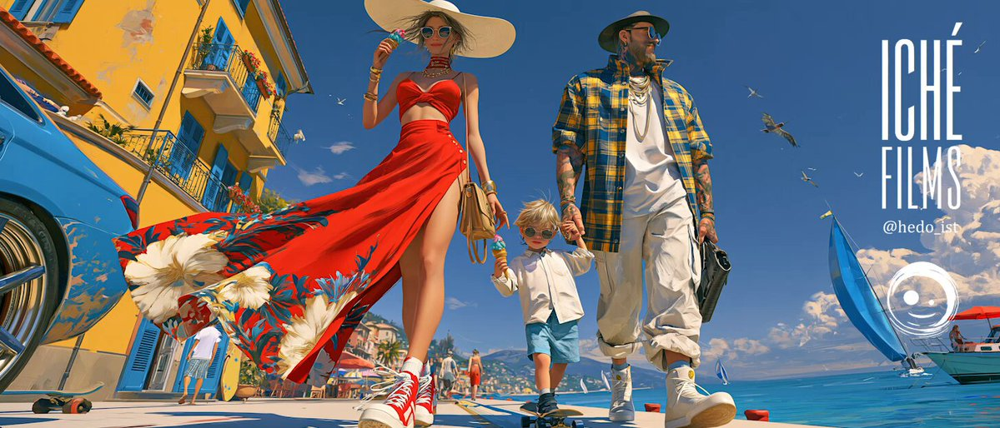</a>

<a href="https://x.com/hedo_ist/status/2083593373512839197">▶️ 在 X 上观看视频</a>

</div>

<details>
<summary><b>📋 点击展开 / 复制提示词</b></summary>

```
People are out on the terrace during the summer when, suddenly, someone appears wakeboarding and splashing the crowd; 

the athlete laughs heartily while performing stunts and jumping over yachts speeding by. 

A fun, fast-paced action scene.
```

</details>

**👤 出处:** [@hedo_ist](https://x.com/hedo_ist) · [source](https://x.com/hedo_ist/status/2083593373512839197)

▶️ **用 API 跑这条提示词** → [Velokey](https://velokey.ai/model/doubao-seedance-2-5-text-to-video?sourceChannel=github-awesome-seedance)（模型 id：`seedance-2.5`）

---

### No.60 宴会厅缓推长镜

 

<div align="center">

<a href="https://x.com/AIcanvas_Frames/status/2083761905794154738">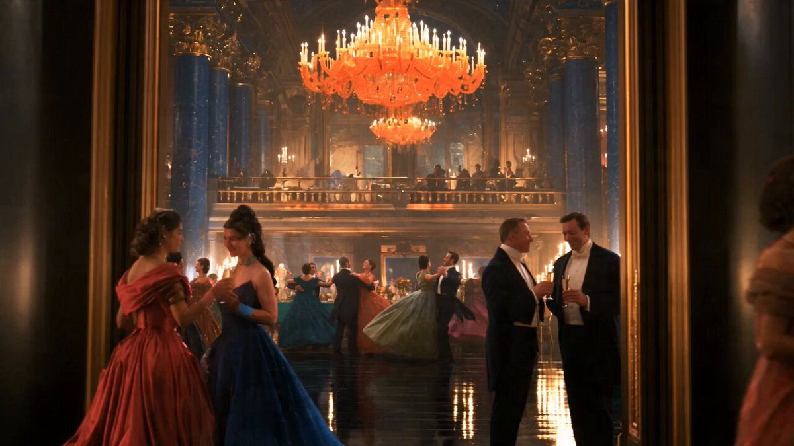</a>

<a href="https://x.com/AIcanvas_Frames/status/2083761905794154738">▶️ 在 X 上观看视频</a>

</div>

<details>
<summary><b>📋 点击展开 / 复制提示词</b></summary>

```
0-5s: [Symmetrical wide shot, stable slow dolly forward] Camera smoothly enters from the ballroom entrance. In the left foreground, two women speak quietly, one holding a champagne glass. In the right foreground, two male guests smile and toast. In the midground, three dancing couples rotate elegantly across the black mirrored floor. On the distant upper balcony, a string quartet performs. A waiter passes the emerald-green banquet table carrying a silver tray of champagne glasses and fruit. Orange chandelier light, candles, flowers, and colorful gowns create rich reflections on the floor. Audio: gentle conversation, clinking glass, string music, and natural laughter.

5-8s: [Smooth lateral move with a slight push-in, no whip pan] Camera moves naturally from left to right, passing behind the shoulder of a woman in a royal-blue silk shawl, then enters the center of the party. Six featured guests form a relaxed, believable group: one dancing couple has just completed a turn, while two women and two men smile at one another and slowly raise their champagne glasses. Focus on natural eyeline exchanges, believable finger placement around the glasses, subtle breathing, and gentle movement in the fabric.
8-10s: [Brief slow motion, stable medium shot] The champagne glasses are about to touch. Camera continues an extremely slow push-in, first revealing candlelight reflected on the rims of the glasses, then a woman gently raising her chin and a male guest smiling toward a friend. The music and laughter enter a very subtle slow-motion feeling without stopping.

10-20s: [Collective time freeze, main visual sequence] At the exact moment the six champagne glasses touch for the first time, time in the entire ballroom is gently paused. This is not a frightening freeze frame. It is an extremely luxurious, joyful, and believable moment of celebration.

Every person stops naturally within their existing action: the central guests keep warm, authentic smiles and look naturally toward one another; a dancing couple in the center of the floor pauses halfway through a turn, with the gown held in an elegant, physically believable curve; the waiter freezes while pouring champagne, with one thin unbroken stream of champagne flowing from the bottle into the glass, realistic bubbles visible inside the liquid; several pink flower petals, a few tiny champagne droplets, and one grape slipping from the edge of the silver tray remain suspended in midair; chandelier reflections, candle flames, and glasses reflected on the banquet tables are completely still.

Only the camera is allowed to move. Camera follows an extremely stable, extremely slow semicircular path around the central toast group. Do not make a full 360-degree orbit, do not pass through bodies, and do not use fast zooms. The camera first glides past the suspended champagne stream and droplets, then passes the frozen silk skirt of a dancer, and finally returns to the faces and hands of the six central guests holding their glasses. During the freeze, sound becomes almost silent: the final note of the strings stretches and stops, leaving only a very soft, warm low room tone and delicate champagne-bubble texture. All frozen faces, hands, and clothing must remain stable without flickering.
```

</details>

> 💡 续帧生成

**👤 出处:** [@AIcanvas_Frames](https://x.com/AIcanvas_Frames) · [source](https://x.com/AIcanvas_Frames/status/2083761905794154738)

▶️ **用 API 跑这条提示词** → [Velokey](https://velokey.ai/model/doubao-seedance-2-5-text-to-video?sourceChannel=github-awesome-seedance)（模型 id：`seedance-2.5`）

---

### No.62 写实人物生成测试

 

<div align="center">

<a href="https://x.com/pound75423/status/2083783652199329798">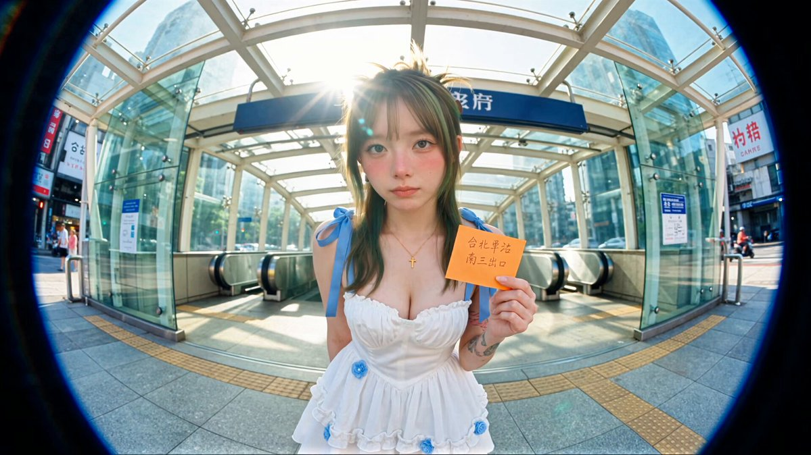</a>

<a href="https://x.com/pound75423/status/2083783652199329798">▶️ 在 X 上观看视频</a>

</div>

<details>
<summary><b>📋 点击展开 / 复制提示词</b></summary>

```
Seedance 2.5 seriously blew me away with its photorealistic human generation. I only gave it a character reference, and the result looked unbelievably real.with Seedance 2.5 Below is a  prompt
```

</details>

> 💡 需人物参考图

**👤 出处:** [@pound75423](https://x.com/pound75423) · [source](https://x.com/pound75423/status/2083783652199329798)

▶️ **用 API 跑这条提示词** → [Velokey](https://velokey.ai/model/doubao-seedance-2-5-text-to-video?sourceChannel=github-awesome-seedance)（模型 id：`seedance-2.5`）

---

### No.63 白日奇幻真人战斗

 

<div align="center">

<a href="https://x.com/aimikoda/status/2083822518658334946">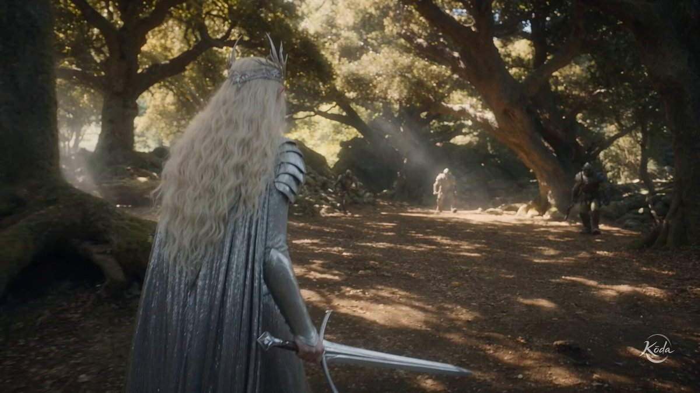</a>

<a href="https://x.com/aimikoda/status/2083822518658334946">▶️ 在 X 上观看视频</a>

</div>

<details>
<summary><b>📋 点击展开 / 复制提示词</b></summary>

```
16:9, 30-second photoreal live-action fantasy battle in clear daylight, crisp high-resolution cinema detail, natural textures, clean HDR contrast, one wide lens and one uninterrupted controlled handheld pursuit shot.

The elf princess is tall and slender, with fair freckled skin, blue-gray eyes, long wavy platinum-blonde hair, pointed ears, a silver branch circlet, and a flowing silver battle gown with a scale-textured mantle. Keep one identical princess throughout. She holds one silver longsword in her right hand.

Exactly 36 distinct armored green-skinned orcs enter over time, each with a different weapon, helmet, armor, or silhouette; orc 36 is a heavy captain with a cleaver. Never reuse an orc. Every stroke hits exactly one target. Show 36 separate contacts, green-fluid releases, and individual defeats. No multi-target cut; shockwaves move dust only. Each next orc actively attacks, guards, evades, or intercepts.

Rotate Zornhau, Zwerchhau, Unterhau, Krumphau, Scheitelhau, straight thrust, moulinet reverse cut, draw cut, and pivoting back cut without adjacent repetition. Every relocation uses this rhythm: clean micro-anticipation; a white-silver flash fully hides the princess and she vanishes; the camera continues its normal physical follow with the environment visible; a second local flash reveals her beside the next target in a fully formed attack pose. Show no transit body movement and no whip pan.

The camera stays close, following with smooth handheld sidesteps, retreats, arcs, drops, rises, and pivots. It travels toward each flash destination without snapping, resetting, teleporting, or hiding a cut. Keep princess, orcs, background, debris, hair, cloth, fluid, and particles sharply resolved. No motion blur anywhere.

SEQUENCE: ONE CONTINUOUS SHOT

Beat 1 / 0-3s: Rear 3/4 WS, follow behind the princess into a sunlit battle already in progress. The orcs occupy successive depth pockets, not one flat crowd; only nearby attackers are readable. Orc 1 charges while she forms the opening anticipation pose.

Beat 2 / 3-10s: CONTINUE SAME SHOT through orcs 1-9. Follow attacks from alternating sides with physical sidesteps and arcs. Perform nine fast but separate vanish, follow, reappear, single-target cycles using different techniques. Preserve each crisp contact, green-fluid release, recoil, and fall before the next attack. End with nine defeated as orc 10 attacks from behind.

Beat 3 / 10-17s: CONTINUE SAME SHOT through orcs 10-18. Pivot around the princess to catch the rear attack, move ahead, backpedal while leading, then arc around as threats enter from different directions. Show nine more individual attacks and one-orc cuts in a changed order. She appears only in sharp anticipation, contact, and finishing poses. End with eighteen defeated and orc 19 intercepting.

Beat 4 / 17-24s: CONTINUE SAME SHOT through orcs 19-27. Drop beside timber, rise around a shield, pass behind an axe raider, then turn toward an attacker descending from rubble. Increase tempo across nine distinct parries, evasions, lunges, guards, and single-target finishes. Each relocation uses two local flashes with continuous environment between them. End with twenty-seven defeated as the final nine surround her.

Beat 5 / 24-30s: CONTINUE SAME SHOT through orcs 28-36. Enter a tight controlled pursuit orbit, changing proximity and height along one physical path. Orcs 28-35 each receive a separate technique, contact, green-fluid release, and fall. The captain attacks last; sidestep his cleaver as one flash hides the princess and the next reveals her beyond him in a sharp Scheitelhau finish. His delayed impact affects only him. End with all 36 individually defeated.

SOUND: No dialogue or subtitles. Daylight battle ambience, sword transients, 36 distinct contact accents, individual orc reactions, dry flash cracks, and accelerating percussion.

VFX: Local white-silver flashes cover only the princess during vanish and reveal. Green fluid begins only at sword contact. Render every effect with crisp edges and zero motion blur.

EXCLUDE: Motion blur anywhere, whip pans, cuts, hidden cuts, lens changes, camera resets or teleports, visible transit, morphing, stretched limbs, extra or smeared anatomy, duplicates, multi-target strikes, low resolution, soft focus, haze, grain, compression artifacts, and night lighting.
```

</details>

**👤 出处:** [@aimikoda](https://x.com/aimikoda) · [source](https://x.com/aimikoda/status/2083822518658334946)

▶️ **用 API 跑这条提示词** → [Velokey](https://velokey.ai/model/doubao-seedance-2-5-text-to-video?sourceChannel=github-awesome-seedance)（模型 id：`seedance-2.5`）

---

### No.64 隐形室友·喜剧

 

<div align="center">

<a href="https://x.com/Dheepanratnam/status/2083838246459408833">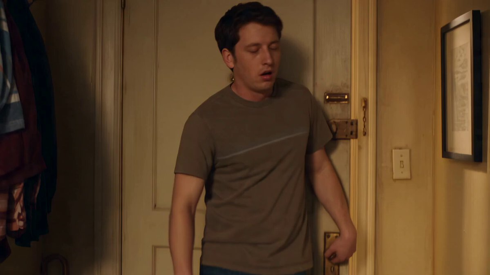</a>

<a href="https://x.com/Dheepanratnam/status/2083838246459408833">▶️ 在 X 上观看视频</a>

</div>

<details>
<summary><b>📋 点击展开 / 复制提示词</b></summary>

```
A small messy apartment in the late afternoon. A young man comes home, drops his keys, and goes to the kitchen. Unseen by him, an invisible figure is already there — only faint heat shimmers and subtle air movements reveal its presence. The invisible being starts helping: floating dishes clean themselves in the sink, the fridge door opens and ingredients float out, a pan starts cooking perfect food on its own. The human walks past, confused but too tired to question it. The invisible being grows bolder — it sits on the couch (cushion sinks), steals a fry from the plate, and even puts its “feet” up on the table. Later that night, the human falls asleep on the couch. The invisible being carefully pulls a blanket over him, then opens the fridge again, takes out a cold Budweiser, and sits in the armchair. The can opens by itself. After a long sip, the being lets out a quiet, satisfied sigh and the camera slowly reveals a faint outline of a smile in the air. Warm apartment lighting, subtle visual effects for invisibility, cozy comedy tone, satisfying final shot.
```

</details>

**👤 出处:** [@Dheepanratnam](https://x.com/Dheepanratnam) · [source](https://x.com/Dheepanratnam/status/2083838246459408833)

▶️ **用 API 跑这条提示词** → [Velokey](https://velokey.ai/model/doubao-seedance-2-5-text-to-video?sourceChannel=github-awesome-seedance)（模型 id：`seedance-2.5`）

---

### No.65 外星指挥官对话

 

<div align="center">

<a href="https://x.com/FabianoFirmo/status/2083859196248818022">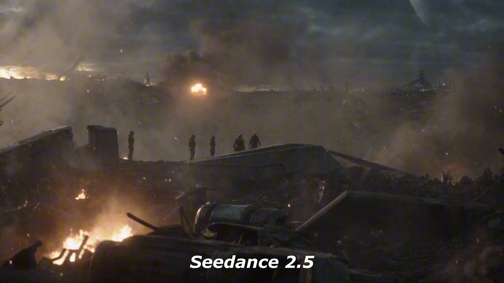</a>

<a href="https://x.com/FabianoFirmo/status/2083859196248818022">▶️ 在 X 上观看视频</a>

</div>

<details>
<summary><b>📋 点击展开 / 复制提示词</b></summary>

```
Image1 é um alienígena comandante e líder. Image2 é um alienígena soldado. O comandante dá uma ordem ao soldado em um campo de batalha. Cena de diálogo recíproco. As falas devem estar completamente em uma língua alienígena fictícia. Deve ser uma cena de batalha de um filme blockbuster. Você deve usar movimentos e ângulos de câmera cinematográficos.
```

</details>

> 💡 需2参考图

**👤 出处:** [@FabianoFirmo](https://x.com/FabianoFirmo) · [source](https://x.com/FabianoFirmo/status/2083859196248818022)

▶️ **用 API 跑这条提示词** → [Velokey](https://velokey.ai/model/doubao-seedance-2-5-text-to-video?sourceChannel=github-awesome-seedance)（模型 id：`seedance-2.5`）

---

### No.66 纽约鱼眼时尚短片

 

<div align="center">

<a href="https://x.com/bmx_ai13/status/2083863629590352329">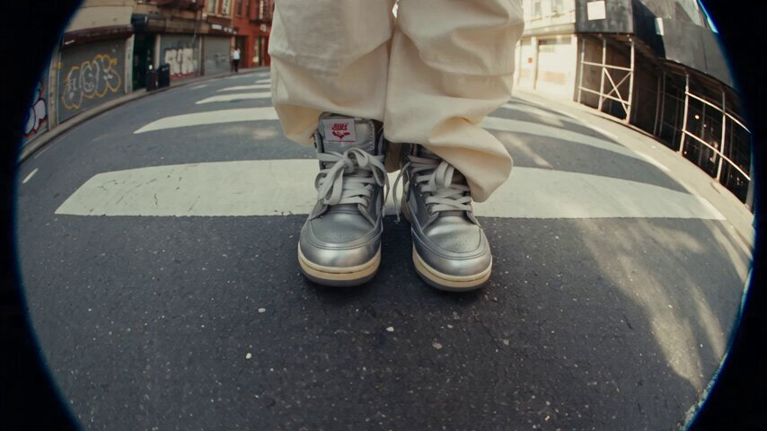</a>

<a href="https://x.com/bmx_ai13/status/2083863629590352329">▶️ 在 X 上观看视频</a>

</div>

<details>
<summary><b>📋 点击展开 / 复制提示词</b></summary>

```
A 15 second urban fashion film shot on dynamic ultra wide fisheye lens capturing a trendy female model strutting through New York street corners. She wears a black crop top low rise baggy white cargo pants high top sneakers silver sunglasses and large over ear headphones around her neck. High energy camera movements include extreme low angle worm eye perspective fast tracking whip pans tilt ups and energetic jump cuts. Scene alternates between bright natural daylight along urban brick storefronts with graffiti shutter doors and moody evening streetlights featuring subtle neon glow. Fast motion city traffic blurred in background. Fluid transitions include quick lens light leaks digital HUD music player UI overlays dynamic trailing light effects and a triple visual echo effect of the model. Photorealistic skin texture natural movement crisp urban ambient audio synced with rhythmic electronic music beats 16 ratio high contrast cinematic grading
```

</details>

**👤 出处:** [@bmx_ai13](https://x.com/bmx_ai13) · [source](https://x.com/bmx_ai13/status/2083863629590352329)

▶️ **用 API 跑这条提示词** → [Velokey](https://velokey.ai/model/doubao-seedance-2-5-text-to-video?sourceChannel=github-awesome-seedance)（模型 id：`seedance-2.5`）

---

### No.67 末日科幻自拍战斗

 

<div align="center">

<a href="https://x.com/Linkinpark3Park/status/2083885953626829071">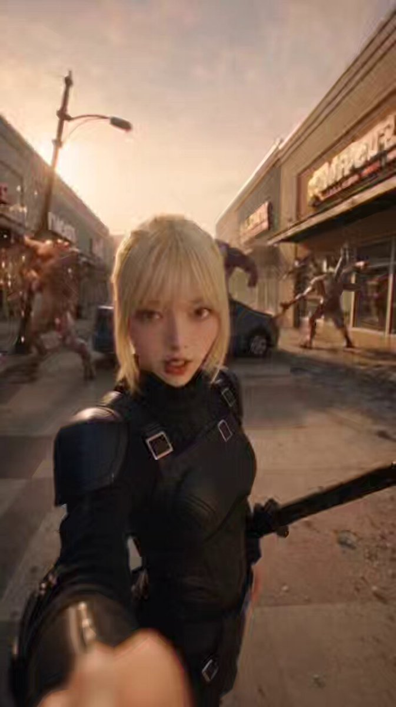</a>

<a href="https://x.com/Linkinpark3Park/status/2083885953626829071">▶️ 在 X 上观看视频</a>

</div>

<details>
<summary><b>📋 点击展开 / 复制提示词</b></summary>

```
[视觉风格与整体基调]
电影级科幻动作场面，写实真人风格，8K分辨率。场景设定在末日氛围下的城市商业街，时间为日落“黄金时刻”；街道上遍布混凝土瓦砾、破碎玻璃和废弃店面，背景中矗立着巨大的外星或奇幻风格怪物。0:00 - 0:03：自拍视角。金发主角手持镜头，自信微笑并比出“剪刀手”对着镜头说话，背景中废墟街道上隐约可见狰狞的怪物。
0:03 - 0:07：动态攻击序列。她转身拔出武士刀，刀身拖曳着紫色光芒，随即挥出一记横斩，将一头长角的石像魔像击碎，使其化作飞溅的碎石与紫色粘液。
0:07 - 0:10：低身闪避滑铲。一辆侧翻的汽车在她附近坠落，她迅速贴地滑铲穿过沥青路面，以此躲避袭来的攻击与飞溅的残骸。
0:10 - 0:14：多重怪物连击。[服装一致性修正：严格锁定其修身黑色战术战斗服；战斗期间服装不得变形或改变]。她向前突进，挥出紫色能量弧光将一头体型巨大的怪物一分为二，随后转身踢飞一只多肢生物，将其撞穿商店的玻璃橱窗。
0:14 - 0:17：氛围停顿。玻璃碎片与尘埃纷纷落下，她持剑戒备，注视着周围溅满紫色液体的破碎店面。
0:17 - 0:21：BOSS登场镜头。一名身披重甲、手持巨型尖刺狼牙棒的黑暗骑士从天而降，重重砸向地面，巨大的冲击力使混凝土路面开裂。
0:21 - 0:25：高速闪避镜头。重甲骑士猛烈挥舞巨型狼牙棒；她身形灵巧，在骑士双腿间穿梭，躲避重击与横扫攻势。
0:25 - 0:28：高潮能量打击。 她为武士刀注入强烈的紫色灵气，向着身披重甲的骑士颈部猛然挥出一记强力上挑斩，将这名首领级敌人彻底粉碎，化作一大团紫色能量与液体的混合物。
0:28 - 0:30：定格特写镜头。她将武士刀垂于身侧，在废墟街道上闪烁的紫色残光中傲然伫立，镜头随之向后拉远。
负面提示词（高级设置）
卡通、3D渲染、动漫风格、低分辨率。
```

</details>

> 💡 中文 prompt

**👤 出处:** [@Linkinpark3Park](https://x.com/Linkinpark3Park) · [source](https://x.com/Linkinpark3Park/status/2083885953626829071)

▶️ **用 API 跑这条提示词** → [Velokey](https://velokey.ai/model/doubao-seedance-2-5-text-to-video?sourceChannel=github-awesome-seedance)（模型 id：`seedance-2.5`）

---

### No.69 楼层剖面下移镜头

 

<div align="center">

<a href="https://x.com/MrDavids1/status/2083964230273786361">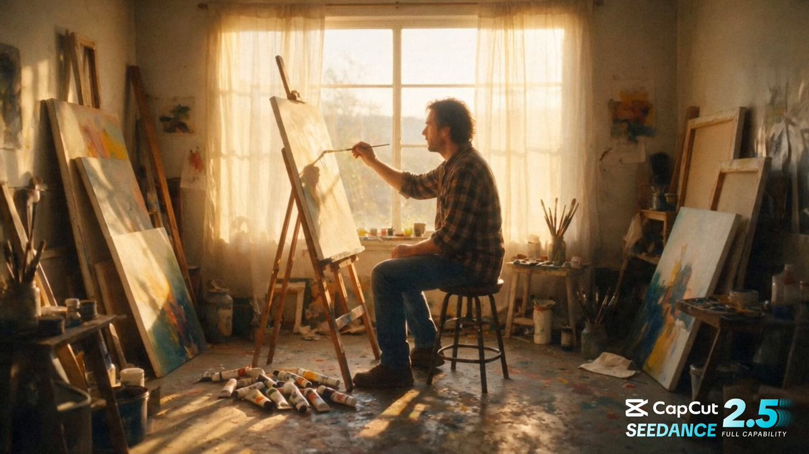</a>

<a href="https://x.com/MrDavids1/status/2083964230273786361">▶️ 在 X 上观看视频</a>

</div>

<details>
<summary><b>📋 点击展开 / 复制提示词</b></summary>

```
🔹Video Generation With Seedance 2.5

In order to create a downward moving camera that moves between a cross section of each floor, the basis of your prompt must include the following "A cinematic wide shot moves continuously downward through a cross-section of an apartment building, each floor slab passing into view as the camera descends, exposed like a dollhouse with the front wall removed."

🔹Here is the entire prompt I used for the opening 30 seconds and each floor had the corresponding image for it mentioned so it knew exactly which floor must show up next, it's important I mention wide shot in each floor transition so it knows to respect the input images dimensions: 

A cinematic wide shot moves continuously downward through a cross-section of an apartment building, each floor slab passing into view as the camera descends, exposed like a dollhouse with the front wall removed. Warm, low afternoon light spills into every room at the same low angle, casting long shadows and a golden cast across every surface, tying every floor to the same moment in time, though each room belongs to a completely different life. 

The shot opens on a wide shot of a paint-splattered studio, where a man sits on a stool before an easel, palett brush poised mid-stroke. The only sound is the faint bristle-drag of the brush against canvas and floorboards under his shifting weight. 

The camera drifts down past the concrete floor slab into a wide shot of the next apartment, where a family is gathered around a dining table, plates half-finished, exchanging warm glances and easy laughter without words, the soft clink of cutlery and quiet murmurs of contentment filling the room, afternoon sun cutting across the tablecloth. 

Descending again, the camera passes into a wide shot of a cluttered workshop where an Indian man is fixing a seventies-styled humanoid robot, its chrome-and-orange chassis scattered with exposed wiring and analog dials. He tightens a final connection with a screwdriver, and the robot's eyes flicker, then glow steady, its head turning toward him with a soft servo whir. He steps back, delighted, letting out a surprised laugh as the robot flexes its fingers for the first time, afternoon light catching the polished chrome in the same low, warm angle as the floor above. 

The camera drifts down past the concrete floor slab into a wide shot of a teenager's bedroom, where two young women dance loosely to music playing from a boombox propped on the dresser, laughing between missteps, the beat filling the room, sunlight cutting through half-closed blinds and striping the floor. 

Descending again, the camera passes into a wide shot into a small indoor garden in a living room, where an elderly Korean couple kneel side by side among rows of potted herbs and vegetables, working the soil with small trowels, exchanging a quiet glance and a small smile between them, the soft scrape of tools against clay pots the only sound, afternoon light warming the leaves and their weathered hands. 

[SOUND] Strictly only naturally occurring sound and foley, Absolutely no music, no score, no soundtrack, no ambient musical tones at any point. No dialogue at any point. Diegetic sound only.
```

</details>

**👤 出处:** [@MrDavids1](https://x.com/MrDavids1) · [source](https://x.com/MrDavids1/status/2083964230273786361)

▶️ **用 API 跑这条提示词** → [Velokey](https://velokey.ai/model/doubao-seedance-2-5-text-to-video?sourceChannel=github-awesome-seedance)（模型 id：`seedance-2.5`）

---

### No.70 1970 地中海鱼市

 

<div align="center">

<a href="https://x.com/Ankit_patel211/status/2083982404755292463"></a>

<a href="https://x.com/Ankit_patel211/status/2083982404755292463">▶️ 在 X 上观看视频</a>

</div>

<details>
<summary><b>📋 点击展开 / 复制提示词</b></summary>

```
Photorealistic cinematic 1970s Mediterranean seaside fish market, colorful striped awnings, weathered stone streets, overflowing seafood stalls, hanging lanterns, wooden crates, bright coastal sunlight, lively crowds, fluttering seagulls, realistic handheld cinematography, rich environmental detail, heavy natural film grain.

0-4s: [Medium Wide] A striking young woman in her early 20s sits alone at a tiny outdoor café table beside the bustling market, calmly eating lemon gelato. Around her, energetic fishmongers shout prices while customers negotiate loudly. A cheerful vendor walks through the crowd carrying a massive tray stacked with fresh fish, shrimp, octopus, lemons and a bucket of crushed ice. An excited tourist suddenly rushes backward to photograph the harbor.

4-8s: [Dynamic Tracking] The tourist slams into the vendor. Fish, ice, lemons, trays, buckets and seawater explode into the air in spectacular slow motion. Hundreds of ice cubes sparkle in sunlight while silver fish tumble through space. The camera instantly begins a fast continuous orbit around the collision. Time freezes at the exact peak of the chaos. Every person and every seagull stops completely. Only the young woman continues enjoying her gelato without the slightest concern.

8-17s: [Slow 360° Orbital] Camera glides elegantly through the frozen marketplace. Water hangs as crystal ribbons and suspended droplets. Fish, shrimp, octopus, lemons, ice cubes, baskets and wooden crates float weightlessly with incredible realism. Market vendors, tourists and children remain frozen in exaggerated expressions. The young woman calmly takes another spoonful of gelato while the entire frozen world except her begins smoothly rewinding. Every droplet, every fish, every crate, every person and every flying bird retraces its path perfectly back to the starting positions.

17-24s: [Medium Shot] The rewind finishes flawlessly. The vendor once again carries the fully loaded tray. The young woman casually points toward the rushing tourist with a tiny smile. The vendor instinctively steps aside just before the collision would have happened. Disaster completely avoided. Nearby customers never realize anything almost occurred.

24-30s: [Extreme Close-Up] Hard cut to her face as she finishes the final spoonful of gelato. A quiet knowing smile appears while the lively market continues normally behind her. Warm sunlight, shimmering sea reflections, soft coastal breeze, creamy cinematic bokeh.

Photorealistic, ultra-detailed fluid simulation, realistic fish and ice physics, physically accurate water behavior, cinematic motion blur only on moving elements, stable character identity, vibrant Mediterranean atmosphere, feature-film quality, heavy natural film grain, seamless temporal coherence, extremely high rewatch value.
```

</details>

**👤 出处:** [@Ankit_patel211](https://x.com/Ankit_patel211) · [source](https://x.com/Ankit_patel211/status/2083982404755292463)

▶️ **用 API 跑这条提示词** → [Velokey](https://velokey.ai/model/doubao-seedance-2-5-text-to-video?sourceChannel=github-awesome-seedance)（模型 id：`seedance-2.5`）

---

### No.71 冻结时间·1950 美式餐厅

 

<div align="center">

<a href="https://x.com/techhalla/status/2083389002552664385">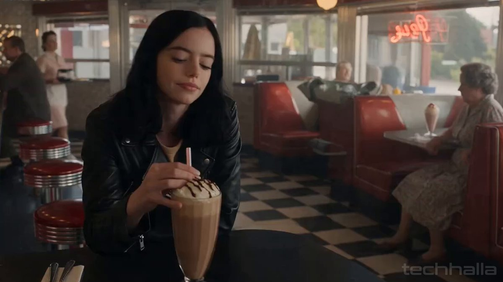</a>

<a href="https://x.com/techhalla/status/2083389002552664385">▶️ 在 X 上观看视频</a>

</div>

<details>
<summary><b>📋 点击展开 / 复制提示词</b></summary>

```
Seedance 2.5 frozen time + rewind effect prompt is below 👇

Photorealistic cinematic 1950s American diner, chrome stools, red vinyl, neon glow and checkerboard floor, shot with modern lived-in realism and soft natural window light. Subtle handheld texture, warm practicals, rich period detail, heavy film grain.

0-4s: [Medium Wide] A striking young woman in her early 20s sits alone at the counter, calm and slightly amused, slowly sipping a tall thick milkshake through a straw. Behind her a young waitress in classic uniform approaches with a tray of eggs and bacon in one hand and a full glass coffee pot in the other. An older lady starts rising from a nearby booth.

4-8s: [Dynamic Tracking] The older lady collides hard into the waitress. Tray, plate, eggs, bacon and coffee pot explode upward in chaotic slow motion. Coffee erupts into long liquid ribbons and perfect suspended droplets. Camera immediately begins a smooth continuous orbit around the impact. Time locks completely at the peak of the spill. Every face freezes in pure shock. Only the girl at the counter keeps moving, completely unfazed.

8-17s: [Slow 360° Orbital] Camera glides in a full elegant orbit through the frozen diner. Coffee hangs in mid-air as glassy ribbons and spheres with perfect volume and surface tension. Bacon strips, eggs and the spinning tray float weightlessly. Patrons and waitress remain locked in startled expressions. The girl at the counter takes one slow, deliberate sip, eyes half-lidded, almost bored, while the entire frozen world (except her) begins an elegant reverse: every droplet, every piece of food and every person rewinds smoothly back to the exact starting positions.

17-24s: [Medium Shot] Rewind lands perfectly. Waitress stands balanced again with tray and coffee pot. The girl lifts her eyes, raises two fingers in a small casual gesture and softly calls the waitress by name. The waitress turns toward her just before the older lady begins to stand, completely avoiding the collision. A tiny private smile crosses the girl’s face.

24-30s: [Extreme Close-Up] Hard cut to her face as she takes one last slow sip. Soft knowing smile, eyes almost closed in quiet satisfaction, like she has done this a hundred times. Shallow depth of field, creamy bokeh of the neon diner behind her.

Photorealistic, ultra-detailed fluid physics, perfect motion blur only on moving elements, stable characters, cinematic lighting, heavy natural film grain, no artifacts, movie-level temporal coherence, high rewatch value.

30 seconds long is the new AI standard! hope you like it 🫡
```

</details>

**👤 出处:** [@techhalla](https://x.com/techhalla) · [source](https://x.com/techhalla/status/2083389002552664385)

▶️ **用 API 跑这条提示词** → [Velokey](https://velokey.ai/model/doubao-seedance-2-5-text-to-video?sourceChannel=github-awesome-seedance)（模型 id：`seedance-2.5`）

---

### No.73 铸剑真人秀

 

<div align="center">

<a href="https://x.com/techhalla/status/2084018642300141851">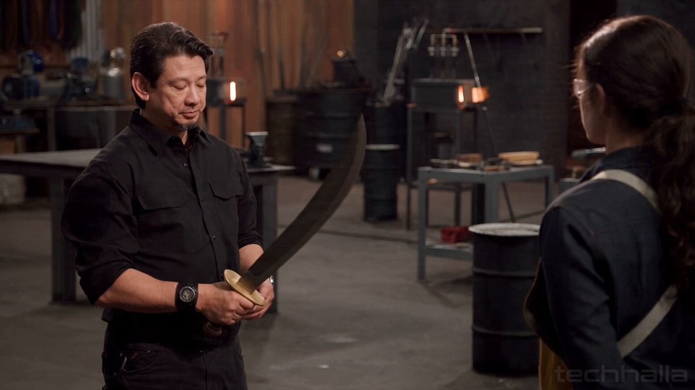</a>

<a href="https://x.com/techhalla/status/2084018642300141851">▶️ 在 X 上观看视频</a>

</div>

<details>
<summary><b>📋 点击展开 / 复制提示词</b></summary>

```
Seedance 2.5 Forged in Fire text to video prompt is below 👇

Reality TV bladesmith competition testing segment, multi-camera documentary production, bright industrial workshop lighting, sharp HD broadcast look, practical forge practicals, natural handheld shake on action cams, clean documentary texture, no cinematic film look.

0-4s: [Medium Two-Shot] Martial arts master of clear Asian ancestry in black tactical shirt stands facing the young female bladesmith in her early 20s (work apron, focused). He holds her forged machete, turns the blade once under the lights. Looks her in the eye: “Are you ready?” She answers firmly “Yes.” Quick cut to her determined face, then to three classic ceramic garden gnomes lined up on sturdy stands behind them.

4-7s: [Low-Angle Tracking + Rapid Cuts] Master steps in, raises the machete. Hard cut to side angle as he delivers a powerful overhead chop into the first gnome. Impact explodes in slow motion: ceramic shatters into sharp fragments, paint chips and dust fly outward. Time locks at peak penetration. Camera orbits the frozen blade buried in the broken gnome for one second. Quick insert ECU of the edge biting through the ceramic body.

7-11s: [Dynamic Side Tracking] Action resumes. Master yanks the machete free, immediately follows with a heavy diagonal slash across the second gnome. Slow-motion again: the figure tears apart sideways, large colored pieces and shards scatter. Freeze at maximum destruction. Two rapid cuts: one over-shoulder from behind the master, one low angle under the flying fragments. Orbit holds for half a second on the locked impact.

11-15s: [Handheld Close Action] Third strike — short, vicious downward chop into the third gnome. Slow-mo impact, the ceramic erupts into dozens of pieces, hat and beard flying. Full freeze. Camera pushes in and circles the frozen chaos for one beat. Quick insert of the master’s focused face mid-swing, then back to the locked blade.

15-19s: [Series of Fast Cuts] Time resumes. Master pulls the machete out, turns it under the light. Tight ECU tracks along the edge: a few small nicks and rolled spots visible. Cut to his fingers testing the edge. Cut to the ruined garden gnomes still shedding fragments. Cut to the young woman’s tense expression as she watches.

19-24s: [Medium Close-Up] Master lowers the blade, looks straight at her. Calm, professional delivery: “There are a couple of nicks on the edge… but your weapon, ma’am… it kills.” Hard cut to her face — a small, controlled smile of pride breaks through.

24-28s: [Final ECU Montage] Extreme close-up of the nicked but still lethal edge catching the light. Cut to the shattered remains of the garden gnomes. Final frame holds on the young bladesmith’s quiet satisfaction as the master nods once.

Realistic TV broadcast quality, detailed ceramic shatter physics, sharp edge detail, natural motion blur only on moving elements, stable characters, coherent impact timing, no artifacts, high rewatch value.

I promise I didn't use any image reference for this one, use it wisely 🫡
```

</details>

**👤 出处:** [@techhalla](https://x.com/techhalla) · [source](https://x.com/techhalla/status/2084018642300141851)

▶️ **用 API 跑这条提示词** → [Velokey](https://velokey.ai/model/doubao-seedance-2-5-text-to-video?sourceChannel=github-awesome-seedance)（模型 id：`seedance-2.5`）

---

### No.74 定格动画肢体喜剧

 

<div align="center">

<a href="https://x.com/janmexico/status/2084140262310166813">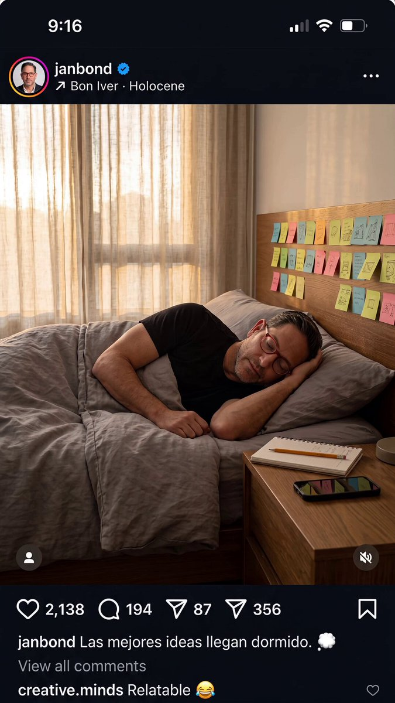</a>

<a href="https://x.com/janmexico/status/2084140262310166813">▶️ 在 X 上观看视频</a>

</div>

<details>
<summary><b>📋 点击展开 / 复制提示词</b></summary>

```
Style: Playful cinematic stop motion, slightly choppy, exaggerated physical comedy
Output frame rate: 24 frames per second, but animate the character with a deliberate 5 frames-per-second stop-motion rhythm
CHARACTER IDENTITY LOCK
The man in every scene is the same man from reference image 1: tall and slim, lean build, short dark hair, round red glasses that never leave his face, black t-shirt, black jeans, white sneakers. His eyes are completely natural, symmetrical human eyes with normal pupils; the red glasses have thin clear lenses that do NOT magnify, bend, distort or blur his eyes in any frame. Stable facial identity and consistent body proportions across all posts.
REFERENCE IMAGES (in upload order)
Bedroom post: reference image 1 (man asleep in bed Instagram post)
Coffee post: reference image 2 (espresso machine kitchen Instagram post)
Studio post: reference image 3 (creative studio with monitors Instagram post)
AI generation post: reference image 4 (giant screen with GENERAR button Instagram post)
Commercial set post: reference image 5 (empty cinematic spotlight set Instagram post)
Final commercial frame: reference image 6 (the man frozen in hero pose in the spotlight)
Create one continuous vertical Instagram feed where the same man secretly moves between different Instagram posts.
The entire 9:16 frame is a single continuous Instagram feed. Do not treat each reference image as a separate scene or separate shot.
Only the photo area inside each Instagram post becomes alive. The black Instagram headers, captions, icons, usernames, likes and comments remain visible and behave like fixed foreground interface layers.
The character must always remain behind the Instagram interface. He must never overlap the caption, icons, usernames or engagement area.
CRITICAL SWIPE TRANSITION ENGINE
Every transition must visibly look like the Instagram feed is being swiped to the next post.
Do not cut directly from one completed post to another completed post.
For every transition:
The man jumps downward inside the current post.
His body reaches the bottom edge of the photo area.
The black caption section passes in front of him and hides him.
While he is hidden behind the black interface, the entire Instagram feed physically slides upward in one continuous movement.
The current post moves upward and partially leaves the screen.
The next post rises into view from the bottom.
For several frames, both the outgoing post and incoming post must be visible together in the same 9:16 frame.
The man immediately continues the same downward movement, reappearing from behind the upper black edge of the incoming post.
He lands inside the next photo area without resetting his pose or speed.
Do not show a finger.
Maintain the same screen-space horizontal position of the man throughout the jump. His downward momentum before disappearing must match his downward momentum when he reappears.
Each swipe should last approximately 0.35 to 0.5 seconds.
During every swipe: no hard cut, no sudden replacement, no crossfade, no dissolve, no flash frame, no black frame, no full-screen blur, no teleportation, no camera repositioning, no instant background change, no separate establishing shot of the next post.
The Instagram interface, outgoing post and incoming post must all move together as one long vertically stacked feed.
Use slight vertical motion blur only on the moving feed during the fastest part of the swipe. The character and interface must remain readable.
0.0 TO 2.5 SECONDS
POST 1: THE SLEEPING CREATOR WAKES
Start with: reference image 1
Hold the post completely still for 0.3 seconds so it appears to be an ordinary Instagram image.
The sleeping man's eyes open behind his red glasses. He blinks.
His eyebrows rise: an idea has arrived.
He sits up suddenly, pushes off the duvet, grabs the notebook from the nightstand and tucks it under his arm.
He tiptoes toward the bottom edge of the photo with clear stop-motion poses and brief holds.
He crouches deeply and jumps straight downward from inside the photo. He does not jump toward the camera.
As he crosses the bottom edge, the black Instagram caption section moves in front of him and progressively hides his body.
At the same time, begin the Instagram swipe. The bedroom post slides upward, the coffee post rises from the bottom, both briefly visible together.
He continues falling and reappears from behind the coffee post's upper black boundary.
Sound effects: duvet rustle, floor creak, spring compression, continuous vertical swipe sound
2.5 TO 4.7 SECONDS
POST 2: THE COFFEE STOP
Reveal: reference image 2
The kitchen remains empty of other people.
The man lands on the kitchen counter beside the espresso machine. Cups and plates rattle.
He grabs the freshly poured espresso cup and takes one large exaggerated gulp. Steam puffs.
His eyes widen with energy, he does a satisfied full-body shake, now fully awake.
He sets the cup down, crawls quickly to the counter edge and performs another downward jump.
The black caption panel hides his body while the coffee post slides upward and the studio post rises from the bottom, both visible together.
He reappears from behind the studio post's upper black edge and continues falling without pause.
Sound effects: ceramic clink, espresso hiss, huge gulp, energized exhale, continuous vertical swipe
4.7 TO 7.3 SECONDS
POST 3: THE CREATION FRENZY
Reveal: reference image 3
The man lands seated directly into the rolling ergonomic chair, which rolls fast across the studio.
He plants his feet, scoots the chair to the desk and types furiously in exaggerated stop-motion bursts.
The monitors flicker with storyboards and video timelines. Sticky notes flutter off the wall. He scribbles one storyboard frame, holds it up, gives a satisfied nod.
He pushes off the desk, the chair spins once, and he leaps from the spinning chair diving down through the bottom edge of the photo.
The black footer hides him while the studio post slides upward and the AI generation post rises from the bottom, both visible together.
He reappears from behind the incoming post's upper black edge, continuing the same headfirst fall.
Sound effects: chair wheels rolling, frantic keyboard clacks, paper flutter, chair spin whoosh, continuous vertical swipe
7.3 TO 10.4 SECONDS
POST 4: THE GENERATE CLICK
Reveal: reference image 4
The man lands in front of the giant wall screen and looks up at the huge glowing GENERAR button.
One dramatic held beat.
He slaps the button with his open palm.
The interface floods with light: a progress bar races across the screen and the preview frame flashes bright.
Light and wind from the screen blow his clothes and hair back. He shields his eyes, grins, steps back and dives down through the bottom edge of the photo while the glow intensifies.
The interface hides his body while the AI post slides upward and the commercial set post rises from the bottom, both visible together.
He reappears from behind the commercial post's upper black boundary, still falling.
Sound effects: deep UI click, rising electronic hum, whoosh of light, continuous vertical swipe
10.4 TO 15.0 SECONDS
POST 5: INSIDE HIS OWN COMMERCIAL
Reveal: reference image 5
The set is empty when he arrives. No crew, no people.
The man falls into the cinematic set and lands inside the spotlight beam. Haze swirls around him.
He stands, adjusts his black t-shirt, and walks to the center mark leaving the haze curling behind him.
The camera performs a smooth continuous forward push toward him. No cut.
He plants his feet and straightens into a confident hero pose.
CRASH ZOOM: a rapid continuous camera push within the same unbroken shot. Do not hide a cut inside the crash zoom. No blur frame, no flash, no different image at the zoom peak.
During the crash zoom the lighting perfects itself, the teal and amber commercial grade settles, and all of his movement gradually stops.
He freezes in the final hero pose. End matching: reference image 6.
The final frame must emerge from the exact same continuous shot. No cut to the reference image, no instant replacement.
At the end he remains frozen as the finished commercial frame. Only his eyes briefly glance sideways, then return to stillness.
Sound effects: spotlight buzz, footsteps on glossy floor, cinematic braam, crash-zoom impact, sudden silence
MOTION STYLE
Use deliberate stop-motion movement: choppy pose-to-pose animation, brief held reaction frames, strong anticipation before jumps, squash and stretch during landings, exaggerated scrambling, fast but readable actions, slightly reduced movement sampling, minimal motion blur outside the feed swipes, stable facial identity, consistent body proportions.
The man's round red glasses stay on his face in every scene, and his eyes always stay natural, sharp and undistorted behind the lenses.
STRICT NEGATIVE INSTRUCTIONS
Do not hard-cut between posts.
Do not show a completed empty post followed by a completed new post.
Do not make the incoming post appear instantly.
Do not zoom into a post to hide the transition.
Do not fade between reference images.
Do not teleport the man.
Do not reset his falling pose between posts.
Do not let him overlap captions, icons or usernames.
Do not distort, warp, cross or enlarge his eyes at any moment.
Do not create any magical portal, glow ring or ripple when he enters the commercial set.
Do not cut during the crash zoom.
The complete video must feel like one long Instagram feed physically scrolling upward while the man continuously falls downward through each post.
```

</details>

**👤 出处:** [@janmexico](https://x.com/janmexico) · [source](https://x.com/janmexico/status/2084140262310166813)

▶️ **用 API 跑这条提示词** → [Velokey](https://velokey.ai/model/doubao-seedance-2-5-text-to-video?sourceChannel=github-awesome-seedance)（模型 id：`seedance-2.5`）

---

### No.75 云之牧羊人·3D 动画

 

<div align="center">

<a href="https://x.com/Dheepanratnam/status/2084145163694129428">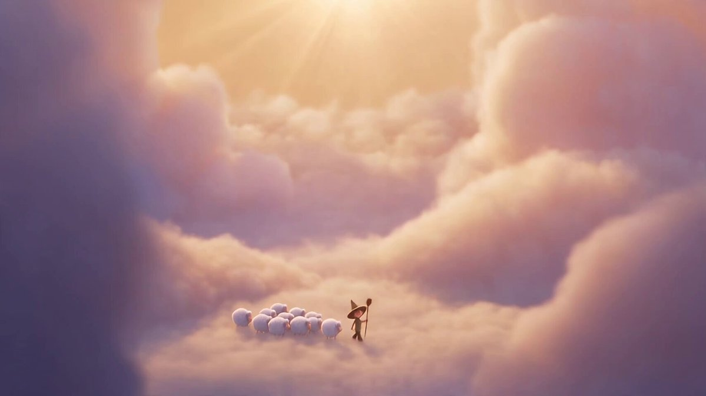</a>

<a href="https://x.com/Dheepanratnam/status/2084145163694129428">▶️ 在 X 上观看视频</a>

</div>

<details>
<summary><b>📋 点击展开 / 复制提示词</b></summary>

```
Json Prompt - Seedance 25 t2v model 

{

"title": "Cloud Shepherd",

"style": "3D Pixar family animation. Floating islands, pastel sky, fluffy cloud-sheep with little legs, golden morning light, whimsical.",

"shots": [

{"time":"00:00-00:03","type":"EXTREME WIDE","action":"Crane shot down through cotton-candy clouds. Shepherd whistles, herding cloud-sheep with feather-duster staff.","camera":"Crane descending. Sun flares.","dialogue":"(whistling)"},

{"time":"00:03-00:06","type":"WIDE","action":"One cloud-sheep drifts away, forms T-rex, then bicycle. Other clouds confused. Shepherd's shoulders drop.","camera":"Static.","dialogue":"Shepherd: 'Bramble, stop becoming a dinosaur! You are a sheep!'"},

{"time":"00:06-00:09","type":"CLOSE-UP","action":"Cloud-sheep shifts into heart shape, floats down, nuzzles shepherd's cheek. She gets slightly damp.","camera":"Macro. Water droplets on freckles.","dialogue":"Shepherd: (giggles, softening) 'Okay, one dinosaur.'"},

{"time":"00:09-00:13","type":"TRACKING","action":"Shepherd chases flock to wooden pen. Cloud-sheep becomes slide, duck, then sheep again, hops inside.","camera":"Side-tracking, fast. Vapor trails.","dialogue":"Shepherd: 'Then we go inside.'"},

{"time":"00:13-00:17","type":"WIDE","action":"Dark grumpy-faced storm cloud approaches. Shepherd looks up worried. Opens tiny umbrella.","camera":"Low angle. Thunder rumbles.","dialogue":"(none)"},

{"time":"00:17-00:23","type":"MEDIUM","action":"Cloud-sheep huddle under tiny umbrella, spilling out. Bramble becomes umbrella shape to help cover.","camera":"High angle. Rain falls golden around them, not on them.","dialogue":"(rain patter, contented baaing)"},

{"time":"00:23-00:27","type":"CLOSE-UP","action":"Shepherd hugs Bramble. Feels like warm cotton. Rainbows in vapor. Eyes closed peaceful.","camera":"Extreme close-up.","dialogue":"(soft humming)"},

{"time":"00:27-00:30","type":"WIDE","action":"Storm passes. Sun returns. Shepherd and flock walk across rainbow bridge to next island, perfectly in line.","camera":"Pull back. Pastel sky.","dialogue":"(whistling resumes)"}

]

}
```

</details>

> 💡 JSON 结构 prompt

**👤 出处:** [@Dheepanratnam](https://x.com/Dheepanratnam) · [source](https://x.com/Dheepanratnam/status/2084145163694129428)

▶️ **用 API 跑这条提示词** → [Velokey](https://velokey.ai/model/doubao-seedance-2-5-text-to-video?sourceChannel=github-awesome-seedance)（模型 id：`seedance-2.5`）

---

### No.76 90 秒科幻三幕剧

 

<div align="center">

<a href="https://x.com/LudovicCreator/status/2084157396352372836">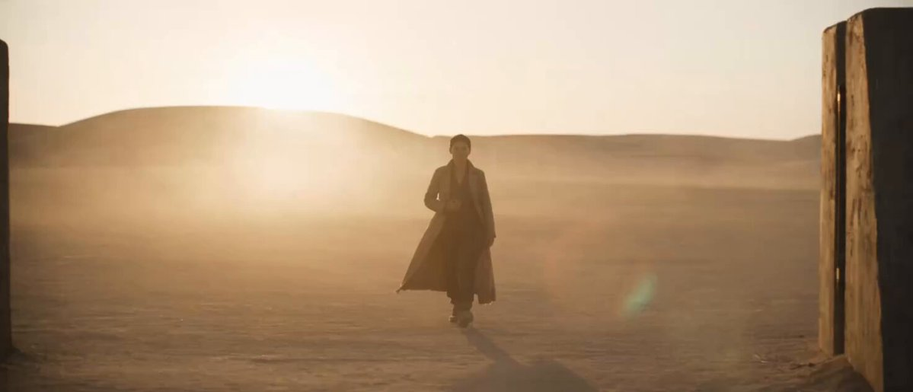</a>

<a href="https://x.com/LudovicCreator/status/2084157396352372836">▶️ 在 X 上观看视频</a>

</div>

<details>
<summary><b>📋 点击展开 / 复制提示词</b></summary>

```
Create a photorealistic 90-second sci-fi drama in native 21:9 anamorphic, structured as three connected 30-second scenes. Use @Image1 as Mara’s exact identity lock and @Image2 as Veyr’s exact identity lock. Preserve their exact faces, hair, mask, wardrobe, body proportions, compass design, room layout and sunset direction throughout all three scenes.

One isolated desert checkpoint at sunset: warm low sunlight, windblown dust, concrete walls and a quiet inspection room overlooking the desert.

Mara: adult female courier, cropped dark hair, weathered tan coat, calm guarded expression. Voice always identical: low warm contralto, neutral accent, measured pace, quiet confidence.

Veyr: adult male checkpoint officer, dark uniform, black gloves and a simple metal half-mask. Voice always identical: restrained deep baritone, neutral accent, slow deliberate delivery, subtle metallic resonance.

Only one person speaks at a time. No overlapping dialogue. Use stable medium close-ups during speech. Maintain clear lip movement and consistent vocal tone.

SCENE 1 :0–30s
Wide exterior as Mara approaches carrying a brass compass. Inside, Veyr sits opposite her. He asks: “Where did you find it?” Two-second pause. Mara replies: “It found me.” End on a stable close-up of the compass between them.

SCENE 2 : 30–60s
Begin on the same compass close-up, matching hand positions and lighting. Slow pullback. Veyr says: “That object disappeared twenty years ago.” Mara covers it gently and replies: “Then stop looking for it.” A distant light appears outside. Both move to the window. End on a locked medium-wide frame with both faces clearly visible.

SCENE 3 : 60–90s
Begin from the same window composition. The light grows brighter through the dust. Veyr opens the gate and says: “You have five minutes.” Mara asks: “Why help me?” Veyr answers: “Because I remember what came through last time.” Mara exits into the sunset. Hold Veyr in a clean medium close-up as the horizon fills with light. Cut to black.

Grounded performances, restrained camera movement, realistic skin, cloth, dust and metal, subtle anamorphic flares, natural room tone, no subtitles, no onscreen text.
2/2
```

</details>

> 💡 需人物参考图

**👤 出处:** [@LudovicCreator](https://x.com/LudovicCreator) · [source](https://x.com/LudovicCreator/status/2084157396352372836)

▶️ **用 API 跑这条提示词** → [Velokey](https://velokey.ai/model/doubao-seedance-2-5-text-to-video?sourceChannel=github-awesome-seedance)（模型 id：`seedance-2.5`）

---

### No.77 史诗奇幻大片

 

<div align="center">

<a href="https://x.com/yesand_ai/status/2083181765590667766"></a>

<a href="https://x.com/yesand_ai/status/2083181765590667766">▶️ 在 X 上观看视频</a>

</div>

<details>
<summary><b>📋 点击展开 / 复制提示词</b></summary>

```
NO MUSIC, ONLY NATURAL SOUND — Epic blockbuster fantasy, shot on ARRI Alexa 65 with IMAX-scale anamorphic lenses, warm golden-hour daylight breaking through canyon haze, drifting mist and volumetric god-rays, with grounded handheld energy during the run building into a sweeping aerial glide in flight. In the sweeping rocky valley from Image3, tiered waterfalls spill down the cliffs, scattered pines line a winding dirt trail across the canyon floor, and tall sandstone mesas dissolve into low mist. A side-tracking shot moves parallel to ERYAN (Image1) as he sprints in profile across the dirt trail, staying low on his feet as they pound the ground and kick up dust and grit. The camera gradually eases back to hold his full body in frame: a lean young man wearing a tattered beige linen tunic belted with a wide leather sash, with black wavy hair, green eyes, and cloth bindings wrapped around his lower legs, driving toward a jutting rock outcrop. Staying lateral with him, the camera follows as he reaches the lip and launches off the edge into open air above the valley. Slow motion at the peak of the leap, held in side profile, with his body suspended against the waterfalls far below, his tunic and hair lifting and his arms spread wide. The forward momentum of the jump carries him into a long downward arc, still traveling forward as he drops, and within the same continuous motion THE GRIFFIN (Image2)—with an eagle head, dark brown plumage, tufted ears, pale eyes, a hooked gray beak, black-brown wings, tawny lion hindquarters, a leather saddle, and braided rope reins—sweeps upward from below in a rush of powerful wingbeats and slides beneath him mid-arc, catching him on its back. Return to real time as ERYAN (Image1) settles into the saddle, grabs the rope reins tightly in both fists, and the griffin banks hard into flight. Dynamic flight sequence: a wide aerial shot follows THE GRIFFIN (Image2) sweeping down the canyon between towering cliff walls, its wingtips skimming a cascading waterfall as spray mists across its feathers. Cut to a tight side-profile tracking shot of ERYAN (Image1) leaning low over the griffin’s neck, wind tearing through his hair as a wide grin breaks across his face and his breath becomes visible. Cut to a low hero shot of THE GRIFFIN (Image2) from the front, wings stretched to their full span, driving forward with powerful downbeats and its eyes locked ahead. Cut to an over-the-shoulder shot from behind ERYAN as the valley opens before him, with waterfalls, pines, and mist-covered mesas streaming past below. The griffin rises through a shaft of golden light and levels out into a long, graceful glide over the ridge. Faces, wardrobe, feather patterns, anatomy, and proportions remain perfectly locked to the reference sheets, with lighting and landscape matched to Image3. SFX: pounding footsteps, scattering grit, the whoosh of the leap, the heavy thunder of wingbeats, rushing wind, distant waterfall roar, Eryan’s laughing breath, and creaking saddle leather. Cinematic 4K, subtle filmic grain, accurate feather and cloth physics, grounded natural motion, no music, no text, no watermark, no CGI plasticity.
```

</details>

**👤 出处:** [@yesand_ai](https://x.com/yesand_ai) · [source](https://x.com/yesand_ai/status/2083181765590667766)

▶️ **用 API 跑这条提示词** → [Velokey](https://velokey.ai/model/doubao-seedance-2-5-text-to-video?sourceChannel=github-awesome-seedance)（模型 id：`seedance-2.5`）

---

### No.78 日本浴衣旅行 Vlog

 

<div align="center">

<a href="https://x.com/zasuko_michiksa/status/2083951358877798818">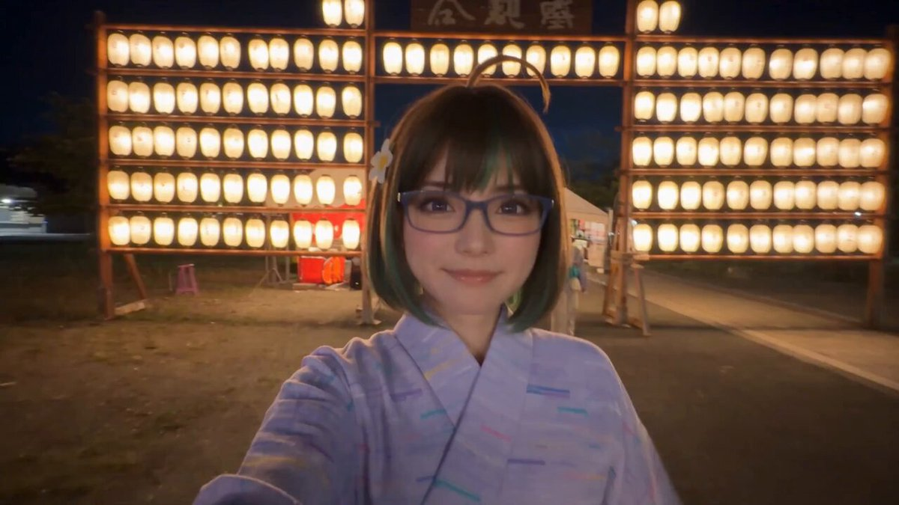</a>

<a href="https://x.com/zasuko_michiksa/status/2083951358877798818">▶️ 在 X 上观看视频</a>

</div>

<details>
<summary><b>📋 点击展开 / 复制提示词</b></summary>

```
Promptはこんな感じです👇
＝＝＝＝＝＝＝＝＝＝＝＝＝＝＝＝＝＝
A 30-second photorealistic smartphone travel vlog featuring Michikusa Zasuko, a real Japanese woman, based on the attached multi-panel character reference sheet.

REFERENCE ROLE: Use the attached image only as the identity, face, hairstyle, blue-purple glasses, white flower hair clip, pastel summer yukata, green obi, purple bow detail, and green sandals reference. Do not reproduce the reference sheet layout, panels, labels, text, or color swatches. Keep Zasuko's appearance consistent in every shot.

STYLE: Natural handheld smartphone footage, realistic Japanese summer festival at night, warm lantern light, authentic crowd ambience, believable human motion, natural facial expressions, realistic phone-camera exposure, 16:9 horizontal vlog. Zasuko is the only featured person and looks directly into the phone during selfie moments.

TIMELINE:
00-04s: Front-facing selfie introduction while walking into a lantern-lit traditional Japanese summer festival. She smiles naturally and briefly shows her pastel yukata.
04-10s: Over-the-shoulder and selfie cutaways of lanterns, food stalls, and festival visitors; she turns the phone back to herself with a small excited reaction.
10-16s: She buys fresh takoyaki, takes one bite, reacts with a warm delighted smile, and shows the food close to the phone camera. Keep hands and food realistic.
16-21s: She plays a simple traditional festival ring-toss game and wins a small plush toy inspired by her official Geneko mascot; she celebrates modestly and naturally.
21-26s: The crowd watches fireworks. Zasuko looks up, then turns the phone toward the bright fireworks and back to her face, preserving the same yukata and hairstyle.
26-30s: Close selfie ending. She waves once and says in natural Japanese with accurate lip sync: "浴衣で夏祭り、めっちゃ楽しいです！ たこ焼きも花火も最高ですね〜！ジェネコにも食べさせてあげたいなぁ。 ふふふ、また一緒に道草しましょうね！"

AUDIO: Natural Japanese spoken dialogue only for the final line, clear female voice, accurate lip sync. Generate authentic footsteps, festival crowd murmur, distant festival music, takoyaki cooking sounds, game stall sounds, and fireworks. Do not generate background music over the dialogue. No subtitles, no captions, no logos, no watermark, no readable invented text.

CONTINUITY LOCK: same face, glasses, bob haircut with green streaks, white flower clip, pastel yukata, green obi, proportions, and accessories across all shots. Avoid face drift, extra fingers, deformed hands, duplicated people, costume changes, anime or illustration styling, plastic skin, abrupt camera jumps, and text artifacts.
```

</details>

> 💡 需人物参考图

**👤 出处:** [@zasuko_michiksa](https://x.com/zasuko_michiksa) · [source](https://x.com/zasuko_michiksa/status/2083951358877798818)

▶️ **用 API 跑这条提示词** → [Velokey](https://velokey.ai/model/doubao-seedance-2-5-text-to-video?sourceChannel=github-awesome-seedance)（模型 id：`seedance-2.5`）

---

### No.79 30 角色家庭晚餐

 

<div align="center">

<a href="https://x.com/aimikoda/status/2083415174556307528"></a>

<a href="https://x.com/aimikoda/status/2083415174556307528">▶️ 在 X 上观看视频</a>

</div>

<details>
<summary><b>📋 点击展开 / 复制提示词</b></summary>

```
[all char refs], a big family dinner, cinematic footage, multiple cuts, dynamic camera angels. show all characters, 20 cuts.

You can find character sheets in the quoted post.
```

</details>

> 💡 需多张角色参考图

**👤 出处:** [@aimikoda](https://x.com/aimikoda) · [source](https://x.com/aimikoda/status/2083415174556307528)

▶️ **用 API 跑这条提示词** → [Velokey](https://velokey.ai/model/doubao-seedance-2-5-text-to-video?sourceChannel=github-awesome-seedance)（模型 id：`seedance-2.5`）

---

### No.80 3 分钟前卫电影

 

<div align="center">

<a href="https://x.com/Christian_Luoma/status/2083562206810046802"></a>

<a href="https://x.com/Christian_Luoma/status/2083562206810046802">▶️ 在 X 上观看视频</a>

</div>

<details>
<summary><b>📋 点击展开 / 复制提示词</b></summary>

```
First try of 3 minute generation with @dreamina_ai Seedance 2.5 . Very simple prompt, two reference images, make an avant garde film about control and conniving environments absorbing the main character. 480p res.  Result definitely is very art house, some continuation issue and audio is what it is, but I could see this as a tool for brainstorming scenes and edits. Cost ~4100 credits in Dreamina
```

</details>

> 💡 需2参考图

**👤 出处:** [@Christian_Luoma](https://x.com/Christian_Luoma) · [source](https://x.com/Christian_Luoma/status/2083562206810046802)

▶️ **用 API 跑这条提示词** → [Velokey](https://velokey.ai/model/doubao-seedance-2-5-text-to-video?sourceChannel=github-awesome-seedance)（模型 id：`seedance-2.5`）

---

### No.81 高空 POV 攀登动作

 

<div align="center">

<a href="https://x.com/martindacol/status/2083795741605310486">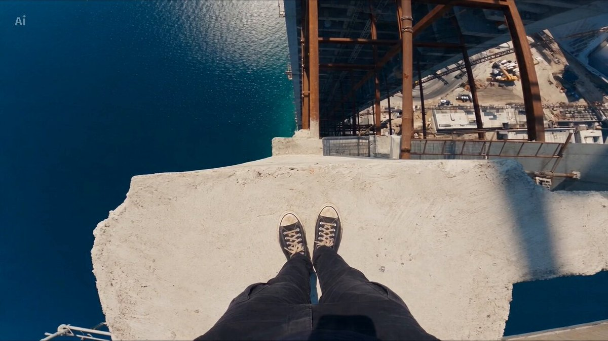</a>

<a href="https://x.com/martindacol/status/2083795741605310486">▶️ 在 X 上观看视频</a>

</div>

<details>
<summary><b>📋 点击展开 / 复制提示词</b></summary>

```
A hyper-realistic, 8K resolution, adrenaline-fueled single-take POV action sequence. The camera is chest-mounted on a man wearing camouflage joggers and worn-out black-and-white sneakers. He stands on the dizzying edge of a rusted skyscraper, 1000 feet above a crystalline turquoise ocean. No clouds, no haze—just a sheer, terrifying vertical drop into the deep blue.

[The Initial Freefall]
The sequence begins with a sudden, heart-stopping leap into a 20-meter vertical freefall. The camera points directly at his feet as the sea surface rushes toward the lens. A deafening, high-pitched whistling 'Hyuo' wind screams past the microphone. Just before the impact, he catches a lower rusted horizontal bar with both hands—white wristband visible—and swings his body forward to land on a tiny vertical pole.

[The Rhythmic Jumps & The Near-Death Slip]
He immediately begins a rhythmic series of high-speed jumps:

Jump 1: A clean, agile spring to a second vertical pole 2 meters away.

Jump 2: A rapid leap to a thin, rusted horizontal pipe.

Jump 3 (The Slip): As he jumps toward the third vertical pole, his right sneaker completely misses the mark and slides off the rusted metal. The camera tilts violently over the edge, staring straight down at the 1000-foot abyss. He lets out a sharp, panicked gasp. For a terrifying second, his body leans into the void, but he desperately claws at the pole with his fingers, his boots scrambling against the side until he manages to hook his leg and haul himself back up.

Jump 4: Still trembling, he forces a frantic, heavy-breathing leap to the next bar to keep the momentum.

Jump 5: A final, explosive long-distance jump to a swaying metal platform. He lands with a heavy, jarring metallic 'Clang', his body hunching low, gripping the vibrating metal for dear life.

[The Ending]
The camera remains in a low, fetal position on the final bar, shaking from the adrenaline. No dialogue. The audio is a visceral layer of the aggressive 'Hyuo' wind, his intense, ragged, and rapid gasping for air, and a loud, thumping heartbeat that resonates as if inside his chest. The harsh midday sun glints off the ocean waves far below, creating a blinding, beautiful, yet lethal glare. Cinematic materials, fluid 120fps motion, hyper-detailed rust and skin textures.
```

</details>

**👤 出处:** [@martindacol](https://x.com/martindacol) · [source](https://x.com/martindacol/status/2083795741605310486)

▶️ **用 API 跑这条提示词** → [Velokey](https://velokey.ai/model/doubao-seedance-2-5-text-to-video?sourceChannel=github-awesome-seedance)（模型 id：`seedance-2.5`）

---

### No.82 雨林野生动物特写

 

<div align="center">

<a href="https://x.com/cipgerx/status/2083607693256712347">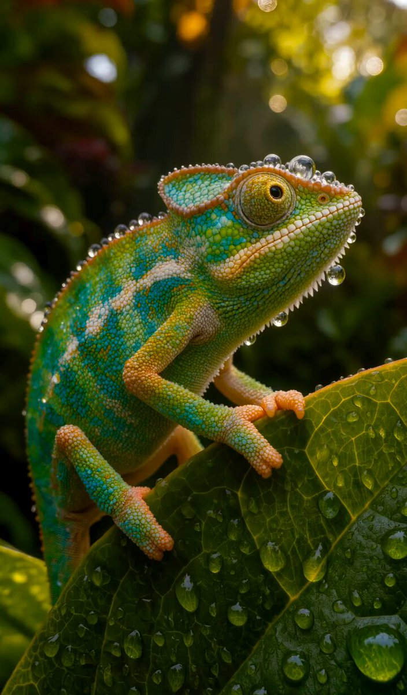</a>

<a href="https://x.com/cipgerx/status/2083607693256712347">▶️ 在 X 上观看视频</a>

</div>

<details>
<summary><b>📋 点击展开 / 复制提示词</b></summary>

```
A wildlife photographer with 23 years of experience just told me this clip broke something in his head

"I spent six hours in a rainforest in Madagascar waiting for this exact shot. Humidity destroyed two lenses. A spider bit my assistant. I got four usable seconds"

This clip is seventeen seconds. Every scale. Every water droplet refracting light through the skin texture. The eye rotation tracking the camera

It was rendered in nine minutes

He asked me to stop sending him these. Not because they're bad. Because he can't tell the difference between his footage and this anymore. And if he can't, nobody can

Macro photography was supposed to be the one genre AI couldn't touch. Too much detail. Too much texture. Too much real-world chaos in every water droplet

That argument ended today

Seedance 2.5. Nine minutes. One prompt. The rainforest, the spider, and the six-hour wait are now optional
```

</details>

**👤 出处:** [@cipgerx](https://x.com/cipgerx) · [source](https://x.com/cipgerx/status/2083607693256712347)

▶️ **用 API 跑这条提示词** → [Velokey](https://velokey.ai/model/doubao-seedance-2-5-text-to-video?sourceChannel=github-awesome-seedance)（模型 id：`seedance-2.5`）

---

### No.83 办公椅野生纪录片·恶搞

 

<div align="center">

<a href="https://x.com/TheMavel/status/2083995038170702143">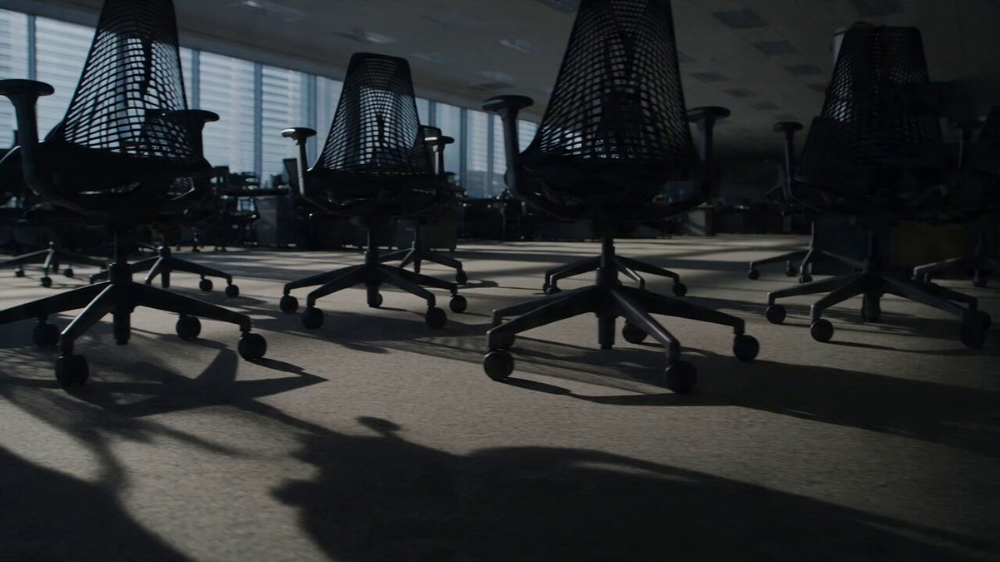</a>

<a href="https://x.com/TheMavel/status/2083995038170702143">▶️ 在 X 上观看视频</a>

</div>

<details>
<summary><b>📋 点击展开 / 复制提示词</b></summary>

```
From time to time I try out the video models with some bullshit prompts to see if they can do anything with it. Like a wildlife documentary about office chairs...

Seedance 2.5

One prompt. Three connected scenes. 
It genuinely blew me away.

Prompt guide
```

</details>

**👤 出处:** [@TheMavel](https://x.com/TheMavel) · [source](https://x.com/TheMavel/status/2083995038170702143)

▶️ **用 API 跑这条提示词** → [Velokey](https://velokey.ai/model/doubao-seedance-2-5-text-to-video?sourceChannel=github-awesome-seedance)（模型 id：`seedance-2.5`）

---

### No.84 悬浮滑板 T2V+R2V

 

<div align="center">

<a href="https://x.com/digitalwindai/status/2083219991856304394">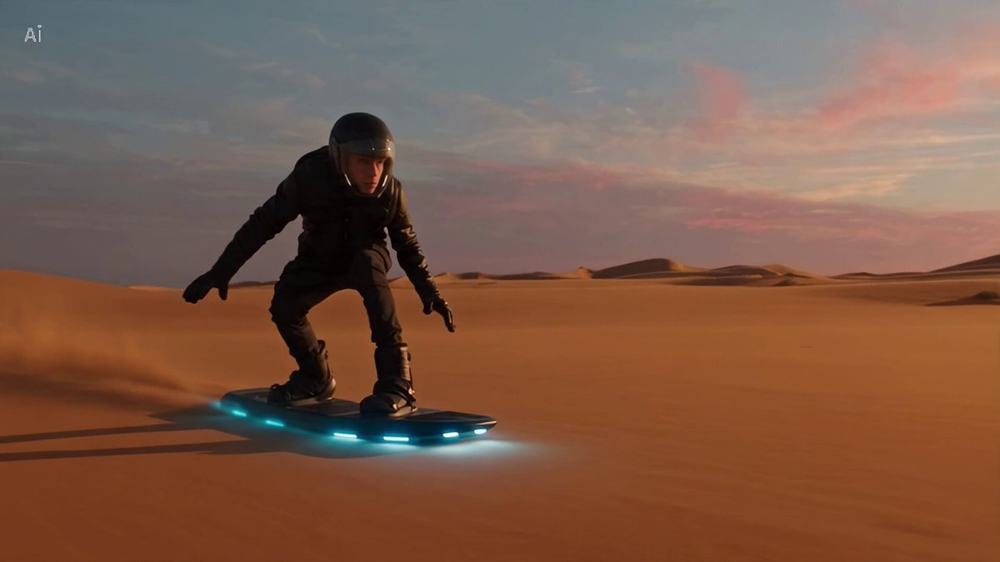</a>

<a href="https://x.com/digitalwindai/status/2083219991856304394">▶️ 在 X 上观看视频</a>

</div>

<details>
<summary><b>📋 点击展开 / 复制提示词</b></summary>

```
🛹 Seedance 2.5 Hover Board T2V+R2V

Started simple — text to video, just a couple of short lines. Then attached that 30s piece as a reference and wrote a detailed prompt.

Really cool and expensive 😎

▾ My take and the full prompt below

1. Consistency is unreal, considering the only reference was a video
2. The sound artifacts are gone — audio got significantly better
3. Realism and physics are off the charts

Prompt

SOURCE AND CONTINUATION
Extend @video1. This is a direct continuation that begins at the exact frame where @video1 ends — the same ride, the same day, the next stretch of desert. Every shot below is new material that happens after the source footage, not a retelling of it.
Preserve exactly from @video1: the rider's identity, helmet and visor, black riding suit, gloves and boots; the hoverboard and its cyan underglow; the desert world, dune shapes and haze; the low golden sun and its direction; the colour grade; and the music, which continues unbroken in the same key, tempo and arrangement with no restart.
CHARACTERS
The rider: same man from @video1, full dark helmet with a clear visor and two white light strips, black armored riding suit, gloves, boots. Identical in every shot. He rides the same hoverboard, lit underneath by a continuous cyan strip.
LOCATION MAP
Foreground: open sand, wind-carved ripples, loose grit lifting off the crests.
Midground: the ride path — dunes flattening into a cracked salt pan that runs into a post-apocalyptic ruin field of collapsed concrete slabs, leaning steel columns, half-buried vehicle hulls and broken roadway sections.
Background: a low sandstone cliff wall on the far side of the ruins, and beyond it open sky with the sun sitting low on the horizon.
The rider travels camera-left to camera-right in every lateral view. The sun stays low and ahead of him, camera-right, throughout.
FIRST FRAME / BLOCKING
Full-frame lateral profile close-up of the rider, 18°, camera tracking alongside him at his own speed, his helmet filling the right third of frame in sharp profile, dunes streaking past behind him, cyan board glow spilling up onto his boots from below.
FORMAT MODE
Timed multishot with HARD CUTS only at 4.0s, 8.0s, 12.0s, 15.0s, 19.0s, 23.5s and 27.0s. The camera cuts only at these points. Real-time playback everywhere except 19.0–23.5s, which is slow motion; the speed change happens only on those two hard cuts.
STORYBOARD
SHOT 1 (0.0–4.0s)
Lateral profile close-up, 18°, camera tracking beside him at 60 km/h, level with his shoulder. He rides steady, head turning a few degrees forward as the ruins come into his sightline, then his shoulders drop slightly and he leans in. Sand streams off the board's trailing edge behind him. Low sun rakes across the front of his visor from camera-right, leaving the far side of his helmet in deep shade.
SHOT 2 (4.0–8.0s)
HARD CUT to an extreme wide, 84°, camera high and static as he crosses the frame camera-left to camera-right at 60 km/h, a small figure with a cyan thread of light beneath him. Ahead of him the ruin field opens up — collapsed slabs and leaning steel standing as tall as six humans, throwing long shadows across the salt pan.
SHOT 3 (8.0–12.0s)
HARD CUT to a low tracking shot, 47°, camera 30 cm off the ground running with him at 70 km/h as he enters the ruins. He weaves between two leaning columns, board tilting hard onto its edge, a sheet of sand and grit fanning off the tail. Broken concrete passes close on both sides. Cyan underglow flares against the slab faces as he passes them.
SHOT 4 (12.0–15.0s)
HARD CUT to a medium shot from the front quarter, 29°, camera drifting backward ahead of him at 70 km/h. He drops into a deep drift, both arms out for balance, the board sliding sideways through a curve of debris, a long curtain of dust thrown out behind him and catching the low sun. His head stays locked on his line through the turn.
SHOT 5 (15.0–19.0s)
HARD CUT to a low rear three-quarter shot, 63°, camera accelerating with him from 70 to 110 km/h. He crouches, drives his weight forward, and the board's cyan strip brightens as it surges. Ahead of him a broken roadway section rises out of the sand at a shallow angle, its torn edge lifted clear of the ground. He hits it square and launches.
SHOT 6 (19.0–23.5s)
HARD CUT into SLOW MOTION. Wide side view, 47°, camera craning slowly upward with him against the low sun. He is airborne at the apex, board still under his feet, one hand gripping the front edge, knees folded. A full curtain of sand hangs suspended around and beneath him, every grain lit gold from camera-right and drifting rather than falling. The cyan glow underneath him rakes across the suspended sand. The whole shot stays in slow motion start to finish.
SHOT 7 (23.5–27.0s)
HARD CUT back to real time. Low tracking shot, 47°, camera behind and beside him. He lands hard, board slapping the sand and compressing, a burst of grit blowing outward from the impact, and he rides straight out of it at 110 km/h across the last open stretch toward the sandstone cliffs. The ruins fall away behind him.
SHOT 8 (27.0–30.0s)
HARD CUT to a lateral profile medium shot, 29°, camera settling alongside him and coming to rest as he does. He carves the board hard sideways and brakes, throwing a low wide sheet of sand forward and to camera-right, and stops at the cliff edge. He straightens up, squares his shoulders, and turns his helmet to face the sun sitting on the horizon. Held final frame: the rider in profile at the cliff edge, sand still settling around the board, the cyan glow steady beneath him, the sun low ahead of him.
PERFORMANCE
Everything reads through the body, since his face is behind the visor: weight shifting into each turn, arms counterbalancing the drift, the deep crouch before the launch, the folded stillness at the apex, the absorbed compression of the landing, and the settled straightening at the very end. Restrained and controlled throughout — a rider who knows this ground.
PHYSICS
The board carries real mass and inertia. It leans into turns and rebounds on landing. Sand behaves as loose dry grain: it fans off the edge under load, hangs in a curtain in slow motion, blows outward in a burst on impact, and settles slowly at the end. Dust catches and scatters the low sun. Wind drags loose grit off the dune crests continuously. Debris in the ruins stays put; only sand and dust move.
LIGHTING
Fixed 3200K golden-hour sun, low on the horizon ahead of the rider and camera-right, unchanged in every shot. Hard warm key on the front of his suit and visor, deep shade on the far side, long shadows running away camera-left across the sand and the ruin floor. Airborne dust glows where it crosses the sun. Cyan board light acts as a cold practical from below, catching his boots, the sand under him and nearby slab faces.
AUDIO
The music from @video1 continues unbroken through the whole extension — same track, same key, same tempo, no restart and no new song. Under it: the low hum of the board, wind across open sand, grit spraying off the edge, concrete and steel echoing close in the ruins.
At 19.0s the mix thins for the slow-motion shot — the music drops to a single sustained low note, and the suspended sand and the board's hum sit at the front.
At 23.5s the full arrangement returns hard on the landing impact.
In the final shot the music resolves and holds under open desert wind. No dialogue anywhere.
OUTPUT SETTINGS
16:9, real-time in every segment except 19.0–23.5s, which is slow motion.
POSITIVE LOCKS
This is a continuation of @video1 — all action takes place after the source footage ends.
The rider, helmet, visor light strips, suit and the hoverboard's cyan underglow stay identical to @video1 in every shot.
The rider travels camera-left to camera-right in every lateral view, and the sun stays low and camera-right in every shot.
One continuous piece of music runs from the first frame to the last, carried over from @video1.
The board keeps complete geometry and stays under his feet through the jump and landing.
Cuts land only at the stated seconds, and the speed change to slow motion happens only at 19.0s and back at 23.5s.
The video ends on the held profile of the rider stopped at the cliff edge, facing the low sun.
```

</details>

**👤 出处:** [@digitalwindai](https://x.com/digitalwindai) · [source](https://x.com/digitalwindai/status/2083219991856304394)

▶️ **用 API 跑这条提示词** → [Velokey](https://velokey.ai/model/doubao-seedance-2-5-text-to-video?sourceChannel=github-awesome-seedance)（模型 id：`seedance-2.5`）

---

### No.85 咖啡馆哲学对话

 

<div align="center">

<a href="https://x.com/digitalwindai/status/2083281155286085911">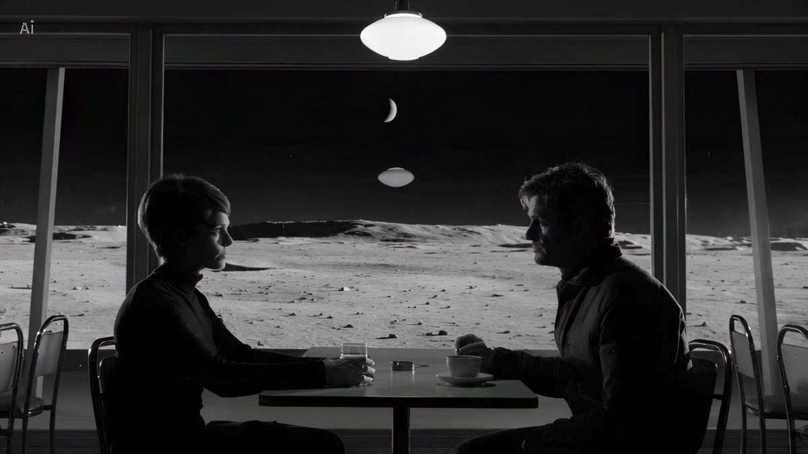</a>

<a href="https://x.com/digitalwindai/status/2083281155286085911">▶️ 在 X 上观看视频</a>

</div>

<details>
<summary><b>📋 点击展开 / 复制提示词</b></summary>

```
☕ Dialogues about the eternal in Seedance 2.5

Turns out 30 seconds holds about ten lines of dialogue and nothing more. Every second of silence costs you one.

Text to video

▾ Full prompt below

META

STYLE
Black-and-white 35mm arthouse cinema, 1960s European café-film look. High-contrast monochrome, soft film grain, gentle bloom on the lamps, shallow depth of field on close-ups.

LIGHT
Night interior lit only by practicals: hanging globe lamps, the espresso machine's glow, and cold light through the window from the lunar plain. Soft key from the window side, deep shadow in the corners, clear catch-lights in the eyes.

COLOR
None. Full grayscale, rich mid-grays on skin, no tint of any kind.

TEXTURE
Fine grain. Chrome holds soft rolling reflections, glass refracts the lamps in small bright points, skin keeps visible pore-level texture with no smoothing.

MOOD
Quiet, intimate, unhurried — a conversation overheard in a place that is ordinary to the people in it.

SCENE CONTEXT
A near-empty late-night café on the surface of the moon. A man and a woman sit across a small round table beside the wide window, talking about the water. Neither of them ever looks outside.

CHARACTERS

The woman: early thirties, dark bob haircut, intelligent face, dark turtleneck with the cuffs visible at her wrists, thin earrings, light coat over her chair. She sits camera-left. Identical in every shot.

The man: mid-thirties, dark slightly messy hair, light stubble, shadowed under-eyes, dark jacket over an open-collar light shirt, jacket sleeve visible at his wrists. He sits camera-right. Identical in every shot.

LOCATION MAP
Foreground: their small round table. Her espresso cup and the single tall glass of water sit on her side, close to her right hand. His espresso cup and spoon sit on his side. Nothing else on the table.
Midground: small round tables, worn tiled floor, hanging globe lamps, chrome espresso machine at the counter.
Background: a wide window along the wall beside them. Beyond the glass, a grey lunar plain with low craters, black sky, and Earth small and low near the horizon.

FIRST FRAME / BLOCKING
Interior medium two-shot, 47°, eye level. The woman sits camera-left, the man camera-right, the window and lunar plain behind them, café interior deeper in the room. Her hands are around her cup with the water glass beside it, his forearms rest on the table.

FORMAT MODE
Timed multishot with HARD CUTS only at 6.0s, 8.5s, 11.0s, 13.0s, 16.0s, 19.0s, 22.5s, 25.0s and 28.0s. The camera cuts only at these points.

STORYBOARD

SHOT 1 (0.0–6.0s)
Medium two-shot, 47°, faint 1–2 cm breathing drift.
The woman, eyes on him: "Do you think people get more honest when they're tired?"
The man answers late, eyes coming up off the table: "No. Their lies just get less inventive."

SHOT 2 (6.0–8.5s)
Extreme close-up, 12°, of the woman's hands on her side of the table, dark turtleneck cuffs at her wrists. Her fingers leave her cup, lift the tall glass of water, and set it back down in the same place, the water rocking once.
The woman, speaking over the image: "It's different tonight."

SHOT 3 (8.5–11.0s)
Close portrait of the man, 18°, eyes down.
The man: "They changed the water."

SHOT 4 (11.0–13.0s)
Extreme close-up, 12°, of the man's hand on his side of the table, dark jacket sleeve at his wrist, turning his spoon a half-turn on the saucer.
The woman, speaking over the image from off-frame: "Again?"

SHOT 5 (13.0–16.0s)
Medium close-up of the man, 29°, lunar plain soft behind his shoulder, eyes still on his cup.
The man: "The old one remembered too much."

SHOT 6 (16.0–19.0s)
Close-up of the woman, 18°. Her eyes come up and hold his.
The woman: "Water can't remember people."

SHOT 7 (19.0–22.5s)
Medium close-up of the man, 29°. He swallows once, then looks up at her.
The man: "Probably not. But people can't remember the past either."

SHOT 8 (22.5–25.0s)
Medium two-shot, 47°, lunar plain behind them. She leans in slightly.
The woman: "Then what do we remember?"

SHOT 9 (25.0–28.0s)
Close portrait of the man, 18°. One breath, then his eyes come up and hold hers.
The man: "The last version we could live with."

SHOT 10 (28.0–30.0s)
Close-up of the woman, 18°, the lunar plain and black sky soft behind her through the glass. No dialogue. Her face stills, one slow blink, her eyes drop toward her cup and then drift slightly aside. The shot holds on her to the last frame, the image staying full and lit.

PERFORMANCE
Both faces stay mostly still, so small movements read. Emotion comes through eyelids, brow corners, jaw and breath rather than expression. Blinks work as punctuation — withheld through the important lines, released after. She runs from light and half-joking, to quieter, to genuinely curious, to quiet recognition at the end. He runs from dry amusement, to flat matter-of-fact, to unguarded tiredness on the last line. Living eyes with catch-lights, natural skin, precise lip sync whenever a speaking face is in frame. Every line is delivered unhurried and complete inside its own shot.

PHYSICS
Steam curls off the cups and the espresso machine. Water rocks and settles in the glass. The cup meets the saucer with weight, the spoon rings faintly on chrome. Nothing beyond the window moves.

AUDIO
The low hum of an enclosed room, a faint air-system whisper, the hiss of the espresso machine, a spoon against a saucer, a swallow of water. No music anywhere. Voices sit close and dry, as in a small room late at night.

OUTPUT SETTINGS
Black and white throughout, real-time, no slow motion.

POSITIVE LOCKS
The image stays fully monochrome in every shot.
The woman speaks her five lines and the man speaks his five lines, exactly as assigned in the storyboard, and neither ever speaks the other's words.
The single glass of water stays on the woman's side of the table for the whole scene, and only she touches it.
The woman stays camera-left and the man camera-right in every two-shot.
Hands in the extreme close-ups are identified by sleeve — turtleneck cuff for her, jacket sleeve for him.
The table holds only two espresso cups on saucers, two spoons and one glass of water.
The interior reads clearly as a café — table, cups, lamps, counter, espresso machine.
The window shows a grey lunar plain, black sky and small distant Earth wherever it is visible, and nothing beyond the glass ever moves.
Both characters keep their exact appearance and seats across every shot.
All ten lines are spoken in full and finish inside their own shot.
Cuts land only at the stated seconds.
The video ends on the held close-up of the woman's face, the image full and lit to the final frame.
```

</details>

**👤 出处:** [@digitalwindai](https://x.com/digitalwindai) · [source](https://x.com/digitalwindai/status/2083281155286085911)

▶️ **用 API 跑这条提示词** → [Velokey](https://velokey.ai/model/doubao-seedance-2-5-text-to-video?sourceChannel=github-awesome-seedance)（模型 id：`seedance-2.5`）

---

### No.86 动感 AI 音乐 MV

 

<div align="center">

<a href="https://x.com/digitalwindai/status/2083594010271129750">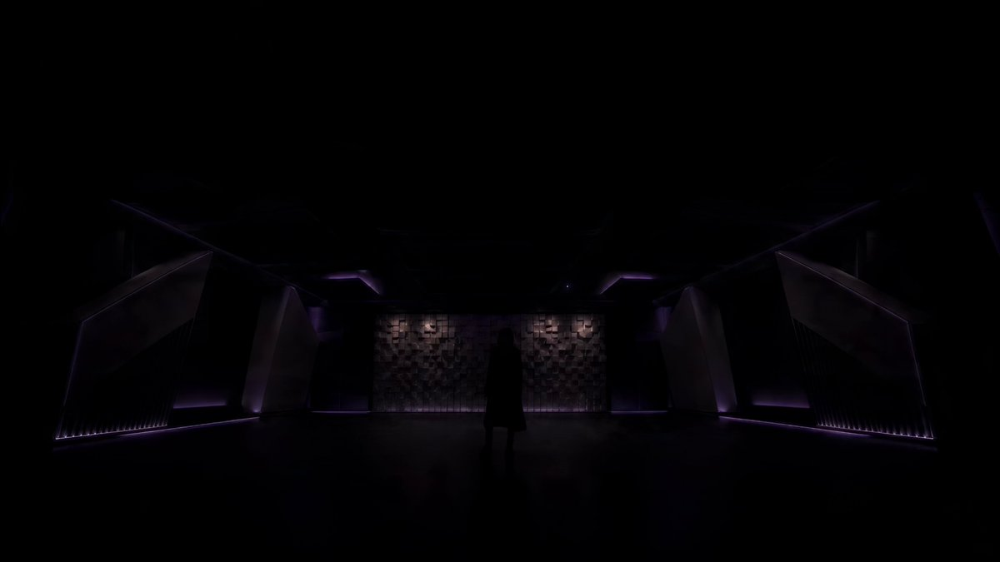</a>

<a href="https://x.com/digitalwindai/status/2083594010271129750">▶️ 在 X 上观看视频</a>

</div>

<details>
<summary><b>📋 点击展开 / 复制提示词</b></summary>

```
Ai artists manifest in Seedance 2.5

Pushed the new model to its limits with this dynamic AI music video.

▾Full prompt below and few takeaways:

- Prompt adherence has improved significantly.
- Audio artifacts are almost completely gone.
- Generating a full 30-second video in one pass is still risky — control and smaller details start to fall apart.
- Omni Reference reinterprets the input audio instead of preserving it exactly. For precise synchronization, separate shorter generations are still the safer workflow.
- I couldn’t stop the model from repeating parts of the lyrics. Adding the lyrics to the prompt actually made it worse, sometimes creating duplicated lines and extra voices.
- Local editing tools probably won’t solve that particular issue.

So be careful with your credits when generating 30-second clips.

@BytePlusGlobal Still, the result is kind of staggering — especially the physical consistency, camera dynamics, character performance, and environmental motion.

Made in @capcutapp with GPT-2 for references.

Prompt

REFERENCE SCOPE

@ IMAGE1 defines only the artist’s identity and wardrobe. Preserve her face, platinum-white blunt bob, round black sunglasses, slim athletic build, long narrow black coat, oversized white T-shirt, short black technical shorts, heavy black boots, and the small white H on the front left chest.

@ IMAGE2 defines the studio: matte black floor and walls, monumental angled white acoustic structures, large white ceiling panels separated by deep cosmic gaps with restrained violet-blue nebulae, and the sculptural cube-like rear wall.

@ IMAGE3 defines the exact first frame: composition, symmetry, camera position, artist scale and darkness. The ceiling must follow @ IMAGE2.

@ VIDEO1 is the sole fixed audio reference and exact performance-timing reference. Ignore its black visual track.

AUDIO

Keep the audio from @ VIDEO1 unchanged at its original timestamps from beginning to end.

All cuts and camera changes affect only the image. They must not alter the audio timing.

Do not generate any new audio, vocals, voices, sound effects, ambience, room tone, impacts or transition sounds.

DIRECTION

Create a cinematic photorealistic underground female rap performance video, 16:9, 1080p.

Keep the artist recognizable and dominant. Her movements feel natural and confident: brief stillness, loose asymmetric gestures, weight shifts, torso turns, short purposeful steps and occasional approaches toward the lens.

No repetitive foot tapping, stomping or looping gestures.

Use lively human handheld camera work: pushes, recoils, brief impact jolts, small tilts, slight overshoots and quick corrections. Keep her face readable. Avoid continuous random shaking and smooth floating gimbal movement.

SHOT STRUCTURE

0–4 SECONDS — OPENING

Start exactly on @ IMAGE3 with no pre-roll or alternate opening frame.

She prepares in darkness with her mouth closed. The studio wakes suddenly in one synchronized lighting event.

The camera immediately makes one fast physical rush-in with natural motion blur, reaching a tight frontal medium close-up as the performance begins. No cut before this moment.

4–8 SECONDS — FRONTAL CLOSE PERFORMANCE

Tight frontal medium close-up. She performs directly toward the lens with natural varied gestures.

The camera stays close, reacting to her forward movement with short pushes and recoils. Ceiling panels clearly shift between dark, dim and bright groups.

HARD CUT.

8–12 SECONDS — LOW-ANGLE PERFORMANCE

Low wide-angle medium shot near the floor. She remains large in frame, takes one purposeful step and leans toward the lens.

Use one strong handheld jolt, a brief horizon tilt and a fast correction.

WHIP CUT motivated by her movement.

12–16 SECONDS — SIDE STRUCTURE

Three-quarter side performance beside one monumental white acoustic structure.

The camera tracks diagonally closer while she turns toward the lens. The nearby structure shifts subtly once and the ceiling lighting continues changing.

HARD CUT.

16–20 SECONDS — EXTREME CLOSE PERFORMANCE

Frontal close-up with strong proximity.

The camera pushes close, recoils, briefly moves off-axis and recovers her face. Her performance remains natural, intense and varied.

End with a clean hard cut. No palm covering or touching the lens.

20–24 SECONDS — CUBE WALL PERFORMANCE

Close angled performance in front of the exact sculptural cube rear wall from image2.

The cube relief moves in broad connected mechanical waves with visible depth, weight and changing shadows. Nothing detaches or flies.

The camera stays close and handheld while she performs in front of the moving wall.

HARD CUT.

24–30 SECONDS — FINAL CLIMAX

Close hero performance at the exact cube rear wall. Move progressively closer throughout this final shot.

The cube wall, side structures and ceiling lighting reach their strongest controlled kinetic state while the studio remains physically intact.

The camera becomes more energetic with brief jolts, forward pressure and quick corrections, while keeping her face clear and dominant.

Near the end, she smoothly removes her sunglasses and reveals beautiful realistic eyes with subtle natural violet irises. No glow, emitted light or supernatural effects.

She holds direct eye contact for the final beat while the studio continues moving softly behind her.

End in a tight close portrait. No fade, no zoom-out and no empty environment shot.

LOCKS

Follow the stated shot order and framing.

Keep the artist visible, recognizable and dominant in every shot.

Use @ sound1  only as the fixed audio and performance-timing reference.

Do not include written lyrics anywhere in the generated video.

No additional audio of any kind.

No portal, black hole, fantasy reveal, studio destruction, flying cubes or detached fragments.
```

</details>

**👤 出处:** [@digitalwindai](https://x.com/digitalwindai) · [source](https://x.com/digitalwindai/status/2083594010271129750)

▶️ **用 API 跑这条提示词** → [Velokey](https://velokey.ai/model/doubao-seedance-2-5-text-to-video?sourceChannel=github-awesome-seedance)（模型 id：`seedance-2.5`）

---

### No.87 与 AI 明星共舞

 

<div align="center">

<a href="https://x.com/maxescu/status/2084015920620478585">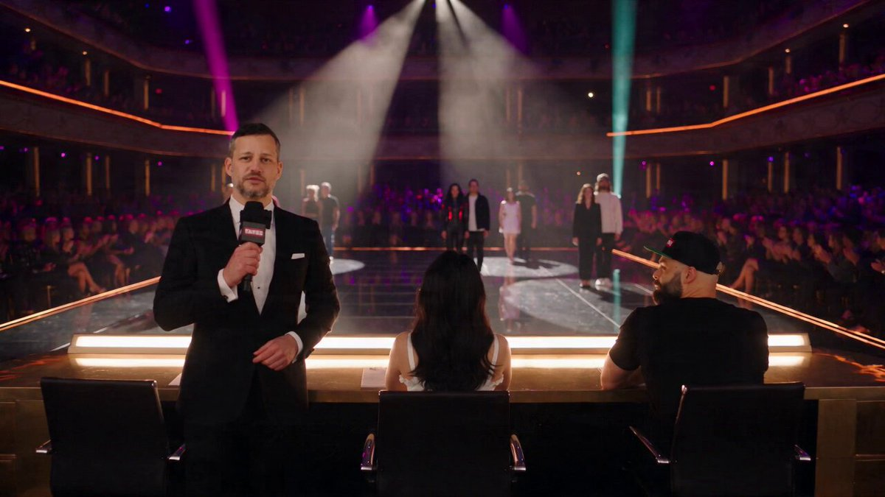</a>

<a href="https://x.com/maxescu/status/2084015920620478585">▶️ 在 X 上观看视频</a>

</div>

<details>
<summary><b>📋 点击展开 / 复制提示词</b></summary>

```
It's in Chinese because the English prompt was way too long.

角色引用：
[IMAGE REFERENCE 1]
[IMAGE REFERENCE 2]
[IMAGE REFERENCE 3]
[IMAGE REFERENCE 4]
[IMAGE REFERENCE 5]
[IMAGE REFERENCE 6]
[IMAGE REFERENCE 7]
[IMAGE REFERENCE 8]
[IMAGE REFERENCE 9]
[IMAGE REFERENCE 10]
[IMAGE REFERENCE 11]

【角色锁定】

全片画面中总共只有十一个人，不多不少：十位舞者和一位主持人。每张参考图对应且仅对应一个人物，每个人物只出现一次。禁止重复的脸，禁止近似双胞胎，禁止额外舞者，禁止背景伴舞。每个角色在整个镜头中始终保持参考图中的脸型、发型、体型与全套服装，分毫不差。

[IMAGE REFERENCE 11] 是主持人，手持细长的电视直播话筒。十位舞者组成五对固定舞伴，每对固定在舞池中属于自己的区域：

第一对：[IMAGE REFERENCE 1] 与 [IMAGE REFERENCE 2]，前区左侧。

第二对：[IMAGE REFERENCE 3] 与 [IMAGE REFERENCE 4]，前区右侧。

第三对：[IMAGE REFERENCE 5] 与 [IMAGE REFERENCE 6]，舞池中央。

第四对：[IMAGE REFERENCE 7] 与 [IMAGE REFERENCE 8]，后区左侧。

第五对：[IMAGE REFERENCE 9] 与 [IMAGE REFERENCE 10]，后区中央，压轴主打舞伴。

除舞蹈动作的自然移动外，各对舞伴始终停留在自己的区域内，任何一对都不会穿越其他舞伴的区域。

【场景】

一座盛大的电视直播交际舞比赛舞台，黄金档综艺级制作水准。镜面拼花舞池地板，规模紧凑而亲密，五对舞伴彼此距离较近地共舞。阶梯式观众席在两侧没入黑暗，坐满轮廓模糊的剪影观众，面部永远不会清晰呈现。评委席位于画面边缘，被柔和的轮廓光勾勒。空气中悬浮着细腻的舞台薄雾。画面中没有任何标识、商标、字幕条，没有任何屏幕文字或图形。

【动作】

阶段一，开场介绍：主持人 [IMAGE REFERENCE 11] 独自站在舞池边缘、评委席旁，面对镜头说出唯一一句充满活力的欢迎词。主持人只用英语说话，口型与英语台词完全同步："Ladies and gentlemen, your favorite A.I. Stars!" 这是全片唯一的一句台词。

阶段二，开舞信号：说到最后一个词的同时，主持人拍手一次。十位舞者早已按五对站位分布在舞池中，随即进入交际舞握持姿势，整齐划一地开始起舞。主持人向后退出画面，此后不再出现。

阶段三至七，逐对巡礼：镜头严格按顺序依次拜访五对舞伴，从第一对到第五对。每对舞伴都获得充裕、从容、不被催促的镜头时间，完整展示各自的舞蹈段落。镜头到达每一对时推近成特写：闭式舞姿中的面部、紧扣的双手、镜面拼花地板上的步法，近距离捕捉舞蹈进行中的握持、旋转、下腰与托举，在表演细节上停留之后再缓缓拉开，滑行至下一对。当某一对被聚焦时，其余舞伴在背景中持续跳舞但保持柔和虚焦，始终不会变得清晰锐利。

阶段八，压轴时刻：第五对舞伴 [IMAGE REFERENCE 9] 与 [IMAGE REFERENCE 10]将舞蹈推向超越常规交际舞技巧的华丽魔幻时刻。在他们最后一个托举中，脚下的镜面地板绽放出光芒，一道金色火花光带缓缓盘旋着从拼花地板升起，环绕这对舞者，托举在空中悬停的时间比重力允许的多出一拍。剪影观众瞬间沸腾，起立欢呼、疯狂鼓掌。镜头在这对舞者与沸腾的观众反应上停留，随后在掌声最高点硬切黑场。

【摄影机】

全片一个不间断的连续长镜头，零剪辑。斯坦尼康稳定器以腰部高度滑行，数字电影摄影机，35mm球面定焦镜头，16:9电视直播画幅。在每对舞伴处重复同一套运动语法：以轻快的舞曲节奏在舞池中平滑横移，缓慢推近并落定为约f/2.0的浅景深特写，只聚焦当前这一对舞者，在面部、双手与步法上停留，随后拉开至约f/4的较深景深感，滑行前往下一个区域。全程运动流畅稳定，禁止甩镜头，禁止变速，禁止手持晃动。彩色光束扫过镜头时产生柔和克制的镜头光晕。

【灯光】

一束暖白色追光始终跟随镜头当前聚焦的那对舞者，保证肤色自然、面部造型清晰。洋红、青绿与琥珀色的摇头电脑灯光束扫过舞池上方的薄雾，形成清晰可见的体积光束。镜面拼花地板将光束与舞者倒映成流动的彩色光带。观众席处于深沉的阴影中，只有微弱的冷色轮廓光勾勒剪影。评委席带有柔和的琥珀色边缘光。灯光随编舞轻柔变化，并在压轴魔幻时刻骤然增亮。

【音频】

开启原生音频。主持人唯一的一句台词只用英语说出，全片所有人声均为英语：禁止中文语音，禁止普通话，禁止额外的旁白或播报声，禁止带歌词的演唱。台词结束后，现场演奏的欢快交际舞管弦乐作为场内音乐贯穿全片，叠加舞池现场真实环境声：鞋跟与舞步敲击拼花地板声、旋转与下腰时裙摆布料的摩擦声、低沉的观众私语声，并在压轴时刻爆发为雷鸣般的掌声、欢呼与口哨。

【风格】

光鲜亮丽的黄金档电视直播质感，明亮饱和的调色，观众席保持浓郁的黑色层次，高度精致的制作水准，舞者全程处于连续流动的舞蹈之中。画面中禁止任何屏幕文字、字幕、字幕条、水印，不得出现任何中文或英文字符。硬切结尾。
```

</details>

> 💡 中文 prompt，需多参考图

**👤 出处:** [@maxescu](https://x.com/maxescu) · [source](https://x.com/maxescu/status/2084015920620478585)

▶️ **用 API 跑这条提示词** → [Velokey](https://velokey.ai/model/doubao-seedance-2-5-text-to-video?sourceChannel=github-awesome-seedance)（模型 id：`seedance-2.5`）

---

### No.88 曼哈顿金色黄昏

 

<div align="center">

<a href="https://x.com/azed_ai/status/2083946975767269520"></a>

<a href="https://x.com/azed_ai/status/2083946975767269520">▶️ 在 X 上观看视频</a>

</div>

<details>
<summary><b>📋 点击展开 / 复制提示词</b></summary>

```
Photorealistic cinematic modern New York City during golden hour, bustling Manhattan sidewalks, yellow taxis, glowing storefronts, steaming manholes, towering glass skyscrapers reflecting warm sunlight, shot with modern lived-in realism, subtle handheld camera movement, premium cinematic lighting, 35mm Kodak Vision3 film emulation, heavy natural film grain, soft highlight halation, organic analog texture, realistic crowd behavior, ultra-detailed fluid simulation, seamless temporal coherence, premium Hollywood visual effects, 30-second video, 15 cinematic cuts.

Cut 1 (0.0–2.0s)
Tracking shot. A sharply dressed young lawyer confidently walks through a crowded Manhattan sidewalk carrying a takeaway coffee while reviewing legal documents.

Cut 2 (2.0–4.0s)
A beautiful young woman walks toward him while checking directions on her phone. The camera alternates between both characters as they unknowingly move toward each other.

Cut 3 (4.0–6.0s)
They collide. Coffee, papers, sunglasses and the phone explode into the air. The camera instantly begins orbiting around the frozen impact.

Cut 4 (6.0–8.0s)
Everything freezes. Coffee droplets hang perfectly suspended. Taxis stop. Pigeons remain frozen mid-flight. Only the lawyer keeps moving.

Cut 5 (8.0–10.0s)
He calmly catches the floating coffee cup. As he reaches for the woman's phone, tiny blue cracks spread through the frozen air around him.

Cut 6 (10.0–12.0s)
The cracks rapidly expand across the entire city like shattered glass. Buildings distort. The sky tears open. Manhattan begins collapsing into glowing fragments.

Cut 7 (12.0–14.0s)
A massive blue vortex opens beneath the street. Cars, traffic lights and debris begin floating upward. The lawyer loses his balance and falls into the portal while still holding his coffee.

Cut 8 (14.0–16.0s)
He crashes through dense jungle vines and lands in a prehistoric rainforest. Towering ferns, waterfalls and enormous trees surround him. Strange dinosaur calls echo through the jungle.

Cut 9 (16.0–18.0s)
He slowly stands and notices enormous three-toed footprints in the mud. The ground begins trembling beneath his feet.

Cut 10 (18.0–20.0s)
A gigantic Tyrannosaurus bursts through the trees, snapping massive trunks in half as it charges directly toward him.

Cut 11 (20.0–22.0s)
High-speed tracking shot. The lawyer sprints through the jungle, leaping over fallen logs while still somehow keeping his coffee upright. The T-Rex crashes through everything behind him.

Cut 12 (22.0–24.0s)
He jumps across a collapsing rope bridge above a roaring river. The dinosaur follows, breaking the bridge apart as wooden planks explode into the canyon below.

Cut 13 (24.0–26.0s)
The lawyer grabs a hanging vine and swings across a massive waterfall. The Tyrannosaurus leaps after him but crashes into the cliff, sending boulders tumbling into the river.

Cut 14 (26.0–28.0s)
The lawyer reaches a cliff overlooking the jungle. Another blue portal opens behind him. The dinosaur charges one final time as the portal expands.

Cut 15 (28.0–30.0s)
He calmly takes one slow sip of his coffee before stepping backward into the portal. The Tyrannosaurus lunges through the opening just as it collapses. Hard cut back to the frozen New York collision for a split second, where not a single drop of coffee has moved. Fade to black.

Photorealistic, ultra-detailed fluid physics, realistic dinosaur animation, cinematic camera choreography, physically accurate destruction, premium Hollywood visual effects, stable character consistency, heavy natural 35mm film grain, high rewatch value.
```

</details>

**👤 出处:** [@azed_ai](https://x.com/azed_ai) · [source](https://x.com/azed_ai/status/2083946975767269520)

▶️ **用 API 跑这条提示词** → [Velokey](https://velokey.ai/model/doubao-seedance-2-5-text-to-video?sourceChannel=github-awesome-seedance)（模型 id：`seedance-2.5`）

---

### No.89 男友视角旅行 Vlog

 

<div align="center">

<a href="https://x.com/QCXINT_/status/2084057368909021350">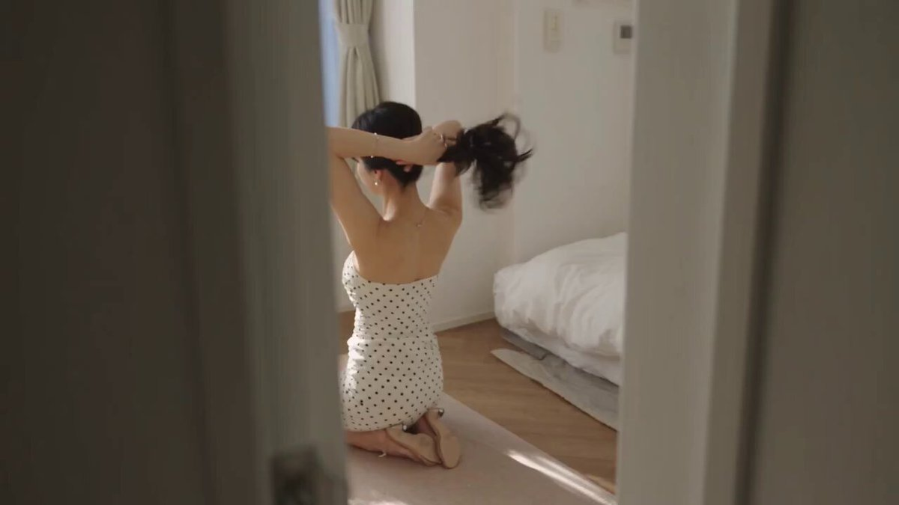</a>

<a href="https://x.com/QCXINT_/status/2084057368909021350">▶️ 在 X 上观看视频</a>

</div>

<details>
<summary><b>📋 点击展开 / 复制提示词</b></summary>

```
Seedance 2.5 vlog case.

This is so real.  

---prompt--- 
Single unbroken handheld boyfriend vlog take throughout, 30 seconds total. A realistic personal travel vlog filmed by a boyfriend following his girlfriend during a normal day in Tokyo. Use the woman from the reference image as the main character. Maintain her exact facial identity, hairstyle, facial features, body proportions, and overall appearance throughout the entire video. She must remain the same person in every shot. The camera feels like a real boyfriend holding a small mirrorless camera or phone, not a professional production. Natural handheld movement, imperfect framing, occasional camera shake, spontaneous reactions, authentic everyday moments. The woman does not pose for the camera. She behaves naturally, sometimes forgetting the camera is there. 0-5s: Morning at a small Tokyo apartment. The camera starts recording as the boyfriend casually walks into the room. Soft morning sunlight enters through the window. The woman is sitting near the bed, fixing her hair and preparing for the day. She notices the camera, smiles naturally, laughs, and playfully tells him to stop filming. The camera stays close, slightly shaky, capturing a private everyday moment. 5-10s: Walking through Tokyo neighborhood streets. The boyfriend follows behind her as they leave the apartment. She walks through a quiet Tokyo street, carrying a small bag. Morning shops are opening, bicycles pass by, locals walk along the street. She stops at a convenience store. The camera follows her inside. She looks at different drinks and snacks, turns around and asks the person behind the camera which one she should choose. Natural interaction, casual conversation, realistic body language. 10-18s: Local food experience. The camera follows her through a small Tokyo alley to a cozy local restaurant. She sits down and tries a bowl of ramen or a local dish. The camera captures close handheld moments: her picking up chopsticks, tasting the food, reacting naturally, laughing when the food is hotter than expected. The boyfriend laughs behind the camera. The moment feels unplanned and authentic. 18-25s: Tokyo afternoon exploration. The couple walks through a lively neighborhood. She browses small shops, looks at interesting objects, takes photos, and occasionally looks back at the camera. The camera moves naturally between her face, her hands, the street atmosphere, and small details of daily life. Crowds pass naturally around them. The city feels alive and real. 25-30s: Tokyo night ending. Night falls. The camera follows her through illuminated Tokyo streets. She walks slightly ahead, then turns back and smiles at the camera. They ride a train home. She sits beside the window, watching city lights pass outside. The camera slowly moves closer as she rests quietly, ending like a real personal memory. Visual style: Authentic boyfriend travel vlog footage. Realistic handheld camera movement. Natural lighting. Casual documentary realism. Unplanned everyday moments. Real human expressions and interactions. Slight motion blur, natural exposure changes, realistic camera autofocus adjustments. No commercial advertisement style. No dramatic posing. No perfect cinematic composition. No text overlays. No logos. No face changes. No identity changes. No artificial transitions. No CGI feeling. Stable character consistency throughout.
```

</details>

> 💡 需人物参考图

**👤 出处:** [@QCXINT_](https://x.com/QCXINT_) · [source](https://x.com/QCXINT_/status/2084057368909021350)

▶️ **用 API 跑这条提示词** → [Velokey](https://velokey.ai/model/doubao-seedance-2-5-text-to-video?sourceChannel=github-awesome-seedance)（模型 id：`seedance-2.5`）

---

### No.90 30 秒结构化叙事

 

<div align="center">

<a href="https://x.com/opener_ai/status/2083542433078624470"></a>

<a href="https://x.com/opener_ai/status/2083542433078624470">▶️ 在 X 上观看视频</a>

</div>

<details>
<summary><b>📋 点击展开 / 复制提示词</b></summary>

```
30 seconds can feel like a long time, or kind of short, depending on the moment. 

But since I'm so used to 15 seconds, figuring out how to structure a 30 second video now that Seedance 2.5 is out on @dreamina_ai  gave me a lot to think about. 

Still, since it takes up a lot of credits, I need to get into the habit of carefully reviewing my prompts for 30 second cuts :)

Prompt ⤵️
```

</details>

> 💡 需人物参考图

**👤 出处:** [@opener_ai](https://x.com/opener_ai) · [source](https://x.com/opener_ai/status/2083542433078624470)

▶️ **用 API 跑这条提示词** → [Velokey](https://velokey.ai/model/doubao-seedance-2-5-text-to-video?sourceChannel=github-awesome-seedance)（模型 id：`seedance-2.5`）

---

### No.91 AI 想象力惊喜生成

 

<div align="center">

<a href="https://x.com/steddipace/status/2084053662809153926">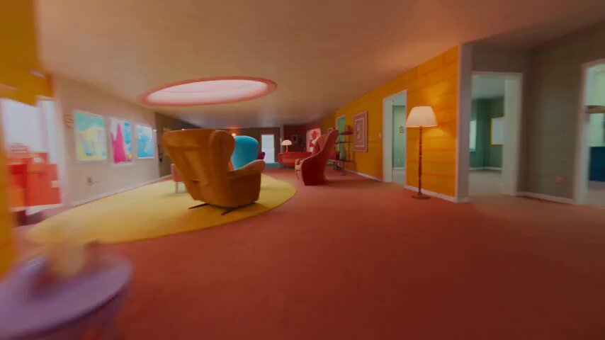</a>

<a href="https://x.com/steddipace/status/2084053662809153926">▶️ 在 X 上观看视频</a>

</div>

<details>
<summary><b>📋 点击展开 / 复制提示词</b></summary>

```
I just copied and pasted the prompt into Seedance 2.5, and this is the result: 

I didn't tell the model how to generate it exactly, the video model's imagination is surprisingly good.

It has a totally different style from the video below:)
```

</details>

**👤 出处:** [@steddipace](https://x.com/steddipace) · [source](https://x.com/steddipace/status/2084053662809153926)

▶️ **用 API 跑这条提示词** → [Velokey](https://velokey.ai/model/doubao-seedance-2-5-text-to-video?sourceChannel=github-awesome-seedance)（模型 id：`seedance-2.5`）

---

### No.92 Plano Secuencia 长镜测试

 

<div align="center">

<a href="https://x.com/postandfly/status/2083228757322592309">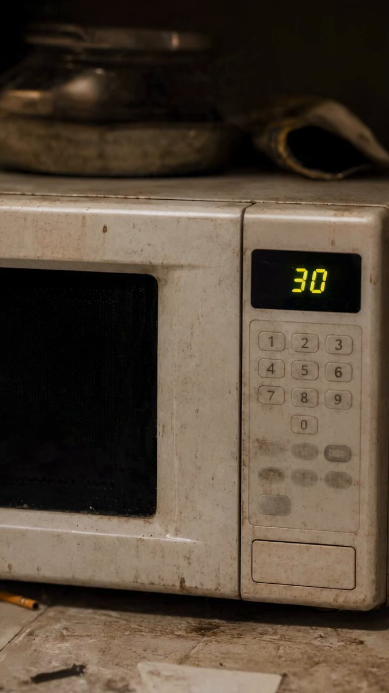</a>

<a href="https://x.com/postandfly/status/2083228757322592309">▶️ 在 X 上观看视频</a>

</div>

<details>
<summary><b>📋 点击展开 / 复制提示词</b></summary>

```
Plano secuencia probando el nuevo modelo Seedance 2.5 de Dreamina, que ya permite crear secuencias de hasta 30 segundos.

Generé todos los personajes con ChatGPT Image 2: uno está basado en mí y el otro es completamente original. También utilicé ChatGPT Image 2 para crear todas las locaciones.

Con ayuda de Claude, describí toda la secuencia en un solo prompt. Lo único que añadí después fue una segunda generación con la explosión final para integrarla al cierre.

Lo que más me sorprendió es que, desde el primer intento, el modelo generó prácticamente la secuencia tal como la había imaginado. Aunque al inicio hay algunos pequeños cortes de cámara que fueron decisión del propio modelo, la toma completa salió exactamente como la había pedido, sin la explosión. Después únicamente agregué ese último plano para cerrar la escena.

 

@dreamina_ai
```

</details>

**👤 出处:** [@postandfly](https://x.com/postandfly) · [source](https://x.com/postandfly/status/2083228757322592309)

▶️ **用 API 跑这条提示词** → [Velokey](https://velokey.ai/model/doubao-seedance-2-5-text-to-video?sourceChannel=github-awesome-seedance)（模型 id：`seedance-2.5`）

---

### No.93 纽约主观视角 VLOG

 

<div align="center">

<a href="https://x.com/noman23761/status/2083235536530202710">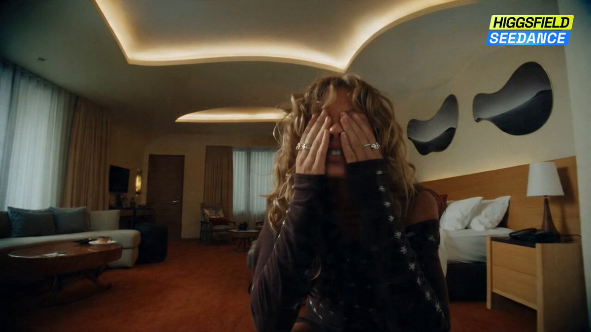</a>

<a href="https://x.com/noman23761/status/2083235536530202710">▶️ 在 X 上观看视频</a>

</div>

<details>
<summary><b>📋 点击展开 / 复制提示词</b></summary>

```
SCENE A day in New York shot entirely by the subject herself: waking in her hotel suite, coffee, getting ready, out into the city, back to the room at night. ACTIVE REFERENCES @ image1 — the hotel suite. Curved cove ceiling with warm LED coving, deep red carpet, cream walls, two black organic sculptures above a light wood headboard, white bedding with red pillows, twin bedside lamps, pale sofa, oval coffee table, sheer curtains, dark door. @ image2 — the subject. Young woman, shoulder-length wavy blonde hair with curtain bangs and highlights, light freckles, thin gold necklace, silver ring, dark brown off-the-shoulder knit with white diamond-stripe pattern. 100% matches the reference. CAMERA OWNERSHIP LOCK Only two positions exist. HELD: arm extended, camera 0.4-0.7m from her face, visible arm tension, tilt and step-bounce. PROPPED: camera on a surface she placed it on, crooked and fixed, with her moving in and out of frame. No operator shots, no tracking, nothing she could not have filmed alone. FORMAT Eight shots, 30s, seven HARD CUTS, no fades. Real-time. 0-4s SHOT 1 — PROPPED, morning room. 84° diagonal field of view, camera on the sideboard 3m from the bed at 1.1m, static and tilted. The suite matches @ image1: cove light on, curtains half open, cool daylight across the red carpet. @ image2 visible at 0.0s, sitting up on the bed edge x66 y58. No empty frame. She rubs her face and croaks at the running camera: "It's seven. In New York. Why am I awake." Stands, walks out screen-right. HARD CUT. 4-7s SHOT 2 — HELD, window light. 84°, arm's length 0.5m, above eye line. She is x50 y42 at the sheer curtain screen-left, cool daylight on the near side of her face, cove warmth behind. She pulls the curtain, squints at the street below, then into the lens: "Okay. It's actually happening." Arm wobble throughout. HARD CUT. 7-11s SHOT 3 — PROPPED, coffee. 47°, camera on the oval coffee table 0.8m away, low, looking up past a cup. She sits into frame at x55 y45, pours, tastes, pulls a face at the running camera: "Hotel coffee. We'll fix that outside." Steam bends in the light. HARD CUT. 11-15s SHOT 4 — HELD, mirror. 47°, camera at chest height reflected in the suite mirror. She is x45 y50 in the reflection, camera visible in her hand, working through her hair with the other. Bed and sculptures behind. At 13s: "This is as good as it gets. Let's go." HARD CUT. 15-18s SHOT 5 — HELD, leaving. 107° wide rectilinear, camera held low at waist height, turned forward. She crosses the red carpet to the door at x55, lens swinging with her stride. She opens it and corridor light floods the frame. Off-frame, breathy: "Downtown first." HARD CUT. 18-22s SHOT 6 — PROPPED, street. 47°, camera on a stoop rail 3m away, static, crooked. A New York block behind her — brownstone steps, fire escapes, yellow cabs, steam from a vent. She walks in from screen-left at 18.5s, stands at x60 y50, spreads her arms: "Look at this street." Then walks to the lens and takes it at 21.5s. Passers-by cross the foreground. HARD CUT. 22-26s SHOT 7 — PROPPED, diner. 84° wide, camera on the counter behind a plate, 0.7m from her, looking up. She is x55 y38, sits into frame, takes a bite, eyes widen, mouth full: "Okay, that's the one." Laughs, keeps eating. HARD CUT. 26-30s SHOT 8 — HELD, night, back in the room. 84°, arm's length 0.5m, held above her. She lies back across the white bedding at x50 y55, hair spread, in the brown knit again. Bedside lamps and cove light are the only sources, windows black with city glow. Into the lens: "Twenty thousand steps. Everything hurts." Softer: "Same time tomorrow." Wave, the frame tilts as she lowers the camera. 30.0s black. SPEECH Only the quoted lines are spoken, at the timings given, all in her voice. Lips still at all other times. No voiceover, no second speaker, no offscreen voices. Delivery is casual, unrehearsed, mid-breath, sometimes trailing off. Volume rises over street noise in Shot 6, near-whisper in Shot 8. CONTINUITY The suite matches @ image1 in both interior sequences — same carpet, sculptures, headboard, sofa, lamps. Hair, necklace and ring identical throughout. PHYSICS Loose knit slides on the shoulder with every arm movement. Wavy hair lags a frame behind head turns. Bedding creases under her weight. Step energy visible in every HELD frame. LIGHTING Shots 1-4: cool daylight from the curtains screen-left as key, warm cove LED as fill, red carpet bouncing warmth into the shadows. Shot 5: corridor light through the doorway. Shots 6-7: hard street daylight, warm diner practicals. Shot 8: lamps and cove light only. AUDIO Diegetic only, from the same camera — room tone, footsteps, door, traffic, sirens, steam vents, diner clatter, wind. Ambience ducks under her lines. No music. LOCKS Photoreal live action, 4K detail, fine grain, warm consumer-camera colour, mild rolling shutter and auto-exposure hunting. She is the only person who speaks; background figures anonymous and unfocused. No subtitles.

    @higgsfield @noman23761
```

</details>

> 💡 需人物参考图

**👤 出处:** [@noman23761](https://x.com/noman23761) · [source](https://x.com/noman23761/status/2083235536530202710)

▶️ **用 API 跑这条提示词** → [Velokey](https://velokey.ai/model/doubao-seedance-2-5-text-to-video?sourceChannel=github-awesome-seedance)（模型 id：`seedance-2.5`）

---

### No.94 说唱歌手写实换脸

 

<div align="center">

<a href="https://x.com/EHuanglu/status/2083246033761694117">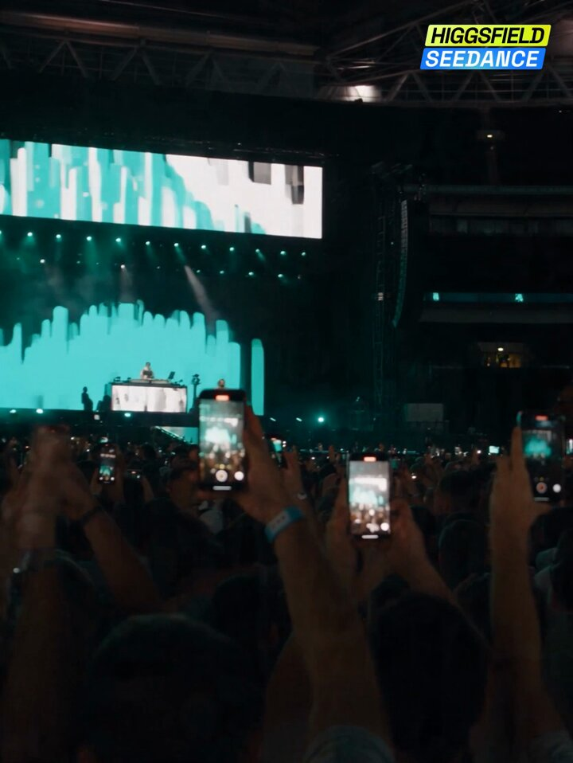</a>

<a href="https://x.com/EHuanglu/status/2083246033761694117">▶️ 在 X 上观看视频</a>

</div>

<details>
<summary><b>📋 点击展开 / 复制提示词</b></summary>

```
@Image1 is the absolute reference for THE RAPPER and completely replaces every previous performer reference. Preserve his exact identity: middle-aged man with a high receding hairline, short salt-and-pepper hair, thick dark eyebrows, dark eyes and a full beard with strongly defined white-gray sections. Preserve his stocky build, black-white-dark-green horizontally striped T-shirt with black chest pocket, sand-colored knee-length chino shorts and chunky off-white sneakers. No changes to his face, body, hair, beard, clothes or proportions.

A 30-second single continuous live stadium rap performance captured horizontally on an iPhone from the front audience section. Authentic handheld fan footage: physical hand tremor, operator breathing, imperfect reframing, rolling shutter, digital-zoom softness, momentary autofocus hunting and compressed phone-microphone sound. No cuts.

The first frame already shows THE RAPPER full-body on the right third at the end of a stage runway. A huge sold-out stadium surrounds him. Exactly four adult backup dancers wait several meters behind him. Emerald, white and black LED graphics echo the stripes of his shirt. The stage floor remains solid, flat and continuous.

A heavy original grime beat begins: deep sub-bass, dry kick, snapping snare and minimal low synth. The iPhone rapidly pinches from 1× to a shaky 5× digital zoom, briefly overshoots, then locks onto THE RAPPER in a full-body composition. Focus stays wide enough to preserve his feet and choreography.

He begins rapping with a low-mid, forceful cadence and exact lip synchronization:

THE RAPPER:
“Walk in steady, put the weight on the beat,
Every bar lands, every move stays clean.
Hands up high when the bass comes down,
I don’t chase the wave—I shake the whole ground!”

Only these words are spoken. Each line is delivered in one controlled breath.

On the first bar he performs two violent shoulder hits, a chest pop and a sharp forearm lock. His shirt and beard react naturally to momentum.

On the second bar he executes fast heel-toe pivots, crosses one foot behind the other and glides sideways while keeping his heavy body convincingly grounded. The camera operator struggles to keep his sneakers in frame, corrects downward and catches the complete footwork.

On the third bar the four dancers join in perfect synchronization. THE RAPPER leads a hard sequence: right stomp, left stomp, elbows strike outward, torso snaps backward, hands shoot overhead. Every movement lands precisely on a kick or snare.

The instrumental cuts for one beat. He holds a deep wide stance, eyes fixed on the upper tiers. His chest rises with one visible breath.

He shouts the final line while performing a rapid three-step, a controlled 180° pivot and one enormous downward arm strike. On “GROUND,” he stomps once. The bass returns with a massive impact; the LED floor sends a broad solid emerald light wave across the stage.

The entire stadium copies his movement. The phone shakes from thousands of spectators stomping together. He breaks into a confident grin but continues bouncing in time, pointing from one side of the stadium to the other.

The operator zooms rapidly back through 3× and 1× to 0.5× ultra-wide while turning 160° away from the stage in one continuous handheld sweep. Exposure briefly pumps, then recovers.

Finish on the full stadium bowl: tens of thousands of people across every tier performing the same shoulder-hit and stomp combination, emerald wrist lights moving in broad geometric waves, stage remaining on the far-left edge. Audio continues with the crowd chanting “SHAKE THE GROUND,” live bass vibration and realistic phone compression. Rich emerald and white light, warm skin and deep blacks. Clear air without haze, smoke, confetti, mist, sparks or airborne particles.
```

</details>

> 💡 需人物参考图

**👤 出处:** [@EHuanglu](https://x.com/EHuanglu) · [source](https://x.com/EHuanglu/status/2083246033761694117)

▶️ **用 API 跑这条提示词** → [Velokey](https://velokey.ai/model/doubao-seedance-2-5-text-to-video?sourceChannel=github-awesome-seedance)（模型 id：`seedance-2.5`）

---

### No.95 比萨斜塔建造过程

 

<div align="center">

<a href="https://x.com/LeeLinAI123/status/2083305831404044545">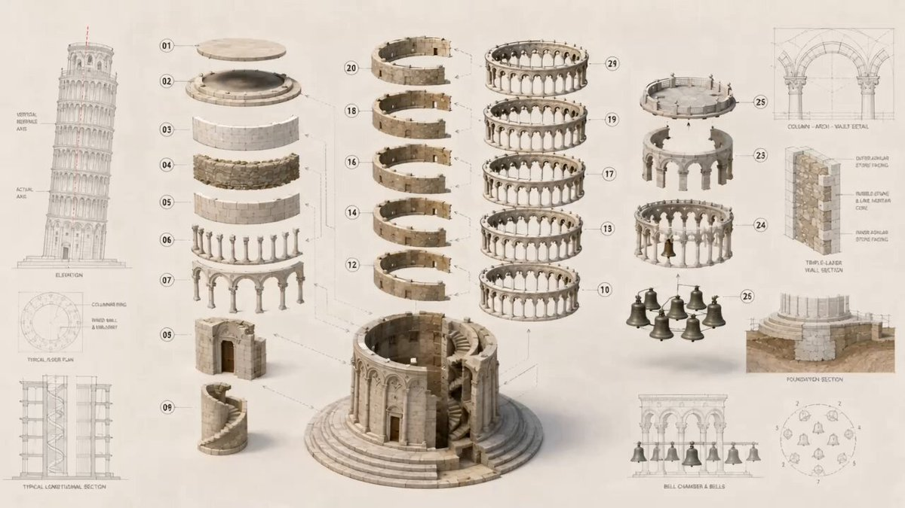</a>

<a href="https://x.com/LeeLinAI123/status/2083305831404044545">▶️ 在 X 上观看视频</a>

</div>

<details>
<summary><b>📋 点击展开 / 复制提示词</b></summary>

```
Execute immediately. Do not restate the prompt, explain capabilities, offer options, or ask questions.

Use the uploaded Leaning Tower of Pisa construction diagram as the only input image. Generate one 15.0-second Seedance 2.5 image-to-video source clip, native 16:9, 720p.

This is an architectural construction-teaching video. Preserve the warm-white studio background, marble materials, engineering-diagram aesthetic, lighting, framing, and all existing shapes from the input image. Do not redesign or invent a new tower.

Asset roles

The partially built circular base at the lower center is the fixed construction anchor. It includes the existing stairs, entrance, cutaway masonry, and foundation. It never moves, rotates, scales, or breaks apart.

Only these existing 3D elements are allowed to assemble:

the curved column module and curved arch module at mid-left;
the five C-shaped masonry-and-gallery modules in the center-left column;
the five matching open arcade rings in the center-right column;
the upper-right transition platform, bell-chamber arch ring, and finished bell-chamber crown.

Everything else is a teaching-reference layer only:

the elevation, plans, sections, diagrams, callouts, labels, leader lines, and dimension marks;
the upper-left material samples;
the separate entrance sample and spiral-stair sample;
the loose group of seven bells at lower right.

The teaching-reference layer never joins the building. It only fades out and later fades back in at exactly its original position. Its own shadows fade with it.

Motion rules

This must feel like the Huanghelou construction video: only one construction group moves at a time. The active group stays at full brightness; all waiting construction groups remain visible but dimmed to about 60% brightness.

Every moving group keeps its original material, scale, orientation, and rigid shape. It moves along one short, clean, unobstructed path toward its final interface. No random flight, free rotation, melting, morphing, stretching, duplicate copies, or geometry left behind at the original location.

Each group eases in, slows down before contact, locks perfectly into place, and pauses for about 0.12 seconds before the next group starts.

The final tower follows the leaning direction indicated by the red “actual axis” in the left elevation drawing. The lean is stable architecture, not a collapse: do not straighten it, increase the lean, wobble, bend, or shake it.

Source-clip timeline

0.00–0.55s — Hold the first frame
Keep the full diagram perfectly still so the viewer can read the exploded structure.
0.55–1.15s — Reference layer fades out
Fade out all diagrams, material samples, loose entrance and stair samples, loose seven-bell group, labels, callouts, and leader lines.
Do not fade the warm-white background, the fixed central anchor, or the actual construction modules.

1.15–2.05s — First arcade level
Move the curved column module into the open receiving interface on top of the fixed anchor and lock it.
Then move the curved arch module into the same level, completing the first arcade layer.
2.05–7.05s — Five upper arcade levels
Build the remaining five levels from bottom to top. For each horizontal pair:
Move the matching C-shaped masonry-and-gallery module into place first.

Move the matching open arcade ring second. It first aligns on the same leaning local axis, then descends coaxially around the masonry module and locks.
Complete one full level before starting the next. Do not let upper layers move early. After this stage, the tower must show exactly six open arcade levels in total.
7.05–8.45s — Bell chamber
Move the circular transition platform onto the sixth arcade level, keeping its central opening aligned with the tower.
Then install the bell-chamber arch ring.
Finally install the finished bell-chamber crown containing the bell already visible in the reference image.

The loose seven bells remain part of the teaching-reference layer and never fly into the tower.
8.45–9.20s — Clean completed tower
Hold the completed Leaning Tower of Pisa completely still on the warm-white background. No diagrams or reference samples are visible.

9.20–10.30s — Teaching layer returns
While the completed tower remains absolutely motionless, fade the original diagrams, material samples, loose stair and entrance samples, loose bells, labels, and callouts back to their exact first-frame positions.
10.30–15.00s — Stable display
Keep the completed tower and restored teaching-reference layer perfectly still.

Final 15-second loop

After generating source clip A, use the same project timeline:
Keep source A from 0.00 to 10.30 seconds at normal speed.
Duplicate that exact 0.00–10.30-second section.
Mute the duplicated section.

Reverse it and speed it up evenly to 4.70 seconds.

Place it immediately after 10.30 seconds.
Use a direct same-frame cut at the join: no dissolve, flash, black frame, or transition.

Do not generate a second AI video for the disassembly.
The reverse section must naturally show: reference layer fades out → bell chamber leaves → the six arcade levels leave in reverse order → the first arcade modules return → all construction modules return to their exact first-frame positions → teaching layer restores → final frame matches the uploaded first frame.

The reverse disassembly should feel fast and exciting, but never like an explosion. Every module follows its exact original path backward.
Camera, background, and audio

Lock the original camera position, focal length, perspective, horizon, roll angle, exposure, and frame. No zoom, orbit, pan, tilt, push-in, pull-back, or camera correction of the tower lean.

Keep the warm-white background, floor, shadow direction, and brightness continuous for the entire video. Never use black, dark gray, vignetting, a new location, a white flash, or a full-frame fade-out.

No voiceover, dialogue, subtitles, lyrics, logos, watermarks, platform UI, or end card. Use only a subtle continuous room tone and very light stone-contact sounds. Mute the reversed clip audio.
Deliver one final 15.0-second native 16:9 video and report the result briefly in Simplified Chinese.
```

</details>

> 💡 需参考图

**👤 出处:** [@LeeLinAI123](https://x.com/LeeLinAI123) · [source](https://x.com/LeeLinAI123/status/2083305831404044545)

▶️ **用 API 跑这条提示词** → [Velokey](https://velokey.ai/model/doubao-seedance-2-5-text-to-video?sourceChannel=github-awesome-seedance)（模型 id：`seedance-2.5`）

---

### No.96 动漫与现实融合

 

<div align="center">

<a href="https://x.com/okuwaki_m/status/2083364253529264252"></a>

<a href="https://x.com/okuwaki_m/status/2083364253529264252">▶️ 在 X 上观看视频</a>

</div>

<details>
<summary><b>📋 点击展开 / 复制提示词</b></summary>

```
I tried using Seedance 2.5. IrukaDark's anime and reality are fused together.
There are no glitches.
The 30-second one-shot output is very impressive.
My prompt was way too sloppy so it turned out like this, but I'm sure that if you properly set up the assets, you can make amazing videos.

●Prompt
A smooth animated video featuring a black dolphin character wearing pink sunglasses supporting various professionals doing PC work in an office. It helps with programming next to an engineer, looks at the screen beside a designer, and cheerfully collaborates at a PC with marketers and back-office staff. In a modern and bright office environment, it gets along well and works smoothly with diverse professionals.
```

</details>

**👤 出处:** [@okuwaki_m](https://x.com/okuwaki_m) · [source](https://x.com/okuwaki_m/status/2083364253529264252)

▶️ **用 API 跑这条提示词** → [Velokey](https://velokey.ai/model/doubao-seedance-2-5-text-to-video?sourceChannel=github-awesome-seedance)（模型 id：`seedance-2.5`）

---

### No.97 武士刀舞者

 

<div align="center">

<a href="https://x.com/aimikoda/status/2083371542717558854">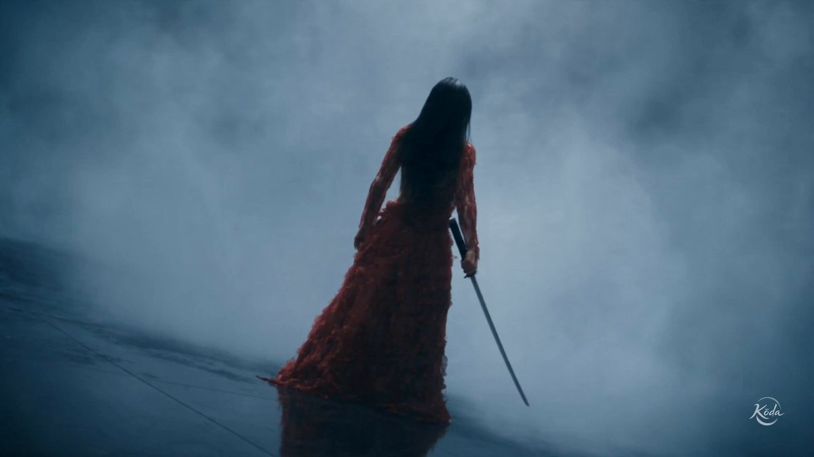</a>

<a href="https://x.com/aimikoda/status/2083371542717558854">▶️ 在 X 上观看视频</a>

</div>

<details>
<summary><b>📋 点击展开 / 复制提示词</b></summary>

```
High-end cinematic 3D realism fused with rapid contemporary dance and spectral blade combat. Explosive turns, deep backbends, floor slides, aerial contractions and sharp limb extensions flow directly into precise single-katana strikes, creating choreography that feels graceful, feral and impossibly fast. Dense shadow matter forms predatory silhouettes, lunging smoke trails and collapsing black shockwaves, while every blade arc tears crimson fabric-like energy through the air and disintegrates impacts into ink-dark particles. Aggressive orbiting camera movement, low-angle tracking, extreme foreshortening, sudden lateral acceleration, cold volumetric haze and wet reflective surfaces amplify the performance without sacrificing silhouette clarity. Realistic cloth dynamics, controlled motion blur, physical blade weight and feature-film rendering preserve elegance, danger and scale.

The performance begins mid-attack as a shadow wolf leaps through the smoke and the dancer @[character ref] folds beneath it in a violent backbend, drawing her single katana through its body during the recovery. More wolves circle and attack from every direction as she accelerates through spins, floor sweeps, aerial kicks and whipping turns, each movement becoming a clean blade strike that shreds them into black vapor and crimson fragments. The camera spirals through the pack with her, ending in full motion as she launches into another rotating slash against the final wave.
```

</details>

> 💡 需人物参考图

**👤 出处:** [@aimikoda](https://x.com/aimikoda) · [source](https://x.com/aimikoda/status/2083371542717558854)

▶️ **用 API 跑这条提示词** → [Velokey](https://velokey.ai/model/doubao-seedance-2-5-text-to-video?sourceChannel=github-awesome-seedance)（模型 id：`seedance-2.5`）

---

### No.99 30 参考图角色一致大片

 

<div align="center">

<a href="https://x.com/mrdejie/status/2083433982356836382">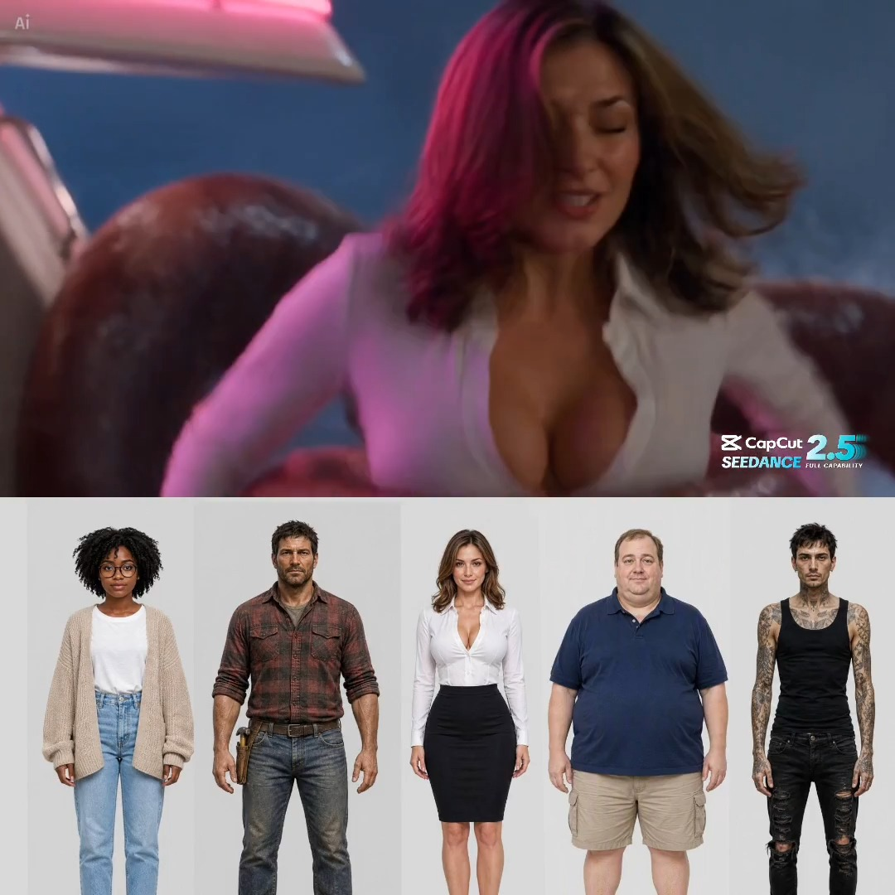</a>

<a href="https://x.com/mrdejie/status/2083433982356836382">▶️ 在 X 上观看视频</a>

</div>

<details>
<summary><b>📋 点击展开 / 复制提示词</b></summary>

```
1980s film, authentic live-action footage shot on 35mm with heavy grain, vibrant yet gritty saturated colors, practical neon lighting mixed with harsh strobes and fog. Fast chaotic editing packed with abrupt cuts, glass reflections, POV inserts, strobe flashes and dynamic movement to create total disorientation and panic. Real practical squib blood, rubber tentacles and physical stunts. Period-accurate 80s performances: big hair, colorful outfits, leg warmers, exaggerated fear and desperate physicality. Visualized synth atmosphere through pulsing lights and sudden dead silence.
[IMAGE REFERENCES] Generate from scratch a consistent group of five mid-80s young adults with distinctly different looks—tall blonde mullet guy in neon shirt, short chubby dark-curly guy in Hawaiian print, slim big-curled redhead girl in neon dress, athletic black-ponytailed girl in crop top, lanky glasses brunette in pastel polo—in colorful yacht-party fashion and one original giant octopus killer with thick rubber tentacles and gaping beak. All on a neon-drenched luxury yacht in pure practical 1980s slasher style.
[TIMELINE SECOND BY SECOND] 0-3s: [Rapid Disorientation Montage] Quick jarring cuts on the dimly lit yacht deck at night. Neon lights pulsing, five friends laughing and dancing with drinks, music blasting. Inserts: champagne spilling, one girl’s smile fading as mist rises from the water, glass reflection briefly showing a massive tentacle that vanishes. Strobe flicker. Laughter dies as engines are dead and no land in sight.
3-6s: [Rising Panic Montage] Fast cuts as panic spreads. Tall blonde runs to the helm, radio smashed. Close-up of broken mic. Two girls huddle near railing, eyes wide, calling names that echo. Low-angle POV gliding through thick fog. Drink glass tips. They split—one to cabins, one to stern. Water reflections show tentacles moving unseen.
6-9s: [First Attack Sequence] Sudden violence, rapid-fire cuts. Giant octopus erupts from foggy water. Quick cuts: massive tentacle lit by strobe, slamming down, bright squib blood spray across pink jacket. Body drops hard on wet deck. Others scream and scatter, slipping. One girl falls. Octopus advances with heavy tentacle movements while neon keeps pulsing.
9-12s: [Full Chaos & Practical Kills] Frenzied montage. Multiple cuts: guy racing for life raft, tentacle appears behind him. Girl hides behind bar, tentacle smashes through, practical blood on counter. Another cornered against cabin wall, lifted and slammed, body slides leaving red streak. Feet scraping, bodies falling, fog swirling around practical gore. Violent strobes. Survivor swings boat hook, dull thud on tentacle.
12-15s: [Climax & Lingering Threat] Fast cuts. Last two desperately lower a life raft. One yanked into fog and water, scream cut short. Final girl turns, face sweat-and-blood covered, backing on slippery deck. Wide shot of yacht littered with bodies under pulsing neon. Octopus rises again, tentacle cracked but massive. She runs into darkness as strobe freezes on the gaping beak. Slight film burn at end.
[STYLE & QUALITY BOOSTERS] Photorealistic 1980s film emulation, heavy natural grain and reel artifacts, authentic practical squib blood and rubber-tentacle stunts, coherent physics with realistic slips and momentum on wet wooden deck.
```

</details>

> 💡 需多张参考图

**👤 出处:** [@mrdejie](https://x.com/mrdejie) · [source](https://x.com/mrdejie/status/2083433982356836382)

▶️ **用 API 跑这条提示词** → [Velokey](https://velokey.ai/model/doubao-seedance-2-5-text-to-video?sourceChannel=github-awesome-seedance)（模型 id：`seedance-2.5`）

---

### No.100 街景转事故揭示长镜

 

<div align="center">

<a href="https://x.com/noman23761/status/2083479402973651024">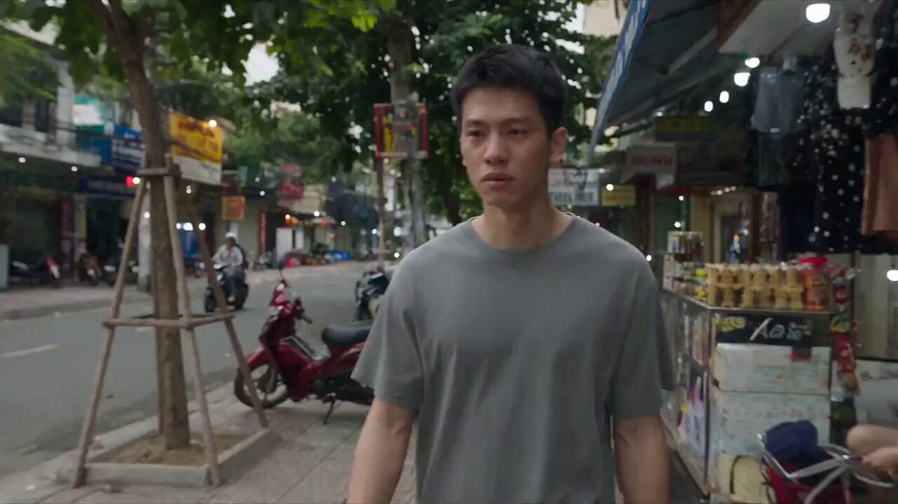</a>

<a href="https://x.com/noman23761/status/2083479402973651024">▶️ 在 X 上观看视频</a>

</div>

<details>
<summary><b>📋 点击展开 / 复制提示词</b></summary>

```
Tried another 30-second long-shot test in Seedance 2.5, with just one hard cut at the end.

This one starts as a slow, grounded street scene and then turns into a full accident aftermath reveal. What I liked here is how well the model handled the progression:

continuous tracking shot feel

natural urban background motion

simple character actions

scooter interaction and mounting

traffic movement

then a sudden tonal shift with the final cut

The setup is pretty simple, but it’s a good stress test for temporal consistency, camera control, and physical realism over a longer sequence.

Prompt:
"30-second cinematic photorealistic video, continuous long tracking shot with only one hard cut at the end. Natural overcast daylight, realistic physics, smooth handheld camera movement, high detail, 4K.

0-12s: Medium shot of a young East Asian man in his mid-20s with short black hair, plain gray t-shirt, walking slowly and contemplatively toward the camera on a busy Vietnamese city sidewalk. Scooters parked and moving, street shops, trees, pedestrians and vendors in the background. He has a slightly sad, thoughtful expression. Camera tracks backward smoothly, keeping him centered.

12-18s: He reaches a black scooter parked on the side of the road, opens the under-seat compartment, takes out a black helmet, carefully puts it on and tightens the chin strap. Then mounts the scooter.

18-24s: Side tracking shot transitioning to rear view as he starts the scooter and rides into the intersection among other scooters and cars. Natural traffic motion and realistic bike physics.

Hard cut at 24s.

24-30s: Aftermath of the accident. Extreme close-up of the same man lying injured on the asphalt, eyes closed, blood stains near his head, black helmet lying nearby. Then slow overhead drone shot revealing the overturned scooter, more blood on the road, and a circle of bystanders gathering around looking down in shock.30-second cinematic photorealistic video, continuous long tracking shot with only one hard cut at the end. Natural overcast daylight, realistic physics, smooth handheld camera movement, high detail, 4K.

0-12s: Medium shot of a young East Asian man in his mid-20s with short black hair, plain gray t-shirt, walking slowly and contemplatively toward the camera on a busy Vietnamese city sidewalk. Scooters parked and moving, street shops, trees, pedestrians and vendors in the background. He has a slightly sad, thoughtful expression. Camera tracks backward smoothly, keeping him centered.

12-18s: He reaches a black scooter parked on the side of the road, opens the under-seat compartment, takes out a black helmet, carefully puts it on and tightens the chin strap. Then mounts the scooter.

18-24s: Side tracking shot transitioning to rear view as he starts the scooter and rides into the intersection among other scooters and cars. Natural traffic motion and realistic bike physics.

Hard cut at 24s.

24-30s: Aftermath of the accident. Extreme close-up of the same man lying injured on the asphalt, eyes closed, blood stains near his head, black helmet lying nearby. Then slow overhead drone shot revealing the overturned scooter, more blood on the road, and a circle of bystanders gathering around looking down in shock."

Seedance 2.5 really cooked on this one. Share your thoughts in the comment section below!
```

</details>

**👤 出处:** [@noman23761](https://x.com/noman23761) · [source](https://x.com/noman23761/status/2083479402973651024)

▶️ **用 API 跑这条提示词** → [Velokey](https://velokey.ai/model/doubao-seedance-2-5-text-to-video?sourceChannel=github-awesome-seedance)（模型 id：`seedance-2.5`）

---

### No.101 奇幻序列长镜

 

<div align="center">

<a href="https://x.com/noman23761/status/2083480073026343323">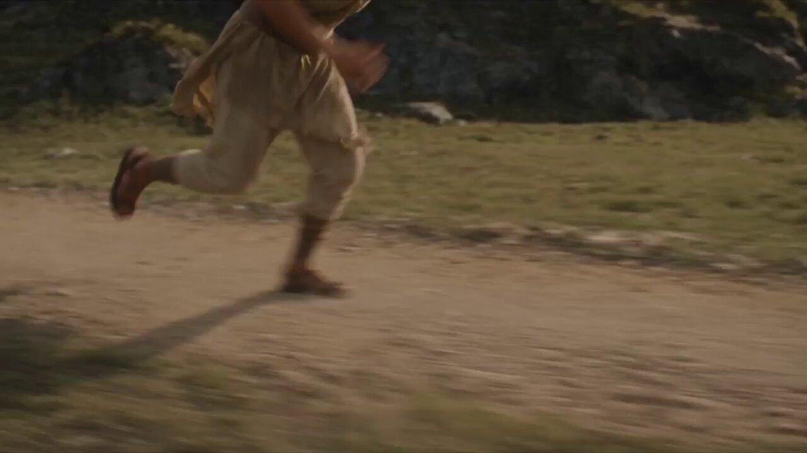</a>

<a href="https://x.com/noman23761/status/2083480073026343323">▶️ 在 X 上观看视频</a>

</div>

<details>
<summary><b>📋 点击展开 / 复制提示词</b></summary>

```
This entire fantasy sequence was generated as one 30-second Seedance 2.5 clip.

The generation cost around $11, which is definitely expensive for a single attempt—but the model handled several difficult transitions surprisingly well:

Side-tracking running sequence

Jumping from a cliff in one continuous motion

Mid-air griffin catch

Character and creature interaction

Waterfall flyby and canyon flight

Multiple cinematic camera angles

Natural sound effects without music

The biggest challenge was clearly describing the momentum of the jump and making sure the griffin approached from below instead of randomly appearing beside the character.

There are still a few moments where the motion and anatomy could be cleaner, but for a 30-second fantasy action sequence generated from reference images, the result feels much more coherent than I expected.

At $11 per generation, I think it is worth testing for complex shots that would normally require multiple clips and edits—but probably too expensive for casual experimentation or repeated prompt testing.

Would you pay $11 for a 30-second generation like this?

Prompt:
NO MUSIC, ONLY NATURAL SOUND — Epic blockbuster fantasy, shot on ARRI Alexa 65 with IMAX-scale anamorphic lenses, warm golden-hour daylight breaking through canyon haze, drifting mist and volumetric god-rays, with grounded handheld energy during the run building into a sweeping aerial glide in flight. In the sweeping rocky valley from Image3, tiered waterfalls spill down the cliffs, scattered pines line a winding dirt trail across the canyon floor, and tall sandstone mesas dissolve into low mist.

A side-tracking shot moves parallel to ERYAN (Image1) as he sprints in profile across the dirt trail, staying low on his feet as they pound the ground and kick up dust and grit. The camera gradually eases back to hold his full body in frame: a lean young man wearing a tattered beige linen tunic belted with a wide leather sash, with black wavy hair, green eyes, and cloth bindings wrapped around his lower legs, driving toward a jutting rock outcrop.

Staying lateral with him, the camera follows as he reaches the lip and launches off the edge into open air above the valley. Slow motion at the peak of the leap, held in side profile, with his body suspended against the waterfalls far below, his tunic and hair lifting and his arms spread wide.

The forward momentum of the jump carries him into a long downward arc, still traveling forward as he drops, and within the same continuous motion THE GRIFFIN (Image2)—with an eagle head, dark brown plumage, tufted ears, pale eyes, a hooked gray beak, black-brown wings, tawny lion hindquarters, a leather saddle, and braided rope reins—sweeps upward from below in a rush of powerful wingbeats and slides beneath him mid-arc, catching him on its back.

Return to real time as ERYAN (Image1) settles into the saddle, grabs the rope reins tightly in both fists, and the griffin banks hard into flight.

Dynamic flight sequence: a wide aerial shot follows THE GRIFFIN (Image2) sweeping down the canyon between towering cliff walls, its wingtips skimming a cascading waterfall as spray mists across its feathers.

Cut to a tight side-profile tracking shot of ERYAN (Image1) leaning low over the griffin’s neck, wind tearing through his hair as a wide grin breaks across his face and his breath becomes visible.

Cut to a low hero shot of THE GRIFFIN (Image2) from the front, wings stretched to their full span, driving forward with powerful downbeats and its eyes locked ahead.

Cut to an over-the-shoulder shot from behind ERYAN as the valley opens before him, with waterfalls, pines, and mist-covered mesas streaming past below.

The griffin rises through a shaft of golden light and levels out into a long, graceful glide over the ridge.

Faces, wardrobe, feather patterns, anatomy, and proportions remain perfectly locked to the reference sheets, with lighting and landscape matched to Image3.

SFX: pounding footsteps, scattering grit, the whoosh of the leap, the heavy thunder of wingbeats, rushing wind, distant waterfall roar, Eryan’s laughing breath, and creaking saddle leather.

Cinematic 4K, subtle filmic grain, accurate feather and cloth physics, grounded natural motion, no music, no text, no watermark, no CGI plasticity."

Share your thoughts in the comments section below!
```

</details>

**👤 出处:** [@noman23761](https://x.com/noman23761) · [source](https://x.com/noman23761/status/2083480073026343323)

▶️ **用 API 跑这条提示词** → [Velokey](https://velokey.ai/model/doubao-seedance-2-5-text-to-video?sourceChannel=github-awesome-seedance)（模型 id：`seedance-2.5`）

---

### No.102 沙漠遗迹夜战·上部

 

<div align="center">

<a href="https://x.com/Linkinpark3Park/status/2083577267142140193">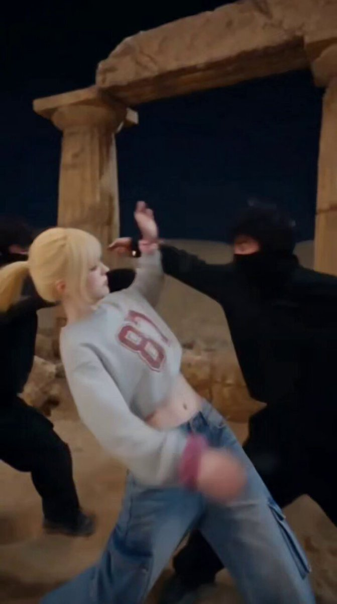</a>

<a href="https://x.com/Linkinpark3Park/status/2083577267142140193">▶️ 在 X 上观看视频</a>

</div>

<details>
<summary><b>📋 点击展开 / 复制提示词</b></summary>

```
First 30 second part prompt yes : [视觉风格与整体基调]
电影级夜间动作场面，写实真人风格，8K分辨率。场景设定在夜色笼罩的古老沙漠遗迹中，周围矗立着巨大的希腊式石柱，散布着历经风霜的古典雕像和细沙；强烈的顶光月色营造出深邃、高对比度的阴影效果。
• 0:00 - 0:03：低角度中景。金发主角被一群身穿黑色隐形战衣的袭击者包围，她格挡袭来的匕首攻击，缴获对手武器，并将其猛力摔入沙漠沙地中。
• 0:03 - 0:07：快速追踪镜头。她在古老石柱间穿梭，以敏捷的动作格挡同步袭来的剑击，并进行强力反击。
• 0:07 - 0:10：风格化定格/停顿镜头。她迅速抓起一个棕色陶罐猛喝一口，随即将其抛开，同时低身闪避袭来的刀锋。
• 0:10 - 0:14：动态特技镜头。她格挡头顶交叉袭来的长剑，借力蹬踏倒塌的雕像底座，在沙地上完成一个爆发力十足的后手翻。
• 0:14 - 0:18：特技翻腾镜头。[服装一致性修正：严格锁定其灰色短款卫衣和蓝色宽松工装牛仔裤；下装绝不可变更为参考视频中的款式]。她攀上巨大的倒塌石柱，随后完成一个高难度的后空翻并顺势在沙地上翻滚，以此躲避后方的偷袭。
• 0:18 - 0:23：近身格斗镜头。她从沙地上一跃而起，施展凌厉的组合拳和强力踢击，将周围多名戴面具的忍者击倒在地。
• 0:23 - 0:26：高台格斗镜头。她跃上两根巨柱之间高耸的废墟石台，低身闪避挥砍而来的长剑，并将一名袭击者扫落台下。
• 0:26 - 0:30：高潮特写镜头。她手持缴获的利刃，傲然屹立于被击败的忍者之上。镜头迅速推进，给出一组极具张力的特写：她目光如炬，神情坚毅，直视镜头。 负面提示词
卡通，3D渲染，动漫风格，低分辨率。
```

</details>

> 💡 中文 prompt，需参考图

**👤 出处:** [@Linkinpark3Park](https://x.com/Linkinpark3Park) · [source](https://x.com/Linkinpark3Park/status/2083577267142140193)

▶️ **用 API 跑这条提示词** → [Velokey](https://velokey.ai/model/doubao-seedance-2-5-text-to-video?sourceChannel=github-awesome-seedance)（模型 id：`seedance-2.5`）

---

### No.103 一镜到底电影感人像

 

<div align="center">

<a href="https://x.com/MathisYanis/status/2083637120883728546">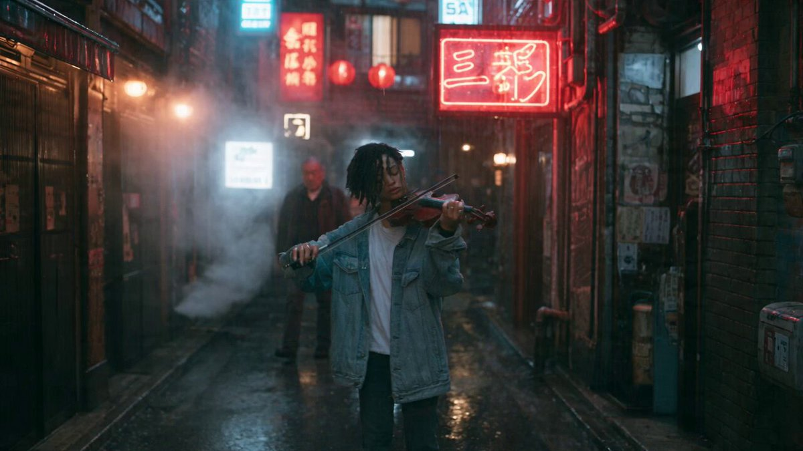</a>

<a href="https://x.com/MathisYanis/status/2083637120883728546">▶️ 在 X 上观看视频</a>

</div>

<details>
<summary><b>📋 点击展开 / 复制提示词</b></summary>

```
A 15-second continuous one-take cinematic shot of a young female street musician in a rainy neon-lit Tokyo alley at night. She starts playing a violin under a flickering neon sign, raindrops bouncing off the strings; then she walks toward the camera while continuing to play, passes a group of curious passersby who stop to listen, and ends by looking directly into the lens with a hopeful smile as the rain intensifies. Soft warm key light on her face, cool blue ambient neon reflections on wet pavement, realistic water physics, subtle camera gimbal tracking forward, natural ambient rain and violin audio synchronized. High detail skin and fabric, 4K cinematic look.
```

</details>

> 💡 需2参考图

**👤 出处:** [@MathisYanis](https://x.com/MathisYanis) · [source](https://x.com/MathisYanis/status/2083637120883728546)

▶️ **用 API 跑这条提示词** → [Velokey](https://velokey.ai/model/doubao-seedance-2-5-text-to-video?sourceChannel=github-awesome-seedance)（模型 id：`seedance-2.5`）

---

### No.104 K-pop 双人 MV

 

<div align="center">

<a href="https://x.com/Aqib__786Ai/status/2083787627531034977">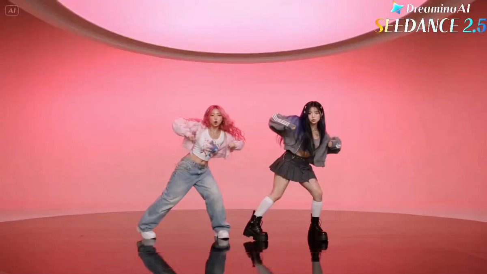</a>

<a href="https://x.com/Aqib__786Ai/status/2083787627531034977">▶️ 在 X 上观看视频</a>

</div>

<details>
<summary><b>📋 点击展开 / 复制提示词</b></summary>

```
Dreamina AI is an official platform for Dreamina Seedance 2.5. It brings cinema-grade, professional-grade, and high-aesthetic visuals to life with unmatched performance.

Made with @dreamina_ai Seedance 2.5 via its official platform: Dreamina AI

prompt

30-second ultra-realistic K-pop MV featuring two young East Asian women with flawless synchronization, cinematic lighting, glossy skin, realistic hair and fabric physics, natural body motion, and 4K live-action quality. Vibrant hot pink, electric blue, and silver color palette. 0–2s: Wide shot in a bright circular pink studio with reflective floor. Pink-haired woman (left) and black-haired woman (right) perform energetic opening pose and synchronized dance. 2–4s: Medium close-up of the black-haired woman on a blue spotlight stage, confidently pointing at the camera. 4–6s: Pink-haired woman dances before shimmering blue-silver tinsel curtains, dramatic hair flip and fluid arm movements. 6–8s: Back to the pink studio. Both perform synchronized choreography with sharp arm waves, hip sways, and strong formations. 8–10s: Extreme close-up of both faces against a blue background, glossy makeup, subtle smiles, and direct eye contact. 10–14s: Solo shots at the tinsel backdrop. Pink-haired woman mouths lyrics and gestures confidently, followed by the black-haired woman with relaxed jacket styling. 14–18s: Pink studio. Coordinated jacket choreography, hair flips, powerful synchronized dance, ending hands-on-hips. 18–22s: Glamour close-ups. Black-haired woman under glittering bokeh lights, then pink-haired woman with wind-blown hair against a soft pink background. 22–24s: Blue spotlight stage. Mirrored black-haired performer effect with synchronized spins and flowing hair. 24–26s: Both walk confidently toward the camera in front of shimmering tinsel curtains, reflections visible on the floor. 26–29s: Final synchronized dance and ending pose in the pink circular studio, standing together and looking into the camera. Style: Hyper-realistic live action, Seedance 2.5-quality motion realism, perfect lip sync, natural weight shifts, flowing hair, realistic fabric simulation, polished K-pop music video cinematography.
```

</details>

> 💡 需人物参考图

**👤 出处:** [@Aqib__786Ai](https://x.com/Aqib__786Ai) · [source](https://x.com/Aqib__786Ai/status/2083787627531034977)

▶️ **用 API 跑这条提示词** → [Velokey](https://velokey.ai/model/doubao-seedance-2-5-text-to-video?sourceChannel=github-awesome-seedance)（模型 id：`seedance-2.5`）

---

### No.105 电影级一镜到底模板

 

<div align="center">

<a href="https://x.com/Ciri_ai/status/2083803575915044941">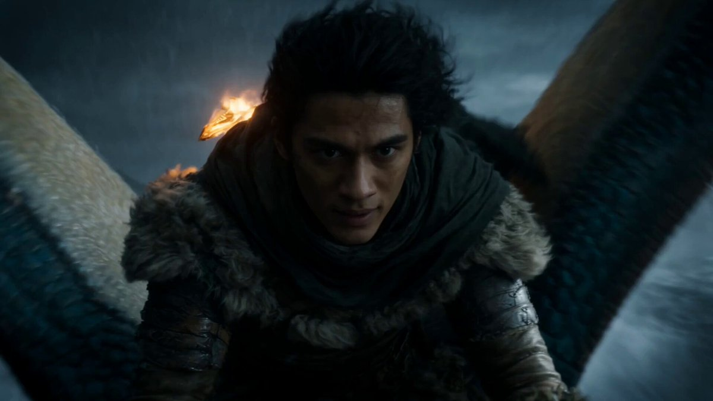</a>

<a href="https://x.com/Ciri_ai/status/2083803575915044941">▶️ 在 X 上观看视频</a>

</div>

<details>
<summary><b>📋 点击展开 / 复制提示词</b></summary>

```
single continuous shot, one take no cuts, cinematic oner, cinematic lighting, photorealistic, 8K ultra-high-definition, hyperdetailed,
35mm film quality, professional color grading, sharp focus, high detail texture, film grain, depth of field mastery, steadicam fluidity
A lone rider tears through a violent ashfall across a chain of active volcanic peaks on the back of a flying dragon, shot in full third
person. The rider is a young Indonesian man (use attached face reference — face fully visible, no helmet, black windswept hair
whipping in the ash-wind), a wiry figure in layered fur-and-leather flight gear, a wind-torn dark cloak streaming behind, gloved hands
gripping a harness strap — a long dormant sword sheathed across his back, its hilt faintly glowing amber. The dragon is an original
design — a sleek serpentine flier with charcoal-black obsidian-scaled hide, broad membranous wings, ridged spine, and faint warm
amber bioluminescence glowing along its scale-seams and throat, the only cool light in a molten world. The storm rages in ash-grey
and magma-orange: black eruption clouds stacked between glowing lava-veined calderas, ash and cinders streaking sideways, lava-
lightning forking through the plumes. The hook arrives as a second, far larger leviathan-dragon erupting head-on from a wall of ash —
a crash zoom slams into the rider as he draws his sword, slow motion holding the blade-ignition, before a cataclysmic light-slash
cleaves the giant and its sundered body crashes into the calderas in fountains of lava. The take is one unbroken oner, the camera
flowing from frontal tracking to rear chase to crash zoom, the only speed shift the slow-motion draw before the slash. [VFX: amber
scale-glow bioluminescence, colossal second dragon, volumetric ash fog, lava-lightning, molten burning cut-seam, blinding light-blade
slash arc, caldera-impact lava fountains]
Single continuous shot 15s: The shot opens on a frontal tracking medium close-up flying backward ahead of the rider — his
unmasked face filling the frame with wind-torn black hair and hard focused eyes, ash streaking past between him and the lens, the
dragon's head bobbing into frame beneath him as they punch through a plume of eruption smoke. The camera dynamically swings
and orbits around his shoulder to settle behind him, revealing the ash-choked volcanic chain ahead, then chases low and tight as
the dragon weaves and snakes hard between glowing calderas, wings carving the smoke, banking left and right with the cloak
lashing, the amber scale-glow blending into the magma-orange glow below. Without warning the colossal leviathan-dragon erupts
head-on from a wall of ash directly ahead, its vast jaws opening — and the camera crash zooms into a medium shot of the rider as
time violently ramps into extreme slow motion: he rises on the saddle, face set with total resolve, and draws the sword from his back
in one flowing motion, the blade igniting into blinding amber-white light, ash and cinders hanging frozen around him, horizontal
anamorphic flares raking the lens, the giant's enormous amber eye looming huge and reflecting his tiny burning silhouette. Time
cracks back to full speed as he swings with his entire body — a colossal crescent arc of searing light erupts from the blade, tearing
across the sky and flooding the whole frame white, the shockwave blasting the ash clouds outward in a perfect expanding ring — and
as the glare fades a molten amber seam burns across the leviathan's full length where the arc passed, erupting in chains of white-
gold detonations as the colossal body sunders into two immense halves, each edge cauterized in glowing ember-light with no gore,
the severed silhouettes plummeting in opposite directions trailing fire and smoke until they slam into the calderas below — twin
apocalyptic impacts that erupt in fountains of molten lava, hurl up mushrooming clouds of ash and cinder, and send fresh lava flows
cascading down every slope; the camera pulls back into a vast trembling wide as the blast wave rocks the rider's dragon mid-air, the
rider standing braced on the saddle with the dimming sword lowered, a tiny victorious silhouette against the burning crash-glow, the
falling ember-rain, and the lava-lit peaks.
```

</details>

**👤 出处:** [@Ciri_ai](https://x.com/Ciri_ai) · [source](https://x.com/Ciri_ai/status/2083803575915044941)

▶️ **用 API 跑这条提示词** → [Velokey](https://velokey.ai/model/doubao-seedance-2-5-text-to-video?sourceChannel=github-awesome-seedance)（模型 id：`seedance-2.5`）

---

### No.106 屋顶花园黄金时刻变身

 

<div align="center">

<a href="https://x.com/LudovicCreator/status/2083915958524031087">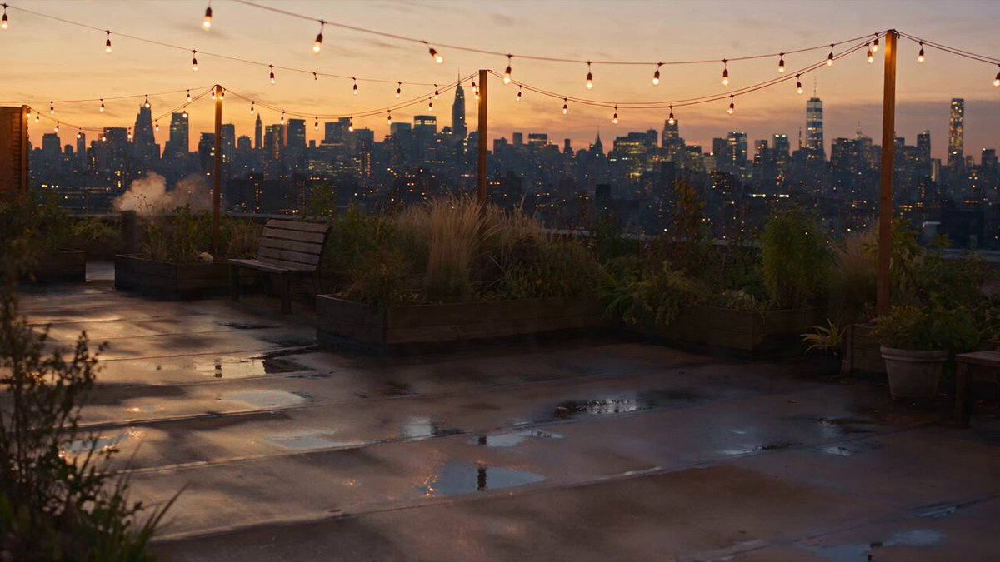</a>

<a href="https://x.com/LudovicCreator/status/2083915958524031087">▶️ 在 X 上观看视频</a>

</div>

<details>
<summary><b>📋 点击展开 / 复制提示词</b></summary>

```
[Global Setting] Base Environment & Texture: A city rooftop garden at golden hour,
warm orange light raking across wet pavement from earlier rain, soft haze in the
skyline behind, string lights beginning to flicker on.

[Opening beat, 0–8s]: Wide shot. A runner in a grey hoodie jogs into frame along
the rooftop path, breath visible in the cool evening air, camera holds static.

[Mid beat, 8–22s]: Camera begins a slow tracking pan alongside the runner at hip
height, matching pace. Passing shots of string lights, a couple sharing a bench,
steam rising from a nearby vent. Light shifts from orange to a deeper blue as the
sun dips further.

[Closing beat, 22–30s]: Runner slows to a stop at the rooftop edge, camera arcs
around to a three-quarter front view, city skyline fully lit behind them, runner
catches breath and looks out over the view. Hold on final frame.

Audio: Footsteps on wet concrete, distant city ambience, wind, no music.

Made in @dreamina_ai
```

</details>

**👤 出处:** [@LudovicCreator](https://x.com/LudovicCreator) · [source](https://x.com/LudovicCreator/status/2083915958524031087)

▶️ **用 API 跑这条提示词** → [Velokey](https://velokey.ai/model/doubao-seedance-2-5-text-to-video?sourceChannel=github-awesome-seedance)（模型 id：`seedance-2.5`）

---

### No.107 竖版时尚变身 9:16

 

<div align="center">

<a href="https://x.com/BubbleBrain/status/2083939966594527607"></a>

<a href="https://x.com/BubbleBrain/status/2083939966594527607">▶️ 在 X 上观看视频</a>

</div>

<details>
<summary><b>📋 点击展开 / 复制提示词</b></summary>

```
---prompt--- 
30-Second Vertical Fashion Transformation Video (9:16)
 Style: High-end fashion magazine motion cover + K-pop idol styling collage + social media outfit transition video
Use the uploaded reference image for the female protagonist’s identity, facial features, hairstyle, makeup, and overall appearance. Use the generated image as reference for the overall collage composition, layout, floating sticker characters, white dashed outline effect, and five modern fashion / K-pop idol outfits.

Create a 30-second 9:16 vertical fashion transformation video with a clean luxury studio aesthetic. The visual style should feel like a dynamic fashion editorial cover mixed with K-pop idol concept photoshoot materials and viral outfit transition videos.

The image should look premium, elegant, minimal, and realistic. All movements should feel natural. Every transformation must be smooth and stylish. The protagonist must always remain the exact same person.

CHARACTER CONSISTENCY

The central female protagonist must always be the same young adult woman from the reference image.

Maintain consistent:

facial structure

eyes, nose, lips, face shape
skin tone
hairstyle and hair volume
makeup style
age appearance
body proportions
jewelry style
overall Korean idol aesthetic
Appearance anchor:

cool fair skin tone

long black wavy hair
soft airy bangs
delicate Korean-style makeup
subtle pink blush
soft nude lips
pearl earrings
thin necklace
delicate rings and bracelets
slim elegant figure
calm, refined, slightly distant idol aura
The central character starts wearing the main stage outfit:

White / ivory crystal stage outfit

diamond decorated bustier-style top

matching high-waisted short skirt
sequins
pearls
layered folds
flowing sheer fabric details
Overall feeling:
luxurious, glowing, like a K-pop group center performer stage costume.

COLLAGE LAYOUT
Scene:

A bright white / light gray seamless studio background.

The background and floor blend naturally together.

Soft diffused fashion studio lighting.

Clean luxury editorial atmosphere.

Camera:

fixed front-facing camera

slightly elevated angle

close distance
no zoom
no camera movement
no rotation
no panning
Composition:
Main protagonist positioned slightly right of center

Largest figure in the frame

Four smaller floating outfit sticker characters around her
Bottom-right area remains clean and empty
The composition must match the reference collage layout.
FOUR FLOATING OUTFIT STICKER CHARACTERS

Around the central character, place four smaller floating versions of the same woman.

They are not thumbnails.

Each one must be:

a complete full-body cutout

naturally cropped following the body silhouette

surrounded by a white hand-drawn dashed outline
like a floating fashion sticker
All four characters remain fixed in position throughout the video.
Top Left

White trainee / practice outfit

white cropped hoodie

white pleated skirt

youthful clean athletic feeling
rehearsal room idol trainee style
relaxed natural pose
Top Right
Black and white airport fashion outfit
white inner top

white knit cardigan

black details / buttons
black high-waisted bottoms
black shoulder bag
sunglasses resting on head
Feeling:
idol airport fashion, casual street style.
Middle Left

Black and white secondary stage outfit
black and white cropped performance top

metallic decorations

chains

studs
decorative straps
black and white pleated skirt
Feeling:
cooler, stronger comeback stage outfit.
Bottom Left
Black luxury editorial dress

black satin fitted dress
subtle slit or folded fabric details

elegant mature cold fashion magazine feeling

TRANSFORMATION MECHANISM

A white hand-shaped mouse cursor appears.
It sequentially clicks the four floating outfit stickers.
Every click follows the same transformation:
The selected small character remains in its original position.

A duplicate full-body sticker version is created.

The sticker flies toward the central character.

It gradually scales up.

The white dashed outline stays attached to the silhouette.
When the flying sticker perfectly overlaps the central character’s head, shoulders, waist, and pose:
The outfit changes instantly and smoothly.
The flying element must always be:
a complete human figure
not clothing pieces
not isolated accessories

not rectangular cards

not abstract effects
TIMELINE
0-3.5s — Fashion Cover Comes Alive
Central character wears the white crystal stage outfit.
She stands slightly turned toward camera.
Pose:
one hand near collarbone or hair

other arm relaxed

calm magazine-cover expression

She slowly raises her eyes toward the camera.

A subtle head tilt.
A very small relaxed smile.
The four sticker characters remain frozen around her.

The scene should feel like a static fashion collage suddenly becoming alive.

Audio:

soft studio ambience

subtle fabric movement

quiet breathing

minimal luxury electronic beat begins

3.5-7.2s — First Transformation: White Trainee Look
Cursor moves to the top-left sticker.
Click.
The sticker flies diagonally toward the center and enlarges.
During the transition:

The woman gently lowers her hand from her hair.

Shoulders relax.

Body weight shifts naturally.

At 7.2s:

Transformation completes.

New outfit:

white cropped hoodie + white pleated skirt.

Movement after transformation:

straighten posture

slightly playful trainee energy

one hand behind waist

slight forward lean toward camera

Audio:
mouse click
clean swoosh
fashion transition hit

soft fabric movement

7.2-12.5s — Trainee Outfit Showcase
She performs small natural idol movements:
slight head tilt
looks into camera then away
gently touches skirt edge

hands return behind body

subtle side-to-side movement
Hair moves naturally.
A small restrained smile.
Not exaggerated cute.
More like a professional idol photoshoot.

Cursor slowly moves toward top-right sticker.

12.5-16.8s — Second Transformation: Airport Fashion

Cursor clicks top-right sticker.

Sticker flies diagonally toward center.

At 16.8s:

Transformation completes.

New outfit:

white inner top

white cardigan

black high-waisted bottoms

black shoulder bag

sunglasses on head
She immediately grabs the bag strap.
Pose:
relaxed shoulder line
slight body turn

one leg slightly forward

Feeling:
idol airport street photo comes alive.

16.8-21.2s — Airport Look Showcase
Natural fashion movements:
adjust cardigan

hold bag strap
turn into three-quarter profile

slowly return to camera

slightly lift chin

Expression:
quiet confidence, elegant distance.
Cursor moves toward middle-left sticker.
21.2-24.8s — Third Transformation: Black White Stage Look
Cursor clicks middle-left sticker.

Sticker flies from left side into center.

Transformation completes.

New outfit:

black and white performance costume.

Energy becomes sharper.

Movement:

slight shoulder drop then rise

one hand near waist

other hand touching hair

stronger eye contact

subtle stage pose

Audio:
stronger transition hit
metallic accessory sounds
sharper fashion beat
24.8-27.6s — Stage Outfit Showcase

Controlled performance movements:

slight forward lean
arms open slightly
hand follows body line
fingers brush hair or shoulder

eyes return to camera

subtle chin lift
More powerful idol stage aura.
Cursor moves toward bottom-left sticker.
27.6-30s — Final Transformation: Black Editorial Dress
Cursor clicks bottom-left sticker.
Sticker flies upward toward center.

Around 28.9s:

Final transformation completes.

New outfit:

black satin fitted luxury dress.

Final pose:

one hand resting naturally in front

other arm relaxed

slight head tilt

slow return to camera

direct eye contact

Hair and dress fabric move slightly with natural inertia.
Final frame:
A premium fashion collage cover freezes.
Feeling:
luxury magazine editorial, elegant, mature, cinematic.

Audio:

final click

elegant transition sound

subtle ending tone

soft breathing

music fades out

SOUND DESIGN
Overall sound:
minimal, premium, fashion-focused.
Include:
minimal electronic fashion beat
mouse clicking sound

sticker flying swoosh

transformation impact sounds

fabric movement

hair brushing shoulders
bag strap movement
jewelry and metallic accessory sounds
subtle breathing
Avoid:
lyrics
dialogue
cartoon effects
exaggerated game sounds

noisy environments

STRICT RULES
Must have only:
one central woman
four fixed floating sticker versions
All characters are the same person.
Maintain:

same face

same hairstyle
same makeup

same identity

same body proportions

Four transformations must happen only through:
full-body sticker flying → scaling → overlapping → outfit change.
Do NOT create:
rectangular thumbnails
clothing flying separately

body duplicates

ghost images

double faces

extra people
distorted hands
face drift
changing identity
Camera must remain completely static.
No zoom.
No pan.
No rotation.
Style:
Modern Korean idol fashion.
Luxury studio photography.
High-end fashion collage.
Realistic human movement.
No:

anime

cartoon
fantasy
historical costume

exaggerated CGI effects.
```

</details>

> 💡 需人物参考图

**👤 出处:** [@BubbleBrain](https://x.com/BubbleBrain) · [source](https://x.com/BubbleBrain/status/2083939966594527607)

▶️ **用 API 跑这条提示词** → [Velokey](https://velokey.ai/model/doubao-seedance-2-5-text-to-video?sourceChannel=github-awesome-seedance)（模型 id：`seedance-2.5`）

---

### No.108 IMAX 真人大片

 

<div align="center">

<a href="https://x.com/egeberkina/status/2083998355948999079">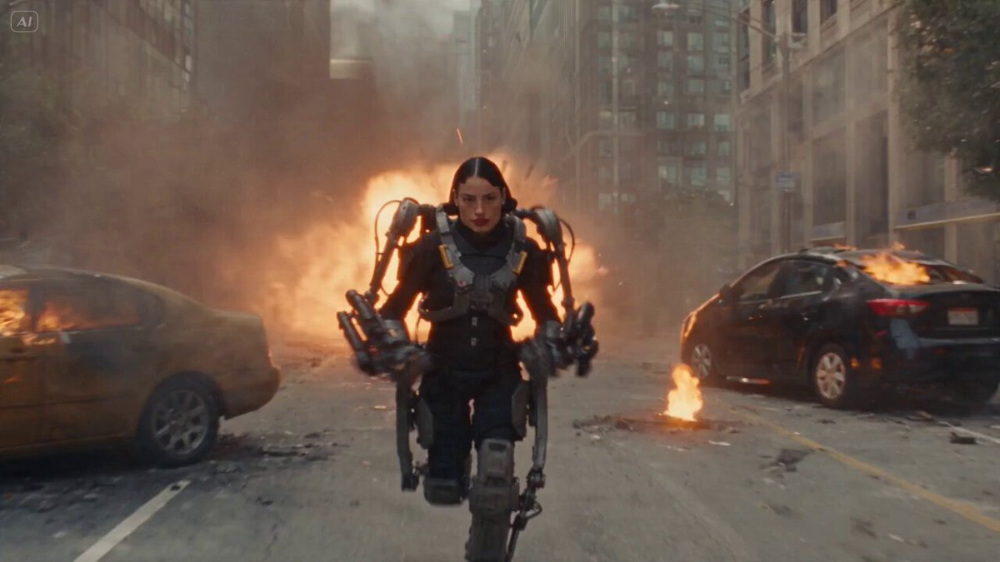</a>

<a href="https://x.com/egeberkina/status/2083998355948999079">▶️ 在 X 上观看视频</a>

</div>

<details>
<summary><b>📋 点击展开 / 复制提示词</b></summary>

```
100% photorealistic live-action blockbuster. IMAX-scale cinematic realism. Real-world physics. Aggressive handheld cinematography mixed with drone shots, cable-cam movement, whip pans, realistic motion blur, practical explosions, volumetric smoke, debris simulation, lens dirt, subtle film grain, natural daylight and grounded lighting. Every frame feels like a modern Hollywood action film.

Use [Reference Image] as the exact character reference. Preserve her face, proportions, hairstyle, clothing and identity consistently throughout the entire sequence.

She wears an original mechanical combat suit made from titanium and carbon fiber with exposed hydraulics, moving armor plates and subtle amber status lights. Completely original design.

A modern city is collapsing after an unknown biological invasion. Burning vehicles, collapsing buildings, helicopters, military convoys, drifting ash, shattered glass and realistic destruction fill every street.

Massive original bio-engineered creatures hunt her relentlessly. They are fast, brutal and physically intimidating.

The film begins in the middle of absolute chaos.

She sprints toward camera while explosions erupt behind her.

A creature lands directly in front of her.

She doesn't stop.

She smirks.

"Oh... you're fast."

It attacks.

She sidesteps at the last second.

Its claws slice through a city bus instead.

She replies,

"Almost."

The soundtrack explodes into huge hybrid orchestral percussion.

She launches herself onto the bus, runs across its roof, jumps through a collapsing building and crashes through an office window.

The camera never leaves her.

Concrete rains around her.

Two creatures attack simultaneously.

She ducks beneath one.

Throws the other through a glass conference room.

Desks, monitors and furniture explode across the floor.

One creature tackles her through several walls.

She stands up laughing.

"That actually hurt."

The largest creature slowly enters the room.

It roars.

Dust falls from the ceiling.

She slowly cracks her neck.

"Finally..."

The creature charges.

The collision destroys the entire floor.

They fall together through multiple levels of the building while fighting continuously.

Every impact bends steel, shatters concrete and blows out windows.

She catches a falling elevator cable, swings across the open shaft and lands on a collapsing bridge outside.

Military helicopters engage the creatures overhead.

Missiles strike nearby.

Shockwaves throw vehicles into the air.

She grabs a broken steel beam and fights with it like an improvised weapon.

The final creature knocks her to one knee.

Silence.

She spits blood.

Looks up.

"My turn."

She launches forward at incredible speed.

The final exchange is brutal and grounded.

Every punch creates realistic environmental destruction.

Concrete fractures.

Cars roll over.

Streetlights collapse.

The creature is finally driven through the center of the collapsing bridge as steel cables snap and debris crashes into the river below.

Smoke fills the air.

Emergency sirens echo through the ruined city.

She slowly walks out of the dust.

Her armor is scratched, smoking and damaged.

She looks directly into camera.

"Who's next?"

Cut to black.

Audio:

Massive Hollywood sound design. Helicopters, collapsing buildings, creature roars, metal impacts, concrete fractures, debris, explosions, breathing, armor mechanics.

Music:

Epic hybrid orchestral score with choir, aggressive percussion, distorted industrial textures and deep cinematic bass that continuously escalates before ending in complete silence.
```

</details>

**👤 出处:** [@egeberkina](https://x.com/egeberkina) · [source](https://x.com/egeberkina/status/2083998355948999079)

▶️ **用 API 跑这条提示词** → [Velokey](https://velokey.ai/model/doubao-seedance-2-5-text-to-video?sourceChannel=github-awesome-seedance)（模型 id：`seedance-2.5`）

---

### No.109 日系偶像个人 VLOG

 

<div align="center">

<a href="https://x.com/BubbleBrain/status/2084013378461478952">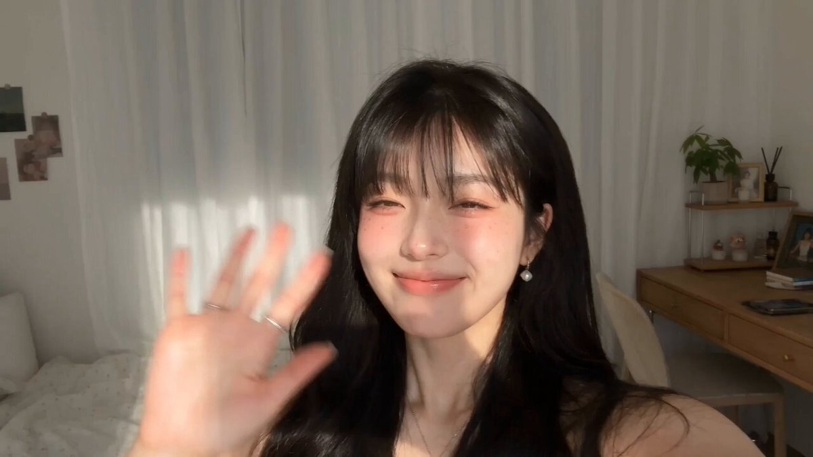</a>

<a href="https://x.com/BubbleBrain/status/2084013378461478952">▶️ 在 X 上观看视频</a>

</div>

<details>
<summary><b>📋 点击展开 / 复制提示词</b></summary>

```
You can also check it here: 
---
Create a 1-minute Japanese-style idol personal vlog. The video should feel like a young Japanese idol casually filming her private daily life for her fans. Not a commercial, not a music video, but a genuine personal diary captured with a small camera or smartphone. The mood is warm, intimate, soft, and slightly nostalgic. The main character is a young female idol with a gentle personality. If a reference image is provided, keep her exact face identity, hairstyle, facial features, body proportions, and overall appearance consistent throughout the entire video. She should feel natural and comfortable in front of the camera: small smiles, shy reactions, fixing her hair, looking away while thinking, small laughs, casual expressions. Camera style: handheld selfie vlog, compact digital camera feeling, Japanese lifestyle vlog aesthetic, soft CCD-like image quality, subtle film grain, slightly warm tones, gentle highlight bloom, natural skin texture, soft focus, slight autofocus adjustments, imperfect framing. The camera should feel like she is holding it herself or placing it casually around her room. No commercial lighting. No perfect poses. No dramatic acting. No artificial influencer energy.
0-8s: Morning bedroom introduction. The vlog starts with a close selfie shot. Soft sunlight comes through white curtains. The room feels cozy and personal: small decorations, books, cute accessories, a desk, plants, everyday objects. She looks into the camera with a sleepy smile. She waves softly and says: "Good morning. I'm filming a little vlog today." She laughs quietly, fixes her hair, and adjusts the camera. The feeling is like a private message to her fans.
8-18s: Introducing herself. She walks around her room while talking casually. She introduces herself: her personality, what kind of person she is, and what she likes doing in her free time. Show small everyday details: choosing clothes, making a drink, checking her schedule, looking through photos on her phone. She occasionally looks away from the camera naturally while talking. She feels like a real person, not performing.
18-30s: Introducing her cat Bubble. The mood becomes warmer and more playful. She calls: "Bubble..." The cat walks into the room. She smiles immediately and follows Bubble with the camera. Show cute natural moments: Bubble jumping onto the bed, sitting near the window, rubbing against her, looking curiously at the camera. She picks Bubble up gently and introduces: "This is Bubble. Bubble is my little family." She laughs because Bubble does not cooperate with the camera. The interaction feels spontaneous and real.
30-45s: Her everyday hobbies. A soft lifestyle montage filmed casually. Show her doing things she enjoys:
listening to music with headphones
writing in a diary
reading a magazine
making coffee or tea
taking selfies
organizing small things in her room
playing with Bubble She talks casually: "I like simple days like this." "I think small moments are my favorite." The atmosphere is peaceful and comforting.
45-55s: A small outside moment. She goes outside for a short walk. Japanese neighborhood atmosphere: quiet streets, small cafes, bicycles, soft afternoon sunlight. She holds the camera while walking. She shows little things she finds interesting: a cute shop, flowers, a drink, a beautiful street corner. She smiles at the camera naturally.
55-60s: Ending the vlog. Back at home. She sits with Bubble beside her. Selfie camera close-up. She smiles warmly and says: "Thank you for spending this little day with me and Bubble." "See you next time." She waves softly. The video ends with a gentle smile, natural room lighting, and a cozy diary-like feeling.

Overall style: Japanese idol private vlog. Soft and nostalgic. Like a personal video diary from a small digital camera. Warm everyday moments. Cute but natural. Quiet happiness. Authentic fan connection. Visual references: Japanese lifestyle vlog atmosphere, soft CCD camera texture, early 2000s digital diary feeling, modern idol off-duty content. Avoid: luxury influencer style, fashion commercial look, perfect cinematic shots, heavy makeup, overly staged reactions, AI-generated smoothness, unrealistic movements.
```

</details>

> 💡 需人物参考图

**👤 出处:** [@BubbleBrain](https://x.com/BubbleBrain) · [source](https://x.com/BubbleBrain/status/2084013378461478952)

▶️ **用 API 跑这条提示词** → [Velokey](https://velokey.ai/model/doubao-seedance-2-5-text-to-video?sourceChannel=github-awesome-seedance)（模型 id：`seedance-2.5`）

---

### No.110 伪偷拍真实生活 VLOG

 

<div align="center">

<a href="https://x.com/QCXINT_/status/2084057364320354755"></a>

<a href="https://x.com/QCXINT_/status/2084057364320354755">▶️ 在 X 上观看视频</a>

</div>

<details>
<summary><b>📋 点击展开 / 复制提示词</b></summary>

```
🚨 This Seedance 2.5 prompt looks like someone secretly recorded real life.

Not a cinematic AI video.

Not a commercial.

Just 30 seconds that feel like an actual memory.

Someone figured out that realism isn't about adding more visual effects...

It's about making the AI behave like a real person.

This boyfriend vlog prompt does exactly that.

✨ Why it feels so real:

📱 Continuous handheld POV

💙 Imperfect camera shake

😊 Genuine everyday interactions

🏪 Convenience store conversations

🍜 Natural restaurant moments

🚆 Real Tokyo train ride ending

🌇 Smooth transition from morning to night

No cinematic shots.

No dramatic poses.

No fake influencer energy.

Just authentic documentary-style footage.

The prompt also forces strong identity consistency, so the same character remains stable from beginning to end instead of slowly changing into someone else.

That's one of the biggest differences between an AI video...

...and something that actually feels like it was filmed on a real phone.

📌 Bookmark this prompt if you're experimenting with Seedance 2.5. It might be one of the most realistic travel vlog prompts available right now.
```

</details>

> 💡 需人物参考图

**👤 出处:** [@QCXINT_](https://x.com/QCXINT_) · [source](https://x.com/QCXINT_/status/2084057364320354755)

▶️ **用 API 跑这条提示词** → [Velokey](https://velokey.ai/model/doubao-seedance-2-5-text-to-video?sourceChannel=github-awesome-seedance)（模型 id：`seedance-2.5`）

---

### No.111 播客采访对话

 

<div align="center">

<a href="https://x.com/Nabilidosoo/status/2083148007843774669"></a>

<a href="https://x.com/Nabilidosoo/status/2083148007843774669">▶️ 在 X 上观看视频</a>

</div>

<details>
<summary><b>📋 点击展开 / 复制提示词</b></summary>

```
El entrevistador esta en su podcast  entrevistando a @8993a3ce-444a-414b-9800-6798a9c997eb y le pregunta con su voz @0949c9e6-24ae-4895-b567-94aa844e0150: " Buenas mi gente, tenemos un nuevo modelo de IA y hemos traido a un experto en ello, Nabil cuentanos" y entonces el invitado dice con su voz @8993a3ce-444a-414b-9800-6798a9c997eb: "Buenas jordi, la verdad que es una cosa de locos. Gracias a este modelo puedo hacer cosas como esta" y se levanta chasquea los dedos y le sale pelo. Se sienta y dice con su voz @7ac71528-ba91-42ec-92e1-89875ed6e49f: "inténtalo tú" y jordi se levanta y chasquea los dedos y entra un equipo de rugby en el podcast y nabil y jordi empiezan a empujarse con el equipo entero como en una pelea. De repente la camara enfoca a nabil en medio de la pelea y este con su voz @7ac71528-ba91-42ec-92e1-89875ed6e49fdice :" Esto solo es posible con el nuevo modelo de seedance, que loco!" y le da un empujon al que tiene encima forcejeando. De repente jordi en medio de la pelea grita con su voz @0949c9e6-24ae-4895-b567-94aa844e0150: "STOP" y todos los de rugby se convierten en plumas que caen al suelo. Jordi y Nabil se miran y les entra un ataque de risa

  @dreamina_ai
```

</details>

> 💡 需参考图+音频

**👤 出处:** [@Nabilidosoo](https://x.com/Nabilidosoo) · [source](https://x.com/Nabilidosoo/status/2083148007843774669)

▶️ **用 API 跑这条提示词** → [Velokey](https://velokey.ai/model/doubao-seedance-2-5-text-to-video?sourceChannel=github-awesome-seedance)（模型 id：`seedance-2.5`）

---

### No.113 云缝匠·飞天火车

 

<div align="center">

<a href="https://x.com/StarjupiAI/status/2084368408791949782">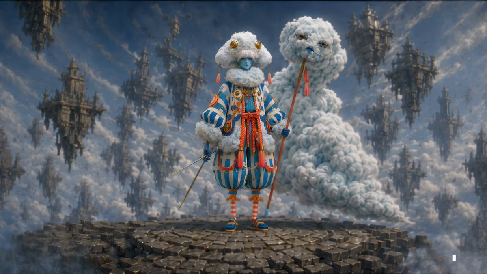</a>

<a href="https://x.com/StarjupiAI/status/2084368408791949782">▶️ 在 X 上观看视频</a>

</div>

<details>
<summary><b>📋 点击展开 / 复制提示词</b></summary>

```
@ Image1 was reused as the master identity reference for Cloudstitcher and the cloud companion.

@ Image2 defined the flying train, roof environment, Sun Core chamber and dark city. It was a world-design reference, not a frame-by-frame storyboard.

PROMPT ↓

@ Image1 defines one Cloudstitcher and one cloud companion. Preserve their exact faces, colors, body proportions, costume, ornaments, weapons and materials. Never duplicate, merge or redesign them. Ignore the studio background.

@ Image2 defines the world only: the flying train exterior, playable train roof, Sun Core chamber and dark city with the empty Sun Tower. Preserve its turquoise, cream, brass-gold and coral-red design language. Never reproduce it as a collage, split screen, storyboard or opening frame.

0–5s — Begin inside the finished game world. Above the dark city, show Cloudstitcher full-body on a floating stone platform. The companion waits behind as a flying train approaches.

5–11s — The hero runs and leaps toward the train. The companion briefly supports the movement like a cloud bridge. Cloudstitcher lands on the roof.

11–17s — The hero moves across the train roof and uses a golden needle with coral-red thread to pull toward the locomotive hatch.

17–23s — Cloudstitcher enters the circular engine chamber. Using both needles, the hero unlocks the mechanism and takes the intact golden Sun Core.

23–27s — The train breaks apart into rain, brass fragments and cloud vapor. The hero falls while protecting the Core. The same companion dives and catches them.

27–30s — They reach the Sun Tower. Cloudstitcher places the Core into its empty socket, sending a warm golden wave across the city.

Premium stylized 3D fantasy action-RPG cinematic with fluid chase cameras, readable movement, expressive fabric and cloud physics. Stormy blue-gray atmosphere contrasted by turquoise, cream, coral-red and warm brass-gold.

Wind, thunder, machinery, metallic impacts, cloud whooshes and orchestral percussion. No dialogue, narration, subtitles, UI, text, logos, extra characters or multiple Sun Cores.
```

</details>

> 💡 需角色+世界设定参考图

**👤 出处:** [@StarjupiAI](https://x.com/StarjupiAI) · [source](https://x.com/StarjupiAI/status/2084368408791949782)

▶️ **用 API 跑这条提示词** → [Velokey](https://velokey.ai/model/doubao-seedance-2-5-text-to-video?sourceChannel=github-awesome-seedance)（模型 id：`seedance-2.5`）

---

### No.114 维京奇幻手绘 3D 动画

 

<div align="center">

<a href="https://x.com/Carlos_Arthurr/status/2084341370400227489">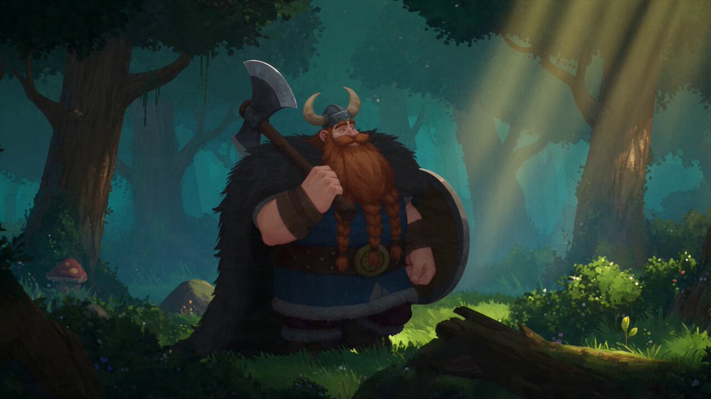</a>

<a href="https://x.com/Carlos_Arthurr/status/2084341370400227489">▶️ 在 X 上观看视频</a>

</div>

<details>
<summary><b>📋 点击展开 / 复制提示词</b></summary>

```
--

Animated fantasy with painterly 3D characters, hand-painted textures, expressive faces, bold silhouettes, dramatic color contrast, visible brushwork, stylized motion smears and cinematic lighting. Deep emerald forest, shafts of golden sunlight, cool blue shadows, drifting pollen and ancient moss-covered ruins. Energetic camera movement, playful character acting and explosive fantasy action. The hero is a huge, cheerful Viking with a braided ginger beard, fur-lined blue cloak, round wooden shield and a slightly too-small horned helmet. Keep his costume, weapons and proportions perfectly consistent throughout. 0–4s: [Wide Tracking Shot] The Viking strolls happily through the forest, humming to himself and swinging his axe over one shoulder. Birds flutter around him. He picks a tiny yellow flower, tucks it into his beard and continues walking with a broad, innocent smile. 4–8s: [Sudden Whip Pan] A crude goblin arrow strikes his shield. Dozens of small green goblins burst from hollow trees, bushes and underground burrows, shrieking as they surround him. The Viking pauses, looks at the arrow, then gives them a delighted grin—as if this has made his walk more interesting. 8–15s: [Fast Kinetic Combat] A wild forest fight erupts. The camera rushes between swinging axes, spinning shields and goblins flying through clouds of leaves. The Viking fights with joyful, oversized movements: shield-bashing three goblins at once, ducking beneath spears and using a fallen tree trunk like a battering ram. Stylized impact frames, painted motion streaks, splintered wood and showers of glowing leaves. No blood or gore. 15–19s: [Rising Crane Shot] More goblins pour from the forest and force him backward onto the edge of a towering cliff. His heels scrape loose stones into the ravine. Hundreds of goblins close in. For the first time, his smile fades. He looks over the edge, then back at the advancing army. 19–23s: [Epic Hero Entrance] Three silhouettes appear against the blazing sun on the cliff above him: a fierce Viking witch with glowing blue runes circling her hands, a colossal bearded giant covered in iron and fur, and a sharp-eyed Viking archer drawing three arrows at once. They leap down through the mist in dramatic slow motion. The witch lands in a burst of blue fire. The archer releases three arrows before touching the ground. The giant lands last, cracking the rock beneath everyone’s feet. The Viking’s huge smile instantly returns. His friends have arrived. 23–27s: [Extreme Wide Launch Sequence] The giant scoops up the Viking, witch and archer in one enormous arm. With a thunderous spinning throw, he launches all three across the ravine toward the goblin village below. The witch becomes a streak of blue magic, the archer fires glowing arrows in flight and the Viking raises his axe, laughing with pure delight. The giant takes one running leap after them. 27–31s: [Chaotic Aerial Destruction] The heroes crash into the goblin village like four living cannonballs. Towers collapse, wooden huts explode into painted splinters and goblins flee in every direction. The witch sends a magical shockwave through the streets. The archer cuts suspension ropes with impossible precision. The giant tears down the central watchtower while the Viking rides its falling roof through the village, still holding the flower in his beard. The destruction feels spectacular, playful and heroic rather than brutal. 31–35s: [Final Hero Shot] Hard cut to silence. The Viking sits proudly on the goblin king’s oversized throne amid the ruined village, legs spread and axe resting beside him. His witch, giant and archer friends stand behind the throne, exhausted but victorious. A tiny goblin cautiously offers him a wooden mug. The Viking takes it, raises it toward his friends and smiles. Slow push toward his face as the yellow flower falls from his beard into the mug. Painterly fantasy animation, rich facial acting, dramatic lighting, strong character silhouettes, textured environments, stable character designs, clean weapon choreography, stylized destruction, cinematic depth of field, controlled motion blur, no gore, no character duplication, no costume changes, no visual artifacts, movie-level temporal coherence and high rewatch value.
```

</details>

**👤 出处:** [@Carlos_Arthurr](https://x.com/Carlos_Arthurr) · [source](https://x.com/Carlos_Arthurr/status/2084341370400227489)

▶️ **用 API 跑这条提示词** → [Velokey](https://velokey.ai/model/doubao-seedance-2-5-text-to-video?sourceChannel=github-awesome-seedance)（模型 id：`seedance-2.5`）

---

### No.115 夏威夷热带旅行 Vlog

 

<div align="center">

<a href="https://x.com/Just_sharon7/status/2084238339469615320">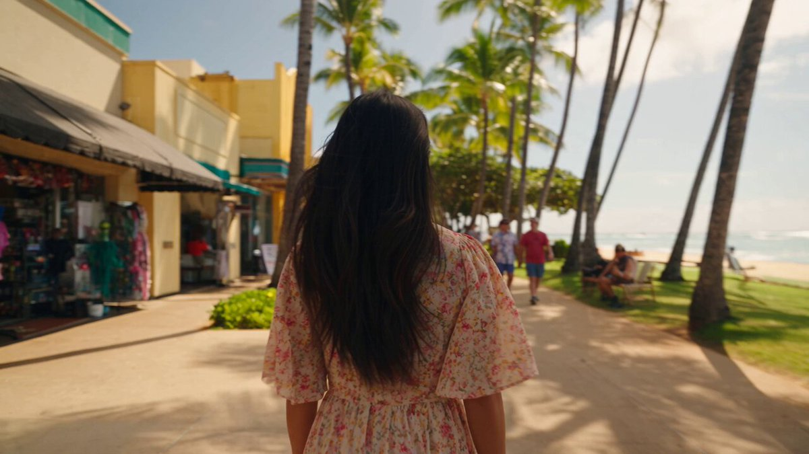</a>

<a href="https://x.com/Just_sharon7/status/2084238339469615320">▶️ 在 X 上观看视频</a>

</div>

<details>
<summary><b>📋 点击展开 / 复制提示词</b></summary>

```
A cinematic 30-second tropical travel vlog montage featuring a beautiful 20-year-old East Asian woman with dark hair exploring Hawaii during a dreamy summer vacation. Shot like an authentic luxury travel diary with handheld camera movement, candid moments, soft golden-hour sunlight, dreamy 35mm film aesthetics, warm vintage color grading, shallow depth of field, natural skin texture, atmospheric lighting, and cinematic storytelling. Maintain the same woman throughout every scene: dark hair, youthful appearance, natural makeup, elegant summer outfits, relaxed happy expression. Format: 4K cinematic video, 24fps, 35mm film grain, realistic handheld camera, soft focus, warm color palette, travel documentary style. Scene 1 (0-4s) — Arrival & City Walk: A beautiful Hawaiian morning. The woman walks through a bright tropical city street wearing a flowing floral summer dress and sunglasses. Palm trees line the sidewalk, sunlight reflects off colorful buildings, people walk casually in the background. Camera follows from behind, then transitions into a close-up of her smiling face as wind moves through her hair. Scene 2 (4-8s) — Beach Discovery: She steps onto a wide sandy beach with crystal blue ocean waves behind her. She walks barefoot along the shoreline, holding her dress slightly as waves touch her feet. Low-angle cinematic shots of footsteps in wet sand, ocean reflections, distant volcanic mountains under a clear sky. Scene 3 (8-12s) — Tropical Nature Moments: A cinematic worm's-eye view looking upward through towering palm trees. Golden sunlight streams between the leaves with beautiful lens flares. Cut to a close-up of her standing near a rocky ocean cliff, wind blowing through her hair while she looks peacefully toward the sea. Scene 4 (12-16s) — Beachfront Cafe & Slow Living: She sits alone at a cozy beachfront cafe near the window, drinking a tropical drink while watching waves outside. Soft sunlight enters through the glass. Close-up shots of her hands, coffee cup, ocean view, and thoughtful expression create an intimate travel diary feeling. Scene 5 (16-20s) — Ocean Adventure: She floats peacefully on a surfboard in calm turquoise ocean water. Camera moves around her from water level, showing gentle waves, sunlight sparkling on the sea surface, tropical coastline and mountains in the distance. She laughs naturally while looking toward the camera. Scene 6 (20-24s) — Night Market Exploration: A vibrant Hawaiian night market filled with warm lights, food stalls, and colorful decorations. She walks through the crowd, trying tropical fruit skewers and local street food. Cinematic close-ups of her reaction, glowing lanterns, neon bokeh, and bustling atmosphere. Scene 7 (24-27s) — Golden Sunset Ending: Wide cinematic silhouette shot of her standing on the ocean shore during sunset. Orange and pink skies reflect on the water. Waves gently move around her feet as she watches the sun disappear behind the horizon. Emotional travel film ending. Scene 8 (27-30s) — Hotel Night Reflection: Nighttime high-rise hotel balcony overlooking sparkling tropical city lights. She wears a simple white dress, leaning against the balcony while a warm breeze moves the curtains behind her. Final intimate close-up of her lying on the hotel bed, looking warmly into the camera lens with a peaceful smile. Camera Style: Authentic travel vlog cinematography, handheld camera shake, smooth cinematic transitions, slow push-ins, natural movement, occasional POV shots, realistic autofocus adjustments, subtle motion blur. Visual Style: Dreamy Hawaii vacation film, luxury travel advertisement aesthetic, soft golden sunlight, realistic skin texture, cinematic depth of field, nostalgic 35mm film look, warm atmospheric colors, natural expressions, emotional storytelling. Avoid: cartoon style, CGI look, plastic skin, unrealistic face, inconsistent character appearance, changing hairstyle, extra fingers, distorted body, artificial lighting, oversaturated colors, blurry face, unnatural movements, duplicate people.
```

</details>

> 💡 需人物参考图

**👤 出处:** [@Just_sharon7](https://x.com/Just_sharon7) · [source](https://x.com/Just_sharon7/status/2084238339469615320)

▶️ **用 API 跑这条提示词** → [Velokey](https://velokey.ai/model/doubao-seedance-2-5-text-to-video?sourceChannel=github-awesome-seedance)（模型 id：`seedance-2.5`）

---

### No.116 日本怪兽袭击动作 Vlog

 

<div align="center">

<a href="https://x.com/saniaspeaks_/status/2084231786155081918">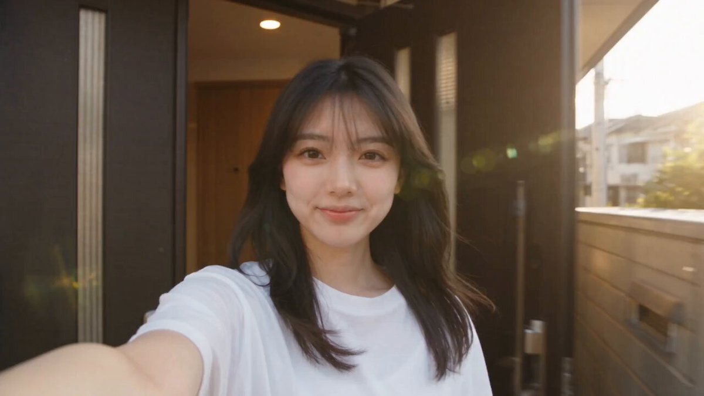</a>

<a href="https://x.com/saniaspeaks_/status/2084231786155081918">▶️ 在 X 上观看视频</a>

</div>

<details>
<summary><b>📋 点击展开 / 复制提示词</b></summary>

```
A cinematic action vlog in live-action photorealism. A young Japanese woman (image = her face and hair) leaves her house on a peaceful morning, casually filming herself with a handheld smartphone. As she walks through a busy Japanese street, people suddenly panic and run as a gigantic shadow monster appears in the distance, shaking the ground and roaring. She looks around in shock, then calmly places her phone on a nearby ledge. A glowing aura surrounds her as she transforms into a powerful armored heroine with flowing energy effects, her appearance remaining recognizable. She charges toward the giant creature and engages in a fast-paced, cinematic battle using agile martial arts, powerful energy strikes, and dramatic dodges through the city streets. After an intense final clash, she unleashes one decisive attack that defeats the monster, causing it to dissolve into glowing particles. The city becomes peaceful again. She transforms back into her normal appearance, smiling as relieved people gather around and respectfully bow in traditional Japanese style to thank her. She picks up her phone, laughs softly, waves at the camera, and says, "Everything's okay now. See you next time!" The video should feel like a high-budget live-action film with realistic physics, consistent character appearance, natural human movement, cinematic lighting, detailed visual effects, and no subtitles, logos, or watermarks.
```

</details>

> 💡 需人物参考图

**👤 出处:** [@saniaspeaks_](https://x.com/saniaspeaks_) · [source](https://x.com/saniaspeaks_/status/2084231786155081918)

▶️ **用 API 跑这条提示词** → [Velokey](https://velokey.ai/model/doubao-seedance-2-5-text-to-video?sourceChannel=github-awesome-seedance)（模型 id：`seedance-2.5`）

---

### No.117 日本弓道 TV 纪录片

 

<div align="center">

<a href="https://x.com/magic_ai_skill/status/2084310185502511554">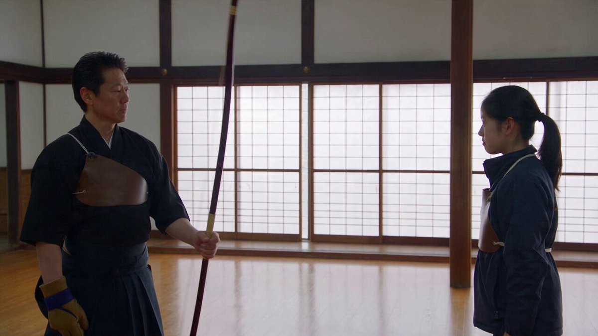</a>

<a href="https://x.com/magic_ai_skill/status/2084310185502511554">▶️ 在 X 上观看视频</a>

</div>

<details>
<summary><b>📋 点击展开 / 复制提示词</b></summary>

```
Craft competition testing segment in a traditional Japanese archery hall, multi-camera documentary production, bright daylight through screens plus fluorescent tubes, sharp HD broadcast look, natural handheld shake on action cams, clean documentary texture, no cinematic film look.

An indoor wooden-floored archery hall. One entire wall is a lattice screen letting in flat white light; white plaster walls with exposed dark timber posts.

THE BOW: an asymmetric longbow far taller than a person, the grip set about one third up from the bottom so the upper limb is much longer. Laminated bamboo finished in dark red lacquer, bound with rattan at intervals. A pale twisted string.

0-2s: [Medium Two-Shot] A master archer in his 40s in a black training top, dark hakama and white split-toe socks faces the young female bowyer in her early 20s. He wears a leather chest guard and a deerskin glove on his right hand. She is in a navy work jacket and apron, hair tied back, unsmiling. He stands her bow upright and turns it once in the window light so the lacquer flashes, then meets her eye: "Are you ready?" She answers firmly "Yes." Quick cut to her determined face, then to three ceramic beckoning-cat figurines on stands across the hall, white bodies painted with red ears and collars and gold bells.

2-4s: [Low-Angle Tracking + Rapid Cuts] The master raises the bow high above his head, then spreads his arms and lowers it. His left arm extends straight forward while his gloved right hand draws the string back past his right ear, bending the bow deeply. Hard cut to side angle as the arrow leaves the string. Impact explodes in slow motion as the point drives into the first cat's face: glazed porcelain splits into sharp fragments, red and gold paint chips flying out with the white dust. Time locks at peak penetration. Camera orbits the frozen arrow buried in the broken figurine for one second. Quick insert ECU of the point breaking out through the back.

4-6s: [Dynamic Side Tracking] Action resumes. The first figurine is already shattered, only its base left on the stand. The master nocks a second arrow and draws in the same form. Slow-motion again: the second figurine tears apart sideways, large red and gold pieces scattering with the dust. Freeze at maximum destruction. Two rapid cuts: one over-shoulder from behind the master, one low angle under the flying fragments. Orbit holds half a second on the locked impact.

6-8s: [Handheld Close Action] The first two figurines are already broken, only bases and scattered shards remain. Third shot — short, vicious release. Slow-mo impact, the porcelain erupts into dozens of pieces, an ear and a raised paw flying. Full freeze. Camera pushes in and circles the frozen chaos for one beat. Quick insert of the master's focused face after the release, then back to the locked arrow.

8-10s: [Series of Fast Cuts] Time resumes. The master holds the bow upright and turns it in the window light. Tight ECU along the string: two strands lifted and frayed. Cut to his bare fingertips rubbing that spot, glove off. Cut to all three stands still shedding dust, every figurine shattered. Cut to the young woman's tense expression as she watches.

10-12s: [Medium Close-Up] The master rests the bow tip on the floor and looks straight at her. Calm, professional: "There are two strands frayed on the string… but your bow, ma'am… it goes through." The three stands behind them remain shattered. Hard cut to her face — a small, controlled smile of pride breaks through.

12-15s: [Final ECU Montage] Extreme close-up of the frayed but still taut string in the window light. Cut to porcelain fragments scattered across the wooden floor. Final frame holds on the young bowyer's quiet satisfaction as the master nods once.

Realistic TV broadcast quality, detailed porcelain shatter physics, sharp arrowhead and string detail, natural motion blur only on moving elements, stable characters, coherent impact timing, no artifacts.

TechHalla님의 프롬프트를 제 식대로 재구성해봤습니다👏
```

</details>

**👤 出处:** [@magic_ai_skill](https://x.com/magic_ai_skill) · [source](https://x.com/magic_ai_skill/status/2084310185502511554)

▶️ **用 API 跑这条提示词** → [Velokey](https://velokey.ai/model/doubao-seedance-2-5-text-to-video?sourceChannel=github-awesome-seedance)（模型 id：`seedance-2.5`）

---

## 🤝 投稿

在 X / Reddit / 小红书看到好提示词？[**点这里用表单投稿**](https://github.com/velokey-ai/awesome-seedance-2.5-prompts/issues/new?template=submit-prompt.yml)，审核通过后自动收录进 README。

## 📄 协议

本仓库采用 [CC BY 4.0](https://creativecommons.org/licenses/by/4.0/) 协议，提示词版权归原作者所有。

[](https://star-history.com/#velokey-ai/awesome-seedance-2.5-prompts&Date)

<div align="center">

<sub>🤖 Auto-generated from <code>data/prompts.yaml</code> · 2026-08-09 04:17 UTC</sub>

<br><sub>一个 API 接入主流文本 / 图片 / 视频模型 · [velokey.ai](https://velokey.ai/model/doubao-seedance-2-5-text-to-video?sourceChannel=github-awesome-seedance)</sub>

</div>