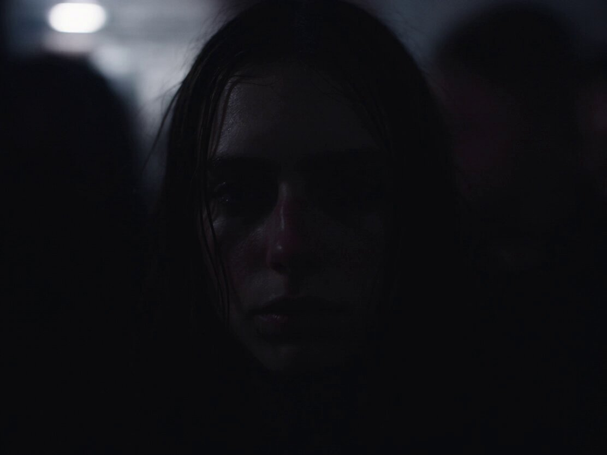

[← 返回全部 / Back to all]( ../README_zh.md )　|　[English list](../README.md)

# No.2 · 伦敦地下电子俱乐部 / London Underground Techno Club

`电影运镜 / Cinematic`　`model: seedance-2.5`

<div align="center">

<a href="https://x.com/JMSvid/status/2083210992343756893"></a>

<b><a href="https://x.com/JMSvid/status/2083210992343756893">▶️ 在 X 上观看视频 / Watch on X</a></b>

</div>

## 📝 Prompt

```
Original scene, 30 seconds, one continuous shot, no cuts.

0–8 seconds: Inside a packed underground London techno club. The camera holds tightly on the face of a young English woman. She is Caucasian, brunette, with delicate features and melancholy behind her eyes. She remains centered in frame and only sways subtly with the music. Around her, the crowd moves intensely and chaotically, with bodies, arms, shoulders and faces constantly passing close to camera, creating strong motion blur and a sense of pressure and overwhelm.

Fast white strobe lights flash continuously, pushing the image back and forth between near-total darkness and sudden bursts of harsh illumination. In the darker intervals, only silhouettes, rim light, glints of sweat and fragmented movement are visible. Each flash briefly reveals fragments of her face—her eyes, cheekbones, wet strands of hair, and distant expression—before she disappears again into darkness. She feels strangely still and emotionally detached while the crowd around her becomes a mass of blurred bodies and flickering light. Heavy four-on-the-floor techno dominates the soundscape, loud, compressed and physically overwhelming.

8–16 seconds: She stays in this space for a moment longer, absorbing the intensity, then finally breaks her gaze, turns and begins pulling herself out of the crowd. The camera does not cut. It releases from the locked close-up and shifts into a close handheld follow shot, staying just behind and slightly beside her as she pushes through dancers. Bodies knock into her shoulders. Arms and backs occasionally obscure the frame. The camera feels intimate, bumped and instinctive, struggling through the same crowded space with her.

As she leaves the center of the dancefloor, the strobing becomes less dominant and the club lighting grows dirtier and more practical. She enters a narrow back passage leading away from the main room.

16–23 seconds: She moves through a cramped, dirty corridor with graffiti-covered walls, peeling paint, torn posters, exposed pipes, damp patches, flickering fluorescent lights and littered plastic cups on the floor. People lean against the walls smoking, chatting, waiting, watching others pass. She threads through them silently. The camera stays close and observational, catching the rustle of fabric, brief shoulder contact and bodies slipping past in the narrow space.

The music becomes more muffled and distant as she moves farther from the dancefloor. The heavy techno remains present only as a low, dulled throb through the walls. Footsteps, clothing friction, breathing, shuffling bodies and indistinct overlapping crowd chatter become clearer. No individual conversation is intelligible. She does not speak.

23–30 seconds: She pushes through the exit and steps into the cold London night. Outside the club, groups of people stand smoking, talking, drifting in and out of the entrance. Streetlight mixes with spill from the doorway and practical urban light. She walks to the nearest dirty exterior wall and pauses. With slightly shaky hands, she lights a cigarette. The flame briefly illuminates her face. She takes a drag, leans back against the wall, then slowly slides down into a seated position on the pavement.

The camera follows her downward and settles at her level, then holds. She sits smoking in silence, looking past the moving crowd into the distance, disconnected from everything around her. People continue crossing the frame, talking, laughing and smoking nearby, but she feels completely alone inside the busy environment.

The sound transitions from overwhelming club techno, to muffled bass and corridor ambience, to distant low-frequency vibration outside mixed with cigarette lighter clicks, breathing, street ambience, footsteps and indistinct smoker chatter. No dialogue.

The overall image should feel raw, naturalistic and grounded, with visible film grain, slight exposure fluctuation, realistic skin texture and subtle handheld instability. Avoid glossy polish, commercial beauty lighting and music-video slickness.
```

**👤 出处 / Credit:** [@JMSvid](https://x.com/JMSvid) · [source](https://x.com/JMSvid/status/2083210992343756893)

▶️ **用 API 跑这条 / Run via API** → [Velokey](https://velokey.ai?sourceChannel=github-awesome-seedance) (`seedance-2.5`)
