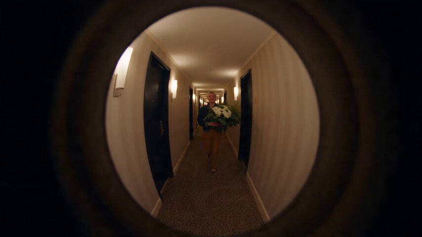

[← 返回全部 / Back to all]( ../README_zh.md )　|　[English list](../README.md)

# No.31 · 门镜鱼眼 POV / Peephole Fisheye POV

`角色动作 / Character & Action`　`model: seedance-2.5`

<div align="center">

<a href="https://x.com/bmx_ai13/status/2083678409272721652"></a>

<b><a href="https://x.com/bmx_ai13/status/2083678409272721652">▶️ 在 X 上观看视频 / Watch on X</a></b>

</div>

## 📝 Prompt

```
A realistic doorway peephole POV video shot through a ultra wide fisheye lens with a pronounced circular black vignette and curved distortion. The scene takes place in a warmly lit, carpeted apartment hallway with dark doors and warm sconce lights running along the walls. A cheerful young woman with short, bleached blonde pixie cut hair, wearing a casual layered outfit, approaches the camera close up, leaning in and playfully knocking on the lens as if knocking on a door. She holds a large fresh bouquet of white daisies and eucalyptus. She smiles brightly, applies lip balm while looking into the camera, spins around happily, and runs off down the corridor. Next, she returns wearing an oversized cream-colored trench coat carrying a small red gift bag, knocks again, poses, turns, and playfully darts away down the hallway before running back toward the door. Finally, she returns wearing a warm brown sweater, holding a frosted red velvet cake on a glass plate. She knocks on the camera lens, licks frosting off her finger, smiles, blows a kiss directly to the camera lens, and runs off giggling. Natural handheld instability, realistic indoor lighting, handheld camera movement, high definition organic video quality, upbeat indie pop background soundtrack. Aspect ratio 16:9, total duration 20 seconds.
```

**👤 出处 / Credit:** [@bmx_ai13](https://x.com/bmx_ai13) · [source](https://x.com/bmx_ai13/status/2083678409272721652)

▶️ **用 API 跑这条 / Run via API** → [Velokey](https://velokey.ai?sourceChannel=github-awesome-seedance) (`seedance-2.5`)
